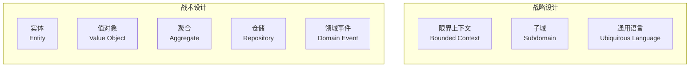
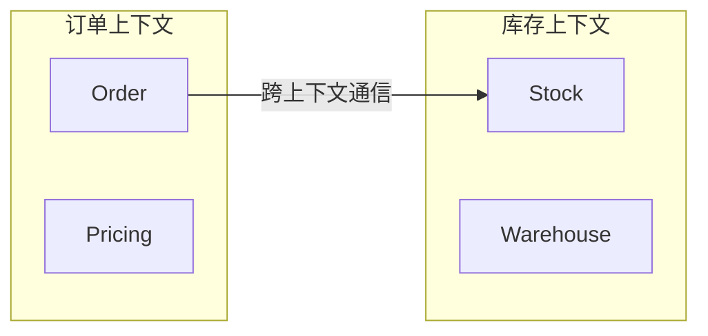
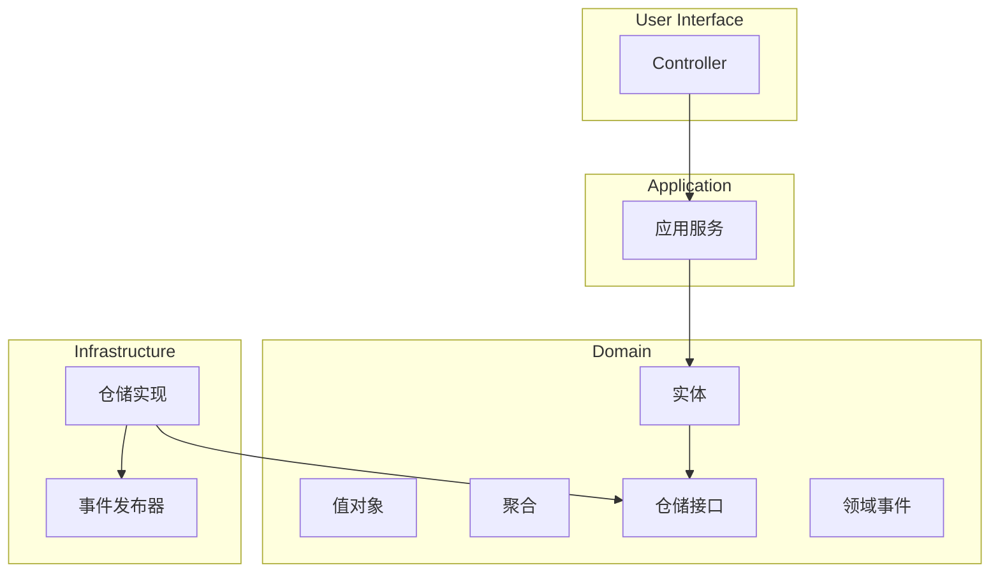

# DDD 领域驱动设计

**目标读者**：P6/P7 面试准备  
**面试级别**：P6 中频 / P7 高频

## 快速自测

> **🔴 面试官最关心的 3 个问题**
>
> 1. 什么是 DDD？解决了什么问题？
> 2. DDD 的核心概念有哪些？
> 3. DDD 在项目中如何落地？

---

## 一、为什么需要 DDD

### 传统开发的问题

```java
// 面向数据库设计（贫血模型）
public class Order {
    private Long id;
    private Long userId;
    private BigDecimal amount;
    private String status;
    // 只有 getter/setter，没有业务逻辑
}

public class OrderService {
    public void createOrder(Order order) {
        // 大量业务逻辑写在 Service 中
        if (order.getAmount().compareTo(BigDecimal.ZERO) <= 0) {
            throw new Exception("金额必须大于0");
        }
        // 50+ 行业务逻辑...
    }
}
```

**问题**：
- 业务逻辑分散在 Service 中
- 代码难以理解和维护
- 领域知识无法沉淀在代码中
- 贫血模型 vs 充血模型

---

## 二、DDD 核心概念



---

## 三、战略设计

### 1. 限界上下文（Bounded Context）



### 2. 通用语言

```java
// 电商场景中的通用语言
// 术语：SKU（Stock Keeping Unit，库存单位）
// 在库存上下文中：SKU 是核心实体
public class SKU {
    private String code;
    private int quantity;
}

// 术语：商品
// 在商品上下文中：Product 是核心实体
public class Product {
    private String name;
    private String sku;
}
```

---

## 四、战术设计

### 1. 实体（Entity）

```java
// 实体：有唯一标识，且标识在生命周期内不变
public class Order implements AggregateRoot {
    private OrderId id;  // 唯一标识
    private CustomerId customerId;
    private List<OrderItem> items;
    private OrderStatus status;

    // 实体特征：有生命周期，状态可变
    public void addItem(Product product, int quantity) {
        if (this.status != OrderStatus.DRAFT) {
            throw new OrderException("订单已锁定");
        }
        this.items.add(new OrderItem(product, quantity));
    }

    public void pay() {
        if (this.status != OrderStatus.DRAFT) {
            throw new OrderException("订单状态不正确");
        }
        this.status = OrderStatus.PAID;
        // 发布领域事件
        DomainEvents.publish(new OrderPaidEvent(this));
    }

    // 唯一标识的比较
    @Override
    public boolean equals(Object o) {
        if (this == o) return true;
        return o instanceof Order && ((Order) o).id.equals(this.id);
    }
}
```

### 2. 值对象（Value Object）

```java
// 值对象：不可变，没有唯一标识，通过属性值来区分
public class Money {
    private final BigDecimal amount;
    private final Currency currency;

    public Money(BigDecimal amount, Currency currency) {
        this.amount = amount;
        this.currency = currency;
    }

    public Money add(Money other) {
        if (!this.currency.equals(other.currency)) {
            throw new IllegalArgumentException("货币不一致");
        }
        return new Money(this.amount.add(other.amount), this.currency);
    }

    // 值对象不可变，所有方法都返回新实例
    public Money multiply(int factor) {
        return new Money(this.amount.multiply(BigDecimal.valueOf(factor)), this.currency);
    }

    @Override
    public boolean equals(Object o) {
        if (this == o) return true;
        if (o == null || getClass() != o.getClass()) return false;
        Money money = (Money) o;
        return amount.equals(money.amount) && currency.equals(money.currency);
    }
}

// 在实体中使用值对象
public class OrderItem {
    private Product product;
    private int quantity;
    private Money price;  // 值对象

    public Money getSubtotal() {
        return price.multiply(quantity);
    }
}
```

### 3. 聚合（Aggregate）

```java
// 聚合：是一组相关对象的集合，作为数据修改的单元
// 聚合根：聚合的入口，所有外部引用都通过聚合根

// Order 是聚合根
public class Order implements AggregateRoot {
    private OrderId id;
    private List<OrderItem> items;  // OrderItem 只能通过 Order 访问

    public void addItem(Product product, int quantity) {
        // 业务规则在聚合根中强制执行
        if (this.status != OrderStatus.DRAFT) {
            throw new OrderException("订单已锁定");
        }
        this.items.add(new OrderItem(product, quantity));
    }

    // 不提供直接修改 items 的方法
    public List<OrderItem> getItems() {
        return Collections.unmodifiableList(items);
    }
}

// OrderItem 不能单独存在，必须通过 Order
// 如果直接获取 OrderItem，无法修改订单
```

### 4. 仓储（Repository）

```java
// 仓储接口定义在领域层
public interface OrderRepository {
    Order findById(OrderId id);
    void save(Order order);
    List<Order> findByCustomerId(CustomerId customerId);
}

// 仓储实现在基础设施层
@Repository
public class JpaOrderRepository implements OrderRepository {
    @Autowired
    private JpaOrderRepository jpaRepository;

    @Override
    public Order findById(OrderId id) {
        return jpaRepository.findById(id.getValue())
            .map(this::toDomain)
            .orElse(null);
    }

    @Override
    public void save(Order order) {
        OrderEntity entity = toEntity(order);
        jpaRepository.save(entity);
    }
}
```

### 5. 领域事件（Domain Event）

```java
// 领域事件
public class OrderPaidEvent implements DomainEvent {
    private final Order order;
    private final LocalDateTime occurredOn;

    public OrderPaidEvent(Order order) {
        this.order = order;
        this.occurredOn = LocalDateTime.now();
    }

    @Override
    public LocalDateTime occurredOn() {
        return occurredOn;
    }
}

// 发布领域事件
public class Order implements AggregateRoot {
    public void pay() {
        this.status = OrderStatus.PAID;
        DomainEvents.publish(new OrderPaidEvent(this));
    }
}

// 监听领域事件
@DomainEventListener
public class OrderEventHandler {
    @EventListener
    public void handleOrderPaid(OrderPaidEvent event) {
        // 发送邮件通知
        // 更新统计数据
        // 触发后续流程
    }
}
```

---

## 五、DDD 分层架构



---

## 六、DDD vs 传统开发

| 维度 | 传统开发 | DDD |
|------|----------|-----|
| 核心 | 数据库表 | 领域模型 |
| 模型 | 贫血模型 | 充血模型 |
| 业务逻辑位置 | Service | 领域对象 |
| 代码可读性 | 难以理解 | 业务语言 |
| 适用场景 | CRUD 项目 | 复杂业务 |

---

## 七、实战落地步骤

1. **识别限界上下文**：根据业务边界划分
2. **定义通用语言**：团队统一术语
3. **建立领域模型**：实体、值对象、聚合
4. **实现领域逻辑**：充血模型
5. **定义仓储接口**：领域层定义，基础设施实现
6. **发布领域事件**：解耦业务流程

---

## 八、面试追问

> **第一层**：什么是 DDD？
>
> **第二层**：DDD 的核心概念有哪些？
>
> **第三层**：如何区分实体和值对象？

**💡 加分回答**：可以提到 CQRS + ES（事件溯源）与 DDD 的结合。
