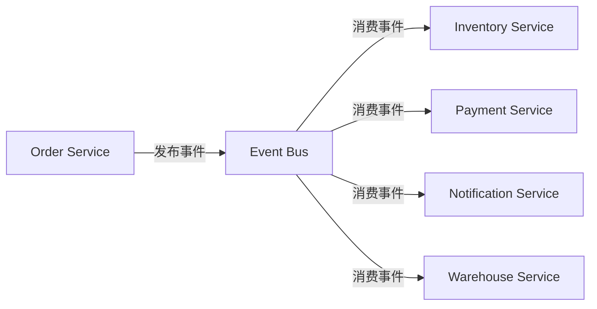

# 事件驱动架构

**目标读者**：P7 面试准备  
**面试级别**：P7 高频

## 快速自测

> **🔴 面试官最关心的 3 个问题**
>
> 1. 什么是事件驱动架构？解决了什么问题？
> 2. 事件驱动架构有哪些核心组件？
> 3. 如何处理事件顺序和幂等性问题？

---

## 一、为什么需要事件驱动架构

### 同步调用的局限性

```java
// 同步调用：订单创建后需要通知多个系统
public class OrderService {
    @Autowired
    private InventoryService inventoryService;
    @Autowired
    private PaymentService paymentService;
    @Autowired
    private NotificationService notificationService;
    @Autowired
    private WarehouseService warehouseService;

    public void createOrder(Order order) {
        // 1. 创建订单（耗时 10ms）
        orderRepository.save(order);

        // 2. 扣减库存（耗时 50ms）
        inventoryService.reserveStock(order.getItems());

        // 3. 调用支付（耗时 200ms）
        paymentService.processPayment(order);

        // 4. 通知仓库（耗时 30ms）
        warehouseService.notifyNewOrder(order);

        // 5. 发送通知（耗时 20ms）
        notificationService.sendOrderConfirmation(order);

        // 总耗时：10 + 50 + 200 + 30 + 20 = 310ms
        // 问题：如果某个系统挂了，整个流程失败
    }
}
```

---

## 二、事件驱动架构

### 核心思想

将业务操作和后续处理解耦，通过事件总线异步通知各系统。



### 优点

| 优点 | 说明 |
|------|------|
| 松耦合 | 生产者和消费者不直接通信 |
| 可扩展 | 可独立扩展各消费者 |
| 容错性 | 单个系统故障不影响其他系统 |
| 性能 | 异步处理，提升响应速度 |

---

## 三、核心组件

### 1. 事件

```java
// 领域事件
public class OrderCreatedEvent implements DomainEvent {
    private final Long orderId;
    private final Long customerId;
    private final List<OrderItemDTO> items;
    private final LocalDateTime occurredOn;

    public OrderCreatedEvent(Long orderId, Long customerId,
                            List<OrderItemDTO> items) {
        this.orderId = orderId;
        this.customerId = customerId;
        this.items = items;
        this.occurredOn = LocalDateTime.now();
    }

    @Override
    public LocalDateTime occurredOn() {
        return occurredOn;
    }
}
```

### 2. 事件发布

```java
// 事件发布器
@Service
public class OrderEventPublisher {
    @Autowired
    private EventBus eventBus;

    public void publishOrderCreated(Order order) {
        OrderCreatedEvent event = new OrderCreatedEvent(
            order.getId(),
            order.getCustomerId(),
            order.getItems().stream()
                .map(OrderItemDTO::from)
                .collect(Collectors.toList())
        );
        eventBus.publish(event);
    }
}
```

### 3. 事件消费

```java
// 事件消费者
@Component
public class OrderEventConsumer {
    @Autowired
    private InventoryService inventoryService;
    @Autowired
    private WarehouseService warehouseService;

    @EventListener
    @Async  // 异步处理
    public void handleOrderCreated(OrderCreatedEvent event) {
        inventoryService.reserveStock(event.getItems());
    }

    @EventListener
    @Async
    public void handleOrderCreatedForWarehouse(OrderCreatedEvent event) {
        warehouseService.notifyNewOrder(event.getOrderId());
    }
}
```

---

## 四、Kafka 事件驱动

### 生产者

```java
@Service
public class KafkaEventPublisher {
    @Autowired
    private KafkaTemplate<String, Object> kafkaTemplate;

    public void publish(String topic, Object event) {
        String key = getKey(event);
        kafkaTemplate.send(topic, key, event);
    }

    private String getKey(Object event) {
        if (event instanceof OrderCreatedEvent) {
            return String.valueOf(((OrderCreatedEvent) event).getOrderId());
        }
        return UUID.randomUUID().toString();
    }
}
```

### 消费者

```java
@Service
public class KafkaEventConsumer {
    @Autowired
    private InventoryService inventoryService;

    @KafkaListener(
        topics = "order.created",
        groupId = "inventory-service",
        concurrency = "3"  // 并发消费
    )
    public void handleOrderCreated(ConsumerRecord<String, OrderCreatedEvent> record) {
        OrderCreatedEvent event = record.value();
        try {
            inventoryService.reserveStock(event.getItems());
        } catch (Exception e) {
            // 幂等处理
            handleWithIdempotency(event, e);
        }
    }
}
```

---

## 五、事件顺序问题

### 问题

```
事件顺序：创建 → 支付 → 发货
实际消费：创建 → 发货 → 支付  ❌ 顺序错误
```

### 解决方案

```java
// 1. 使用分区保证顺序
@KafkaListener(topics = "order", partition = "0")
public void handleOrderEvent(OrderEvent event) {
    // 同一个订单的所有事件发送到同一分区
}

// 2. 消费端排序
@Component
public class OrderedEventHandler {
    private final Map<Long, LinkedBlockingQueue<OrderEvent>> orderQueues = new ConcurrentHashMap<>();

    @KafkaListener(topics = "order")
    public void handleEvent(OrderEvent event) {
        // 同一订单的事件排队处理
        LinkedBlockingQueue<OrderEvent> queue = orderQueues.computeIfAbsent(
            event.getOrderId(),
            k -> new LinkedBlockingQueue<>()
        );
        queue.offer(event);
        processQueue(queue, event.getOrderId());
    }

    private void processQueue(LinkedBlockingQueue<OrderEvent> queue, Long orderId) {
        // 按顺序处理
    }
}
```

---

## 六、幂等处理

```java
@Service
public class IdempotentEventHandler {
    @Autowired
    private RedisTemplate<String, String> redisTemplate;

    public void handleEvent(OrderCreatedEvent event) {
        String idempotentKey = "order:created:" + event.getOrderId();

        // 检查是否已处理
        Boolean isNew = redisTemplate.opsForValue()
            .setIfAbsent(idempotentKey, "1", Duration.ofDays(7));

        if (Boolean.TRUE.equals(isNew)) {
            // 首次处理
            processOrderCreated(event);
        }
        // 重复消息直接忽略
    }
}
```

---

## 七、面试追问

> **第一层**：什么是事件驱动架构？
>
> **第二层**：如何保证事件的顺序性？
>
> **第三层**：如何保证事件的幂等性？

**💡 加分回答**：可以提到 `Outbox Pattern`（发件箱模式）保证事件可靠发布。
