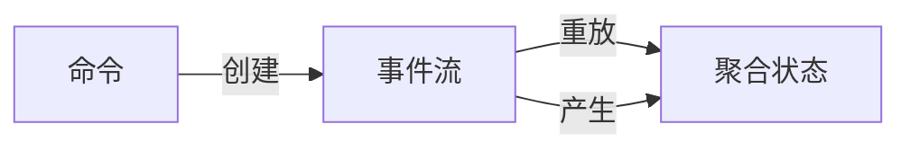

# 事件溯源

**目标读者**：P7 面试准备  
**面试级别**：P7 高频

## 快速自测

> **🔴 面试官最关心的 3 个问题**
>
> 1. 什么是事件溯源？解决了什么问题？
> 2. 事件溯源如何重建聚合状态？
> 3. 事件溯源和传统持久化有什么区别？

---

## 一、为什么需要事件溯源

### 传统持久化的问题

```java
// 传统方式：只保存当前状态
public class Account {
    private Long id;
    private BigDecimal balance;
    private String status;
}

// 问题：
// 1. 无法知道余额如何变成 1000 的
// 2. 无法回溯到任意时间点
// 3. 无法重放业务操作
```

---

## 二、事件溯源核心概念

### 核心思想

**不存储状态，存储事件**。通过重放事件来重建状态。



### 对比

| 维度 | 传统持久化 | 事件溯源 |
|------|------------|----------|
| 存储内容 | 当前状态 | 事件历史 |
| 数据修改 | UPDATE | 新增事件 |
| 状态获取 | 直接读取 | 重放事件 |
| 历史记录 | 无 | 完整保留 |

---

## 三、代码实现

### 1. 定义事件

```java
// 基础事件接口
public interface Event {
    Long getAggregateId();
    LocalDateTime getOccurredOn();
}

// 具体事件
public class MoneyDepositedEvent implements Event {
    private final Long accountId;
    private final BigDecimal amount;
    private final BigDecimal balanceAfter;
    private final LocalDateTime occurredOn;

    public MoneyDepositedEvent(Long accountId, BigDecimal amount,
                              BigDecimal balanceAfter) {
        this.accountId = accountId;
        this.amount = amount;
        this.balanceAfter = balanceAfter;
        this.occurredOn = LocalDateTime.now();
    }

    @Override
    public Long getAggregateId() {
        return accountId;
    }

    @Override
    public LocalDateTime getOccurredOn() {
        return occurredOn;
    }
}

public class MoneyWithdrawnEvent implements Event {
    private final Long accountId;
    private final BigDecimal amount;
    private final BigDecimal balanceAfter;
    private final LocalDateTime occurredOn;

    public MoneyWithdrawnEvent(Long accountId, BigDecimal amount,
                              BigDecimal balanceAfter) {
        this.accountId = accountId;
        this.amount = amount;
        this.balanceAfter = balanceAfter;
        this.occurredOn = LocalDateTime.now();
    }

    @Override
    public Long getAggregateId() {
        return accountId;
    }

    @Override
    public LocalDateTime getOccurredOn() {
        return occurredOn;
    }
}
```

### 2. 聚合根

```java
// 聚合根：应用命令，产生事件
public class Account implements AggregateRoot {
    private Long id;
    private BigDecimal balance;

    public Account(Long id, BigDecimal initialBalance) {
        this.id = id;
        this.balance = initialBalance;
    }

    // 从事件历史重建
    public Account(List<Event> events) {
        for (Event event : events) {
            apply(event);
        }
    }

    // 命令：存款
    public List<Event> deposit(BigDecimal amount) {
        if (amount.compareTo(BigDecimal.ZERO) <= 0) {
            throw new IllegalArgumentException("金额必须大于0");
        }
        this.balance = this.balance.add(amount);
        return Collections.singletonList(
            new MoneyDepositedEvent(this.id, amount, this.balance)
        );
    }

    // 命令：取款
    public List<Event> withdraw(BigDecimal amount) {
        if (amount.compareTo(BigDecimal.ZERO) <= 0) {
            throw new IllegalArgumentException("金额必须大于0");
        }
        if (this.balance.compareTo(amount) < 0) {
            throw new IllegalArgumentException("余额不足");
        }
        this.balance = this.balance.subtract(amount);
        return Collections.singletonList(
            new MoneyWithdrawnEvent(this.id, amount, this.balance)
        );
    }

    // 应用事件（私有方法）
    private void apply(Event event) {
        if (event instanceof MoneyDepositedEvent) {
            MoneyDepositedEvent e = (MoneyDepositedEvent) event;
            this.balance = e.getBalanceAfter();
        } else if (event instanceof MoneyWithdrawnEvent) {
            MoneyWithdrawnEvent e = (MoneyWithdrawnEvent) event;
            this.balance = e.getBalanceAfter();
        }
    }
}
```

### 3. 仓储

```java
// 事件仓储
public interface EventStore {
    void append(Event event);
    List<Event> getEvents(Long aggregateId);
    List<Event> getEvents(Long aggregateId, LocalDateTime since);
}

// 实现
@Repository
public class KafkaEventStore implements EventStore {
    @Autowired
    private KafkaTemplate<String, Event> kafkaTemplate;

    @Override
    public void append(Event event) {
        kafkaTemplate.send(
            "account-events",
            event.getAggregateId().toString(),
            event
        );
    }

    @Override
    public List<Event> getEvents(Long aggregateId) {
        // 从 Kafka 或数据库读取事件
        return eventRepository.findByAggregateId(aggregateId);
    }
}
```

### 4. 快照优化

```java
// 快照：避免每次都重放所有事件
public class AccountSnapshot {
    private Long aggregateId;
    private BigDecimal balance;
    private int eventCount;  // 快照后的事件数量
    private LocalDateTime createdAt;
}

// 每 100 个事件保存一次快照
public class SnapshotService {
    public Account reconstructAggregate(Long accountId) {
        AccountSnapshot snapshot = snapshotRepository.findLatest(accountId);
        List<Event> events;

        if (snapshot != null) {
            // 从快照重建 + 后续事件
            Account account = reconstructFromSnapshot(snapshot);
            events = eventStore.getEventsSince(accountId, snapshot.getCreatedAt());
        } else {
            // 无快照，从头重放
            events = eventStore.getEvents(accountId);
        }

        // 重建聚合
        return new Account(events);
    }
}
```

---

## 四、事件溯源优缺点

| 优点 | 缺点 |
|------|------|
| 完整的历史记录 | 实现复杂度高 |
| 可任意回溯 | 存储成本增加 |
| 可重放业务 | 查询相对复杂 |
| 天然支持审计 | 需要处理快照 |
| 事件驱动集成 | 学习曲线陡 |

---

## 五、快照策略

| 策略 | 触发条件 | 优点 | 缺点 |
|------|----------|------|------|
| 固定数量 | 每 N 个事件 | 实现简单 | 不可控 |
| 固定时间 | 每天/每周 | 可控 | 不精确 |
| 增量 | 事件累计 | 平衡 | 实现复杂 |

---

## 六、面试追问

> **第一层**：什么是事件溯源？
>
> **第二层**：如何重建聚合状态？
>
> **第三层**：快照的作用是什么？

**💡 加分回答**：可以提到事件溯源适合审计日志、金融系统等需要完整历史的场景。
