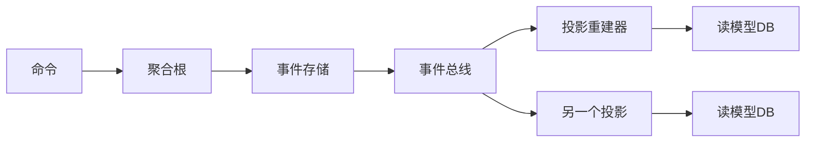

# 事件溯源Event Sourcing

## 一个监管合规的噩梦

2022年，我们金融支付系统收到了监管部门的审计要求：需要提供过去5年内任意账户任意时间点的余额快照，精确到每一次交易变更。

技术团队慌了。

我们的系统用的是传统增删改模式——订单表、账户表、流水表。只有当前状态，没有历史轨迹。想查2019年3月15日某个账户的余额？对不起，只能根据流水记录手工推算，但问题是：余额模型发生过两次大改版，2019年的交易记录格式和现在完全不同。

最后靠5个人连轴转了3周，人工还原数据，差点没赶上监管检查的死线。

这次事故之后，我们全面引入了 Event Sourcing（事件溯源）。

## 问题定义

传统系统设计只存储**当前状态**（Current State），也叫"快照模式"。这种模式的问题是：

- **丢失了过程**：你只知道账户现在有多少钱，不知道这笔钱是怎么来的
- **审计成本高**：要么靠流水表反推，要么加一整套审计日志
- **重放困难**：业务逻辑变更后，无法用新逻辑重跑历史数据
- **调试盲区**：生产问题排查时，只能靠日志"猜"当时发生了什么

【架构权衡】

事件溯源的核心思路是：**不要存储状态，要存储事件**。每次状态变更都是一条不可变的事件记录，当前状态由事件重放计算得出。这就像把"银行存折"和"余额"的关系反转了——不是用余额来验证流水，而是用流水来计算余额。

## 方案演进

我们先看看为什么传统方案会失败，再看事件溯源如何解决。

### 方案A：快照模式（传统做法）

```java
// 账户表只存当前余额
class Account {
    Long id;
    String accountNo;
    BigDecimal balance;      // 当前余额快照
    LocalDateTime updatedAt;
}
```

**优点**：简单，查询当前状态快
**缺点**：丢失历史，审计难，重放不可能
**适用场景**：状态不敏感、不需要审计的简单业务

### 方案B：流水账模式（打补丁做法）

```java
class AccountTransaction {
    Long id;
    String accountNo;
    BigDecimal amount;
    String type;             // DEPOSIT/WITHDRAW/TRANSFER
    LocalDateTime createdAt;
}
```

**优点**：有审计轨迹，可追溯
**缺点**：重放需要业务逻辑和表结构耦合；重放慢（百万级流水重放可能需要数小时）；事件本身可能包含业务含义变更（如手续费规则改变），直接重放会出错
**适用场景**：审计要求不高的业务

### 方案C：事件溯源（Event Sourcing）

```java
// 每个状态变更都是一条不可变事件
abstract class DomainEvent {
    String eventId;         // 唯一标识
    String aggregateId;      // 聚合根ID
    Long version;            // 聚合版本号（乐观锁）
    LocalDateTime occurredAt;// 事件发生时间
    String eventType;        // 事件类型
}

// 具体事件
class AccountOpened extends DomainEvent {
    String accountNo;
    String ownerName;
    BigDecimal initialBalance;
}

class MoneyDeposited extends DomainEvent {
    BigDecimal amount;
    String currency;
    String remark;
}

class MoneyWithdrawn extends DomainEvent {
    BigDecimal amount;
    String currency;
    String remark;
}

class MoneyTransferred extends DomainEvent {
    BigDecimal amount;
    String currency;
    String fromAccountNo;
    String toAccountNo;
    String traceId;          // 关联追踪ID
}
```

**优点**：完整的历史、可重放、可重建任意时间点状态、审计天然合规
**缺点**：查询当前状态需要重放所有事件（慢）；事件膨胀；事件 Schema 变更（版本化）；最终一致性处理复杂
**适用场景**：金融、审计、订单、BPM等对历史过程敏感的业务

## 核心设计

### 聚合根与事件存储

事件溯源的单位是**聚合根**（Aggregate）。每个聚合根维护自己的事件序列，版本号用乐观锁控制。

```java
// 聚合根：账户
class AccountAggregate extends AbstractAggregateRoot {

    private String accountNo;
    private BigDecimal balance;
    private String status;   // ACTIVE/FROZEN/CLOSED
    private Long version;

    // 私有构造函数，只能通过事件重建或创建
    AccountAggregate() {}

    // 工厂方法：创建账户
    public static AccountAggregate create(String accountNo, String ownerName, BigDecimal initialBalance) {
        AccountAggregate account = new AccountAggregate();
        account.apply(new AccountOpened(UUID.randomUUID().toString(),
            accountNo, ownerName, initialBalance, LocalDateTime.now()));
        return account;
    }

    // 从事件重建
    public void apply(DomainEvent event) {
        if (event instanceof AccountOpened e) {
            this.accountNo = e.getAccountNo();
            this.balance = e.getInitialBalance();
            this.status = "ACTIVE";
        } else if (event instanceof MoneyDeposited e) {
            this.balance = this.balance.add(e.getAmount());
        } else if (event instanceof MoneyWithdrawn e) {
            if (this.balance.compareTo(e.getAmount()) < 0) {
                throw new IllegalStateException("余额不足");
            }
            this.balance = this.balance.subtract(e.getAmount());
        }
        // ...
        this.version++;
    }

    // 命令方法：存款
    public void deposit(BigDecimal amount, String remark) {
        if (!"ACTIVE".equals(this.status)) {
            throw new IllegalStateException("账户状态异常");
        }
        apply(new MoneyDeposited(UUID.randomUUID().toString(),
            this.accountNo, amount, "CNY", remark, LocalDateTime.now()));
    }

    // 命令方法：取款
    public void withdraw(BigDecimal amount, String remark) {
        if (!"ACTIVE".equals(this.status)) {
            throw new IllegalStateException("账户状态异常");
        }
        if (this.balance.compareTo(amount) < 0) {
            throw new InsufficientBalanceException("余额不足，当前余额：" + this.balance);
        }
        apply(new MoneyWithdrawn(UUID.randomUUID().toString(),
            this.accountNo, amount, "CNY", remark, LocalDateTime.now()));
    }
}
```

关键设计点：
- **私有构造函数**：防止外部直接 new，确保聚合根只能通过事件创建或重放
- **apply 方法处理事件**：根据事件类型更新状态，保证状态变更和事件记录一致
- **命令校验前置**：在生成事件之前做业务规则校验，校验失败不产生事件

### 事件存储设计

```java
// 事件存储（Event Store）
interface EventStore {

    // 保存事件
    void append(String aggregateId, List<DomainEvent> events, Long expectedVersion);

    // 读取聚合根的所有事件
    List<DomainEvent> getEventsForAggregate(String aggregateId);

    // 读取指定时间范围内的事件（用于投影重建）
    List<DomainEvent> getEventsSince(LocalDateTime since);
}

// MySQL 实现
class MySQLEventStore implements EventStore {

    @Autowired
    private JdbcTemplate jdbcTemplate;

    @Override
    public void append(String aggregateId, List<DomainEvent> events, Long expectedVersion) {
        String sql = """
            INSERT INTO domain_events
            (event_id, aggregate_id, event_type, event_data, version, occurred_at)
            VALUES (?, ?, ?, ?, ?, ?)
            """;
        jdbcTemplate.batchUpdate(sql, events, events.size(),
            (ps, event) -> {
                ps.setString(1, event.getEventId());
                ps.setString(2, aggregateId);
                ps.setString(3, event.getEventType());
                ps.setString(4, toJson(event));        // 事件数据序列化
                ps.setLong(5, event.getVersion());
                ps.setObject(6, event.getOccurredAt());
            });
    }

    @Override
    public List<DomainEvent> getEventsForAggregate(String aggregateId) {
        String sql = "SELECT * FROM domain_events WHERE aggregate_id = ? ORDER BY version";
        // 从结果集重建事件对象（需要事件反序列化）
    }
}
```

```sql
-- 事件表设计
CREATE TABLE domain_events (
    id BIGINT AUTO_INCREMENT PRIMARY KEY,
    event_id VARCHAR(36) NOT NULL UNIQUE,   -- 事件全局唯一ID
    aggregate_id VARCHAR(64) NOT NULL,       -- 聚合根ID
    event_type VARCHAR(128) NOT NULL,       -- 事件类型名
    event_data JSON NOT NULL,                -- 事件数据（JSON）
    version BIGINT NOT NULL,                  -- 聚合版本号
    occurred_at TIMESTAMP NOT NULL,          -- 事件发生时间
    created_at TIMESTAMP DEFAULT CURRENT_TIMESTAMP,
    INDEX idx_aggregate_version (aggregate_id, version),
    INDEX idx_occurred_at (occurred_at)
) ENGINE=InnoDB;
```

### 快照机制：解决重放性能问题

事件重放的核心问题是：**事件数量会随着时间线性增长**。一个活跃账户5年可能产生上百万条事件，每次查余额都要重放全部事件——这是不可接受的。

快照机制来解决这个问题。

```java
// 快照存储
class SnapshotStore {

    public void saveSnapshot(AccountAggregate aggregate) {
        Snapshot snapshot = new Snapshot();
        snapshot.setAggregateId(aggregate.getAccountNo());
        snapshot.setVersion(aggregate.getVersion());
        snapshot.setBalance(aggregate.getBalance());
        snapshot.setStatus(aggregate.getStatus());
        snapshot.setTakenAt(LocalDateTime.now());
        snapshotRepository.save(snapshot);
    }

    // 从快照恢复 + 重放增量事件
    public AccountAggregate restore(String aggregateId) {
        Snapshot snapshot = snapshotRepository.findLatest(aggregateId);
        AccountAggregate aggregate = new AccountAggregate();

        if (snapshot != null) {
            aggregate.restoreFromSnapshot(snapshot);  // 快速恢复到快照版本
            // 只重放快照之后的增量事件
            List<DomainEvent> incrementalEvents =
                eventStore.getEventsSince(snapshot.getTakenAt());
            for (DomainEvent event : incrementalEvents) {
                aggregate.apply(event);
            }
        } else {
            // 没有快照，从零重放
            List<DomainEvent> allEvents = eventStore.getEventsForAggregate(aggregateId);
            for (DomainEvent event : allEvents) {
                aggregate.apply(event);
            }
        }
        return aggregate;
    }
}
```

快照策略建议：
- 每处理1000个事件打一次快照（可配置）
- 快照异步存储，不阻塞主流程
- 快照保留最近N个版本，支持回溯

### 事件版本化：处理 Schema 变更

业务演进过程中，事件 Schema 必然会变。比如早期 `MoneyTransferred` 事件没有 `remark` 字段，后来加了。

```java
// 事件版本化：Upcasting 模式
class MoneyTransferredUpcaster implements EventUpcaster {

    @Override
    public boolean canUpcast(String eventType, Long fromVersion, Long toVersion) {
        return "MoneyTransferred".equals(eventType) && fromVersion < 2L;
    }

    @Override
    public DomainEvent upcast(DomainEvent event, Long fromVersion, Long toVersion) {
        // 从 v1 升级到 v2：补充 remark 字段
        if (fromVersion == 1L) {
            MoneyTransferredV2 upgraded = new MoneyTransferredV2();
            upgraded.setAmount(event.getAmount());
            upgraded.setCurrency(event.getCurrency());
            upgraded.setFromAccountNo(event.getFromAccountNo());
            upgraded.setToAccountNo(event.getToAccountNo());
            upgraded.setRemark("");  // 旧事件无备注，补空字符串
            return upgraded;
        }
        return event;
    }
}
```

【架构权衡】

事件版本化是 Event Sourcing 在生产环境中最容易被低估的复杂度。网上很多文章只讲"存储事件"多美好，但不提 Schema 变更的坑：
- 每次事件字段变更都要写 Upcaster
- Upcaster 链顺序不能出错
- 历史事件 Upcast 后要不要持久化？持久化的话会改历史，不持久化每次重放都要 Upcast

## 生产避坑

### 坑1：事件数据被篡改

事件是不可变的，但这只是应用层的约定。如果有人在数据库里直接 UPDATE，后果不堪设想。

**解决方案**：
- 事件表去掉 UPDATE 和 DELETE 权限（DBA 层控制）
- 每个事件加 checksum，存储时校验
- 事件写入后立即异步计算 hash 并存储，读取时校验

### 坑2：投影重建时服务不可用

投影（Projection）是事件溯源的读模型。当投影重建时，如果数据量很大，服务在重建期间可能完全不可用。

**解决方案**：
- 投影重建走独立的离线任务，不影响在线读
- 蓝绿投影：新旧投影并行，切换时无感知
- 投影分片：按聚合根 ID 哈希分片，支持并行重建

### 坑3：并发写入导致版本冲突

两个命令同时处理同一聚合根，乐观锁版本号会冲突。如果处理不当，事件会丢失。

```java
// 错误的并发处理
public void handle(DepositCommand cmd) {
    AccountAggregate account = eventStore.getEventsForAggregate(cmd.getAccountNo())
        .replay();  // 这里拿到了 v10
    account.deposit(cmd.getAmount(), cmd.getRemark());
    // 另一个线程已经写入了 v11
    eventStore.append(cmd.getAccountNo(), account.getUncommittedEvents(), 10L); // 期望v10，但已是v11
    // 乐观锁异常，事件丢失！
}
```

**正确的并发处理**：使用 `EXPECTED_VERSION` 乐观锁，捕获 `ConcurrencyException` 后重试整个命令。

```java
public void handle(DepositCommand cmd) {
    int maxRetries = 3;
    for (int i = 0; i < maxRetries; i++) {
        try {
            AccountAggregate account = aggregateRepository.find(cmd.getAccountNo());
            account.deposit(cmd.getAmount(), cmd.getRemark());
            aggregateRepository.save(account);  // save 内部使用乐观锁
            return;
        } catch (ConcurrencyException e) {
            // 乐观锁冲突，重试
            log.warn("乐观锁冲突，重试第{}次", i + 1);
        }
    }
    throw new ConcurrencyException("重试次数超限");
}
```

## 工程代价评估

| 维度 | 评估 |
| --- | --- |
| 运维成本 | 高——需要维护事件存储、快照存储、投影服务三套组件 |
| 排障复杂度 | 中——事件链可追溯，但需要工具支持事件链可视化 |
| 扩展性 | 高——事件天然支持分片，投影可水平扩展 |
| 数据量 | 大——事件只增不减，需要定期归档或冷热分离 |
| 查询性能 | 差——当前状态需要重放或依赖投影，读QPS高的场景需要同步投影 |
| 团队要求 | 高——开发者需要理解聚合、事件驱动、最终一致性，门槛不低 |

## 落地 Checklist

- [ ] 事件不可变设计评审（表层禁止 UPDATE/DELETE）
- [ ] 事件 Schema 版本化方案（第一个 Upcaster 就应该设计好）
- [ ] 快照策略确定（间隔、存储、清理规则）
- [ ] 投影服务架构设计（同步投影 vs 异步投影）
- [ ] 命令处理重试机制（乐观锁冲突处理）
- [ ] 事件数据归档策略（多久归档到冷存储）
- [ ] 监控告警：事件写入延迟、投影延迟、快照积压
- [ ] 单元测试：聚合根在任意事件序列下的行为一致性

## CQRS + Event Sourcing 组合

Event Sourcing 最好的搭档是 CQRS。写模型用事件存储，读模型用投影构建：



写入链路：命令 → 聚合根校验 → 生成事件 → 写入 Event Store → 发布到事件总线
读取链路：从投影 DB 直接查询（不经过聚合根）

这套组合在电商订单、金融账务、物流追踪等场景下非常有效，但组合的复杂度也是双倍的——建议只在真正需要审计追溯和复杂读模型的场景下使用。

【架构权衡】

Event Sourcing 不是银弹。它最适合的场景：
- 审计合规要求高（金融、医疗、法律）
- 业务过程本身是核心价值（订单全流程、审批流）
- 需要任意时间点的状态回溯
- CQRS 读写分离，查询模型非常复杂

不太适合的场景：
- CRUD 为主的简单业务（过度设计）
- 查询 QPS 极高（投影重建有延迟）
- 团队对 DDD 和事件驱动没有经验积累
