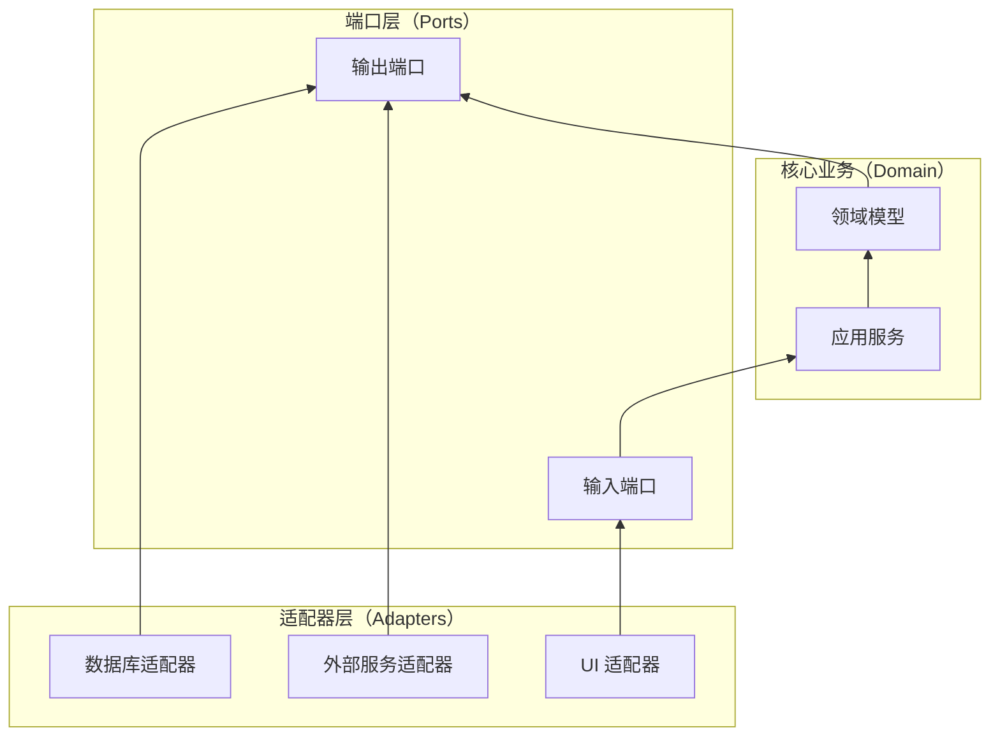

# 六边形架构

**目标读者**：P7 面试准备  
**面试级别**：P7 中频

## 快速自测

> **🔴 面试官最关心的 3 个问题**
>
> 1. 六边形架构的核心思想是什么？
> 2. 六边形架构和传统分层架构有什么区别？
> 3. 端口和适配器分别指什么？

---

## 一、核心思想

六边形架构（Hexagonal Architecture）由 Alistair Cockburn 提出，又称**端口与适配器架构**（Ports and Adapters）。

**核心原则**：应用程序的业务逻辑应该与外部系统（数据库、UI、外部服务）完全解耦。

---

## 二、结构图



---

## 三、核心概念

### 端口（Port）

端口是应用程序向外提供的接口，分为两种：

| 类型 | 说明 | 示例 |
|------|------|------|
| 输入端口 | 外部调用应用程序的接口 | OrderService |
| 输出端口 | 应用程序调用外部系统的接口 | PaymentGateway、UserRepository |

### 适配器（Adapter）

适配器是端口的具体实现：

| 类型 | 示例 |
|------|------|
| 主适配器（Driving）| REST Controller、CLI |
| 从适配器（Driven）| MySQL 适配器、Redis 适配器、HTTP 客户端 |

---

## 四、代码实现

### 1. 定义输入端口

```java
// 输入端口：定义应用服务接口
public interface OrderUseCase {
    Order createOrder(Long userId, List<OrderItem> items);
    Order cancelOrder(Long orderId);
    List<Order> getUserOrders(Long userId);
}
```

### 2. 定义输出端口

```java
// 输出端口：定义持久化接口
public interface OrderRepository {
    Order save(Order order);
    Optional<Order> findById(Long id);
    List<Order> findByUserId(Long userId);
}

// 输出端口：定义外部支付接口
public interface PaymentGateway {
    PaymentResult pay(Long orderId, BigDecimal amount);
    RefundResult refund(Long paymentId);
}

// 输出端口：定义通知接口
public interface NotificationService {
    void sendOrderCreatedNotification(Order order);
    void sendOrderCancelledNotification(Order order);
}
```

### 3. 实现核心业务

```java
// 应用服务（Application Service）
@Service
public class OrderService implements OrderUseCase {
    private final OrderRepository orderRepository;
    private final PaymentGateway paymentGateway;
    private final NotificationService notificationService;

    // 依赖注入
    public OrderService(OrderRepository orderRepository,
                       PaymentGateway paymentGateway,
                       NotificationService notificationService) {
        this.orderRepository = orderRepository;
        this.paymentGateway = paymentGateway;
        this.notificationService = notificationService;
    }

    @Override
    @Transactional
    public Order createOrder(Long userId, List<OrderItem> items) {
        // 业务逻辑：创建订单
        Order order = new Order();
        order.setUserId(userId);
        order.setStatus(OrderStatus.PENDING);

        BigDecimal totalAmount = items.stream()
            .map(OrderItem::getAmount)
            .reduce(BigDecimal.ZERO, BigDecimal::add);
        order.setTotalAmount(totalAmount);

        // 保存订单
        Order savedOrder = orderRepository.save(order);

        // 调用外部支付
        PaymentResult result = paymentGateway.pay(savedOrder.getId(), totalAmount);

        if (result.isSuccess()) {
            savedOrder.setStatus(OrderStatus.PAID);
            orderRepository.save(savedOrder);

            // 发送通知
            notificationService.sendOrderCreatedNotification(savedOrder);
        }

        return savedOrder;
    }
}
```

### 4. 实现适配器

```java
// 主适配器：REST 控制器
@RestController
@RequestMapping("/api/orders")
public class OrderController implements OrderUseCase {
    private final OrderUseCase orderUseCase;

    public OrderController(OrderUseCase orderUseCase) {
        this.orderUseCase = orderUseCase;
    }

    @Override
    @PostMapping
    public Order createOrder(@RequestBody CreateOrderRequest request) {
        return orderUseCase.createOrder(request.getUserId(), request.getItems());
    }
}

// 从适配器：MySQL 持久化
@Repository
public class JpaOrderRepository implements OrderRepository {
    @Autowired
    private OrderJpaRepository jpaRepository;

    @Override
    public Order save(Order order) {
        return jpaRepository.save(order);
    }

    @Override
    public Optional<Order> findById(Long id) {
        return jpaRepository.findById(id);
    }
}

// 从适配器：第三方支付
@Service
public class AlipayGateway implements PaymentGateway {
    @Override
    public PaymentResult pay(Long orderId, BigDecimal amount) {
        // 调用支付宝 SDK
        return new PaymentResult(true, "alipay_" + orderId);
    }
}
```

---

## 五、六边形架构 vs 三层架构

| 对比 | 三层架构 | 六边形架构 |
|------|----------|------------|
| 业务核心 | 在业务层 | 独立于所有层 |
| 外部依赖 | 依赖数据库 | 不依赖外部系统 |
| 可测试性 | 需要 mock | 可完全独立测试 |
| 适配器切换 | 困难 | 只需实现端口 |
| 适用场景 | 简单应用 | 复杂业务、DDD |

---

## 六、六边形架构的优势

| 优势 | 说明 |
|------|------|
| 业务逻辑独立 | 核心不受外部影响 |
| 可测试性 | 核心业务可无依赖测试 |
| 适配器可替换 | 可随时切换数据库、UI |
| 支持 DDD | 与领域驱动设计天然契合 |

---

## 七、Spring Boot 应用

```java
// 主程序入口
@SpringBootApplication
public class Application {
    public static void main(String[] args) {
        SpringApplication.run(Application.class, args);
    }
}

// 配置类：组装适配器
@Configuration
public class AppConfig {
    @Bean
    public OrderUseCase orderUseCase(OrderRepository repository,
                                     PaymentGateway gateway,
                                     NotificationService notification) {
        return new OrderService(repository, gateway, notification);
    }

    @Bean
    public OrderController orderController(OrderUseCase useCase) {
        return new OrderController(useCase);
    }
}
```

---

## 八、面试追问

> **第一层**：什么是六边形架构？
>
> **第二层**：六边形架构和分层架构有什么区别？
>
> **第三层**：如何用六边形架构实现 DDD？

**💡 加分回答**：可以提到整洁架构（Clean Architecture）和六边形架构的关系，它们都强调业务核心的独立性。

---

## 九、适用场景

| 场景 | 适用性 |
|------|--------|
| 简单 CRUD 应用 | ❌ 过度设计 |
| 复杂业务系统 | ✅ 非常适合 |
| 需要切换存储 | ✅ 适配器可替换 |
| DDD 项目 | ✅ 天然契合 |
| 微服务 | ✅ 清晰的边界 |
