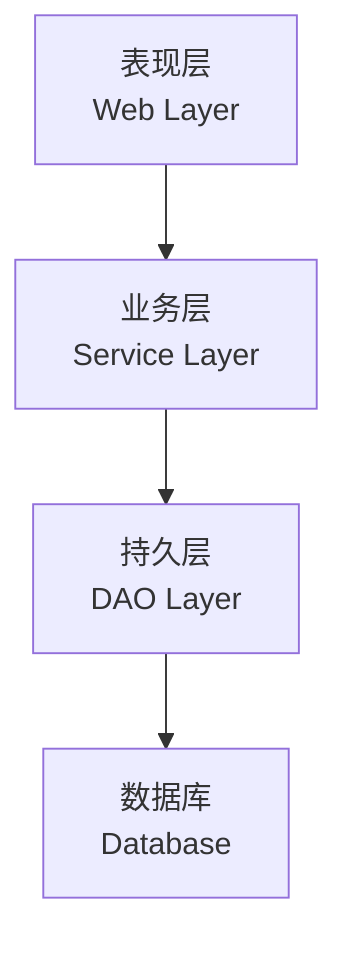
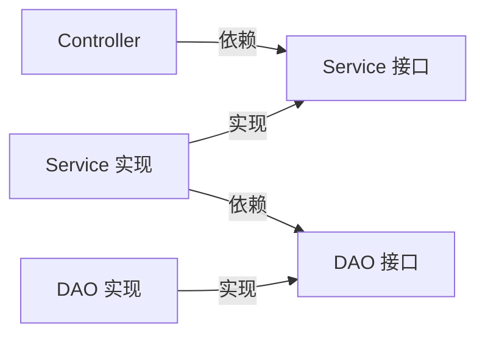
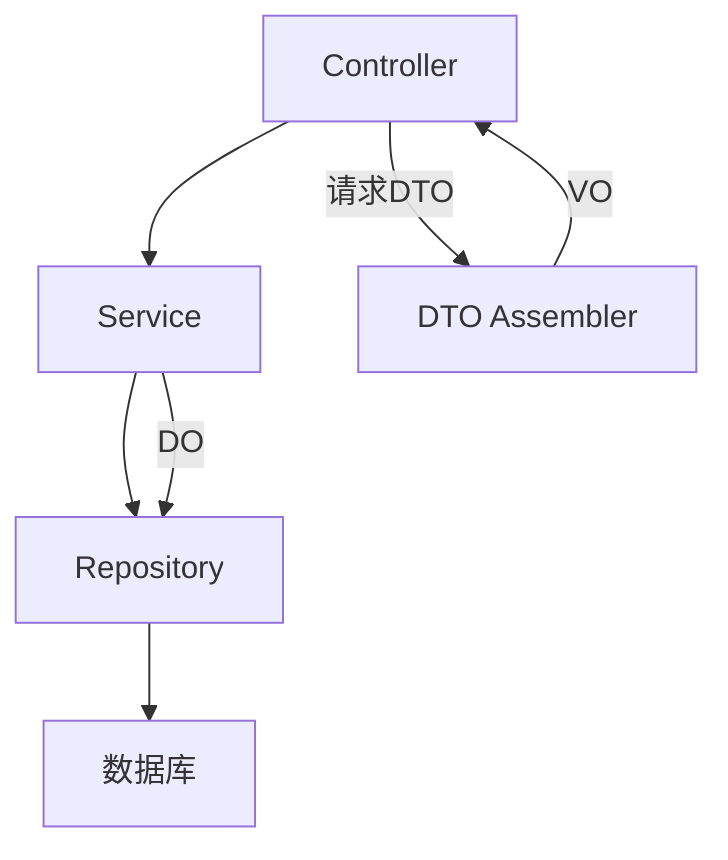

# 分层架构

**目标读者**：P5/P6 面试准备  
**面试级别**：P5 高频 / P6 进阶

## 快速自测

> **🔴 面试官最关心的 3 个问题**
>
> 1. 为什么需要分层架构？
> 2. 三层架构是哪三层？各自职责是什么？
> 3. 分层架构的优缺点是什么？

---

## 一、为什么需要分层架构

### 不分层的问题

```java
// 一个类干所有事
public class UserService {
    public void addUser(HttpServletRequest request) {
        // 1. 参数校验
        String name = request.getParameter("name");
        if (name == null || name.isEmpty()) {
            // 直接返回错误
        }

        // 2. SQL 查询
        Connection conn = getConnection();
        // 3. 业务逻辑
        // 4. 响应处理
    }
}
```

**问题**：
- 代码臃肿，难以维护
- 难以复用
- 难以测试
- 违反单一职责原则

---

## 二、经典三层架构

### 结构图



### 三层职责

| 层级 | 职责 | 常见组件 |
|------|------|----------|
| 表现层 | 接收请求、返回响应 | Controller、Filter、Interceptor |
| 业务层 | 业务逻辑、事务管理 | Service |
| 持久层 | 数据库操作、ORM | DAO、Repository |

---

## 三、代码实现

### 表现层（Controller）

```java
@RestController
@RequestMapping("/api/user")
public class UserController {
    @Autowired
    private UserService userService;

    @PostMapping
    public ResponseEntity<UserVO> createUser(@RequestBody @Valid CreateUserRequest request) {
        UserVO user = userService.createUser(request);
        return ResponseEntity.ok(user);
    }

    @GetMapping("/{id}")
    public ResponseEntity<UserVO> getUser(@PathVariable Long id) {
        UserVO user = userService.getUser(id);
        return ResponseEntity.ok(user);
    }
}
```

### 业务层（Service）

```java
@Service
@Transactional(rollbackFor = Exception.class)
public class UserService {
    @Autowired
    private UserRepository userRepository;
    @Autowired
    private EmailService emailService;

    public UserVO createUser(CreateUserRequest request) {
        // 1. 业务校验
        if (userRepository.existsByEmail(request.getEmail())) {
            throw new BusinessException("邮箱已被注册");
        }

        // 2. 转换为实体
        User user = new User();
        user.setName(request.getName());
        user.setEmail(request.getEmail());

        // 3. 保存
        User savedUser = userRepository.save(user);

        // 4. 发送邮件（异步）
        emailService.sendWelcomeEmail(savedUser.getEmail());

        // 5. 转换为 VO
        return toVO(savedUser);
    }
}
```

### 持久层（DAO）

```java
@Repository
public class UserRepository {
    @Autowired
    private JdbcTemplate jdbcTemplate;

    public User findById(Long id) {
        return jdbcTemplate.queryForObject(
            "SELECT * FROM user WHERE id = ?",
            new BeanPropertyRowMapper<>(User.class),
            id
        );
    }

    public User save(User user) {
        if (user.getId() == null) {
            return insert(user);
        } else {
            return update(user);
        }
    }

    public boolean existsByEmail(String email) {
        Integer count = jdbcTemplate.queryForObject(
            "SELECT COUNT(*) FROM user WHERE email = ?",
            Integer.class,
            email
        );
        return count > 0;
    }
}
```

---

## 四、依赖倒置原则在分层中的应用



```java
// 接口定义在业务层
public interface UserRepository {
    User findById(Long id);
    User save(User user);
}

// 实现放在持久层
@Repository
public class UserRepositoryImpl implements UserRepository {
    // JDBC 实现
}
```

---

## 五、分层架构的优点

| 优点 | 说明 |
|------|------|
| 职责清晰 | 每层只关注自己的职责 |
| 代码复用 | 业务层可在多个表现层复用 |
| 易于测试 | 可单独测试每层 |
| 可扩展 | 可独立扩展某层 |
| 团队协作 | 不同团队可并行开发不同层 |

---

## 六、分层架构的缺点

| 缺点 | 说明 |
|------|------|
| 代码量增加 | 需要写接口、转换对象 |
| 性能损耗 | 多次对象转换 |
| 复杂度增加 | 需要维护分层边界 |
| 过度设计 | 小项目可能不需要 |

---

## 七、四层架构（增加 DTO 层）



### 常见对象类型

| 类型 | 说明 | 示例 |
|------|------|------|
| Entity/DO | 数据库实体 | User、Order |
| DTO | 数据传输对象 | CreateUserRequest |
| VO | 视图对象 | UserVO、OrderVO |
| Query | 查询条件 | UserQuery |

---

## 八、事务传播行为

```java
@Service
public class OrderService {
    @Autowired
    private OrderRepository orderRepository;
    @Autowired
    private PaymentService paymentService;

    @Transactional
    public void createOrder(Long userId, BigDecimal amount) {
        // 订单服务开启事务
        Order order = new Order();
        order.setAmount(amount);
        orderRepository.save(order);

        // 调用支付服务（开启新事务）
        paymentService.processPayment(order.getId(), amount);
        // 如果 paymentService 也开启事务，需要配置传播行为
    }
}

@Service
public class PaymentService {
    @Transactional(propagation = Propagation.REQUIRES_NEW)
    public void processPayment(Long orderId, BigDecimal amount) {
        // 创建新事务，不受外部事务影响
    }
}
```

### 传播行为类型

| 传播行为 | 说明 |
|----------|------|
| REQUIRED | 默认，加入当前事务 |
| REQUIRES_NEW | 开启新事务，挂起当前事务 |
| NESTED | 嵌套事务（Savepoint）|
| SUPPORTS | 支持当前事务 |
| NOT_SUPPORTED | 不支持事务 |
| NEVER | 非事务执行 |
| MANDATORY | 必须有事务 |

---

## 九、面试追问

> **第一层**：三层架构是哪三层？
>
> **第二层**：为什么要先定义接口再实现？
>
> **第三层**：事务传播行为有哪些？

**💡 加分回答**：可以提到 `REQUIRES_NEW` 的使用场景，如日志服务不应该因为业务事务失败而回滚。

---

## 十、常见面试陷阱

> **⚠️ 陷阱 1**：分层过于死板
>
> 不是所有项目都需要四层、五层。小项目可以简化分层，专注业务价值。

> **⚠️ 陷阱 2**：忽视对象转换开销
>
> DO → DTO → VO 的转换可能有性能损耗，高并发场景需要注意。
