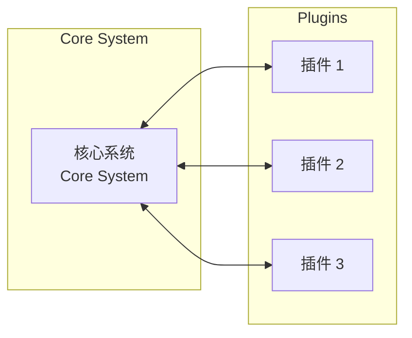

# 微内核架构

**目标读者**：P6/P7 面试准备  
**面试级别**：P6 中频 / P7 高频

## 快速自测

> **🔴 面试官最关心的 3 个问题**
>
> 1. 什么是微内核架构？
> 2. 插件机制如何实现？
> 3. 微内核架构和微服务有什么区别？

---

## 一、核心概念

微内核架构（Microkernel Architecture）是一种软件架构风格，核心系统保持最小化，功能通过插件扩展。



---

## 二、核心组成

| 组件 | 说明 |
|------|------|
| 核心系统 | 最小的功能集，平台基础 |
| 插件模块 | 可选功能，动态加载 |
| 通信机制 | 核心与插件的交互 |

---

## 三、代码实现

### 1. 插件接口

```java
// 插件接口
public interface Plugin {
    String getId();
    String getName();
    void init(Context context);
    void start();
    void stop();
}

// 上下文：核心系统向插件提供服务
public interface PluginContext {
    DataSource getDataSource();
    ExecutorService getExecutor();
    <T> T getService(Class<T> serviceClass);
}
```

### 2. 插件注册

```java
// 插件管理器
@Service
public class PluginManager {
    private final Map<String, Plugin> plugins = new ConcurrentHashMap<>();
    private final PluginContext defaultContext;

    public PluginManager(PluginContext context) {
        this.defaultContext = context;
    }

    public void registerPlugin(Plugin plugin) {
        if (plugins.containsKey(plugin.getId())) {
            throw new IllegalStateException("Plugin already registered: " + plugin.getId());
        }
        plugin.init(defaultContext);
        plugins.put(plugin.getId(), plugin);
    }

    public void startPlugin(String pluginId) {
        Plugin plugin = plugins.get(pluginId);
        if (plugin != null) {
            plugin.start();
        }
    }

    public void stopPlugin(String pluginId) {
        Plugin plugin = plugins.get(pluginId);
        if (plugin != null) {
            plugin.stop();
        }
    }

    public Optional<Plugin> getPlugin(String pluginId) {
        return Optional.ofNullable(plugins.get(pluginId));
    }
}
```

### 3. SPI 机制

```java
// META-INF/services/com.example.Plugin
// 文件内容：
// com.example.plugin.EmailPlugin
// com.example.plugin.SmsPlugin

// 加载插件
@Service
public class SpiPluginLoader {
    private static final Logger logger = LoggerFactory.getLogger(SpiPluginLoader.class);

    public List<Plugin> loadPlugins() {
        List<Plugin> plugins = new ArrayList<>();
        ServiceLoader<Plugin> loader = ServiceLoader.load(Plugin.class);

        for (Plugin plugin : loader) {
            logger.info("Loading plugin: {}", plugin.getName());
            plugins.add(plugin);
        }

        return plugins;
    }
}
```

---

## 四、实战：IDE 插件系统

### 核心接口

```java
public interface IDEPlugin extends Plugin {
    // IDE 特定的扩展点
    void onFileOpen(File file);
    void onFileSave(File file);
    List<MenuItem> getMenuItems();
}
```

### 插件实现

```java
// Git 插件
public class GitPlugin implements IDEPlugin {
    private PluginContext context;

    @Override
    public void init(Context context) {
        this.context = context;
    }

    @Override
    public void onFileOpen(File file) {
        // 检查 Git 状态
    }

    @Override
    public List<MenuItem> getMenuItems() {
        return Arrays.asList(
            new MenuItem("Git Commit", this::commit),
            new MenuItem("Git Push", this::push),
            new MenuItem("Git Pull", this::pull)
        );
    }
}
```

---

## 五、微内核 vs 微服务

| 对比 | 微内核架构 | 微服务架构 |
|------|------------|------------|
| 架构范围 | 单进程 | 多进程 |
| 扩展方式 | 插件 | 服务 |
| 部署 | 整体部署 | 独立部署 |
| 通信 | JVM 内调用 | 网络调用 |
| 适用场景 | IDE、浏览器 | 互联网应用 |

---

## 六、Spring Boot 自动配置

```java
// 自动配置类
@Configuration
@ConditionalOnClass(Plugin.class)
public class PluginAutoConfiguration {
    @Bean
    public PluginManager pluginManager(PluginContext context) {
        return new PluginManager(context);
    }

    @Bean
    public PluginLoader pluginLoader() {
        return new SpiPluginLoader();
    }
}

// spring.factories
// org.springframework.boot.autoconfigure.EnableAutoConfiguration=\
// com.example.config.PluginAutoConfiguration
```

---

## 七、面试追问

> **第一层**：什么是微内核架构？
>
> **第二层**：如何实现插件的热加载？
>
> **第三层**：微内核架构的优缺点是什么？

**💡 加分回答**：可以提到 VS Code 的插件系统采用微内核架构，IntelliJ IDEA 也是类似设计。
