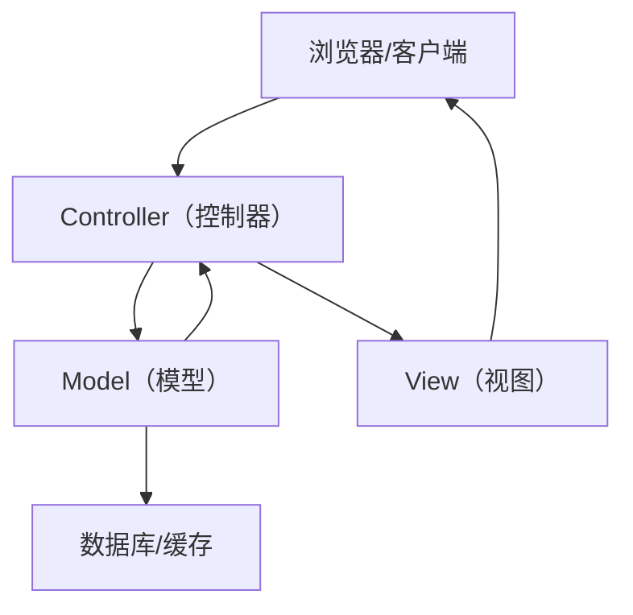
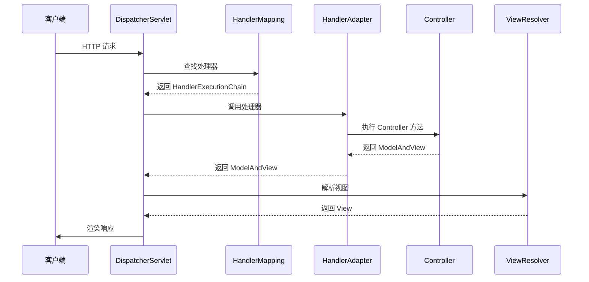

# MVC 模式深度解析与生产实践

2023年大促期间，某电商平台的商品详情页接口平均响应时间从 80ms 飙升到 3.2s，持续了整整 40 分钟，影响了约 150 万次 PV。

事后复盘，根因令所有人汗颜：一个"Controller 里塞了 800 行业务逻辑"的 God Controller，在大促流量下把数据库查询、缓存操作、价格计算、库存校验全部串行执行，每次请求至少打了 12 次数据库。

这不是技术问题，是架构问题——他们根本没理解 MVC 是干什么的。

## 一、MVC 是什么，为什么会被误用

MVC（Model-View-Controller）是 1970 年代 Smalltalk 语言里就有的模式，核心思路是**关注点分离**：把"数据"、"展示"、"控制"三件事拆开来做。

但问题就出在这里：大多数开发者把 Controller 当成了"啥都能放"的垃圾桶。



标准 MVC 的职责边界：

| 层次 | 职责 | 不该做的事 |
|------|------|-----------|
| Controller | 接收请求、参数校验、调用 Service、返回结果 | 写业务逻辑、直接操作数据库 |
| Model | 封装数据和业务逻辑 | 直接操作 HTTP 请求/响应 |
| View | 渲染展示 | 包含业务计算 |

## 二、God Controller 的典型翻车现场

### 2.1 错误示范

```java
@RestController
@RequestMapping("/api/product")
public class ProductController {

    @Autowired
    private ProductMapper productMapper;

    @Autowired
    private StockMapper stockMapper;

    @Autowired
    private PriceMapper priceMapper;

    // 这个方法有 200 行，直接在 Controller 里做了所有事
    @GetMapping("/{id}")
    public ProductVO getDetail(@PathVariable Long id) {
        // 直接查数据库，没有 Service 层
        Product product = productMapper.selectById(id);
        if (product == null) {
            throw new RuntimeException("商品不存在");
        }

        // 查库存
        Stock stock = stockMapper.selectByProductId(id);

        // 查价格，还带了复杂的促销计算
        Price price = priceMapper.selectByProductId(id);
        BigDecimal finalPrice = price.getOriginalPrice();
        if (price.getPromotionType() == 1) {
            finalPrice = price.getOriginalPrice().multiply(price.getDiscount());
        } else if (price.getPromotionType() == 2) {
            finalPrice = price.getOriginalPrice().subtract(price.getCouponAmount());
        }
        // ...还有 150 行类似的逻辑

        return buildVO(product, stock, finalPrice);
    }
}
```

这种代码的线上后果：
- **无法单元测试**：Controller 直接依赖 Mapper，测试必须启动整个 Spring 容器
- **无法复用**：相同的价格计算逻辑被拷贝到 5 个 Controller
- **无法优化**：所有逻辑串行，想加缓存也不知道加哪里
- **无法扩展**：新增一个促销类型，要改 Controller 里的 if-else 链

:::warning ⚠️
God Controller 是 MVC 最常见的反模式。面试时如果被问到"你们项目的 MVC 怎么分层"，千万别说"Controller 里直接调 Mapper"，这是直接扣分的。
:::

### 2.2 标准 MVC 分层

```java
// Controller 层：只做请求处理和参数校验
@RestController
@RequestMapping("/api/product")
public class ProductController {

    @Autowired
    private ProductService productService;

    @GetMapping("/{id}")
    public Result<ProductVO> getDetail(@PathVariable @Positive Long id) {
        ProductVO vo = productService.getProductDetail(id);
        return Result.success(vo);
    }
}

// Service 层：业务逻辑在这里
@Service
public class ProductServiceImpl implements ProductService {

    @Autowired
    private ProductRepository productRepository;

    @Autowired
    private PriceCalculator priceCalculator;

    @Override
    public ProductVO getProductDetail(Long id) {
        Product product = productRepository.findById(id)
            .orElseThrow(() -> new ProductNotFoundException(id));

        // 价格计算委托给专门的计算器
        BigDecimal finalPrice = priceCalculator.calculate(product);

        return ProductAssembler.toVO(product, finalPrice);
    }
}

// Model 层：封装领域数据，包含基础校验
@Data
public class Product {
    private Long id;
    private String name;
    private ProductStatus status;

    // 领域行为放在 Model 里
    public boolean isOnSale() {
        return status == ProductStatus.ON_SALE;
    }
}
```

【架构权衡】

MVC 最核心的权衡在于"Model 该有多厚"。两种极端都有问题：

**贫血模型（Anemic Model）**：Model 只有 getter/setter，业务逻辑全在 Service。代码量少，容易理解，适合 CRUD 项目。但业务复杂时，Service 会越来越膨胀，形成"Fat Service"。

**充血模型（Rich Model）**：业务逻辑放在 Domain Object 里，Service 只做编排。更贴近 DDD，测试友好，但学习成本高，需要团队对领域建模有共识。

**生产建议**：CRUD 项目用贫血模型，业务复杂度超过 3 层嵌套逻辑时，考虑引入充血模型或 DDD。

## 三、Spring MVC 的实际运作

很多人以为 Spring MVC 就是"Controller-Service-Mapper 三层架构"，但这其实是误解。Spring MVC 的 MVC 指的是 DispatcherServlet 的请求处理链。



:::tip 💡
面试加分点：能说清楚 DispatcherServlet 是 MVC 的核心调度器，HandlerMapping 负责找处理器，HandlerAdapter 负责调用处理器，ViewResolver 负责渲染视图，这四个组件的职责和关系，是 Spring MVC 面试的高频考点。
:::

## 四、生产避坑

### 4.1 Controller 参数校验缺失

**线上后果**：SQL 注入、NPE、非法数据写入数据库

**排查路径**：查接口访问日志，找到异常入参；审计 Controller 方法，确认是否有 `@Valid`/`@Validated` 注解

**正确做法**：
```java
@PostMapping("/order")
public Result<Long> createOrder(@RequestBody @Valid CreateOrderRequest request) {
    // @Valid 会触发 request 里的 @NotNull、@Min 等校验
    return Result.success(orderService.create(request));
}
```

### 4.2 Controller 直接返回 DO（数据库对象）

**线上后果**：接口返回了数据库字段名（如 `create_time`），接口契约和数据库强耦合，改字段必改接口

**正确做法**：引入 VO（View Object）层，通过 Assembler/Converter 做转换

### 4.3 跨 Controller 的逻辑重复

**线上后果**：同一段逻辑改 3 个地方，漏改一个就埋 bug

**排查路径**：用代码扫描工具（如 PMD）检测重复代码块

**正确做法**：抽到 Service 或工具类，Controller 只做调用

## 五、架构演进路径

MVC 不是终点，当业务复杂度上升时，有清晰的演进路径：

| 阶段 | 架构 | 适用场景 | 信号 |
|------|------|----------|------|
| 初期 | 简单 MVC | CRUD 应用，团队 `<` 5 人 | 功能单一 |
| 成长期 | MVC + Service 层 | 有一定业务逻辑，团队 5-15 人 | Service 开始膨胀 |
| 复杂期 | MVC + DDD 分层 | 核心域业务复杂，团队 `>` 15 人 | 需求变更频繁 |
| 规模期 | 微服务 | 多团队协作，独立发布需求 | 单体部署成为瓶颈 |

:::tip 💡
架构师加分点：能说清楚"什么时候该从 MVC 迁移到 DDD"，并给出迁移的渐进策略（不是一次性重写），这是 P7/P8 级别候选人的分水岭。
:::

## 六、工程代价评估

| 维度 | 评估 |
|------|------|
| 运维成本 | 低，单体 MVC 部署简单，日志集中 |
| 排障复杂度 | 中，分层后调用链变长，需要链路追踪 |
| 扩展性 | 中，垂直扩展容易，水平扩展需要无状态设计 |
| 回滚风险 | 低，单体回滚简单，一键回退版本 |
| 团队学习成本 | 低，MVC 是最广泛的架构模式 |
