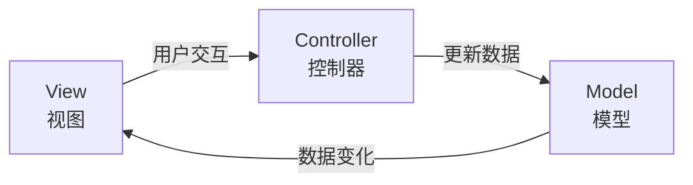
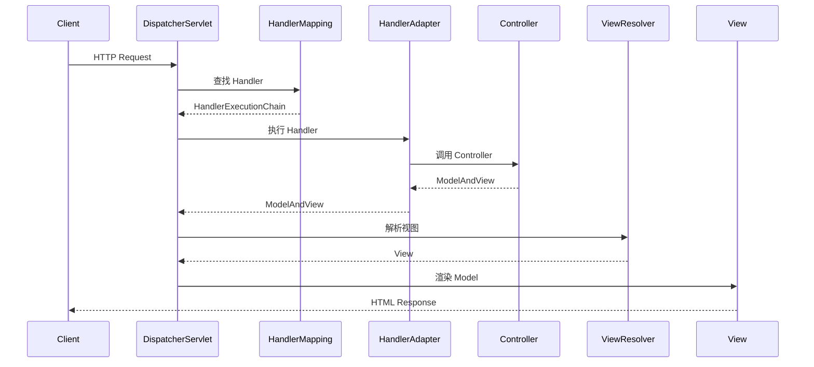

# MVC 模式

**目标读者**：P5/P6 面试准备  
**面试级别**：P5 高频 / P6 进阶

## 快速自测

> **🔴 面试官最关心的 3 个问题**
>
> 1. MVC 模式中三层各自的职责是什么？
> 2. MVC 和 MVP、MVVM 有什么区别？
> 3. Spring MVC 的请求处理流程是怎样的？

---

## 一、MVC 模式概述

### 定义

MVC（Model-View-Controller）是一种软件架构模式，将应用分为三个核心部分：

- **Model（模型）**：业务数据和业务逻辑
- **View（视图）**：用户界面展示
- **Controller（控制器）**：协调用户输入和模型更新



---

## 二、三层职责详解

### Model（模型层）

```java
// 模型：业务数据 + 业务逻辑
public class UserModel {
    private Long id;
    private String name;
    private String email;

    // 业务逻辑
    public boolean validate() {
        return name != null && email != null && email.contains("@");
    }

    public void encryptPassword() {
        // 密码加密逻辑
    }
}

// DAO 层
@Repository
public class UserDao {
    @Autowired
    private JdbcTemplate jdbcTemplate;

    public UserModel findById(Long id) {
        return jdbcTemplate.queryForObject(
            "SELECT * FROM user WHERE id = ?",
            new BeanPropertyRowMapper<>(UserModel.class),
            id
        );
    }
}
```

### View（视图层）

```html
<!-- JSP/Thymeleaf 模板 -->
<div class="user-info">
    <h2 th:text="${user.name}">用户名</h2>
    <p th:text="${user.email}">邮箱</p>
    <form action="/user/update" method="post">
        <input name="name" th:value="${user.name}" />
        <button type="submit">更新</button>
    </form>
</div>
```

### Controller（控制器层）

```java
@Controller
@RequestMapping("/user")
public class UserController {
    @Autowired
    private UserService userService;

    // 处理 GET 请求：展示用户信息
    @GetMapping("/{id}")
    public String getUser(@PathVariable Long id, Model model) {
        UserModel user = userService.findById(id);
        model.addAttribute("user", user);
        return "user/detail";  // 返回视图名
    }

    // 处理 POST 请求：更新用户
    @PostMapping("/update")
    public String updateUser(@ModelAttribute UserModel user) {
        userService.update(user);
        return "redirect:/user/" + user.getId();  // 重定向
    }
}
```

---

## 三、Spring MVC 工作流程



### 核心组件

| 组件 | 职责 |
|------|------|
| DispatcherServlet | 前端控制器，统一入口 |
| HandlerMapping | 根据 URL 找到 Handler |
| HandlerAdapter | 执行 Handler |
| Controller | 处理业务逻辑 |
| ViewResolver | 解析视图名称 |
| View | 渲染页面 |

---

## 四、MVC 的优点与缺点

| 优点 | 缺点 |
|------|------|
| 职责分离 | Controller 容易变得臃肿 |
| 代码复用 | View 和 Controller 耦合 |
| 易于测试 | Model 和 View 可能双向依赖 |
| 支持多种视图技术 | 不适合大型项目 |

---

## 五、MVC vs 其他模式

| 对比 | MVC | MVP | MVVM |
|------|-----|-----|------|
| Presenter/ViewModel | Controller | Presenter | ViewModel |
| 通信方式 | Controller 更新 Model | Presenter 更新 View | 双向绑定 |
| 耦合度 | 中 | 低 | 低 |
| 适用场景 | Web 应用 | 桌面/移动 | 前端 |
| 数据绑定 | 无 | 手动 | 自动 |

---

## 六、Spring MVC 注解

```java
@Controller
@RequestMapping("/api")
public class ApiController {

    // URL 路径参数
    @GetMapping("/user/{id}")
    public User getUser(@PathVariable Long id) {
        return userService.findById(id);
    }

    // 查询参数
    @GetMapping("/search")
    public List<User> search(@RequestParam String keyword,
                             @RequestParam(defaultValue = "10") int size) {
        return userService.search(keyword, size);
    }

    // 请求体
    @PostMapping("/user")
    public User createUser(@RequestBody @Valid User user) {
        return userService.create(user);
    }

    // 请求头
    @GetMapping("/profile")
    public User getProfile(@RequestHeader("Authorization") String token) {
        return userService.getByToken(token);
    }
}
```

---

## 七、面试追问

> **第一层**：Spring MVC 的请求处理流程是什么？
>
> **第二层**：@Controller 和 @RestController 有什么区别？
>
> **第三层**：Spring MVC 的参数绑定原理是什么？

**💡 加分回答**：可以提到 `HandlerAdapter` 会根据方法签名自动进行类型转换，支持自定义 `Converter`。

---

## 八、常见面试陷阱

> **⚠️ 陷阱 1**：Controller 做过多的业务逻辑
>
> Controller 应该只负责请求转发和参数校验，业务逻辑应该放在 Service 层。

> **⚠️ 陷阱 2**：混淆 MVC 和三层架构
>
> MVC 是表现层模式，三层架构（表现层、业务层、持久层）是整体架构划分。
