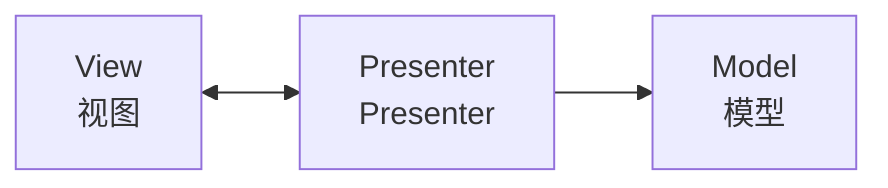
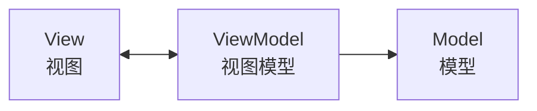

# MVP 与 MVVM 模式

**目标读者**：P6 面试准备  
**面试级别**：P6 高频

## 快速自测

> **🔴 面试官最关心的 3 个问题**
>
> 1. MVP 和 MVC 的核心区别是什么？
> 2. MVVM 的双向绑定是如何实现的？
> 3. Android 开发中 MVP 和 MVVM 各自适用什么场景？

---

## 一、MVP 模式（Model-View-Presenter）

### 结构



### 核心特点

- **View**：被动视图，只负责 UI 展示，不包含业务逻辑
- **Presenter**：协调者，负责业务逻辑和视图更新
- **Model**：数据层，提供业务数据
- View 和 Presenter 通过接口通信，实现完全解耦

### 实现示例

```java
// View 接口（Activity/Fragment 实现）
public interface UserView {
    void showLoading();
    void hideLoading();
    void showUser(User user);
    void showError(String message);
}

// Presenter
public class UserPresenter {
    private UserView view;
    private UserService userService;

    public UserPresenter(UserView view) {
        this.view = view;
        this.userService = new UserService();
    }

    public void loadUser(Long userId) {
        view.showLoading();
        userService.getUser(userId, new Callback<User>() {
            @Override
            public void onSuccess(User user) {
                view.hideLoading();
                view.showUser(user);
            }

            @Override
            public void onError(String message) {
                view.hideLoading();
                view.showError(message);
            }
        });
    }

    public void onDestroy() {
        view = null;
    }
}

// Activity 实现 View
public class UserActivity extends AppCompatActivity implements UserView {
    private UserPresenter presenter;

    @Override
    protected void onCreate(Bundle savedInstanceState) {
        super.onCreate(savedInstanceState);
        presenter = new UserPresenter(this);
        presenter.loadUser(1L);
    }

    @Override
    public void showUser(User user) {
        textView.setText(user.getName());
    }

    @Override
    public void showLoading() {
        progressBar.setVisibility(View.VISIBLE);
    }

    @Override
    public void hideLoading() {
        progressBar.setVisibility(View.GONE);
    }

    @Override
    public void showError(String message) {
        Toast.makeText(this, message, Toast.LENGTH_SHORT).show();
    }
}
```

---

## 二、MVVM 模式（Model-View-ViewModel）

### 结构



### 核心特点

- **View**：UI 层，绑定 ViewModel
- **ViewModel**：持有 UI 状态，暴露可观察数据
- **Model**：数据层
- **双向绑定**：View 变化自动更新 ViewModel，ViewModel 变化自动更新 View

### 实现示例

```java
// ViewModel（Jetpack ViewModel）
public class UserViewModel extends ViewModel {
    private final MutableLiveData<User> user = new MutableLiveData<>();
    private final MutableLiveData<Boolean> isLoading = new MutableLiveData<>();

    private final UserRepository userRepository;

    public UserViewModel() {
        userRepository = new UserRepository();
    }

    public LiveData<User> getUser() {
        return user;
    }

    public LiveData<Boolean> getIsLoading() {
        return isLoading;
    }

    public void loadUser(Long userId) {
        isLoading.setValue(true);
        userRepository.getUser(userId).observeForever(result -> {
            user.setValue(result);
            isLoading.setValue(false);
        });
    }
}

// Activity/Fragment
public class UserActivity extends AppCompatActivity {
    private UserViewModel viewModel;

    @Override
    protected void onCreate(Bundle savedInstanceState) {
        super.onCreate(savedInstanceState);

        // ViewModel 自动管理生命周期
        viewModel = new ViewModelProvider(this).get(UserViewModel.class);

        // 数据绑定
        viewModel.getUser().observe(this, user -> {
            textView.setText(user.getName());
        });

        viewModel.getIsLoading().observe(this, isLoading -> {
            progressBar.setVisibility(isLoading ? View.VISIBLE : View.GONE);
        });
    }
}
```

### 数据绑定（XML 方式）

```xml
<layout xmlns:android="http://schemas.android.com/apk/res/android">
    <data>
        <variable
            name="viewModel"
            type="com.example.UserViewModel" />
    </data>

    <LinearLayout>
        <TextView
            android:text="@{viewModel.user.name}" />

        <ProgressBar
            android:visibility="@{viewModel.isLoading ? View.VISIBLE : View.GONE}" />

        <Button
            android:onClick="@{() -> viewModel.loadUser(1L)}" />
    </LinearLayout>
</layout>
```

---

## 三、三种模式对比

| 维度 | MVC | MVP | MVVM |
|------|-----|-----|------|
| Controller/Presenter | Controller | Presenter | ViewModel |
| View 更新方式 | Controller 更新 View | Presenter 调用 View 接口 | 双向绑定 |
| 通信方式 | 直接调用 | 接口回调 | 观察者模式 |
| 代码量 | 中 | 多 | 中 |
| 测试性 | 较难 | 易 | 易 |
| 适用场景 | Web | 桌面/移动 App | 前端/Android |

---

## 四、MVP 优缺点

| 优点 | 缺点 |
|------|------|
| View 和 Presenter 完全解耦 | Presenter 可能变得臃肿 |
| 易于单元测试 | View 接口过多 |
| View 可以独立于 Model 开发 | 需要手动管理 View 和 Presenter 的生命周期 |

---

## 五、MVVM 优缺点

| 优点 | 缺点 |
|------|------|
| 双向绑定减少样板代码 | 复杂绑定可能难以调试 |
| ViewModel 可独立测试 | 数据流可能不清晰 |
| 自动处理生命周期 | 学习曲线较陡 |

---

## 六、Spring Boot + Vue 的 MVVM

### 后端（Spring Boot）

```java
// REST API 提供数据
@RestController
@RequestMapping("/api/user")
public class UserController {
    @Autowired
    private UserService userService;

    @GetMapping("/{id}")
    public UserVO getUser(@PathVariable Long id) {
        return userService.getUser(id);
    }
}
```

### 前端（Vue.js）

```vue
<template>
  <div>
    <input v-model="user.name" />
    <button @click="loadUser">加载</button>
  </div>
</template>

<script>
export default {
  data() {
    return {
      user: { name: '' }
    }
  },
  methods: {
    loadUser() {
      // 调用后端 API
      this.$http.get('/api/user/1')
        .then(response => {
          this.user = response.data  // 双向绑定自动更新 UI
        })
    }
  }
}
</script>
```

---

## 七、面试追问

> **第一层**：MVP 和 MVC 的区别是什么？
>
> **第二层**：MVVM 的双向绑定原理是什么？
>
> **第三层**：Android 开发中如何选择 MVP 和 MVVM？

**💡 加分回答**：可以提到 Jetpack 组件（LiveData、ViewModel、DataBinding）如何协同实现 MVVM。

---

## 八、选择建议

| 场景 | 推荐模式 |
|------|----------|
| Web 后端渲染 | MVC |
| Android 原生开发 | MVVM（推荐）/ MVP |
| 桌面应用 | MVP |
| 前端 Vue/React | MVVM |
| 小型 Android 项目 | MVP（简单直接）|
