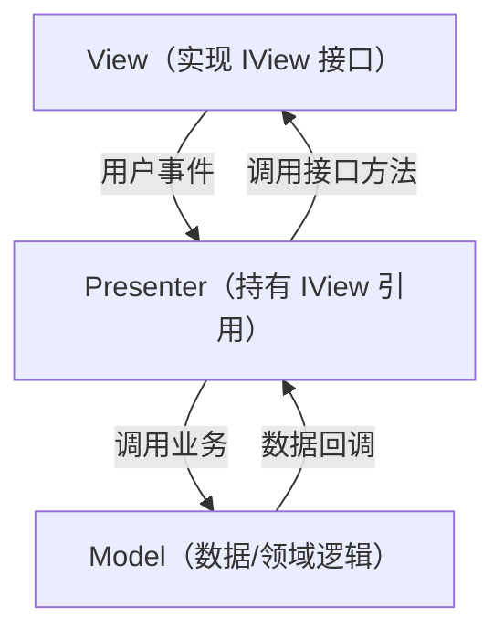
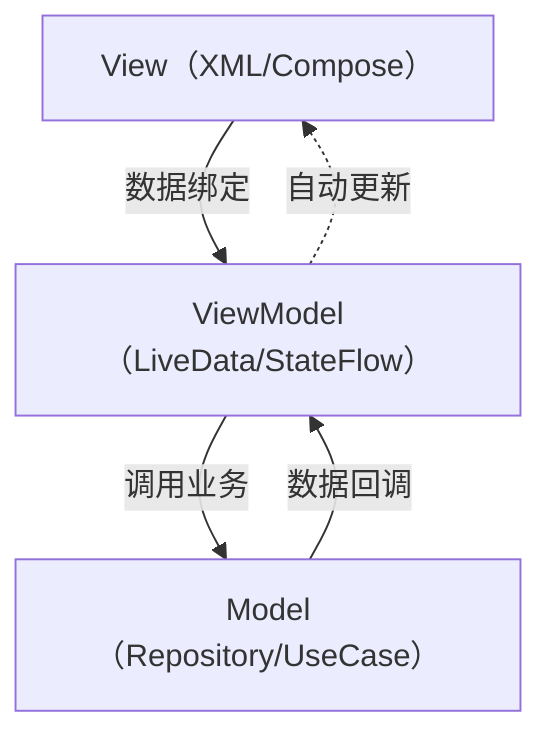
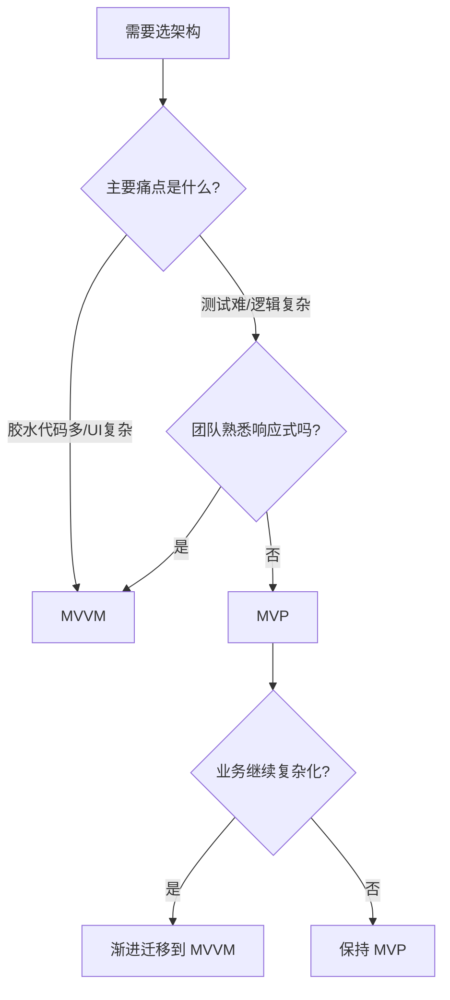

# MVP 与 MVVM 模式对比与选型

某金融 App 上线两年后，测试团队反馈：UI 自动化测试覆盖率只有 12%，每次改一个页面逻辑都要靠人工回归。项目负责人找到我，说要把 MVC 迁移到 MVVM。

我问了他一个问题："你们后端接口稳定吗？数据绑定多不多？"他回答："接口天天改，数据绑定不多。"

我告诉他：你们应该先上 MVP，而不是 MVVM。

这个判断背后，是 MVP 和 MVVM 两种模式完全不同的设计哲学和适用场景。

## 一、从 MVC 的痛点说起

MVC 最大的痛点：View 和 Controller 耦合太紧，单元测试难，UI 逻辑和业务逻辑混在一起，改一个地方容易带崩另一个地方。

MVP 和 MVVM 都是为了解决这个问题，但思路不同：

- **MVP**：引入 Presenter 作为 View 和 Model 的中介，View 只负责展示，Presenter 持有 View 的接口引用，可以 Mock View 做单元测试
- **MVVM**：引入 ViewModel 和数据绑定机制，View 和 ViewModel 通过绑定自动同步，减少胶水代码

## 二、MVP 深度解析

### 2.1 MVP 的核心结构



关键设计：**View 依赖倒置**。View 实现一个接口（`IView`），Presenter 持有这个接口引用，而不是直接依赖具体的 View 实现。这样 Presenter 就可以在测试时用 Mock 替换真实的 View。

```java
// View 接口定义
public interface IOrderView {
    void showLoading();
    void hideLoading();
    void showOrderList(List<OrderVO> orders);
    void showError(String message);
}

// Presenter
public class OrderPresenter {
    private final IOrderView view;          // 依赖接口，不依赖具体实现
    private final OrderRepository repository;

    public OrderPresenter(IOrderView view, OrderRepository repository) {
        this.view = view;
        this.repository = repository;
    }

    public void loadOrders(Long userId) {
        view.showLoading();
        repository.findByUserId(userId)
            .subscribe(
                orders -> {
                    view.hideLoading();
                    view.showOrderList(orders);
                },
                error -> {
                    view.hideLoading();
                    view.showError(error.getMessage());
                }
            );
    }
}

// Activity/Fragment 实现 View 接口
public class OrderActivity extends AppCompatActivity implements IOrderView {
    private OrderPresenter presenter;

    @Override
    protected void onCreate(Bundle savedInstanceState) {
        super.onCreate(savedInstanceState);
        presenter = new OrderPresenter(this, new OrderRepository());
        presenter.loadOrders(getCurrentUserId());
    }

    @Override
    public void showLoading() { progressBar.setVisibility(View.VISIBLE); }

    @Override
    public void showOrderList(List<OrderVO> orders) {
        adapter.submitList(orders);
    }
    // ...
}

// 单元测试时 Mock View
@Test
public void testLoadOrders_success() {
    IOrderView mockView = mock(IOrderView.class);
    OrderRepository mockRepo = mock(OrderRepository.class);
    when(mockRepo.findByUserId(1L)).thenReturn(Observable.just(testOrders));

    OrderPresenter presenter = new OrderPresenter(mockView, mockRepo);
    presenter.loadOrders(1L);

    verify(mockView).showLoading();
    verify(mockView).showOrderList(testOrders);
    verify(mockView, never()).showError(any());
}
```

:::tip 💡
MVP 的核心价值在于**可测试性**。能说出"通过 View 接口实现依赖倒置，让 Presenter 可以用 Mock 做单元测试"，是面试 MVP 最有分量的一句话。
:::

### 2.2 MVP 的痛点

MVP 没有解决一个问题：**当 View 很复杂时，IView 接口会膨胀得很难维护**。一个页面有 20 个 UI 元素，IView 就要有 20 个方法，Presenter 调用起来也很啰嗦。

此外，Presenter 持有 View 引用，如果不小心处理生命周期，会导致内存泄漏。

## 三、MVVM 深度解析

### 3.1 MVVM 的核心结构



关键设计：**双向数据绑定**（或单向数据流）。ViewModel 暴露可观察的数据（如 `LiveData`、`StateFlow`、Vue 的 `ref`），View 订阅这些数据，数据变化时 View 自动更新，不需要 Presenter 手动调用 View 接口方法。

```java
// Android MVVM with LiveData
public class OrderViewModel extends ViewModel {
    // 对外暴露不可变的 LiveData
    private final MutableLiveData<List<OrderVO>> _orders = new MutableLiveData<>();
    public final LiveData<List<OrderVO>> orders = _orders;

    private final MutableLiveData<Boolean> _loading = new MutableLiveData<>(false);
    public final LiveData<Boolean> loading = _loading;

    private final OrderRepository repository;

    public OrderViewModel(OrderRepository repository) {
        this.repository = repository;
    }

    public void loadOrders(Long userId) {
        _loading.setValue(true);
        repository.findByUserId(userId)
            .observe(result -> {
                _loading.setValue(false);
                _orders.setValue(result);
            });
    }
}

// Activity 中订阅
public class OrderActivity extends AppCompatActivity {
    private OrderViewModel viewModel;

    @Override
    protected void onCreate(Bundle savedInstanceState) {
        super.onCreate(savedInstanceState);
        viewModel = new ViewModelProvider(this).get(OrderViewModel.class);

        // 数据绑定：LiveData 变化时自动更新 UI
        viewModel.orders.observe(this, orders -> adapter.submitList(orders));
        viewModel.loading.observe(this, loading ->
            progressBar.setVisibility(loading ? View.VISIBLE : View.GONE));

        viewModel.loadOrders(getCurrentUserId());
    }
}
```

【架构权衡】

MVVM 的数据绑定减少了大量胶水代码，但引入了新的复杂性：**ViewModel 的状态管理**。当页面有多个异步操作并发时，多个 `MutableLiveData` 的状态同步很容易出错，开发者需要有意识地用 `sealed class` 或统一的 `UiState` 来管理状态。

```java
// 推荐：用统一 UiState 替代多个 LiveData
sealed class OrderUiState {
    object Loading : OrderUiState()
    data class Success(val orders: List<OrderVO>) : OrderUiState()
    data class Error(val message: String) : OrderUiState()
}
```

## 四、MVP vs MVVM 选型对比

| 维度 | MVP | MVVM |
|------|-----|------|
| 核心机制 | View 接口 + Presenter | 数据绑定 + ViewModel |
| 可测试性 | 高（Presenter 易测试） | 高（ViewModel 不依赖 UI 框架） |
| 胶水代码 | 多（View 接口方法多） | 少（绑定自动同步） |
| 学习成本 | 低 | 中（需要理解响应式） |
| 适用场景 | 接口不稳定、逻辑重、需要高测试覆盖 | 数据绑定多、状态驱动 UI |
| 框架依赖 | 低 | 高（依赖 LiveData/RxJava/Vue 等） |
| 状态管理 | Presenter 手动管理 | ViewModel 状态机 |

## 五、生产避坑

### 5.1 MVP 内存泄漏

**线上后果**：Activity 销毁后，Presenter 因为持有 View 引用导致 Activity 无法回收，内存溢出

**排查路径**：用 LeakCanary 检测，看 Activity 销毁后是否有泄漏链

**修复方案**：
```java
// 在 onDestroy 时解除 View 引用
@Override
protected void onDestroy() {
    super.onDestroy();
    presenter.detachView(); // Presenter 中将 view 引用置为 null
}
```

### 5.2 MVVM 状态爆炸

**线上后果**：页面有 10 个 `MutableLiveData`，并发更新时 UI 状态不一致，出现"加载完成但还在 loading"的 bug

**修复方案**：引入单一状态机（UiState），所有状态变更走统一入口

### 5.3 ViewModel 持有 Context

**线上后果**：ViewModel 生命周期比 Activity 长，持有 Activity Context 导致内存泄漏

**修复方案**：用 `ApplicationContext` 或 `AndroidViewModel`（内置 `Application` 引用）

## 六、选型决策树



:::tip 💡
选型加分答案：不要直接说"MVVM 更好"。能说出"MVP 在可测试性上更直观，MVVM 在减少胶水代码上有优势，选型要看团队背景和业务特征"，这是真正理解过两种模式的人才能说出的话。
:::
