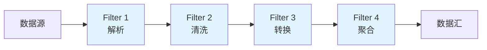
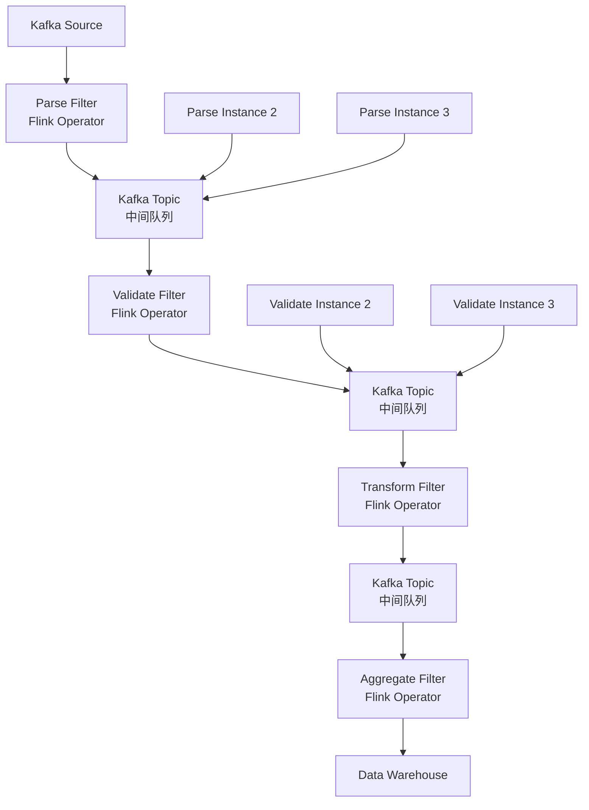

# 管道-过滤器架构

## 一个 ETL 系统的崩塌

2020年双十一大促前夜，我们上线了新版数据中台 ETL 系统。

大促当天，实时数据从 Kafka 流入 ETL 管道：解析 → 清洗 → 转换 → 聚合 → 写入下游。凌晨0点大促开始，流量峰值是平时的 20 倍。

ETL 管道在凌晨 0:15 开始出现严重延迟——消息处理不过来了。最要命的是，整个 ETL 是一个单体程序，解析、清洗、转换、聚合全耦合在一起。要扩容，只能整体扩容；要修一个环节的 bug，只能停掉整个管道。

从凌晨 0:15 发现问题，到凌晨 2:30 紧急扩容完成恢复，延迟了将近 2 个小时。运营日报的数据全部延迟，品牌方的实时大屏也黑了。

这次事故之后，我们重构成了管道-过滤器架构。

## 问题定义

传统单体 ETL 或数据处理系统的问题：

- **紧耦合**：每个处理环节依赖其他环节的数据结构和状态
- **难以扩展**：某个环节成为瓶颈时，只能整体扩容
- **难以测试**：无法单独测试某个处理步骤
- **难以复用**：相同的解析逻辑在多个地方重复
- **单点故障**：一个环节崩了，整个管道停摆

【架构权衡】

管道-过滤器架构的核心思想是：**将数据处理过程分解为独立的、可组合的处理单元**。每个过滤器（Filter）只做一件事，单元之间通过管道（Pipe）连接，数据像水流一样在管道中流动。

这就像工厂流水线——每个工位只完成一道工序，工序之间用传送带连接。任何工位可以单独优化、单独替换、单独扩容。

## 核心概念



**管道（Pipe）**：负责在过滤器之间传递数据，通常是阻塞队列或异步消息通道
**过滤器（Filter）**：独立的处理单元，输入数据，输出处理后的数据
**数据源（Source）**：数据入口，如 Kafka、文件、数据库
**数据汇（Sink）**：数据出口，如数据库、消息队列、文件系统

## 方案演进

### 方案A：单体管道（传统做法）

```java
// 单体 ETL：所有逻辑耦合在一起
class MonolithicETL {
    public void process(List<String> rawData) {
        for (String record : rawData) {
            // 解析
            OrderEvent event = parse(record);
            // 清洗
            if (!validate(event)) continue;
            // 转换
            OrderModel model = transform(event);
            // 聚合
            aggregator.aggregate(model);
        }
    }
}
```

**优点**：简单，开发周期短，适合小数据量
**缺点**：紧耦合，无法独立扩展，单点故障
**适用场景**：数据量稳定、处理逻辑简单、无高并发要求

### 方案B：管道-过滤器（轻量版）

```java
// 管道接口
interface Pipe<T> {
    void write(T data);
    void connect(Filter<T, ?> next);
}

// 过滤器接口
interface Filter<T, R> {
    R process(T input);
}

// 解析过滤器
class ParserFilter implements Filter<String, OrderEvent> {
    @Override
    public OrderEvent process(String input) {
        return JSON.parseObject(input, OrderEvent.class);
    }
}

// 清洗过滤器
class ValidationFilter implements Filter<OrderEvent, OrderEvent> {
    @Override
    public OrderEvent process(OrderEvent input) {
        if (input.getAmount() == null || input.getAmount().compareTo(BigDecimal.ZERO) <= 0) {
            return null; // 过滤掉非法数据
        }
        return input;
    }
}

// 转换过滤器
class TransformFilter implements Filter<OrderEvent, OrderModel> {
    @Override
    public OrderModel process(OrderEvent input) {
        if (input == null) return null;
        OrderModel model = new OrderModel();
        model.setOrderId(input.getId());
        model.setAmount(input.getAmount());
        model.setTimestamp(input.getCreatedAt());
        model.setCategory(categoryMapper.map(input.getCategoryCode()));
        return model;
    }
}

// 聚合过滤器（状态ful，需要内部状态）
class AggregationFilter implements Filter<OrderModel, Void> {
    private Map<String, OrderStats> statsMap = new ConcurrentHashMap<>();

    @Override
    public Void process(OrderModel input) {
        if (input == null) return null;
        statsMap.compute(input.getCategory(), (k, v) -> {
            if (v == null) v = new OrderStats();
            v.setOrderCount(v.getOrderCount() + 1);
            v.setTotalAmount(v.getTotalAmount().add(input.getAmount()));
            return v;
        });
        return null;
    }

    public Map<String, OrderStats> getStats() { return statsMap; }
}

// 管道组装
class Pipeline {
    private Filter head;
    private Filter tail;

    public Pipeline add(Filter filter) {
        if (head == null) {
            head = tail = filter;
        } else {
            tail.connect(filter);
            tail = filter;
        }
        return this;
    }
}
```

**优点**：过滤器独立，可单独测试，可复用
**缺点**：Java 接口方式有对象创建开销；在 JVM 中不如流式 API 高效
**适用场景**：中等规模数据处理，需要一定灵活性

### 方案C：Java Stream 管道（生产推荐）

Java 8+ 的 Stream API 天然就是管道-过滤器的实现。

```java
// 使用 Stream 实现管道过滤器
public class StreamBasedETL {

    public Stream<OrderModel> buildPipeline(Stream<String> rawData) {
        return rawData
            .map(this::parse)           // Filter: 解析
            .filter(Objects::nonNull)   // Filter: 清洗
            .filter(this::validate)
            .map(this::transform)       // Filter: 转换
            .filter(Objects::nonNull);
    }

    // 大促期间用并行流加速
    public Stream<OrderModel> buildParallelPipeline(Stream<String> rawData) {
        return rawData
            .parallel()                 // 并行处理
            .map(this::parse)
            .filter(Objects::nonNull)
            .filter(this::validate)
            .map(this::transform)
            .filter(Objects::nonNull);
    }

    private OrderEvent parse(String record) {
        try {
            return objectMapper.readValue(record, OrderEvent.class);
        } catch (JsonProcessingException e) {
            log.warn("解析失败: {}", record, e);
            return null;
        }
    }

    private boolean validate(OrderEvent event) {
        return event.getAmount() != null
            && event.getAmount().compareTo(BigDecimal.ZERO) > 0
            && event.getId() != null;
    }

    private OrderModel transform(OrderEvent event) {
        OrderModel model = new OrderModel();
        model.setOrderId(event.getId());
        model.setAmount(event.getAmount());
        model.setTimestamp(event.getCreatedAt());
        model.setCategory(categoryMapper.map(event.getCategoryCode()));
        return model;
    }
}
```

### 方案D：分布式管道（高并发场景）

当单机无法承载数据量时，需要分布式管道。



```java
// Flink 分布式管道实现
public class FlinkETLPipeline {

    public void buildPipeline(StreamExecutionEnvironment env) {
        // Source: 从 Kafka 读取原始数据
        DataStream<String> rawStream = env.addSource(
            new FlinkKafkaConsumer<>(
                "order-events",
                new SimpleStringSchema(),
                kafkaProps
            )
        );

        // 解析
        DataStream<OrderEvent> parsedStream = rawStream
            .map(record -> {
                try {
                    return objectMapper.readValue(record, OrderEvent.class);
                } catch (JsonProcessingException e) {
                    return null;
                }
            })
            .filter(Objects::nonNull);

        // 清洗
        DataStream<OrderEvent> validatedStream = parsedStream
            .filter(e -> e.getAmount() != null
                && e.getAmount().compareTo(BigDecimal.ZERO) > 0
                && e.getId() != null);

        // 按类目分组的聚合（10秒滚动窗口）
        DataStream<CategoryStats> statsStream = validatedStream
            .keyBy(OrderEvent::getCategory)
            .window(TumblingProcessingTimeWindows.of(Time.seconds(10)))
            .aggregate(new CategoryAggregator());

        // Sink: 写入下游
        statsStream.addSink(
            new FlinkKafkaProducer<>("order-stats", new JsonSerializationSchema())
        );
    }
}

// 自定义聚合器
class CategoryAggregator implements AggregateFunction<OrderEvent, OrderStats, CategoryStats> {
    @Override
    public OrderStats createAccumulator() {
        return new OrderStats();
    }

    @Override
    public OrderStats add(OrderEvent value, OrderStats accumulator) {
        accumulator.addOrder(value);
        return accumulator;
    }

    @Override
    public CategoryStats getResult(OrderStats accumulator) {
        return accumulator.toCategoryStats();
    }

    @Override
    public OrderStats merge(OrderStats a, OrderStats b) {
        a.merge(b);
        return a;
    }
}
```

## 关键设计决策

### 管道缓冲与反压

过滤器之间用有界队列（Bounded Queue）连接。当下游处理速度慢于上游时，队列会满，上游自动被反压（Back Pressure）。

```java
// BlockingQueue 实现管道缓冲
class BlockingQueuePipe<T> implements Pipe<T> {

    private BlockingQueue<T> queue;
    private Filter<T, ?> nextFilter;
    private ExecutorService executor;

    public BlockingQueuePipe(int capacity) {
        this.queue = new LinkedBlockingQueue<>(capacity);
    }

    @Override
    public void write(T data) {
        boolean offered = queue.offer(data, 100, TimeUnit.MILLISECONDS);
        if (!offered) {
            // 队列满了，触发反压策略
            // 1. 丢弃（熔断）
            // 2. 阻塞等待
            // 3. 告警 + 降级
            handleBackPressure(data);
        }
    }

    @Override
    public void connect(Filter<T, ?> next) {
        this.nextFilter = next;
        this.executor = Executors.newSingleThreadExecutor();
        this.executor.submit(this::consumeLoop);
    }

    private void consumeLoop() {
        while (true) {
            try {
                T data = queue.poll(1, TimeUnit.SECONDS);
                if (data != null && nextFilter != null) {
                    Object result = nextFilter.process(data);
                    if (result != null && nextPipe != null) {
                        nextPipe.write(result);
                    }
                }
            } catch (InterruptedException e) {
                Thread.currentThread().interrupt();
                break;
            }
        }
    }
}
```

【架构权衡】

管道缓冲大小的选择是一个关键权衡：
- **队列太大**：内存占用高，数据延迟大（数据在队列里等很久）
- **队列太小**：容易触发反压，上游被迫降速或丢弃数据

经验值：
- 处理延迟敏感：`queue size = 100~1000`
- 吞吐量优先：`queue size = 10000~50000`
- 内存敏感：`queue size = 1000`，配置好告警和熔断

### 过滤器热插拔

管道-过滤器架构最大的优势之一是可以在运行时修改管道拓扑。

```java
// 动态管道管理器
class DynamicPipelineManager {

    private Pipeline pipeline = new Pipeline();
    private Map<String, Filter> registeredFilters = new ConcurrentHashMap<>();

    // 注册过滤器
    public void registerFilter(String name, Filter filter) {
        registeredFilters.put(name, filter);
    }

    // 动态添加过滤器（在转换和聚合之间插入一个新的过滤器）
    public void insertFilter(String after, String name) {
        Filter target = registeredFilters.get(after);
        Filter newFilter = registeredFilters.get(name);
        pipeline.insertAfter(target, newFilter);
    }

    // 动态移除过滤器（不重启服务）
    public void removeFilter(String name) {
        Filter filter = registeredFilters.get(name);
        pipeline.remove(filter);
    }

    // 下游出问题时，快速切换到降级管道
    public void switchToDegradedPipeline() {
        pipeline.clear();
        pipeline.add(registeredFilters.get("parse"))
                .add(registeredFilters.get("validate"))
                .add(registeredFilters.get("simpleTransform"))  // 降级：跳过复杂转换
                .add(registeredFilters.get("basicAggregate"));
    }
}
```

## 生产避坑

### 坑1：过滤器顺序不当导致数据倾斜

聚合过滤器如果放在管道前端，会导致大量中间数据堆积。

**场景**：将 `GroupByKey` 聚合放在管道前 10% 的位置，所有流量都打到同一个聚合实例。

**正确做法**：遵循"先过滤、再转换、最后聚合"的原则。减少数据量后再做重量级操作。

### 坑2：NullPointerException 在管道中扩散

一个过滤器返回 null，如果下游没有做空值保护，会导致整个管道崩溃。

```java
// 错误的写法：没有空值保护
DataStream<OrderModel> result = rawData
    .map(this::transform)      // transform 可能返回 null
    .map(model -> model.toStats()); // NPE!

// 正确的写法：每一步都保护
DataStream<OrderModel> result = rawData
    .map(this::transform)
    .filter(Objects::nonNull)   // 关键：过滤掉 null
    .map(model -> model.toStats());
```

### 坑3：状态ful 过滤器无法并行

聚合类过滤器有内部状态，如果不小心用了并行流，状态会错乱。

```java
// 错误：并行流 + 有状态聚合 = 数据错乱
rawData.parallelStream()
    .map(this::parse)
    .filter(this::validate)
    .forEach(model -> {
        statsMap.compute(...)  // 并行写入同一个 Map，数据会错乱
    });

// 正确：用串行流或者分区聚合
rawData.stream()  // 串行流
    .map(this::parse)
    .forEach(model -> statsMap.compute(...));
```

### 坑4：管道启动时数据丢失

新过滤器上线时，Kafka 或消息队列中积压的数据可能被重复消费或漏掉。

**解决方案**：
- 使用 Flink 的 exactly-once 语义（checkpoint）
- 管道启动前记录消费位点，启动后从断点继续
- 关键管道上线前做小流量灰度

## 工程代价评估

| 维度 | 评估 |
| --- | --- |
| 运维成本 | 中——过滤器独立，可单独监控，需要监控每个管道的吞吐和延迟 |
| 排障复杂度 | 低——单个过滤器的输入输出清晰，问题定位容易 |
| 扩展性 | 高——按需扩容瓶颈过滤器，不影响其他环节 |
| 吞吐量 | 高——各环节可并行，支持背压 |
| 延迟 | 中——管道层次数越多，延迟累加越多 |
| 开发成本 | 中——需要设计好过滤器接口和管道管理器 |

## 落地 Checklist

- [ ] 过滤器接口标准化（输入/输出类型定义）
- [ ] 每级管道的队列大小和反压策略确定
- [ ] 关键过滤器设置监控指标（处理量、耗时、错误率）
- [ ] 聚合类过滤器确认是否为状态ful，决定是否需要 checkpoint
- [ ] 降级管道设计（某个过滤器崩溃时的 fallback）
- [ ] 端到端的 exactly-once 或 at-least-once 保证
- [ ] 单元测试：每个过滤器独立测试，覆盖正常/异常输入
- [ ] 集成测试：管道组装后的端到端测试

## 常见应用场景

### 场景1：日志处理流水线

```java
rawLogStream
    .map(LogParser::parse)           // 解析
    .filter(Log::isValid)            // 过滤无效日志
    .map(LogNormalizer::normalize)   // 标准化
    .keyBy(Log::getTraceId)
    .window(TumblingEventTimeWindows.of(Time.minutes(5)))
    .process(new LogAggregator())    // 聚合
    .addSink(ElasticsearchSink);
```

### 场景2：ETL 数据管道

```java
// Source -> Parse -> Dedupe -> Transform -> Enrich -> Sink
Pipeline etl = new Pipeline();
etl.add(new BinaryParser())           // 二进制解析
   .add(new DedupeFilter(redisClient)) // 去重（基于 Redis）
   .add(new SchemaTransform())         // Schema 转换
   .add(new EnrichFilter(userService)) // 数据丰富
   .add(new ElasticSearchSink());      // 写入 ES
```

### 场景3：实时告警处理

```java
// Metric -> Parse -> ThresholdCheck -> GroupBy -> Aggregate -> Alert
metricStream
    .map(MetricParser::parse)
    .filter(m -> m.getValue() > threshold)
    .keyBy(Metric::getMetricName)
    .window(Time.minutes(5))
    .aggregate(new AlertAggregator(threshold))
    .filter(stats -> stats.getCount() > alertMinCount)
    .addSink(AlertNotifier);
```

【架构权衡】

管道-过滤器是处理"数据流"问题的经典架构，但要注意它不是万能的：
- 当管道层次数超过 10 层时，延迟会成为主要瓶颈，考虑合并轻量级过滤器
- 当过滤器之间的数据格式差异很大时，转换过滤器会变成维护噩梦，考虑引入 schema registry
- 当需要复杂的条件路由（不是线性管道而是 DAG）时，考虑引入 Apache Camel 或 Flink 的侧输出
