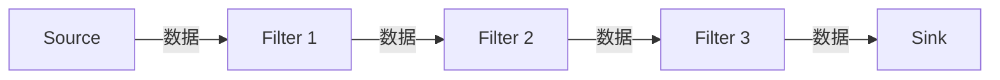

# 管道-过滤器模式

**目标读者**：P6/P7 面试准备  
**面试级别**：P6 中频

## 快速自测

> **🔴 面试官最关心的 3 个问题**
>
> 1. 什么是管道-过滤器模式？
> 2. 管道-过滤器模式和责任链模式有什么区别？
> 3. 在哪些场景适合使用管道-过滤器？

---

## 一、核心概念

管道-过滤器模式（Pipe-Filter）是一种数据流处理架构，每个处理步骤称为过滤器，数据通过管道传递。



---

## 二、代码实现

### 1. 管道接口

```java
// 数据管道
public interface Pipe<I, O> {
    O process(I input);
}

// 过滤器接口
public interface Filter<I, O> {
    O process(I input);
    default Pipe<I, O> to(Filter<O, ?> next) {
        return input -> {
            O intermediate = this.process(input);
            return next.process(intermediate);
        };
    }
}
```

### 2. 具体过滤器

```java
// 输入验证过滤器
public class ValidationFilter implements Filter<String, String> {
    @Override
    public String process(String input) {
        if (input == null || input.isEmpty()) {
            throw new IllegalArgumentException("输入不能为空");
        }
        return input;
    }
}

// 转大写过滤器
public class UpperCaseFilter implements Filter<String, String> {
    @Override
    public String process(String input) {
        return input.toUpperCase();
    }
}

// 分割过滤器
public class SplitFilter implements Filter<String, List<String>> {
    @Override
    public List<String> process(String input) {
        return Arrays.asList(input.split(" "));
    }
}

// 计数过滤器
public class CountFilter implements Filter<List<String>, Integer> {
    @Override
    public Integer process(List<String> input) {
        return input.size();
    }
}
```

### 3. 管道组装

```java
public class TextPipeline {
    private final List<Filter<?, ?>> filters = new ArrayList<>();

    public TextPipeline addFilter(Filter<?, ?> filter) {
        filters.add(filter);
        return this;
    }

    public <T> T execute(Object input) {
        Object current = input;
        for (Filter<?, ?> filter : filters) {
            current = ((Filter) filter).process(current);
        }
        return (T) current;
    }
}

// 使用
public class Client {
    public static void main(String[] args) {
        TextPipeline pipeline = new TextPipeline()
            .addFilter(new ValidationFilter())
            .addFilter(new UpperCaseFilter())
            .addFilter(new SplitFilter())
            .addFilter(new CountFilter());

        int count = pipeline.execute("hello world");
        System.out.println("单词数量: " + count);
    }
}
```

---

## 三、Spring Security 过滤器链

```java
// Spring Security 过滤器链
@Configuration
@EnableWebSecurity
public class SecurityConfig extends WebSecurityConfigurerAdapter {
    @Override
    protected void configure(HttpSecurity http) throws Exception {
        http
            .addFilterBefore(new CsrfFilter(), UsernamePasswordAuthenticationFilter.class)
            .addFilterBefore(new SessionFilter(), UsernamePasswordAuthenticationFilter.class)
            .addFilterBefore(new UsernamePasswordAuthenticationFilter(), BasicAuthenticationFilter.class)
            .addFilterBefore(new BasicAuthenticationFilter(), ExceptionTranslationFilter.class)
            // 更多过滤器...
    }
}
```

---

## 四、对比

| 对比 | 管道-过滤器 | 责任链模式 |
|------|-------------|------------|
| 数据流 | 线性传递 | 可分支 |
| 处理方式 | 依次处理 | 找到处理者后停止 |
| 用途 | 数据处理流水线 | 请求处理链 |
| 顺序 | 固定顺序 | 可动态调整 |

---

## 五、面试追问

> **第一层**：什么是管道-过滤器模式？
>
> **第二层**：管道-过滤器和责任链有什么区别？
>
> **第三层**：有哪些实际应用？

**💡 加分回答**：可以提到 Linux 的管道 `|` 就是管道-过滤器模式的经典应用。
