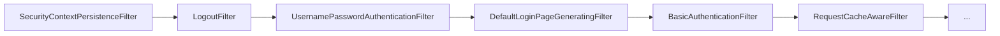

# 责任链模式

**目标读者**：P5/P6 面试准备  
**面试级别**：P5 中频

## 快速自测

> **🔴 面试官最关心的 3 个问题**
>
> 1. 责任链模式和 if-else 有什么区别？
> 2. Spring Security 的过滤器链是如何工作的？
> 3. 责任链模式和装饰器模式有什么区别？

---

## 一、为什么需要责任链模式

### if-else 的问题

```java
public String handleRequest(String request) {
    if (request.startsWith("/admin")) {
        // 权限校验
    } else if (request.startsWith("/api")) {
        // API 处理
    } else if (request.startsWith("/static")) {
        // 静态资源
    } else {
        // 默认处理
    }
    // 问题：新增处理器要改代码
}
```

---

## 二、责任链模式实现

```java
// 处理器接口
public interface Handler {
    Handler setNext(Handler handler);
    String handle(String request);
}

// 抽象处理器
public abstract class AbstractHandler implements Handler {
    private Handler next;

    @Override
    public Handler setNext(Handler handler) {
        this.next = handler;
        return handler;
    }

    @Override
    public String handle(String request) {
        if (next != null) {
            return next.handle(request);
        }
        return request;
    }
}

// 具体处理器
public class AuthHandler extends AbstractHandler {
    @Override
    public String handle(String request) {
        if (request.contains("admin")) {
            return "[AuthHandler] 处理: " + request;
        }
        return super.handle(request);
    }
}

public class LoggingHandler extends AbstractHandler {
    @Override
    public String handle(String request) {
        System.out.println("日志: " + request);
        return super.handle(request);
    }
}

// 使用
public class Client {
    public static void main(String[] args) {
        Handler chain = new AuthHandler();
        chain.setNext(new LoggingHandler());

        chain.handle("/admin/dashboard");
    }
}
```

---

## 三、Spring Security 过滤器链



### FilterRegistrationBean

```java
@Bean
public FilterRegistrationBean<MyFilter> myFilter() {
    FilterRegistrationBean<MyFilter> registration = new FilterRegistrationBean<>();
    registration.setFilter(new MyFilter());
    registration.addUrlPatterns("/api/*");
    registration.setOrder(1);  // 执行顺序
    return registration;
}
```

---

## 四、对比总结

| 对比 | 责任链模式 | if-else | 策略模式 |
|------|------------|---------|----------|
| 扩展性 | 高 | 低 | 高 |
| 顺序控制 | 支持 | 不支持 | 不支持 |
| 选择处理器 | 链传递 | 条件判断 | 工厂获取 |
