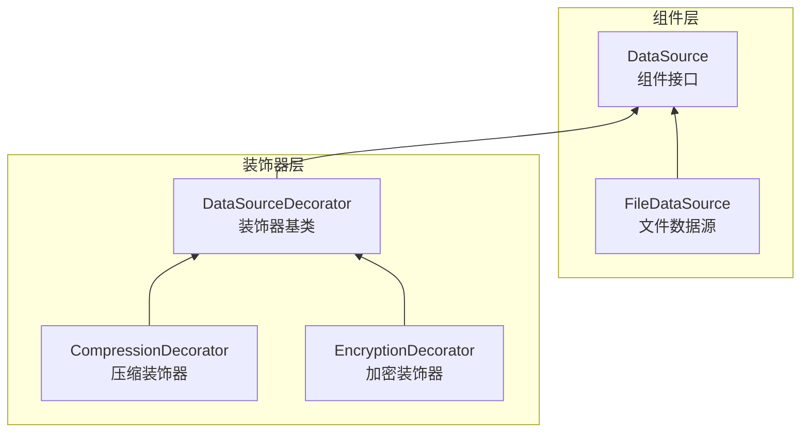

# 装饰器模式

**目标读者**：P5/P6 面试准备  
**面试级别**：P5 低频 / P6 中频

## 快速自测

> **🔴 面试官最关心的 3 个问题**
>
> 1. 装饰器模式和继承有什么区别？
> 2. Java I/O 中哪些类用到了装饰器模式？
> 3. 装饰器模式和代理模式有什么区别？

---

## 一、为什么需要装饰器模式

### 继承的困境

```java
// 使用继承实现功能增强
public class FileData {
    public byte[] read() { return null; }
    public void write(byte[] data) {}
}

// 压缩文件
public class CompressedFileData extends FileData {
    @Override
    public byte[] read() {
        byte[] compressed = super.read();
        return decompress(compressed);
    }

    @Override
    public void write(byte[] data) {
        byte[] compressed = compress(data);
        super.write(compressed);
    }
}

// 加密文件
public class EncryptedFileData extends FileData {
    // 加密逻辑...
}

// 问题：既要压缩又要加密？组合爆炸！
public class CompressedEncryptedFileData extends FileData {
    // 双重继承？不存在的！
}
```

---

## 二、装饰器模式实现

### 核心结构

```java
// 组件接口：定义核心功能
public interface DataSource {
    void write(String data);
    String read();
}

// 基础组件：文件数据源
public class FileDataSource implements DataSource {
    private String filename;

    public FileDataSource(String filename) {
        this.filename = filename;
    }

    @Override
    public void write(String data) {
        // 写入文件
        System.out.println("写入文件: " + data);
    }

    @Override
    public String read() {
        // 读取文件
        return "文件内容";
    }
}

// 装饰器基类（关键）
public class DataSourceDecorator implements DataSource {
    protected DataSource wrappee;  // 被装饰的对象

    public DataSourceDecorator(DataSource wrappee) {
        this.wrappee = wrappee;
    }

    @Override
    public void write(String data) {
        wrappee.write(data);  // 默认委托给被装饰对象
    }

    @Override
    public String read() {
        return wrappee.read();
    }
}

// 具体装饰器：压缩
public class CompressionDecorator extends DataSourceDecorator {
    public CompressionDecorator(DataSource wrappee) {
        super(wrappee);
    }

    @Override
    public void write(String data) {
        String compressed = compress(data);
        super.write(compressed);
    }

    @Override
    public String read() {
        String compressed = super.read();
        return decompress(compressed);
    }

    private String compress(String data) {
        System.out.println("压缩数据");
        return data + ".compressed";
    }

    private String decompress(String data) {
        System.out.println("解压数据");
        return data.replace(".compressed", "");
    }
}

// 具体装饰器：加密
public class EncryptionDecorator extends DataSourceDecorator {
    public EncryptionDecorator(DataSource wrappee) {
        super(wrappee);
    }

    @Override
    public void write(String data) {
        String encrypted = encrypt(data);
        super.write(encrypted);
    }

    @Override
    public String read() {
        String encrypted = super.read();
        return decrypt(encrypted);
    }

    private String encrypt(String data) {
        System.out.println("加密数据");
        return data + ".encrypted";
    }

    private String decrypt(String data) {
        System.out.println("解密数据");
        return data.replace(".encrypted", "");
    }
}
```

### 使用方式

```java
public class Client {
    public static void main(String[] args) {
        // 1. 普通文件
        DataSource source = new FileDataSource("data.txt");

        // 2. 压缩文件
        DataSource compressed = new CompressionDecorator(source);

        // 3. 压缩+加密文件
        DataSource compressedAndEncrypted = new EncryptionDecorator(new CompressionDecorator(source));

        // 写入
        compressedAndEncrypted.write("Hello World");
    }
}
```

### 装饰器模式结构图



---

## 三、装饰器 vs 继承

| 对比 | 装饰器模式 | 继承 |
|------|------------|------|
| 扩展方式 | 组合 | 继承 |
| 类数量 | 类多（每个装饰器一个类） | 类少（每个功能一个子类） |
| 运行时 | 可动态组合 | 编译时确定 |
| 顺序 | 可改变顺序 | 固定 |
| 符合 OCP | ✅ | ❌ |

---

## 四、Java I/O 中的装饰器模式

### 类结构

```
InputStream (抽象组件)
├── FileInputStream (具体组件)
├── ByteArrayInputStream (具体组件)
└── FilterInputStream (装饰器基类)
    ├── BufferedInputStream (缓冲装饰器)
    ├── DataInputStream (数据装饰器)
    └── GZIPInputStream (压缩装饰器)
```

### 使用示例

```java
// 基础组件
FileInputStream file = new FileInputStream("data.txt");

// 缓冲装饰器
BufferedInputStream buffered = new BufferedInputStream(file);

// 数据装饰器
DataInputStream data = new DataInputStream(buffered);

// GZIP 压缩装饰器
GZIPInputStream gzip = new GZIPInputStream(buffered);

// 组合：缓冲 + 压缩 + 数据
DataInputStream combined = new DataInputStream(
    new BufferedInputStream(
        new GZIPInputStream(
            new FileInputStream("data.gz")
        )
    )
);
```

### 自定义装饰器

```java
// 自定义日志装饰器
public class LoggingInputStream extends FilterInputStream {
    public LoggingInputStream(InputStream in) {
        super(in);
    }

    @Override
    public int read() throws IOException {
        int data = super.read();
        if (data != -1) {
            System.out.println("读取字节: " + (char) data);
        }
        return data;
    }

    @Override
    public int read(byte[] b, int off, int len) throws IOException {
        int count = super.read(b, off, len);
        System.out.println("读取了 " + count + " 字节");
        return count;
    }
}
```

---

## 五、装饰器模式 vs 代理模式

| 对比 | 装饰器模式 | 代理模式 |
|------|------------|----------|
| 目的 | 动态添加功能 | 控制对对象的访问 |
| 接口关系 | 装饰器和被装饰对象实现相同接口 | 代理和被代理对象实现相同接口 |
| 代码生成 | 可在运行时动态创建 | 编译时确定 |
| 关注点 | 功能增强 | 访问控制 |

```java
// 装饰器模式：添加功能
DataSource dataSource = new CompressionDecorator(
    new EncryptionDecorator(new FileDataSource("data.txt"))
);

// 代理模式：控制访问
DataSource proxy = new DataSourceProxy(new FileDataSource("data.txt"));
```

---

## 六、面试追问

> **第一层**：装饰器模式解决了什么问题？
>
> **第二层**：Java I/O 中哪些类用到了装饰器模式？
>
> **第三层**：装饰器模式和代理模式有什么区别？

**💡 加分回答**：可以提到 Spring 的 `BeanWrapper`、MyBatis 的 `CachingExecutor` 等都是装饰器模式的应用。
