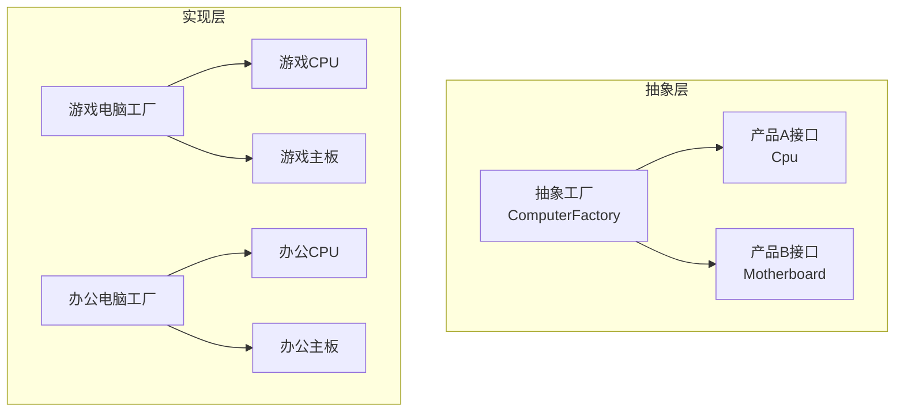

# 工厂模式

**目标读者**：P5/P6 面试准备  
**面试级别**：P5 高频 / P6 进阶

## 快速自测

> **🔴 面试官最关心的 3 个问题**
>
> 1. 简单工厂、工厂方法、抽象工厂有什么区别？
> 2. 工厂方法模式如何符合开闭原则？
> 3. Spring 的 `BeanFactory` 用的是什么工厂模式？

---

## 一、为什么需要工厂模式

### 直接 new 的问题

```java
// 直接 new 导致的问题
public class OrderService {
    public void createOrder(String type) {
        if ("normal".equals(type)) {
            NormalOrder order = new NormalOrder(); // 依赖具体类
            order.process();
        } else if ("vip".equals(type)) {
            VipOrder order = new VipOrder(); // 依赖具体类
            order.process();
        } else if ("flash".equals(type)) {
            FlashOrder order = new FlashOrder(); // 依赖具体类
            order.process();
        }
    }
}
```

**问题**：
- 新增订单类型需要修改 `OrderService`
- 违反开闭原则（对扩展开放，对修改关闭）
- 订单创建逻辑分散，难以维护

---

## 二、简单工厂模式

### 实现方式

```java
// 产品接口
public interface Order {
    void process();
}

// 具体产品
public class NormalOrder implements Order {
    @Override
    public void process() {
        System.out.println("处理普通订单");
    }
}

public class VipOrder implements Order {
    @Override
    public void process() {
        System.out.println("处理VIP订单");
    }
}

public class FlashOrder implements Order {
    @Override
    public void process() {
        System.out.println("处理秒杀订单");
    }
}

// 简单工厂
public class OrderFactory {
    public static Order createOrder(String type) {
        switch (type) {
            case "normal":
                return new NormalOrder();
            case "vip":
                return new VipOrder();
            case "flash":
                return new FlashOrder();
            default:
                throw new IllegalArgumentException("未知订单类型: " + type);
        }
    }
}

// 使用
public class OrderService {
    public void createOrder(String type) {
        Order order = OrderFactory.createOrder(type);
        order.process();
    }
}
```

### 简单工厂的优缺点

| 优点 | 缺点 |
|------|------|
| 封装了创建逻辑 | 违反开闭原则（新增产品要改工厂） |
| 调用方与产品解耦 | 工厂类职责过重 |
| 代码简洁 | 难以扩展产品族 |

### ⚠️ 面试陷阱

> 很多人误以为简单工厂是「设计模式」，但 GoF 23 种设计模式中**没有简单工厂**。它只是一种编程习惯。

---

## 三、工厂方法模式

### 核心思想

定义一个创建对象的接口，让子类决定实例化哪个类。

### 实现方式

```java
// 产品接口
public interface Order {
    void process();
}

// 具体产品
public class NormalOrder implements Order {
    @Override
    public void process() {
        System.out.println("处理普通订单");
    }
}

public class VipOrder implements Order {
    @Override
    public void process() {
        System.out.println("处理VIP订单");
    }
}

// 抽象工厂
public abstract class OrderFactory {
    // 抽象方法，由子类实现
    public abstract Order createOrder();

    // 模板方法：订单处理流程
    public void processOrder() {
        Order order = createOrder();
        order.process();
    }
}

// 具体工厂
public class NormalOrderFactory extends OrderFactory {
    @Override
    public Order createOrder() {
        return new NormalOrder();
    }
}

public class VipOrderFactory extends OrderFactory {
    @Override
    public Order createOrder() {
        return new VipOrder();
    }
}

// 使用
public class OrderService {
    private OrderFactory factory;

    public OrderService(OrderFactory factory) {
        this.factory = factory;
    }

    public void processOrder() {
        factory.processOrder();
    }
}

// 调用
OrderService service = new OrderService(new VipOrderFactory());
service.processOrder();
```

### 符合开闭原则

```
新增订单类型？
    ↓
新增一个类 NormalOrder（产品）
    ↓
新增一个类 NormalOrderFactory（工厂）
    ↓
无需修改现有代码 ✅
```

### 工厂方法 vs 简单工厂

| 对比 | 简单工厂 | 工厂方法 |
|------|----------|----------|
| 符合 OCP | ❌ | ✅ |
| 代码复杂度 | 低 | 中 |
| 扩展方式 | 修改工厂 | 新增工厂类 |
| 产品数量 | 单一产品 | 单一产品族 |

---

## 四、抽象工厂模式

### 解决的问题

工厂方法只创建一个产品，但实际场景中经常需要创建**产品族**。

**场景**：组装电脑
- 产品族 A：游戏电脑（游戏CPU、游戏主板、游戏显卡）
- 产品族 B：办公电脑（办公CPU、办公主板、办公显卡）

### 实现方式

```java
// CPU 产品族
public interface Cpu {
    void calculate();
}

public class GameCpu implements Cpu {
    @Override
    public void calculate() {
        System.out.println("游戏CPU高性能计算");
    }
}

public class OfficeCpu implements Cpu {
    @Override
    public void calculate() {
        System.out.println("办公CPU低功耗计算");
    }
}

// 主板产品族
public interface Motherboard {
    void install();
}

public class GameMotherboard implements Motherboard {
    @Override
    public void install() {
        System.out.println("游戏主板支持超频");
    }
}

public class OfficeMotherboard implements Motherboard {
    @Override
    public void install() {
        System.out.println("办公主板稳定可靠");
    }
}

// 抽象工厂：创建整个产品族
public interface ComputerFactory {
    Cpu createCpu();
    Motherboard createMotherboard();
}

// 具体工厂：游戏电脑工厂
public class GameComputerFactory implements ComputerFactory {
    @Override
    public Cpu createCpu() {
        return new GameCpu();
    }

    @Override
    public Motherboard createMotherboard() {
        return new GameMotherboard();
    }
}

// 具体工厂：办公电脑工厂
public class OfficeComputerFactory implements ComputerFactory {
    @Override
    public Cpu createCpu() {
        return new OfficeCpu();
    }

    @Override
    public Motherboard createMotherboard() {
        return new OfficeMotherboard();
    }
}

// 使用
public class ComputerShop {
    public static void main(String[] args) {
        // 创建游戏电脑
        ComputerFactory gameFactory = new GameComputerFactory();
        Cpu gameCpu = gameFactory.createCpu();
        Motherboard gameBoard = gameFactory.createMotherboard();
        gameCpu.calculate();
        gameBoard.install();

        // 创建办公电脑
        ComputerFactory officeFactory = new OfficeComputerFactory();
        Cpu officeCpu = officeFactory.createCpu();
        Motherboard officeBoard = officeFactory.createMotherboard();
        officeCpu.calculate();
        officeBoard.install();
    }
}
```

### 抽象工厂结构图



### 三种工厂模式对比

| 对比 | 简单工厂 | 工厂方法 | 抽象工厂 |
|------|----------|----------|----------|
| 产品数量 | 单一产品 | 单一产品族 | 多个产品族 |
| 扩展方式 | 修改工厂 | 新增工厂 | 新增工厂 |
| 符合 OCP | ❌ | ✅ | ✅ |
| 复杂度 | 低 | 中 | 高 |
| 适用场景 | 产品固定 | 产品会扩展 | 产品族会扩展 |

---

## 五、Spring 中的工厂模式

### BeanFactory

```java
// Spring 的 BeanFactory 是工厂方法模式的实现
public interface BeanFactory {
    Object getBean(String name) throws BeansException;
    <T> T getBean(String name, Class<T> requiredType) throws BeansException;
}

// 顶级接口
public interface ListableBeanFactory extends BeanFactory { }

// 可获取 BeanDefinition
public interface ConfigurableListableBeanFactory
    extends ConfigurableBeanFactory, ListableBeanFactory {
    void preInstantiateSingletons();
}
```

### BeanFactory 的继承体系


### ApplicationContext

```java
// ApplicationContext 是 BeanFactory 的子接口
public interface ApplicationContext extends Lifecycle, EnvironmentCapable {
    // 继承的方法
    Object getBean(String name);
    <T> T getBean(Class<T> requiredType);

    // 扩展的方法
    String[] getBeanDefinitionNames();
    boolean containsBean(String name);
}

// 常见实现
// ClassPathXmlApplicationContext - XML配置
// AnnotationConfigApplicationContext - 注解配置
// WebApplicationContext - Web应用
```

### Spring 的工厂方法

```java
// 1. 静态工厂方法
@Configuration
public class StaticFactoryConfig {
    @Bean
    public static DataSource dataSource() {
        return new DruidDataSource();
    }
}

// 2. 实例工厂方法
@Configuration
public class InstanceFactoryConfig {
    @Bean
    public DataSource dataSource() {
        return new DruidDataSource();
    }
}

// 3. FactoryBean（面试常问）
public class UserDaoFactoryBean implements FactoryBean<UserDao> {
    @Override
    public UserDao getObject() throws Exception {
        return new UserDao();
    }

    @Override
    public Class<?> getObjectType() {
        return UserDao.class;
    }

    @Override
    public boolean isSingleton() {
        return true;
    }
}
```

### FactoryBean vs BeanFactory

| 对比 | BeanFactory | FactoryBean |
|------|-------------|-------------|
| 定位 | 容器顶级接口 | 创建 Bean 的工厂 |
| 使用场景 | Spring 核心 | 复杂 Bean 创建 |
| 获取对象 | `getBean()` | `getBean()` 返回 FactoryBean 创建的对象 |
| 典型应用 | `DefaultListableBeanFactory` | `SqlSessionFactoryBean` |

---

## 六、面试追问

> **第一层**：简单工厂和工厂方法的区别？
>
> **第二层**：什么时候用抽象工厂？
>
> **第三层**：Spring 的 FactoryBean 和 BeanFactory 有什么区别？

**💡 加分回答**：

```java
// MyBatis 的 SqlSessionFactory 是工厂方法模式
// SqlSessionFactoryBuilder -> SqlSessionFactory -> SqlSession

// SqlSessionFactory 的创建过程
SqlSessionFactory factory = new SqlSessionFactoryBuilder()
    .build(inputStream); // 读取配置，构建工厂

SqlSession session = factory.openSession(); // 从工厂获取 session
```

---

## 七、实战应用

### 支付场景

```java
// 支付接口
public interface Payment {
    PayResult pay(Order order);
}

// 具体支付实现
public class Alipay implements Payment {
    @Override
    public PayResult pay(Order order) {
        // 支付宝支付逻辑
        return new PayResult(true, "alipay_" + System.currentTimeMillis());
    }
}

public class WechatPay implements Payment {
    @Override
    public PayResult pay(Order order) {
        // 微信支付逻辑
        return new PayResult(true, "wechat_" + System.currentTimeMillis());
    }
}

public class UnionPay implements Payment {
    @Override
    public PayResult pay(Order order) {
        // 银联支付逻辑
        return new PayResult(true, "union_" + System.currentTimeMillis());
    }
}

// 支付工厂（简单工厂）
public class PaymentFactory {
    private static final Map<String, Payment> PAYMENTS = new ConcurrentHashMap<>();

    static {
        PAYMENTS.put("alipay", new Alipay());
        PAYMENTS.put("wechat", new WechatPay());
        PAYMENTS.put("union", new UnionPay());
    }

    public static Payment getPayment(String type) {
        Payment payment = PAYMENTS.get(type);
        if (payment == null) {
            throw new IllegalArgumentException("不支持的支付方式: " + type);
        }
        return payment;
    }
}

// 使用
public class OrderService {
    public void payOrder(Long orderId, String paymentType) {
        Order order = orderRepository.findById(orderId);
        Payment payment = PaymentFactory.getPayment(paymentType);
        payment.pay(order);
    }
}
```

---

## 八、常见面试陷阱

> **⚠️ 陷阱 1**：混淆工厂方法和抽象工厂
>
> 工厂方法只有一个产品等级结构，抽象工厂有多个产品等级结构。

> **⚠️ 陷阱 2**：过度使用工厂模式
>
> 不是所有 `new` 都要用工厂。如果产品不会扩展，直接 `new` 更简洁。

> **⚠️ 陷阱 3**：忽略开闭原则
>
> 简单工厂虽然简单，但每次加新产品都要改工厂类，这在稳定系统中是可以接受的。

---

## 九、总结对比表

| 模式 | 产品结构 | 工厂结构 | 扩展方式 | 复杂度 |
|------|----------|----------|----------|--------|
| 简单工厂 | 1 | 1 | 修改工厂 | 低 |
| 工厂方法 | 1 | 多 | 增加工厂 | 中 |
| 抽象工厂 | 多 | 多 | 增加工厂 | 高 |

**💡 选型建议**：
- 产品不扩展：简单工厂
- 产品单一，会扩展：工厂方法
- 多个产品族，会扩展：抽象工厂
