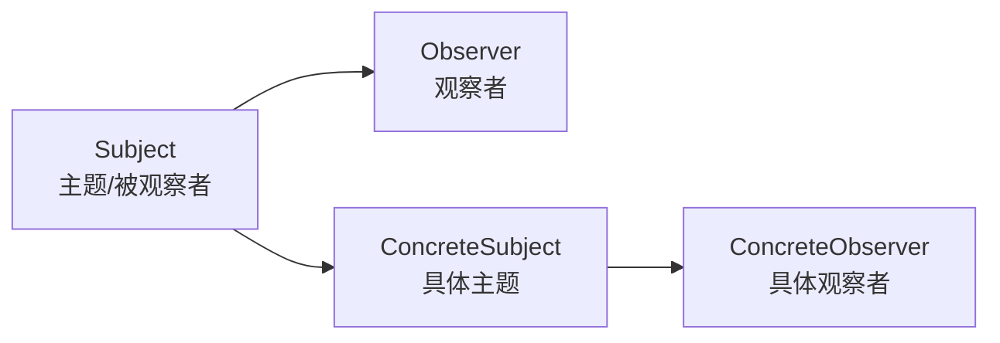

# 观察者模式

**目标读者**：P5/P6 面试准备  
**面试级别**：P5 中频 / P6 高频

## 快速自测

> **🔴 面试官最关心的 3 个问题**
>
> 1. 观察者模式和发布订阅模式有什么区别？
> 2. Java 提供的 Observable 类有什么问题？
> 3. Spring 事件机制是如何实现的？

---

## 一、为什么需要观察者模式

### 场景：订单状态变更通知

```java
// 订单状态变更时，需要通知多个系统
public class OrderService {
    public void updateOrderStatus(Long orderId, String status) {
        // 1. 更新数据库
        orderDao.updateStatus(orderId, status);

        // 2. 发短信通知用户
        smsService.send(orderId, status);

        // 3. 发邮件通知管理员
        emailService.sendAdmin(orderId, status);

        // 4. 更新物流系统
        logisticsService.update(orderId, status);

        // 5. 发送消息到MQ
        mqService.send(orderId, status);

        // 6. 记录日志
        logger.info("订单状态变更", orderId, status);
    }
}
```

**问题**：
- 违反单一职责原则（订单服务干了太多事）
- 难以扩展（新增通知渠道要改代码）
- 难以测试（耦合太多依赖）
- 难以复用通知逻辑

---

## 二、观察者模式实现

### 结构



### 核心接口

```java
// 观察者接口
public interface Observer {
    void update(OrderStatusChange event);
}

// 主题接口
public interface Subject {
    void attach(Observer observer);      // 添加观察者
    void detach(Observer observer);       // 移除观察者
    void notifyAllObservers();            // 通知所有观察者
}
```

### 具体实现

```java
// 订单状态变更事件
public class OrderStatusChange {
    private final Long orderId;
    private final String oldStatus;
    private final String newStatus;
    private final LocalDateTime timestamp;

    public OrderStatusChange(Long orderId, String oldStatus, String newStatus) {
        this.orderId = orderId;
        this.oldStatus = oldStatus;
        this.newStatus = newStatus;
        this.timestamp = LocalDateTime.now();
    }

    // getters...
}

// 订单主题
public class OrderSubject implements Subject {
    private final List<Observer> observers = new CopyOnWriteArrayList<>();

    @Override
    public void attach(Observer observer) {
        observers.add(observer);
    }

    @Override
    public void detach(Observer observer) {
        observers.remove(observer);
    }

    @Override
    public void notifyAllObservers() {
        // 通知逻辑
    }

    // 业务方法：状态变更
    public void changeStatus(Long orderId, String oldStatus, String newStatus) {
        // 更新数据库
        orderDao.updateStatus(orderId, newStatus);

        // 通知观察者
        OrderStatusChange event = new OrderStatusChange(orderId, oldStatus, newStatus);
        observers.forEach(o -> o.update(event));
    }
}

// 短信通知观察者
public class SmsObserver implements Observer {
    @Override
    public void update(OrderStatusChange event) {
        if ("PAID".equals(event.getNewStatus())) {
            smsService.send(event.getOrderId(), "您的订单已支付");
        }
    }
}

// 邮件通知观察者
public class EmailObserver implements Observer {
    @Override
    public void update(OrderStatusChange event) {
        if ("CANCELLED".equals(event.getNewStatus())) {
            emailService.sendAdmin(event.getOrderId(), "订单已取消");
        }
    }
}

// 物流通知观察者
public class LogisticsObserver implements Observer {
    @Override
    public void update(OrderStatusChange event) {
        if ("PAID".equals(event.getNewStatus())) {
            logisticsService.update(event.getOrderId(), "待发货");
        }
    }
}
```

### 使用

```java
public class Client {
    public static void main(String[] args) {
        OrderSubject orderSubject = new OrderSubject();

        // 注册观察者
        orderSubject.attach(new SmsObserver());
        orderSubject.attach(new EmailObserver());
        orderSubject.attach(new LogisticsObserver());

        // 订单状态变更，自动通知所有观察者
        orderSubject.changeStatus(1001L, "CREATED", "PAID");
    }
}
```

---

## 三、Java 提供的支持

### JDK Observable 类（已废弃）

```java
// Java 1.0 引入，但 Java 9 已废弃
public class OldOrderObservable extends Observable {
    public void changeStatus(String status) {
        setChanged();  // 必须调用，设置状态已变更
        notifyObservers(status);  // 通知所有观察者
    }
}

// 观察者
Observer observer = (obs, arg) -> {
    System.out.println("收到通知: " + arg);
};

// 使用
OldOrderObservable observable = new OldOrderObservable();
observable.addObserver(observer);
observable.changeStatus("PAID");
```

**⚠️ 问题**：
1. Observable 是类，不是接口（无法继承其他类）
2. `setChanged()` 容易被忘记调用
3. 线程安全问题（`changed` 字段不是 volatile）
4. `notifyObservers()` 默认顺序通知，不保证线程安全

### Java 9+ 的替代

```java
// Java 9+ 使用 Flow API
public class OrderProcessor {
    private final SubmissionPublisher<OrderStatusChange> publisher =
        new SubmissionPublisher<>();

    public OrderProcessor() {
        // 订阅处理器
        publisher.consume(event -> {
            System.out.println("处理通知: " + event);
        });
    }

    public void changeStatus(OrderStatusChange event) {
        publisher.submit(event);
    }
}
```

---

## 四、观察者模式 vs 发布订阅模式

| 对比 | 观察者模式 | 发布订阅模式 |
|------|------------|--------------|
| 耦合度 | 松耦合（组件直接通信） | 更松耦合（通过消息代理） |
| 通信方式 | 同步 | 异步 |
| 中间件 | 无 | 消息队列、EventBus |
| 适用场景 | 进程内 | 跨进程、跨服务 |
| 扩展性 | 一般 | 高 |

```
观察者模式：
    Subject → 直接调用 → Observer

发布订阅模式：
    Publisher → Message Broker → Subscriber
              (RabbitMQ/Kafka)
```

---

## 五、Spring 事件机制

### 核心组件

```java
// 1. 定义事件
public class OrderCreatedEvent extends ApplicationEvent {
    private final Long orderId;

    public OrderCreatedEvent(Object source, Long orderId) {
        super(source);
        this.orderId = orderId;
    }

    public Long getOrderId() {
        return orderId;
    }
}

// 2. 定义监听器
@Component
public class OrderListener {
    @EventListener
    public void handleOrderCreated(OrderCreatedEvent event) {
        System.out.println("处理订单创建事件: " + event.getOrderId());
    }
}

// 3. 发布事件
@Service
public class OrderService {
    @Autowired
    private ApplicationEventPublisher publisher;

    public void createOrder(Order order) {
        // 创建订单
        orderDao.save(order);
        // 发布事件
        publisher.publishEvent(new OrderCreatedEvent(this, order.getId()));
    }
}
```

### 异步事件

```java
@Component
public class AsyncOrderListener {
    @Async  // 异步执行
    @EventListener
    public void handleOrderCreated(OrderCreatedEvent event) {
        // 异步处理
    }
}
```

### 条件监听

```java
@Component
public class ConditionalListener {
    @EventListener(condition = "#event.orderId > 1000")
    public void handleLargeOrder(OrderCreatedEvent event) {
        // 只处理订单ID大于1000的事件
    }
}
```

---

## 六、Spring 事件原理

```java
// 简化版的 Spring 事件机制
public class SimpleApplicationEventPublisher {
    private final Map<Class<?>, List<Object>> listeners = new ConcurrentHashMap<>();

    public void addListener(Class<?> eventType, Consumer<Object> listener) {
        listeners.computeIfAbsent(eventType, k -> new CopyOnWriteArrayList<>())
                 .add(listener);
    }

    public void publishEvent(Object event) {
        List<Object> eventListeners = listeners.get(event.getClass());
        if (eventListeners != null) {
            eventListeners.forEach(listener -> {
                if (listener instanceof Consumer) {
                    ((Consumer) listener).accept(event);
                } else if (listener instanceof Method) {
                    try {
                        Method method = (Method) listener;
                        Object bean = /* 获取bean */;
                        method.invoke(bean, event);
                    } catch (Exception e) {
                        throw new RuntimeException(e);
                    }
                }
            });
        }
    }
}
```

---

## 七、Guava EventBus

### 使用示例

```java
// 引入依赖
// <dependency>
//     <groupId>com.google.guava</groupId>
//     <artifactId>guava</artifactId>
// </dependency>

// 定义事件
public class OrderEvent {
    private final Long orderId;
    private final String action;

    public OrderEvent(Long orderId, String action) {
        this.orderId = orderId;
        this.action = action;
    }
}

// 定义监听器
public class OrderEventListener {
    @Subscribe
    public void handleOrderCreated(OrderEvent event) {
        System.out.println("处理订单: " + event.getOrderId());
    }

    @Subscribe
    public void handleOrderCancelled(OrderEvent event) {
        System.out.println("处理取消: " + event.getOrderId());
    }
}

// 使用
public class Client {
    public static void main(String[] args) {
        EventBus eventBus = new EventBus();

        OrderEventListener listener = new OrderEventListener();
        eventBus.register(listener);  // 注册监听器

        eventBus.post(new OrderEvent(1L, "CREATED"));  // 发布事件
        eventBus.unregister(listener);  // 取消注册
    }
}
```

---

## 八、实战场景

### 1. 股票价格监控

```java
public interface StockObserver {
    void onPriceChange(String symbol, double price);
}

public class StockSubject {
    private final Map<String, List<StockObserver>> observers = new HashMap<>();

    public void attach(String symbol, StockObserver observer) {
        observers.computeIfAbsent(symbol, k -> new ArrayList<>())
                .add(observer);
    }

    public void updatePrice(String symbol, double price) {
        List<StockObserver> symbolObservers = observers.get(symbol);
        if (symbolObservers != null) {
            symbolObservers.forEach(o -> o.onPriceChange(symbol, price));
        }
    }
}
```

### 2. UI 事件处理

```java
// MVC 中的观察者模式
public interface ViewListener {
    void onAction(String action);
}

public class Button {
    private final List<ViewListener> listeners = new ArrayList<>();

    public void addListener(ViewListener listener) {
        listeners.add(listener);
    }

    public void click() {
        System.out.println("按钮点击");
        listeners.forEach(l -> l.onAction("click"));
    }
}
```

---

## 九、面试追问

> **第一层**：什么是观察者模式？
>
> **第二层**：观察者模式和发布订阅模式有什么区别？
>
> **第三层**：Spring 事件机制是如何实现的？

**💡 加分回答**：可以提到 Spring 的 `ApplicationEventMulticaster` 是事件广播器，`SimpleApplicationEventMulticaster` 是默认实现。

---

## 十、常见面试陷阱

> **⚠️ 陷阱 1**：忽略线程安全问题
>
> `notifyObservers()` 时，如果观察者列表在遍历过程中被修改，会出问题。使用 `CopyOnWriteArrayList`。

> **⚠️ 陷阱 2**：观察者订阅后忘记取消订阅
>
> 导致内存泄漏，特别是在 Android 开发中。
