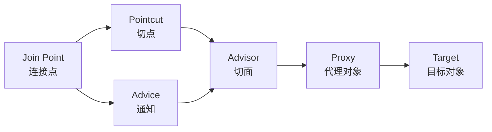

# 代理模式

**目标读者**：P6 面试准备  
**面试级别**：P6 高频

## 快速自测

> **🔴 面试官最关心的 3 个问题**
>
> 1. 静态代理、JDK 动态代理、CGLIB 代理有什么区别？
> 2. Spring AOP 是如何选择使用 JDK 代理还是 CGLIB 的？
> 3. JDK 动态代理为什么只能代理接口？

---

## 一、为什么需要代理模式

### 直接调用的场景

```java
public class UserService {
    public void addUser(User user) {
        // 1. 权限校验
        checkPermission();

        // 2. 记录日志
        log("添加用户: " + user.getName());

        // 3. 业务逻辑
        System.out.println("业务逻辑：添加用户");

        // 4. 性能监控
        long start = System.currentTimeMillis();
        long duration = System.currentTimeMillis() - start;
        metrics.record("addUser", duration);
    }
}
```

**问题**：
- 业务逻辑和横切关注点（权限、日志、监控）混在一起
- 违反单一职责原则
- 难以复用和测试

### 代理模式解决方案

```java
// 接口：定义业务方法
public interface UserService {
    void addUser(User user);
}

// 真实对象：执行业务逻辑
public class RealUserService implements UserService {
    @Override
    public void addUser(User user) {
        // 只关注业务逻辑
        System.out.println("业务逻辑：添加用户 " + user.getName());
    }
}

// 代理对象：添加横切逻辑
public class UserServiceProxy implements UserService {
    private final UserService target;

    public UserServiceProxy(UserService target) {
        this.target = target;
    }

    @Override
    public void addUser(User user) {
        // 前置处理
        checkPermission();
        log("添加用户: " + user.getName());

        // 调用真实对象
        long start = System.currentTimeMillis();
        target.addUser(user);
        long duration = System.currentTimeMillis() - start;

        // 后置处理
        metrics.record("addUser", duration);
    }
}
```

---

## 二、静态代理

### 实现方式

```java
// 接口
public interface OrderService {
    void createOrder(Order order);
    void cancelOrder(Long orderId);
}

// 真实对象
public class RealOrderService implements OrderService {
    @Override
    public void createOrder(Order order) {
        System.out.println("创建订单: " + order.getId());
    }

    @Override
    public void cancelOrder(Long orderId) {
        System.out.println("取消订单: " + orderId);
    }
}

// 静态代理
public class OrderServiceProxy implements OrderService {
    private final RealOrderService target;

    public OrderServiceProxy(RealOrderService target) {
        this.target = target;
    }

    @Override
    public void createOrder(Order order) {
        // 权限校验
        if (!hasPermission("order:create")) {
            throw new SecurityException("无权限创建订单");
        }
        // 日志记录
        log("创建订单: " + order.getId());
        // 调用真实对象
        target.createOrder(order);
        // 事务提交（隐含）
    }

    @Override
    public void cancelOrder(Long orderId) {
        if (!hasPermission("order:cancel")) {
            throw new SecurityException("无权限取消订单");
        }
        log("取消订单: " + orderId);
        target.cancelOrder(orderId);
    }

    private boolean hasPermission(String permission) {
        return true; // 简化
    }

    private void log(String message) {
        System.out.println("[LOG] " + message);
    }
}
```

### 使用方式

```java
public class Client {
    public static void main(String[] args) {
        // 直接调用真实对象
        RealOrderService real = new RealOrderService();
        real.createOrder(new Order());

        // 通过代理调用
        OrderService proxy = new OrderServiceProxy(new RealOrderService());
        proxy.createOrder(new Order());
    }
}
```

### 静态代理的优缺点

| 优点 | 缺点 |
|------|------|
| 实现简单 | 需要为每个类编写代理类 |
| 容易理解 | 代理类和真实类实现相同接口 |
| 无运行时开销 | 大量类时，代理类爆炸 |
| 编译时检查 | 修改接口时，所有代理类都要改 |

---

## 三、JDK 动态代理

### 实现原理

JDK 动态代理通过 `java.lang.reflect.Proxy` 在**运行时生成**代理类字节码。

### 核心 API

```java
public class Proxy {
    // 创建代理对象
    public static Object newProxyInstance(
        ClassLoader loader,           // 类加载器
        Class<?>[] interfaces,        // 代理要实现的接口
        InvocationHandler h           // 方法调用处理器
    ) throws IllegalArgumentException;
}

public interface InvocationHandler {
    // 代理对象的方法被调用时，都会执行这个方法
    Object invoke(Object proxy, Method method, Object[] args) throws Throwable;
}
```

### 实现方式

```java
// 接口
public interface UserService {
    void addUser(User user);
    void deleteUser(Long id);
}

// 真实对象
public class UserServiceImpl implements UserService {
    @Override
    public void addUser(User user) {
        System.out.println("添加用户: " + user.getName());
    }

    @Override
    public void deleteUser(Long id) {
        System.out.println("删除用户: " + id);
    }
}

// JDK 动态代理工厂
public class JdkProxyFactory {
    public static <T> T createProxy(T target) {
        return (T) Proxy.newProxyInstance(
            target.getClass().getClassLoader(),     // 类加载器
            target.getClass().getInterfaces(),      // 实现的接口
            new InvocationHandler() {                // 调用处理器
                @Override
                public Object invoke(Object proxy, Method method, Object[] args) throws Throwable {
                    String methodName = method.getName();

                    // 前置增强
                    if ("addUser".equals(methodName)) {
                        System.out.println("[日志] 准备添加用户...");
                    }

                    // 执行目标方法
                    long start = System.currentTimeMillis();
                    Object result = method.invoke(target, args); // 调用真实对象
                    long duration = System.currentTimeMillis() - start;

                    // 后置增强
                    System.out.println("[监控] 方法执行耗时: " + duration + "ms");

                    return result;
                }
            }
        );
    }
}

// 使用
public class Client {
    public static void main(String[] args) {
        UserService target = new UserServiceImpl();
        UserService proxy = JdkProxyFactory.createProxy(target);

        proxy.addUser(new User("张三"));
        proxy.deleteUser(1L);
    }
}
```

### 生成的代理类结构

```java
// 生成的代理类（简化版）
public final class $Proxy0 extends Proxy implements UserService {
    private InvocationHandler h;

    public $Proxy0(InvocationHandler h) {
        this.h = h;
    }

    @Override
    public void addUser(User user) {
        try {
            // 调用InvocationHandler
            h.invoke(this, method, new Object[]{user});
        } catch (RuntimeException | Error e) {
            throw e;
        } catch (Throwable t) {
            throw new UndeclaredThrowableException(t);
        }
    }
    // ... deleteUser 等方法类似
}
```

### JDK 动态代理的局限

> **⚠️ 为什么 JDK 动态代理只能代理接口？**

1. JDK 动态代理生成的代理类**继承自** `java.lang.reflect.Proxy`
2. Java 是单继承语言，所以代理类不能再继承其他类
3. 因此，代理类只能实现接口，不能继承具体类

```
$Proxy0 继承 Proxy
       实现 UserService
```

---

## 四、CGLIB 动态代理

### 为什么需要 CGLIB

JDK 动态代理只能代理接口，如果类没有实现接口，就需要 CGLIB。

### 核心概念

- **ASM**：字节码操作库，直接操作字节码
- **CGLIB**：基于 ASM 的高级封装，动态生成子类
- **MethodInterceptor**：方法拦截器，类似 JDK 代理的 InvocationHandler

### Maven 依赖

```xml
<dependency>
    <groupId>cglib</groupId>
    <artifactId>cglib</artifactId>
    <version>3.3.0</version>
</dependency>
```

### 实现方式

```java
// 真实类（不需要实现接口）
public class UserService {
    public void addUser(User user) {
        System.out.println("添加用户: " + user.getName());
    }

    public void deleteUser(Long id) {
        System.out.println("删除用户: " + id);
    }
}

// CGLIB 代理工厂
public class CglibProxyFactory {
    public static <T> T createProxy(T target) {
        // 创建Enhancer
        Enhancer enhancer = new Enhancer();
        enhancer.setSuperclass(target.getClass());  // 设置父类
        enhancer.setCallback(new MethodInterceptor() {
            @Override
            public Object intercept(Object obj, Method method,
                                    Object[] args, MethodProxy proxy) throws Throwable {
                String methodName = method.getName();

                // 前置增强
                long start = System.currentTimeMillis();
                System.out.println("[CGLIB] 调用方法: " + methodName);

                // 调用父类方法（真正执行业务逻辑）
                Object result = proxy.invokeSuper(obj, args);

                // 后置增强
                long duration = System.currentTimeMillis() - start;
                System.out.println("[CGLIB] 方法执行完成，耗时: " + duration + "ms");

                return result;
            }
        });

        return (T) enhancer.create();
    }
}

// 使用
public class Client {
    public static void main(String[] args) {
        UserService target = new UserService();
        UserService proxy = CglibProxyFactory.createProxy(target);

        proxy.addUser(new User("张三"));
        proxy.deleteUser(1L);
    }
}
```

### CGLIB 生成的类结构

```
UserService 原始类
    │
    ↓ 继承
CGLIB$$UserService$$ByCGLIB$$hashcode
    │
    ├── addUser() [增强逻辑] → 调用父类 addUser()
    │
    └── deleteUser() [增强逻辑] → 调用父类 deleteUser()
```

---

## 五、JDK 代理 vs CGLIB 代理

| 对比维度 | JDK 动态代理 | CGLIB 动态代理 |
|----------|--------------|----------------|
| 实现方式 | 实现接口，继承 Proxy | 继承父类，生成子类 |
| 代理对象类型 | 接口实现类 | 具体类 |
| 性能 | JDK 8 前较慢，JDK 8+ 优化 | 较快（直接生成字节码） |
| 限制 | 只能代理接口 | 不能代理 final 类/final 方法 |
| Spring 默认 | ✅ (有接口时) | ✅ (无接口时) |

### Spring AOP 的选择策略

```java
// Spring 决定使用哪种代理的核心逻辑
if (targetClass.isInterface() || Proxy.isProxyClass(targetClass)) {
    // 有接口 → 使用 JDK 动态代理
    return JdkDynamicAopProxy.newInstance(this);
} else {
    // 无接口 → 使用 CGLIB
    return CglibAopProxy.newInstance(this);
}
```

### Spring AOP 配置

```java
// 配置强制使用 CGLIB
@EnableAspectJAutoProxy(proxyTargetClass = true)  // 强制使用 CGLIB
@EnableAspectJAutoProxy(proxyTargetClass = false) // 强制使用 JDK 代理（默认）

// application.properties
spring.aop.proxy-target-class=true  // 强制 CGLIB
```

---

## 六、Spring AOP 中的代理模式

### 核心组件



### 五种通知类型

```java
@Aspect
@Component
public class LoggingAspect {

    // 前置通知
    @Before("execution(* com.example.service.*.*(..))")
    public void before(JoinPoint joinPoint) {
        System.out.println("方法执行前: " + joinPoint.getSignature());
    }

    // 后置通知
    @After("execution(* com.example.service.*.*(..))")
    public void after() {
        System.out.println("方法执行后");
    }

    // 返回通知
    @AfterReturning(pointcut = "execution(* com.example.service.*.*(..))", returning = "result")
    public void afterReturning(JoinPoint joinPoint, Object result) {
        System.out.println("方法返回: " + result);
    }

    // 异常通知
    @AfterThrowing(pointcut = "execution(* com.example.service.*.*(..))", throwing = "e")
    public void afterThrowing(Exception e) {
        System.out.println("方法异常: " + e.getMessage());
    }

    // 环绕通知
    @Around("execution(* com.example.service.*.*(..))")
    public Object around(ProceedingJoinPoint pjp) throws Throwable {
        long start = System.currentTimeMillis();
        Object result = pjp.proceed();
        long duration = System.currentTimeMillis() - start;
        System.out.println("方法耗时: " + duration + "ms");
        return result;
    }
}
```

---

## 七、面试追问

> **第一层**：静态代理和动态代理的区别？
>
> **第二层**：JDK 动态代理的实现原理？
>
> **第三层**：Spring AOP 如何选择 JDK 代理和 CGLIB？

**💡 加分回答**：可以提到 `Spring Boot 2.x` 之后默认使用 CGLIB，以及原因。

---

## 八、MyBatis 中的代理模式

### Mapper 代理

```java
// MyBatis 不使用实现类，而是通过代理
public class MapperProxyFactory<T> {
    private final Class<T> mapperInterface;

    public T newInstance(SqlSession sqlSession) {
        MapperProxy<T> proxy = new MapperProxy<>(sqlSession, mapperInterface);
        return (T) Proxy.newProxyInstance(
            mapperInterface.getClassLoader(),
            new Class[]{mapperInterface},
            proxy
        );
    }
}

// MapperProxy 实现了 InvocationHandler
public class MapperProxy<T> implements InvocationHandler {
    @Override
    public Object invoke(Object proxy, Method method, Object[] args) throws Throwable {
        // 根据方法名调用对应的 SQL
        MappedStatement ms = configuration.getMappedStatement(method);
        return sqlSession.selectOne(ms, args);
    }
}
```

### 使用示例

```java
// DAO 接口（不写实现类）
public interface UserDao {
    @Select("SELECT * FROM user WHERE id = #{id}")
    User findById(Long id);

    @Insert("INSERT INTO user(name) VALUES(#{name})")
    int insert(User user);
}

// MyBatis 自动生成代理
SqlSession session = sqlSessionFactory.openSession();
UserDao userDao = session.getMapper(UserDao.class);
User user = userDao.findById(1L); // 实际执行的是代理对象
```

---

## 九、常见面试陷阱

> **⚠️ 陷阱 1**：混淆代理模式和装饰器模式
>
> 代理模式和装饰器模式结构相似，但目的不同：
> - **代理模式**：控制对对象的访问（lazy loading、access control）
> - **装饰器模式**：动态添加功能（功能增强）

> **⚠️ 陷阱 2**：忽略 Spring 代理的坑
>
> Spring 的代理是**通过父类方法调用**的，所以在同类内部方法调用时，事务、缓存等可能不生效。

```java
@Service
public class UserService {
    public void methodA() {
        // 调用 methodB，不会经过代理！
        // 因为 this.methodB() 不走代理
        methodB();
    }

    @Transactional  // 事务可能不生效
    public void methodB() {
        // ...
    }
}
```

> **⚠️ 陷阱 3**：不了解 `AopContext.currentProxy()`
>
> 同类内部调用走代理的解决方案：
> ```java
> ((UserService) AopContext.currentProxy()).methodB();
> ```

---

## 十、总结对比

| 维度 | 静态代理 | JDK 动态代理 | CGLIB 代理 |
|------|----------|--------------|------------|
| 实现方式 | 手动编写 | Proxy.newProxyInstance | Enhancer.create |
| 接口 | 必须有接口 | 必须有接口 | 不需要接口 |
| 性能 | 无运行时开销 | JDK 8+ 已优化 | 较快 |
| 代码量 | 多（每个类写一个） | 少（通用工厂） | 少（通用工厂） |
| Spring 默认 | ❌ | ✅ | ✅（无接口时） |

**💡 最佳实践**：
1. 有接口优先用 JDK 代理（Spring 默认）
2. 无接口用 CGLIB
3. 强制 CGLIB：proxyTargetClass = true
4. 避免同类内部调用走代理的坑
