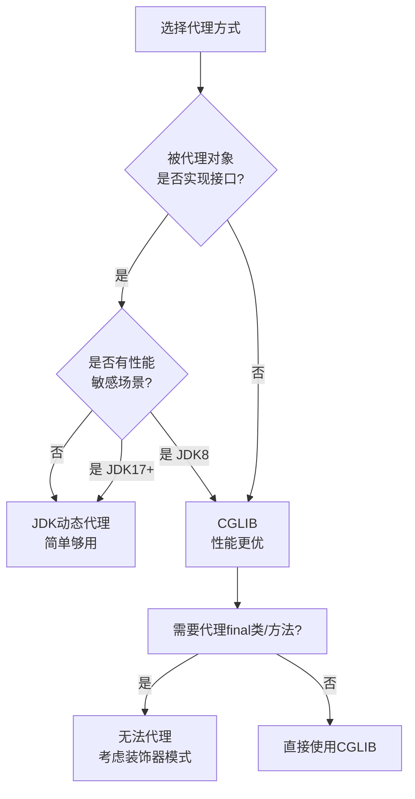

# 代理模式实战解析

## 一个慢 SQL 引发的线上事故

2024年618大促期间，我们团队接到告警：商品查询接口 P99 延迟从 50ms 飙到 3s。

DBA 排查后发现，罪魁祸首是一段"缓存代码"：

```java
public class GoodsService {
    public Goods getGoods(String id) {
        // 业务逻辑
        return goodsMapper.selectById(id);
    }
}
```

开发同学想加缓存，于是改了代码：

```java
public class GoodsService {
    private CacheService cacheService;

    public Goods getGoods(String id) {
        // 缓存逻辑侵入到每个方法中
        Goods cached = cacheService.get("goods:" + id);
        if (cached != null) {
            return cached;
        }
        Goods goods = goodsMapper.selectById(id);
        cacheService.put("goods:" + id, goods);
        return goods;
    }
}
```

结果：100 个方法，他改了 80 个，所有方法的缓存逻辑一模一样，但散落在代码各处。更可怕的是，当他后来想加缓存失效逻辑时，发现要在每个地方都改一遍。

**这就是 AOP（面向切面编程）和代理模式要解决的问题：把横切关注点从业务逻辑中分离出来。**

---

## 一、代理模式的核心思想

代理模式：为其他对象提供一种代理以控制对这个对象的访问。

```
Client  -->  Proxy  -->  RealSubject
              ↓
         可以在调用
         前后加逻辑
```

代理模式和装饰器模式的区别：
- **代理模式**：控制访问，不一定增加功能
- **装饰器模式**：增加功能，动态扩展行为

但实际上，两者在实现上几乎一样，区别只在语义上。

---

## 二、静态代理🔴

### 2.1 基本结构

```java
// 接口
interface GoodsService {
    Goods getGoods(String id);
}

// 真实对象
class GoodsServiceImpl implements GoodsService {
    @Override
    public Goods getGoods(String id) {
        // 真实的业务逻辑
        return goodsMapper.selectById(id);
    }
}

// 代理对象
class GoodsServiceProxy implements GoodsService {
    private final GoodsServiceImpl realService;
    private final CacheService cacheService;

    public GoodsServiceProxy(GoodsServiceImpl realService, CacheService cacheService) {
        this.realService = realService;
        this.cacheService = cacheService;
    }

    @Override
    public Goods getGoods(String id) {
        // 调用前：检查/缓存/日志
        String cacheKey = "goods:" + id;
        Goods cached = cacheService.get(cacheKey);
        if (cached != null) {
            return cached;
        }

        // 调用真实对象
        Goods goods = realService.getGoods(id);

        // 调用后：缓存/日志/监控
        cacheService.put(cacheKey, goods);

        return goods;
    }
}
```

### 2.2 静态代理的致命缺陷

```java
// 如果 GoodsService 有 50 个方法...
interface GoodsService {
    Goods getGoods(String id);
    List<Goods> searchGoods(String keyword);
    void updateGoods(Goods goods);
    void deleteGoods(String id);
    Goods getGoodsDetail(String id);
    // ... 50 个方法
}
```

**每个方法都要在代理中写一遍**！而且如果真实对象变了接口（比如加了个新方法），代理类也要跟着改。

| 缺陷 | 描述 |
|------|------|
| 代码膨胀 | 代理类和真实类的方法必须一一对应 |
| 接口变化脆弱 | 真实类接口变，代理类必须跟着变 |
| 重复代码 | 所有代理方法的横切逻辑都类似 |
| 编译时绑定 | 无法在运行时切换代理逻辑 |

【架构权衡】
静态代理适合的场景非常有限：接口稳定、业务简单、代理逻辑固定。如果你的接口经常变化，或者横切逻辑复杂，静态代理会变成维护噩梦。实际生产中，99% 的场景应该用动态代理。

---

## 三、JDK 动态代理🔴

### 3.1 核心原理

JDK 动态代理的核心是 `InvocationHandler` 接口：

```java
public interface InvocationHandler {
    Object invoke(Object proxy, Method method, Object[] args) throws Throwable;
}
```

### 3.2 手写 JDK 动态代理

```java
import java.lang.reflect.*;

public class JdkProxyFactory {
    private final Object target;
    private final CacheService cacheService;

    public JdkProxyFactory(Object target, CacheService cacheService) {
        this.target = target;
        this.cacheService = cacheService;
    }

    public Object getProxy() {
        return Proxy.newProxyInstance(
            target.getClass().getClassLoader(),   // 类加载器
            target.getClass().getInterfaces(),   // 要代理的接口
            (proxy, method, args) -> {           // InvocationHandler
                // 前置增强
                long start = System.nanoTime();

                // 方法名到缓存键的映射
                String cacheKey = method.getName() + ":" + Arrays.toString(args);
                Object cached = cacheService.get(cacheKey);
                if (cached != null) {
                    return cached;
                }

                // 调用真实对象
                Object result = method.invoke(target, args);

                // 后置增强
                cacheService.put(cacheKey, result);
                long cost = System.nanoTime() - start;
                System.out.println(method.getName() + " took " + cost + "ns");

                return result;
            }
        );
    }
}
```

使用方式：

```java
GoodsServiceImpl realService = new GoodsServiceImpl();
GoodsService proxy = (GoodsService) new JdkProxyFactory(realService, cacheService).getProxy();

// 调用方式和真实对象完全一样
Goods goods = proxy.getGoods("12345");
```

### 3.3 JDK 动态代理的字节码生成

`Proxy.newProxyInstance()` 生成的代理类大致长这样（伪代码）：

```java
public final class $Proxy0 extends Proxy implements GoodsService {
    private InvocationHandler h;

    public $Proxy0(InvocationHandler h) {
        this.h = h;
    }

    @Override
    public Goods getGoods(String id) {
        // 自动生成的代理方法
        return (Goods) h.invoke(this,
            Class.forName("GoodsService").getMethod("getGoods", String.class),
            new Object[]{id}
        );
    }

    // 代理的所有方法都类似...
}
```

```
$Proxy0 类结构：

继承 Proxy，实现 GoodsService 接口
      ↓
每个方法体都是：h.invoke(this, method, args)
      ↓
InvocationHandler.invoke() 决定具体行为
```

### 3.4 JDK 动态代理的限制

**JDK 动态代理只能代理接口，不能代理类。**

```java
// ❌ 错误：GoodsServiceImpl 是类，不是接口
class GoodsServiceImpl { ... }

Object proxy = Proxy.newProxyInstance(
    cl,
    new Class<?>[]{GoodsServiceImpl.class}, // 这里会报错
    handler
);

// ✅ 正确：GoodsServiceImpl 必须实现接口
class GoodsServiceImpl implements GoodsService { ... }

Object proxy = Proxy.newProxyInstance(
    cl,
    GoodsServiceImpl.class.getInterfaces(), // 或者 new Class<?>[]{GoodsService.class}
    handler
);
```

这就是为什么 Spring 默认使用 CGLIB 作为 AOP 代理的原因——因为你的 Bean 可能没有实现任何接口。

:::warning ⚠️
JDK 1.8 及之前，动态代理的性能比 CGLIB 差很多。实测：JDK 动态代理调用耗时约是直接调用的 3-5 倍，CGLIB 约是 1.5-2 倍。但从 JDK 17 开始，JDK 动态代理的性能已经大幅提升，和 CGLIB 差距很小。
:::

---

## 四、CGLIB 动态代理🟡

### 4.1 核心原理

CGLIB（Code Generation Library）通过**继承**的方式生成子类，覆盖父类的方法来实现的代理。

```java
import net.sf.cglib.proxy.*;

public class CglibProxyFactory {
    private final Object target;
    private final CacheService cacheService;

    public CglibProxyFactory(Object target, CacheService cacheService) {
        this.target = target;
        this.cacheService = cacheService;
    }

    public Object getProxy() {
        Enhancer enhancer = new Enhancer();
        enhancer.setSuperclass(target.getClass()); // 继承目标类
        enhancer.setCallback((MethodInterceptor) (obj, method, args, proxy) -> {
            // 前置增强
            String cacheKey = method.getName() + ":" + Arrays.toString(args);
            Object cached = cacheService.get(cacheKey);
            if (cached != null) {
                return cached;
            }

            // 调用父类方法（真实对象）
            Object result = proxy.invokeSuper(obj, args);

            // 后置增强
            cacheService.put(cacheKey, result);

            return result;
        });

        return enhancer.create();
    }
}
```

### 4.2 CGLIB vs JDK 动态代理

| 维度 | JDK 动态代理 | CGLIB |
|------|-------------|-------|
| 代理方式 | 实现接口 | 继承父类 |
| 代理目标 | 必须实现接口 | 可以代理类 |
| 性能 | JDK 17+ 已接近 CGLIB | 略快（老版本） |
| 生成类数量 | 一个代理类 | 每个被代理类生成一个子类 |
| final 类/方法 | ✅ 代理接口即可 | ❌ 无法代理 final 类，无法覆盖 final 方法 |
| Spring 默认 | 否 | ✅（当 Bean 没有实现接口时） |

### 4.3 Spring AOP 的代理策略

```java
// Spring 5.x 的代理选择逻辑（简化）
if (存在接口) {
    // 优先使用 JDK 动态代理
    proxy = JdkDynamicAopProxy(config);
} else {
    // 没有接口？用 CGLIB
    proxy = CglibAopProxy(config);
}
```

```xml
<!-- 强制使用 CGLIB -->
<aop:aspectj-autoproxy proxy-target-class="true"/>
```

```java
// Spring Boot 2.x 开始，默认 proxy-target-class="true"
@EnableAspectJAutoProxy
```

【架构权衡】
Spring 的策略是务实的：优先用 JDK 动态代理（代码少、生成的类少），没有接口时才用 CGLIB。很多人以为 Spring Boot 默认用 CGLIB，其实不然——Spring Boot 只是默认开启了 `proxy-target-class=true`，但如果 Bean 实现了接口，Spring 仍然会用 JDK 动态代理。

---

## 五、三种代理模式对比



---

## 六、Spring AOP 中的代理模式🟡

### 6.1 AOP 术语映射

```java
@Aspect
@Component
public class CacheAspect {

    @Around("@annotation(Cacheable)")  // Pointcut：哪些方法
    public Object around(ProceedingJoinPoint pjp) throws Throwable {
        String cacheKey = buildKey(pjp); // Before

        Object cached = cache.get(cacheKey); // Before
        if (cached != null) {
            return cached; // Around: 阻止方法执行
        }

        Object result = pjp.proceed(); // 调用真实方法

        cache.put(cacheKey, result); // AfterReturning

        return result;
    }
}
```

| AOP 术语 | 代理模式中的对应 |
|----------|-----------------|
| Join Point | 被代理的方法调用 |
| Pointcut | 决定哪些 Join Point 需要代理 |
| Advice | 代理中的增强逻辑（Before/After/Around） |
| Aspect | Advice + Pointcut 的组合 |
| Weaving | 将 Aspect 应用到目标对象的过程 |

### 6.2 Spring 事务的代理实现

```java
// Spring 事务的本质：DataSourceTransactionManager 创建代理
// 伪代码
TransactionInterceptor {
    invoke(MethodInvocation invocation) {
        TransactionStatus tx = transactionManager.getTransaction();

        try {
            Object result = invocation.proceed(); // 调用真实方法
            transactionManager.commit(tx);
            return result;
        } catch (Exception e) {
            transactionManager.rollback(tx);
            throw e;
        }
    }
}
```

当你写 `@Transactional` 时，Spring 容器会为你的 Bean 生成一个事务代理，方法调用前后自动加上事务逻辑——**这正是代理模式的典型应用**。

---

## 七、生产避坑清单

### 7.1 代理对象的自调用问题

```java
@Service
public class GoodsService {
    @Transactional
    public void methodA() {
        this.methodB(); // 调用的是 this，不是代理！
        // 事务不生效！
    }

    @Transactional
    public void methodB() {
        // 不会被代理拦截
    }
}
```

```java
// ✅ 解决方案一：注入自身
@Service
public class GoodsService {
    @Autowired
    private GoodsService self; // 或使用 ObjectFactory<A>

    public void methodA() {
        self.methodB(); // 通过代理调用
    }
}

// ✅ 解决方案二：使用 AspectJ（编译时织入）
@EnableAspectJAutoProxy(exposeProxy = true)
public class GoodsService {
    public void methodA() {
        ((GoodsService) AopContext.currentProxy()).methodB();
    }
}
```

:::warning ⚠️
代理对象的自调用问题是 Spring AOP 中最常见的坑。90% 的新手都会踩这个坑：加了 `@Transactional` 但事务没生效，排查半天发现是因为内部 `this` 调用绕过了代理。
:::

### 7.2 方法可见性问题

```java
// ❌ private 方法无法被代理
public class A {
    @Transactional
    private void txMethod() {
        // Spring AOP 无法代理 private 方法
        // 事务不生效
    }

    public void publicMethod() {
        this.txMethod(); // 直接调用，绕过了代理
    }
}

// ✅ 解决方案：使用编程式事务
@Autowired
private TransactionTemplate transactionTemplate;

public void publicMethod() {
    transactionTemplate.execute(status -> {
        // 业务逻辑
        return null;
    });
}
```

### 7.3 性能监控指标

| 指标 | 目标值 | 告警阈值 |
|------|--------|----------|
| 代理方法调用耗时 | < 1ms | > 10ms |
| 代理类生成时间 | < 100ms | > 1s |
| Spring 容器启动时间 | < 30s | > 60s |

---

## 八、面试总结

### 8.1 核心追问

1. **"JDK 动态代理和 CGLIB 的区别是什么？"** —— 基本题，必须答对
2. **"JDK 动态代理为什么只能代理接口？"** —— 深层原理题
3. **"Spring AOP 的默认代理策略是什么？"** —— 实际应用题
4. **"代理对象的自调用问题怎么解决？"** —— 生产踩坑题
5. **"你用过哪些 AOP 场景？"** —— 结合项目经验的加分题

### 8.2 级别差异

| 级别 | 期望回答 |
|------|----------|
| P5 | 能写出静态代理或 JDK 动态代理 |
| P6 | 能对比 JDK 动态代理和 CGLIB，说出 Spring 默认策略 |
| P7 | 能分析自调用问题、性能差异、选型原因，能说出 AOP 各种通知类型 |
