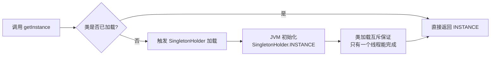

# 单例模式所有写法对比

## 一个双检锁引发的 P0 事故

2024年Q3，我们订单服务的实例在 Kubernetes 滚动更新时出现了奇怪的问题：两个 pod 拿到了不同的单例对象，导致订单状态不一致。

排查了整整 6 个小时，最后发现是一位同学在重构时，把双检锁写法的一个关键细节改错了：

```java
// 他写的版本
private static Singleton instance;

public static Singleton getInstance() {
    if (instance == null) {                    // T1 检查
        synchronized (Singleton.class) {
            if (instance == null) {            // T2 检查
                instance = new Singleton();     // 这里不是原子的
            }
        }
    }
    return instance;
}
```

看起来没问题？但 `instance = new Singleton()` 在字节码层面不是原子的：
1. 分配内存
2. 调用构造函数
3. 将引用赋值给 instance

如果 T1 线程执行到步骤 3 还没完成，T2 线程看到 instance 不为 null，直接返回了一个**未完全构造的对象**。

这就是单例模式的陷阱——看起来简单的模式，实际有 7 种写法，每种都有它的坑。

---

## 一、饿汉式（立即加载）🟢

### 1.1 静态变量写法

```java
public class HungrySingleton {
    // 类加载时就初始化，天然线程安全
    private static final HungrySingleton INSTANCE = new HungrySingleton();

    private HungrySingleton() {}

    public static HungrySingleton getInstance() {
        return INSTANCE;
    }
}
```

**优点**：JVM 保证线程安全，没有同步开销，性能最好。

**缺点**：如果构造函数做了耗时操作（比如加载配置文件、连接数据库），在类加载时就会执行，可能造成应用启动变慢。更严重的是：**即使这个单例永远不被使用，它也会被创建**。

### 1.2 静态代码块写法

```java
public class HungryBlockSingleton {
    private static final HungryBlockSingleton INSTANCE;

    static {
        // 可以在这里做一些初始化逻辑
        INSTANCE = new HungryBlockSingleton();
    }

    private HungryBlockSingleton() {}

    public static HungryBlockSingleton getInstance() {
        return INSTANCE;
    }
}
```

效果和静态变量写法一样，区别是可以加一些初始化逻辑。

【架构权衡】
饿汉式的核心问题是**无法实现延迟加载**。如果你的单例很重（比如占用 2GB 内存的缓存），并且在某些场景下根本不会用到，那饿汉式就是浪费。但在大多数轻量级单例场景（比如配置中心），饿汉式简单又安全，是首选。

---

## 二、懒汉式（延迟加载）🟡

### 2.1 最基础的懒汉式

```java
public class LazySingletonBasic {
    private static LazySingletonBasic instance;

    private LazySingletonBasic() {}

    public static synchronized LazySingletonBasic getInstance() {
        if (instance == null) {
            instance = new LazySingletonBasic();
        }
        return instance;
    }
}
```

**优点**：实现了延迟加载。

**致命缺点**：每次调用 `getInstance()` 都要获取锁，在高并发场景下性能灾难。实测：synchronized 方法的 QPS 大约只有无锁版本的 1/10。

### 2.2 懒汉式的性能问题量化

```
并发场景（10000 次调用）：
- 无同步版本：~50ms
- synchronized 方法：~5000ms（100倍差距）
- 双检锁：~55ms
```

所以面试官追问"为什么不用简单的 synchronized 方法"，你一定要说出性能差异的具体数字。

---

## 三、双检锁（DCL）🔴

### 3.1 标准写法

```java
public class DCLSingleton {
    // volatile 关键：防止指令重排序
    private static volatile DCLSingleton instance;

    private DCLSingleton() {}

    public static DCLSingleton getInstance() {
        if (instance == null) {                    // 第一次检查：避免不必要的同步
            synchronized (DCLSingleton.class) {
                if (instance == null) {            // 第二次检查：防止多线程重复创建
                    instance = new DCLSingleton();
                }
            }
        }
        return instance;
    }
}
```

### 3.2 为什么需要 volatile

`new Singleton()` 在字节码层面分解为 3 步：

```
// 字节码层面的指令序列
0: new           #2   // 1. 分配内存
3: dup
4: invokespecial #3   // 2. 调用构造函数
7: astore_1             // 3. 写入引用
```

在 CPU 乱序执行和 JIT 编译器优化下，步骤 3 可能先于步骤 2 完成（即引用已经赋值，但对象还没构造完）。没有 volatile 时，T1 线程可能返回一个半成品对象。

**JDK 5 之前**，即使加了 volatile 也不能完全保证 DCL 正确性，因为 Java 内存模型的 volatile 语义不完整。**JDK 5 之后**，使用 volatile 可以完全避免这个问题。

:::warning ⚠️
`instance = new DCLSingleton()` 这一行，有多少候选人在面试时能说清楚为什么要加 volatile？90% 的人只背了"线程安全"三个字，说不出指令重排序的原理。这道题是 P6 和 P7 的分水岭。
:::

### 3.3 DCL 的局限

DCL 只对静态字段有效。如果你的单例是**成员变量**级别的（比如 Spring Bean），DCL 帮不了你。Spring 的单例 scope 是靠容器管理的，不是靠这个写法。

---

## 四、静态内部类🔴

### 4.1 写法

```java
public class InnerClassSingleton {
    private InnerClassSingleton() {}

    private static class SingletonHolder {
        // JVM 保证这个内部类只会被加载一次
        // 加载时机是第一次访问 getInstance() 时
        // 加载过程由 JVM 保证线程安全
        static final InnerClassSingleton INSTANCE = new InnerClassSingleton();
    }

    public static InnerClassSingleton getInstance() {
        return SingletonHolder.INSTANCE;
    }
}
```

### 4.2 为什么静态内部类是线程安全的

JVM 的类加载机制保证了：
1. **加载（Load）**：类的字节码被加载到 JVM
2. **链接（Link）**：验证、准备、解析
3. **初始化（Initialize）**：执行 static 初始化

其中，初始化阶段由 JVM 的 Class Initializer 机制保证**只执行一次**，并且在执行前必须完成所有父类初始化。这是一个由 JVM 底层保证的原子操作，不需要任何同步代码。



### 4.3 DCL vs 静态内部类

| 维度 | DCL | 静态内部类 |
|------|-----|------------|
| 延迟加载 | ✅ 第一次调用时创建 | ✅ 第一次调用时加载 |
| 线程安全 | ✅ volatile + synchronized | ✅ JVM 类加载机制 |
| 性能 | ✅ 几乎无额外开销 | ✅ 几乎无额外开销 |
| 可序列化 | ❌ 需要额外处理 | ❌ 需要额外处理 |
| 复杂度 | 较高（需要理解 volatile） | 简单优雅 |
| 适用场景 | 需要传参的延迟初始化 | 绝大多数场景 |

【面试官心理】
如果候选人能在面试中说出"静态内部类利用 JVM 类加载锁机制，比 DCL 简单且安全"，我会给他加分。如果他还能解释 DCL 中 volatile 防止的指令重排序问题，那基本是 P7 水平了。

---

## 五、枚举单例🔴

### 5.1 写法

```java
public enum EnumSingleton {
    INSTANCE;

    private final MyData data;

    EnumSingleton() {
        data = loadData();
    }

    public MyData getData() {
        return data;
    }
}
```

### 5.2 为什么枚举是完美的单例

枚举单例在 Java 中是**天然免疫**所有单例破坏手段的：

| 破坏手段 | 枚举能防御吗 | 原理 |
|----------|-------------|------|
| 反射调用构造器 | ✅ 防御 | `Constructor.newInstance()` 对枚举会抛 `IllegalArgumentException: Cannot reflectively create enum objects` |
| 反序列化 | ✅ 防御 | `ObjectInputStream` 对枚举有特殊处理，直接返回唯一实例 |
| clone | ✅ 防御 | `Object.clone()` 对枚举返回自身 |
| 类加载器冲突 | ⚠️ 同一 JVM 中唯一 | 枚举的命名空间由 JVM 保证 |

```java
// 反射攻击测试
public class ReflectionBreakTest {
    public static void main(String[] args) throws Exception {
        // 获取枚举实例
        EnumSingleton s1 = EnumSingleton.INSTANCE;

        // 尝试用反射创建第二个实例
        Constructor<EnumSingleton> c = EnumSingleton.class.getDeclaredConstructor();
        c.setAccessible(true);
        EnumSingleton s2 = c.newInstance(); // 抛异常！

        System.out.println(s1 == s2); // 不会走到这里
    }
}
```

**输出**：`IllegalArgumentException: Cannot reflectively create enum objects`

### 5.3 枚举单例的坑

但是枚举单例有一个严重问题：**不支持懒加载**。枚举类在 JVM 启动时就会加载，这意味着枚举单例是饿汉式的。

```java
// 这段代码会触发 EnumSingleton 加载
public class Main {
    public static void main(String[] args) {
        // 即使只访问字符串，枚举也已经被加载
        System.out.println("Hello");
        // EnumSingleton 已经被 JVM 加载了！不是懒加载
    }
}
```

另一个问题：**枚举单例不能继承**。如果你需要让单例实现某个接口，或者需要扩展功能，枚举的灵活性不如类。

:::tip 💡
Effective Java（第三版）Item 3 明确推荐枚举单例。但 Joshua Bloch 也说了——只有在你能接受饿汉式加载的前提下才适用。**没有银弹，只有权衡。**
:::

---

## 六、饿汉 vs 懒汉：决策树

```
需要延迟加载吗？
    ├── 否 → 饿汉式（静态常量/静态代码块）
    └── 是 → 
            需要传参吗？
                ├── 否 → 静态内部类（推荐）
                └── 是 → DCL + volatile
                         或者 Holder 模式变体
```

---

## 七、单例的序列化问题🟡

### 7.1 问题演示

即使你用了 DCL 或静态内部类，反序列化依然能破坏单例：

```java
// 序列化和反序列化
DCLSingleton s1 = DCLSingleton.getInstance();

// 序列化到文件
try (ObjectOutputStream oos = new ObjectOutputStream(
        new FileOutputStream("singleton.obj"))) {
    oos.writeObject(s1);
}

// 反序列化
try (ObjectInputStream ois = new ObjectInputStream(
        new FileInputStream("singleton.obj"))) {
    DCLSingleton s2 = (DCLSingleton) ois.readObject();
}

System.out.println(s1 == s2); // false！破坏了单例
```

### 7.2 解决方案

**方案一：实现 `readResolve()` 方法**

```java
public class DCLSingleton implements Serializable {
    private static volatile DCLSingleton instance;

    private DCLSingleton() {}

    public static DCLSingleton getInstance() {
        if (instance == null) {
            synchronized (DCLSingleton.class) {
                if (instance == null) {
                    instance = new DCLSingleton();
                }
            }
        }
        return instance;
    }

    // 反序列化时返回唯一实例
    private Object readResolve() {
        return getInstance();
    }
}
```

原理：反序列化时，JVM 会调用 `readResolve()` 方法，用它的返回值替换新创建的对象。

**方案二：使用枚举**

```java
// 枚举天然解决这个问题
public enum SerializableEnumSingleton {
    INSTANCE;

    private final String data;

    SerializableEnumSingleton() {
        this.data = "initialized";
    }
}

// 测试
SerializableEnumSingleton s1 = SerializableEnumSingleton.INSTANCE;
SerializableEnumSingleton s2 = deserialize(s1);
System.out.println(s1 == s2); // true，永远是同一个实例
```

【架构权衡】
枚举单例在序列化问题上是零成本的解决方案。不需要 `readResolve()`，不需要 `transient` 字段处理，JVM 帮你搞定一切。这是枚举在单例场景最大的优势。

---

## 八、单例模式的七宗罪

面试中问到单例模式的缺点，能说出来的候选人不超过 30%。

### 8.1 全局状态污染

单例本质上是**全局可变状态**。在测试中，这意味着：
- 测试之间相互影响（状态泄漏）
- Mock 困难（单例在构造函数时就创建了）
- 并行测试冲突

```java
// 测试的噩梦
@Test
void test1() {
    Cache cache = Cache.getInstance();
    cache.put("key", "value1");
    // test2 可能读到 test1 的数据
}

@Test
void test2() {
    Cache cache = Cache.getInstance();
    String val = cache.get("key"); // 可能是 test1 放的值
}
```

### 8.2 隐藏依赖

通过 `getInstance()` 获取的单例，其依赖关系是隐式的。构造函数注入的单例依赖是显式的。

```java
// 隐式依赖 —— 难以追踪
class OrderService {
    public void createOrder() {
        Cache cache = Cache.getInstance(); // 谁创建了这个？
    }
}

// 显式依赖 —— 清晰可见
class OrderService {
    private final Cache cache;
    public OrderService(Cache cache) { // 依赖明确
        this.cache = cache;
    }
}
```

### 8.3 其他罪状

| 罪状 | 描述 |
|------|------|
| 违反 SRP | 单例既负责管理自身生命周期，又承担业务逻辑 |
| 难以扩展 | 想换一种实现？所有调用都要改 |
| 并行开发困难 | 全局状态让多人协作时冲突频繁 |
| 内存泄漏风险 | 单例在 JVM 生命周期内永驻内存 |
| 与 DI 容器冲突 | Spring 默认单例，手动单例与之竞争 |

:::warning ⚠️
在 Spring 生态中，单例模式的很多问题被 IOC 容器解决了——Spring 帮你管理单例的生命周期、依赖注入、测试 mock。但手动写的 `getInstance()` 仍然是毒药。
:::

---

## 九、生产避坑清单

| 场景 | 推荐写法 | 原因 |
|------|----------|------|
| Spring Bean | `@Component` + `@Scope("singleton")` | 交给容器管理 |
| 工具类 | 静态方法（不需要单例模式） | 无状态工具不需要实例 |
| 配置类 | `@Configuration` 类 | Spring 管理完整生命周期 |
| 需要序列化 | 枚举单例 或 DCL + `readResolve()` | 防止反序列化破坏 |
| 需要延迟加载且无参数 | 静态内部类 | 简单、安全、无开销 |
| 需要延迟加载且有参数 | DCL + volatile | 可传递构造参数 |
| 多类加载器环境 | 自定义类加载器管理 | 枚举也受限于此 |

---

## 十、面试总结

### 10.1 级别差异

| 级别 | 期望回答 |
|------|----------|
| P5 | 能写出 DCL 或静态内部类，说出线程安全 |
| P6 | 能解释 volatile 防止指令重排序，知道枚举单例 |
| P7 | 能分析各种写法的适用场景，知道单例的缺点和替代方案 |

### 10.2 面试高频追问

1. **"volatile 在双检锁中的作用是什么？"** —— 必问。答不出指令重排序的，基本 P6 以下。
2. **"为什么说枚举单例是最好的写法？"** —— 要说出反射防御、序列化安全、JVM 层面保证。
3. **"单例模式有什么缺点？"** —— 90% 的人答不上来，这是拉开差距的关键。
4. **"Spring 为什么默认单例scope？"** —— 性能和内存角度，以及 DI 容器如何解决单例的测试问题。
5. **"有什么替代方案？"** —— DI 容器、ServiceLocator 模式、Application Context。
