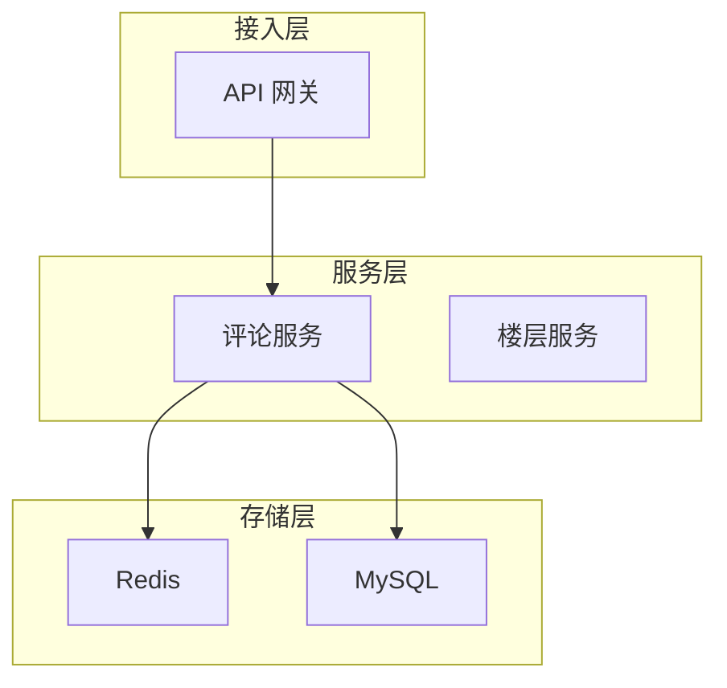

# 评论系统设计

**目标读者**：P7 面试准备  
**面试级别**：P7 中频

## 快速自测

> **🔴 面试官最关心的 3 个问题**
>
> 1. 如何设计评论的存储结构？
> 2. 如何实现评论的分页加载？
> 3. 如何处理热点内容的评论？

---

## 一、系统架构



---

## 二、数据模型

### 表结构设计

```sql
CREATE TABLE comment (
    id BIGINT PRIMARY KEY AUTO_INCREMENT,
    parent_id BIGINT DEFAULT 0,           -- 父评论 ID，0 为一级评论
    root_id BIGINT DEFAULT 0,            -- 根评论 ID，用于楼层展示
    object_type VARCHAR(32) NOT NULL,     -- 评论对象类型：article/video
    object_id BIGINT NOT NULL,           -- 评论对象 ID
    user_id BIGINT NOT NULL,
    content TEXT NOT NULL,
    like_count INT DEFAULT 0,
    reply_count INT DEFAULT 0,
    status TINYINT DEFAULT 1,
    created_at DATETIME,
    INDEX idx_object (object_type, object_id, created_at),
    INDEX idx_root (root_id, created_at),
    INDEX idx_parent (parent_id, created_at)
) ENGINE=InnoDB;
```

---

## 三、评论发布

```java
@Service
public class CommentService {
    @Autowired
    private CommentMapper commentMapper;

    public Comment publish(PublishCommentRequest request) {
        Comment comment = Comment.builder()
            .parentId(request.getParentId())
            .rootId(request.getRootId())
            .objectType(request.getObjectType())
            .objectId(request.getObjectId())
            .userId(request.getUserId())
            .content(request.getContent())
            .createdAt(LocalDateTime.now())
            .build();

        // 处理 root_id
        if (request.getParentId() == 0) {
            comment.setRootId(comment.getId());
        }

        // 写入数据库
        commentMapper.insert(comment);

        // 更新回复数（异步）
        asyncUpdateReplyCount(comment);

        return comment;
    }
}
```

---

## 四、评论分页

### 一级评论分页

```java
@Service
public class CommentService {
    public PageResult<CommentVO> getFirstLevelComments(String objectType, Long objectId,
                                                       Long cursor, int limit) {
        // 按时间倒序分页
        List<Comment> comments = commentMapper.selectFirstLevel(
            objectType, objectId, cursor, limit + 1
        );

        boolean hasMore = comments.size() > limit;
        if (hasMore) {
            comments = comments.subList(0, limit);
        }

        // 获取评论的回复数
        List<Long> rootIds = comments.stream()
            .map(Comment::getId)
            .collect(Collectors.toList());
        Map<Long, Integer> replyCounts = getReplyCounts(rootIds);

        // 构建 VO
        List<CommentVO> vos = comments.stream()
            .map(c -> toVO(c, replyCounts.getOrDefault(c.getId(), 0)))
            .collect(Collectors.toList());

        return PageResult.builder()
            .list(vos)
            .nextCursor(hasMore ? vos.get(vos.size() - 1).getId() : null)
            .hasMore(hasMore)
            .build();
    }
}
```

### 二级评论分页

```java
@Service
public class CommentService {
    public PageResult<CommentVO> getSecondLevelComments(Long rootId, Long cursor, int limit) {
        List<Comment> comments = commentMapper.selectSecondLevel(
            rootId, cursor, limit + 1
        );

        // 类似一级评论处理...
        return buildPageResult(comments, limit);
    }
}
```

---

## 五、评论点赞

```java
@Service
public class CommentLikeService {
    @Autowired
    private RedisTemplate<String, String> redisTemplate;

    private static final String LIKE_KEY = "comment:like:";
    private static final String LIKE_COUNT_KEY = "comment:like:count:";

    public boolean like(Long userId, Long commentId) {
        String userKey = LIKE_KEY + commentId + ":users";
        String countKey = LIKE_COUNT_KEY + commentId;

        // 使用 Set 保证不重复点赞
        Long result = redisTemplate.opsForSet().add(userKey, userId.toString());
        if (result != null && result > 0) {
            redisTemplate.opsForValue().increment(countKey);
            return true;
        }
        return false;
    }
}
```

---

## 六、热点处理

```java
@Service
public class HotCommentService {
    // 热点评论缓存
    private LoadingCache<String, List<CommentVO>> hotComments =
        Caffeine.newBuilder()
            .maximumSize(10000)
            .expireAfterWrite(Duration.ofMinutes(5))
            .build();

    public List<CommentVO> getHotComments(String objectType, Long objectId) {
        String cacheKey = "hot:comments:" + objectType + ":" + objectId;
        return hotComments.get(cacheKey, () -> loadHotComments(objectType, objectId));
    }

    private List<CommentVO> loadHotComments(String objectType, Long objectId) {
        // 按点赞数排序获取热门评论
        return commentMapper.selectHotComments(objectType, objectId, 50);
    }
}
```

---

## 七、面试追问

> **第一层**：如何设计评论的存储结构？
>
> **第二层**：如何实现评论的分页加载？
>
> **第三层**：如何处理热点内容的评论？

**💡 加分回答**：可以提到使用 Redis ZSet 实现热评排行。
