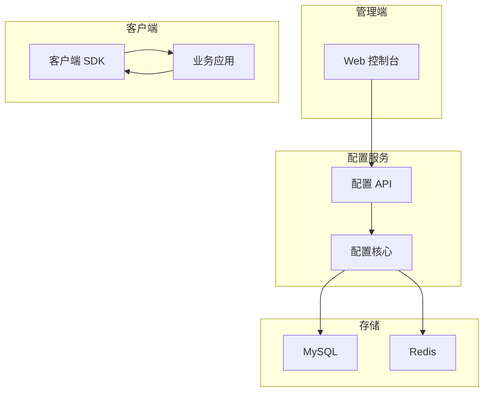

# 配置中心设计

**目标读者**：P7 面试准备  
**面试级别**：P7 中频

## 快速自测

> **🔴 面试官最关心的 3 个问题**
>
> 1. 配置中心解决了什么问题？
> 2. 如何实现配置的热更新？
> 3. 如何保证配置的一致性？

---

## 一、为什么需要配置中心

### 传统配置的问题

```java
// 配置文件在代码中
@Configuration
public class AppConfig {
    @Value("${db.url}")
    private String dbUrl;
}

// 问题：
// 1. 修改配置需要重启服务
// 2. 多环境配置管理困难
// 3. 配置分散，难以统一管理
```

---

## 二、系统架构



---

## 三、配置推送机制

```java
@Service
public class ConfigPushService {
    @Autowired
    private ConfigMapper configMapper;
    @Autowired
    private MQTemplate mqTemplate;

    // 发布配置
    public void publish(Config config) {
        // 1. 入库
        configMapper.insert(config);

        // 2. 写入缓存
        String cacheKey = "config:" + config.getNamespace() + ":" + config.getKey();
        redisTemplate.opsForValue().set(cacheKey, config.getValue());

        // 3. 推送变更
        mqTemplate.send("config:change", config.getNamespace(), config);
    }
}
```

---

## 四、配置监听

```java
@Service
public class ConfigListener {
    @Autowired
    private ConfigClient configClient;

    @PostConstruct
    public void init() {
        // 监听配置变更
        configClient.addListener("app:feature:switch", new ConfigListener() {
            @Override
            public void onChange(ConfigChangeEvent event) {
                // 重新加载配置
                reloadFeatureSwitch();
            }
        });
    }

    private void reloadFeatureSwitch() {
        String value = configClient.get("app:feature:switch");
        FeatureSwitchConfig config = JSON.parseObject(value, FeatureSwitchConfig.class);
        FeatureSwitchHolder.update(config);
    }
}
```

---

## 五、面试追问

> **第一层**：配置中心解决了什么问题？
>
> **第二层**：如何实现配置的热更新？
>
> **第三层**：如何保证配置的一致性？

**💡 加分回答**：可以提到使用长轮询或 WebSocket 实现配置实时推送。
