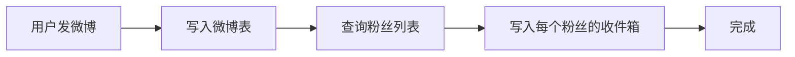
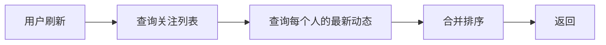

# Feed流系统设计

## 一个"简单"的需求

产品经理说："做个类似朋友圈的功能吧，用户可以看到关注的人的动态。"

我心想："这不就是 SELECT * FROM posts WHERE user_id IN (SELECT follow_id FROM follows WHERE user_id = ?) 吗？"

一周后，我发现问题：
- 用户 A 关注了 10000 人
- 这 10000 人每天产生 50000 条动态
- 用户 A 的每次刷新需要聚合 50000 条数据
- DAU 1 亿，数据库直接爆炸

**Feed 流系统的核心问题是：如何高效地将"生产者的内容"分发给"消费者"。**

---

## 二、核心概念🔴

### 2.1 Feed 流是什么

Feed 流（信息流）：一种持续更新、用户被动接收的内容列表。

| 典型产品 | 特点 |
|----------|------|
| 微博 | 关注的人的微博列表 |
| 朋友圈 | 好友的朋友圈动态 |
| 抖音 | 推荐视频流 |
| Instagram | 关注的人的图片 |
| 今日头条 | 个性化推荐内容 |

### 2.2 两种核心模式

| 模式 | 全称 | 代表产品 | 核心思想 |
|------|------|----------|----------|
| Push | 写扩散 | 微博 | 内容写给所有粉丝 |
| Pull | 读扩散 | 微博（某些场景） | 读的时候聚合 |
| Hybrid | 混合模式 | Twitter | 两者结合 |

---

## 三、推模式（Push）🔴

### 3.1 写入流程



```java
@Service
class FeedService {
    @Autowired
    private FeedDao feedDao;
    @Autowired
    private FollowService followService;

    public void publish(Post post) {
        // 1. 写入微博表
        feedDao.savePost(post);

        // 2. 查询所有粉丝
        List<Long> followers = followService.getFollowers(post.getUserId());

        // 3. 写扩散：写入每个粉丝的收件箱
        for (Long followerId : followers) {
            feedDao.pushToInbox(followerId, post.getId());
        }
    }
}
```

### 3.2 读取流程

```java
@Service
class FeedService {
    public List<Post> getFeed(Long userId, int offset, int limit) {
        // 直接从收件箱读取
        List<Long> postIds = feedDao.getInbox(userId, offset, limit);

        // 批量查询微博详情
        return postMapper.selectByIds(postIds);
    }
}
```

### 3.3 推模式的优缺点

| 优点 | 缺点 |
|------|------|
| 读取极快（O(1)） | 写入慢（粉丝数越多越慢） |
| 适合粉丝少的大V | 大V发一条微博要写几十万个收件箱 |
| 用户体验好（秒开） | 存储成本高（每条微博复制 N 份） |

### 3.4 推模式的优化：异步化

```java
@Service
class FeedService {
    @Autowired
    private RocketMQTemplate mqTemplate;

    public void publish(Post post) {
        // 1. 快速写入微博表
        feedDao.savePost(post);

        // 2. 发送异步消息，不阻塞主流程
        mqTemplate.asyncSend("feed:publish:topic",
            new FeedMessage(post.getUserId(), post.getId()),
            new SendCallback() {
                @Override
                public void onSuccess(SendResult result) {
                    // MQ 消费者处理写扩散
                }

                @Override
                public void onException(Throwable e) {
                    // 失败重试
                }
            }
        );
    }
}

// MQ 消费者处理写扩散
@RocketMQListener(topic = "feed:publish:topic")
public void handleFeedMessage(FeedMessage message) {
    List<Long> followers = followService.getFollowers(message.getUserId());

    // 批量写入收件箱
    for (Long followerId : followers) {
        feedDao.pushToInbox(followerId, message.getPostId());
    }
}
```

---

## 四、拉模式（Pull）🔴

### 4.1 读取流程



```java
@Service
class FeedService {
    public List<Post> getFeed(Long userId, int offset, int limit) {
        // 1. 查询关注列表
        List<Long> following = followService.getFollowing(userId);

        // 2. 查询每个关注的人的动态（合并）
        List<Post> allPosts = new ArrayList<>();
        for (Long followeeId : following) {
            List<Post> posts = feedDao.getUserPosts(followeeId, 0, 100);
            allPosts.addAll(posts);
        }

        // 3. 合并排序（按时间）
        allPosts.sort((a, b) -> b.getCreateTime().compareTo(a.getCreateTime()));

        // 4. 分页
        return allPosts.stream()
            .skip(offset)
            .limit(limit)
            .collect(Collectors.toList());
    }
}
```

### 4.2 拉模式的优缺点

| 优点 | 缺点 |
|------|------|
| 写入极快（只写一条） | 读取慢（N 次数据库查询） |
| 存储成本低 | 大用户列表查询慢 |
| 大V发微博无压力 | 无法做到秒开 |

### 4.3 拉模式的优化

```java
@Service
class FeedService {
    public List<Post> getFeed(Long userId, int offset, int limit) {
        // 1. 批量查询减少数据库交互
        List<Long> following = followService.getFollowing(userId);

        // 2. 并行查询
        ExecutorService executor = Executors.newFixedThreadPool(10);
        List<Future<List<Post>>> futures = following.stream()
            .map(followeeId ->
                executor.submit(() -> feedDao.getUserPosts(followeeId, 0, 100))
            )
            .collect(Collectors.toList());

        // 3. 合并结果
        List<Post> allPosts = futures.stream()
            .flatMap(f -> {
                try {
                    return f.get().stream();
                } catch (Exception e) {
                    return Stream.empty();
                }
            })
            .sorted(Comparator.comparing(Post::getCreateTime).reversed())
            .skip(offset)
            .limit(limit)
            .collect(Collectors.toList());

        return allPosts;
    }
}
```

---

## 五、混合模式🟡

### 5.1 设计思路

```
普通用户（粉丝 < 10000）：
  → 推模式：写入扩散

大V用户（粉丝 > 10000）：
  → 拉模式：读取时拉取
  → 或者：只推送给活跃用户
```

```java
@Service
class FeedService {
    private static final long PUSH_THRESHOLD = 10_000;

    public void publish(Post post) {
        feedDao.savePost(post);

        long followerCount = followService.getFollowerCount(post.getUserId());

        if (followerCount < PUSH_THRESHOLD) {
            // 普通用户：推模式
            pushToAllFollowers(post);
        } else {
            // 大V用户：只推活跃粉丝
            pushToActiveFollowers(post);
        }
    }

    public List<Post> getFeed(Long userId, int offset, int limit) {
        // 1. 从收件箱读取（推送的内容）
        List<Post> inboxPosts = feedDao.getInbox(userId, offset, limit);

        // 2. 补充拉取大V的最新动态
        List<Post> celebrityPosts = pullCelebrityPosts(userId, limit - inboxPosts.size());

        // 3. 合并去重
        return mergePosts(inboxPosts, celebrityPosts);
    }
}
```

### 5.2 微博的实际方案

微博的Feed系统是典型的混合模式：

```
Timeline 类型：

用户 Timeline（我的首页）：
  → 推模式：关注的人的微博写入收件箱
  → 读取：直接从收件箱读取

明星 Timeline：
  → 拉模式：大V的微博只写一条
  → 读取时动态拉取

Push + Pull 的临界点：
  → 当用户关注列表中大V超过一定数量时，切换为混合模式
```

---

## 六、存储设计🟡

### 6.1 收件箱存储

```sql
-- 用户收件箱（Redis Sorted Set）
-- key: inbox:{userId}
-- score: 时间戳
-- member: postId
ZADD inbox:12345 1704067200 "post:98765"
ZADD inbox:12345 1704067201 "post:98766"
ZADD inbox:12345 1704067202 "post:98767"

-- 分页读取
ZREVRANGE inbox:12345 0 9  -- 最新10条
```

```java
@Service
class FeedDao {
    @Autowired
    private RedisTemplate<String, String> redisTemplate;

    public void pushToInbox(Long userId, Long postId) {
        String key = "inbox:" + userId;
        long score = System.currentTimeMillis();
        redisTemplate.opsForZSet().add(key, postId.toString(), score);
    }

    public List<Long> getInbox(Long userId, int offset, int limit) {
        String key = "inbox:" + userId;
        Set<String> postIds = redisTemplate.opsForZSet()
            .reverseRange(key, offset, offset + limit - 1);
        return postIds.stream()
            .map(Long::parseLong)
            .collect(Collectors.toList());
    }
}
```

### 6.2 微博存储

```sql
-- 微博表
CREATE TABLE posts (
    id BIGINT PRIMARY KEY,
    user_id BIGINT NOT NULL,
    content TEXT,
    media_urls JSON,
    created_at TIMESTAMP,
    like_count INT DEFAULT 0,
    comment_count INT DEFAULT 0,
    INDEX idx_user_created (user_id, created_at DESC)
);

-- 用户收件箱（Redis Sorted Set，TTL 7天）
-- 超过7天的 Feed 从数据库拉取
```

### 6.3 存储容量估算

```
假设：
- DAU: 1 亿
- 平均每个用户关注: 200 人
- 每人每天产生: 5 条动态
- 平均每个用户每天收到: 1000 条 Feed

存储计算：
Redis 收件箱（7天）: 1亿 × 1000条 × 8字节(时间戳) × 7天 ≈ 56 GB
微博详情（热数据）: 1亿 × 5条 × 30天 = 1500亿条
```

---

## 七、生产避坑清单🟡

### 7.1 分页的坑

```java
// ❌ 错误：深度分页
List<Post> page1 = getFeed(userId, 0, 20);
List<Post> page2 = getFeed(userId, 1000, 20); // 翻页到很后面

// ✅ 正确：游标分页
class FeedCursor {
    private final long lastTimestamp;
    private final long lastPostId;
}

// 获取下一页
List<Post> page2 = getFeedWithCursor(userId, cursor, 20);

// Redis ZSET 分页
ZREVRANGEBYSCORE inbox:userId 1704067200 -inf LIMIT 0 20
```

### 7.2 热key问题

```java
// ❌ 错误：大V的微博直接读数据库
Post post = postDao.selectById(postId);

// ✅ 正确：多级缓存
Post getPost(Long postId) {
    // L1: 本地缓存
    Post cached = localCache.get(postId);
    if (cached != null) return cached;

    // L2: Redis
    String json = redisTemplate.opsForValue().get("post:" + postId);
    if (json != null) {
        Post post = JSON.parse(json);
        localCache.put(postId, post);
        return post;
    }

    // L3: 数据库
    Post post = postDao.selectById(postId);
    redisTemplate.opsForValue().set("post:" + postId, JSON.toJSON(post));
    return post;
}
```

### 7.3 数据一致性

```java
// ❌ 错误：推送和实际数据不一致
public void publish(Post post) {
    feedDao.savePost(post);
    // 如果 pushToInbox 失败，用户的 Feed 看不到这条微博
    pushToAllFollowers(post);
}

// ✅ 正确：MQ 保证最终一致
public void publish(Post post) {
    feedDao.savePost(post);
    mqTemplate.send("feed:push:topic", post);
}
```

【架构权衡】
Feed 流系统的核心是"推"和"拉"的权衡。推模式读快写慢，适合粉丝数少、活跃用户；拉模式写快读慢，适合大V用户、内容多。实际系统都是混合模式，根据粉丝数、活跃度等维度动态选择。

---

## 八、面试总结

### 8.1 核心追问

1. **"推模式和拉模式各适合什么场景？"** —— 推模式读快写慢，拉模式相反
2. **"如何避免分页重复？"** —— 游标分页、合并去重
3. **"大V发微博怎么处理？"** —— 混合模式、异步推送
4. **"Feed 流如何实现点赞、评论的实时更新？"** —— WebSocket、MQ

### 8.2 级别差异

| 级别 | 期望回答 |
|------|----------|
| P5 | 能说出推拉模式的基本原理 |
| P6 | 能分析两种模式的优缺点，知道混合模式 |
| P7 | 能设计完整的 Feed 流系统，包括存储、缓存、分页 |
