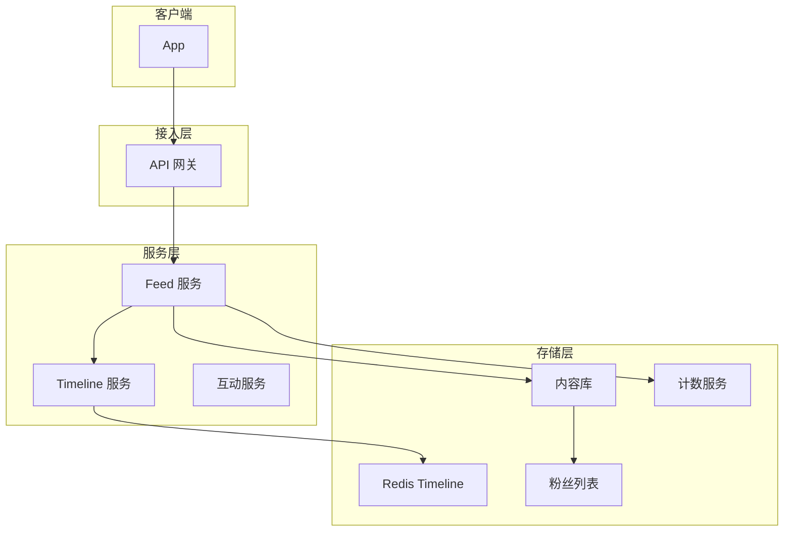
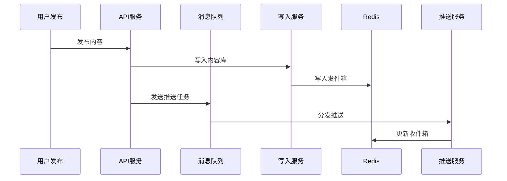

# Feed 流系统设计

**目标读者**：P7 面试准备  
**面试级别**：P7 高频

## 快速自测

> **🔴 面试官最关心的 3 个问题**
>
> 1. 推模式、拉模式、混合模式各有什么优缺点？
> 2. 如何设计 Feed 流的存储架构？
> 3. 如何实现点赞等计数服务？

---

## 一、Feed 流核心概念

### 什么是 Feed 流

```
用户打开 App → 看到好友/关注的内容列表 → 滚动浏览 → 互动（点赞、评论、转发）
```

### 核心指标

| 指标 | 要求 | 说明 |
|------|------|------|
| 日活用户 | 1 亿 | 微博级别 |
| 日均 Feed | 100 亿 | 读取量 |
| 刷新延迟 | `<` 500ms | P99 |
| 可用性 | 99.99% | 高可用 |

---

## 二、推拉模式对比

| 模式 | 原理 | 优点 | 缺点 | 适用场景 |
|------|------|------|------|----------|
| 推模式 | 写入时推送给所有粉丝 | 读取快 | 写放大、存储大 | 粉丝少 |
| 拉模式 | 读取时拉取关注列表 | 存储小 | 读取慢 | 粉丝多 |
| 混合模式 | 大 V 推、普通用户拉 | 平衡 | 复杂度高 | 大型平台 |

---

## 三、系统架构



---

## 四、推模式实现

### 发布流程



### 代码实现

```java
@Service
public class FeedPublishService {
    @Autowired
    private ContentMapper contentMapper;
    @Autowired
    private FanService fanService;
    @Autowired
    private TimelineProducer timelineProducer;

    @Transactional
    public Content publish(PublishRequest request) {
        Long userId = request.getUserId();

        // 1. 发布内容入库
        Content content = Content.builder()
            .userId(userId)
            .content(request.getContent())
            .createdAt(LocalDateTime.now())
            .build();
        contentMapper.insert(content);

        // 2. 写入用户发件箱（Timeline）
        String outboxKey = "timeline:outbox:" + userId;
        redisTemplate.opsForList().leftPush(outboxKey, content.getId().toString());

        // 3. 异步推送给粉丝
        List<Long> fans = fanService.getFans(userId);
        for (Long fanId : fans) {
            timelineProducer.sendTimelineTask(fanId, content.getId());
        }

        return content;
    }
}
```

### 收件箱设计

```java
@Service
public class TimelineService {
    private static final int INBOX_SIZE = 1000; // 收件箱容量

    // 写入收件箱
    public void pushToInbox(Long userId, Long contentId) {
        String inboxKey = "timeline:inbox:" + userId;

        // 列表左侧插入最新内容
        redisTemplate.opsForList().leftPush(inboxKey, contentId.toString());

        // 限制列表长度
        redisTemplate.opsForList().trim(inboxKey, 0, INBOX_SIZE - 1);

        // 设置过期时间
        redisTemplate.expire(inboxKey, Duration.ofDays(7));
    }
}
```

---

## 五、拉模式实现

```java
@Service
public class PullTimelineService {
    @Autowired
    private FanService fanService;
    @Autowired
    private ContentMapper contentMapper;

    // 拉取 Feed 流
    public List<ContentVO> pullTimeline(Long userId, Long cursor, int limit) {
        // 1. 获取关注列表
        List<Long> followings = fanService.getFollowings(userId);

        // 2. 并行拉取关注者的最新内容
        List<Long> contentIds = new ArrayList<>();

        for (Long followingId : followings) {
            String outboxKey = "timeline:outbox:" + followingId;
            List<String> ids = redisTemplate.opsForList()
                .range(outboxKey, 0, limit - 1);
            contentIds.addAll(ids.stream()
                .map(Long::parseLong)
                .collect(Collectors.toList()));
        }

        // 3. 按时间排序
        contentIds.sort((a, b) -> b.compareTo(a));

        // 4. 分页
        List<Long> pageIds = contentIds.stream()
            .skip(cursor)
            .limit(limit)
            .collect(Collectors.toList());

        // 5. 批量获取内容详情
        return batchGetContents(pageIds);
    }
}
```

---

## 六、混合模式实现

```java
@Service
public class HybridTimelineService {
    private static final int PUSH_THRESHOLD = 10000; // 粉丝数阈值

    @Autowired
    private FanService fanService;

    public void publish(Content content) {
        Long authorId = content.getUserId();
        List<Long> fans = fanService.getFans(authorId);

        if (fans.size() < PUSH_THRESHOLD) {
            // 小博主：推模式
            pushToAllFans(content, fans);
        } else {
            // 大 V：混合模式
            // 普通粉丝：推模式
            List<Long> normalFans = fans.subList(0, PUSH_THRESHOLD);
            pushToAllFans(content, normalFans);

            // 超量粉丝：拉模式（只更新发件箱）
            updateOutbox(content, authorId);
        }
    }

    private void pushToAllFans(Content content, List<Long> fans) {
        for (Long fanId : fans) {
            String inboxKey = "timeline:inbox:" + fanId;
            redisTemplate.opsForList().leftPush(inboxKey, content.getId().toString());
            redisTemplate.opsForList().trim(inboxKey, 0, 999);
        }
    }

    private void updateOutbox(Content content, Long authorId) {
        String outboxKey = "timeline:outbox:" + authorId;
        redisTemplate.opsForList().leftPush(outboxKey, content.getId().toString());
    }
}
```

---

## 七、核心代码

### Feed 流读取

```java
@Service
public class FeedReadService {
    @Autowired
    private ContentMapper contentMapper;

    public FeedResult getFeed(Long userId, Long lastId, int limit) {
        String inboxKey = "timeline:inbox:" + userId;

        // 1. 获取内容 ID 列表
        List<String> contentIds = redisTemplate.opsForList()
            .range(inboxKey, 0, limit);

        if (contentIds.isEmpty()) {
            return FeedResult.empty();
        }

        // 2. 批量获取内容详情
        List<Long> ids = contentIds.stream()
            .map(Long::parseLong)
            .collect(Collectors.toList());

        List<Content> contents = contentMapper.selectByIds(ids);

        // 3. 补全互动信息
        List<ContentVO> vos = enrichWithInteractions(contents);

        // 4. 构建下一页 cursor
        Long nextCursor = Long.parseLong(contentIds.get(contentIds.size() - 1));

        return FeedResult.builder()
            .list(vos)
            .nextCursor(nextCursor)
            .hasMore(contentIds.size() == limit)
            .build();
    }
}
```

### 点赞服务

```java
@Service
public class LikeService {
    @Autowired
    private RedisTemplate<String, String> redisTemplate;

    // 点赞
    public boolean like(Long userId, Long contentId) {
        String likeKey = "like:" + contentId;
        String userKey = "like:users:" + contentId;

        // 使用 Set 保证用户不重复点赞
        Long result = redisTemplate.opsForSet().add(userKey, userId.toString());
        if (result != null && result > 0) {
            // 点赞成功，增加计数
            redisTemplate.opsForValue().increment(likeKey);
            return true;
        }
        return false;
    }

    // 获取点赞数
    public long getLikeCount(Long contentId) {
        String likeKey = "like:" + contentId;
        String count = redisTemplate.opsForValue().get(likeKey);
        return count != null ? Long.parseLong(count) : 0;
    }

    // 用户是否点赞
    public boolean isLiked(Long userId, Long contentId) {
        String userKey = "like:users:" + contentId;
        return Boolean.TRUE.equals(
            redisTemplate.opsForSet().isMember(userKey, userId.toString())
        );
    }
}
```

---

## 八、容量估算

```
用户数：1 亿
日均发博：1 亿
粉丝分布：80% 用户粉丝 < 1000，20% 用户粉丝 > 1000
热点用户：1000 万粉丝

存储估算：
- 每个用户 Timeline：1000 条 × 8 字节 = 8KB
- 1 亿用户：800 GB

QPS 估算：
- 读 QPS：100 亿 / 86400 ≈ 11.6 万
- 写 QPS：1 亿 / 86400 ≈ 1157
```

---

## 九、面试追问

> **第一层**：推模式和拉模式有什么区别？
>
> **第二层**：如何处理大 V 的粉丝推送？
>
> **第三层**：如何实现点赞的计数服务？

**💡 加分回答**：可以提到使用 Redis HyperLogLog 统计 UV，使用 Bitmap 实现已读标记。
