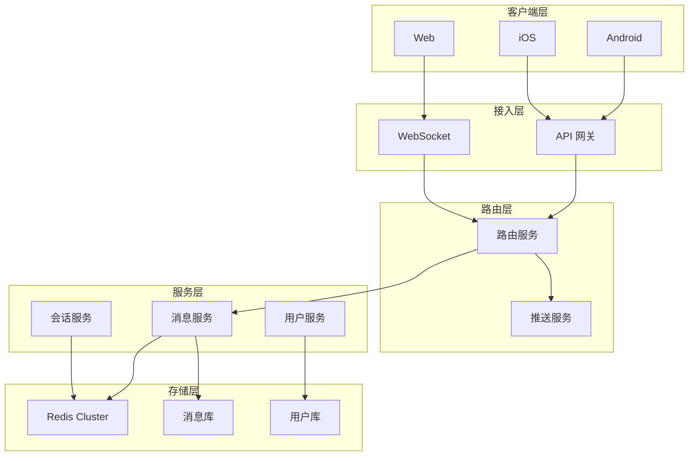
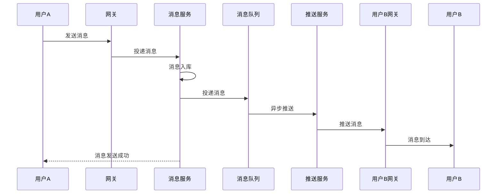

# IM 系统设计

**目标读者**：P7 面试准备  
**面试级别**：P7 高频

## 快速自测

> **🔴 面试官最关心的 3 个问题**
>
> 1. 如何实现消息的可靠传输？
> 2. 如何设计消息存储架构？
> 3. 如何处理消息的亿级并发？

---

## 一、IM 系统核心指标

| 指标 | 要求 | 说明 |
|------|------|------|
| 日活用户 | 1 亿 | 微信级别 |
| 峰值并发 | 1000 万 | 早高峰 |
| 消息量 | 1000 亿 | 每天 |
| 消息延迟 | `<` 100ms | P99 |
| 可用性 | 99.99% | 4 个 9 |

---

## 二、系统架构



---

## 三、消息发送流程



---

## 四、消息存储设计

### 消息表设计

```sql
CREATE TABLE message (
    id BIGINT PRIMARY KEY,
    msg_id VARCHAR(64) NOT NULL UNIQUE,     -- 全局唯一消息ID
    from_uid BIGINT NOT NULL,                -- 发送者
    to_uid BIGINT NOT NULL,                 -- 接收者
    conversation_id VARCHAR(64) NOT NULL,   -- 会话ID
    content TEXT,                            -- 消息内容
    msg_type TINYINT NOT NULL,              -- 消息类型
    status TINYINT DEFAULT 0,                -- 消息状态
    created_at DATETIME NOT NULL,
    INDEX idx_conversation (conversation_id, created_at),
    INDEX idx_from_uid (from_uid, created_at),
    INDEX idx_to_uid (to_uid, created_at)
) ENGINE=InnoDB;

-- 会话表
CREATE TABLE conversation (
    id VARCHAR(64) PRIMARY KEY,
    type TINYINT NOT NULL,                  -- 单聊/群聊
    member_ids VARCHAR(255) NOT NULL,       -- 成员ID列表
    last_msg_id BIGINT,                     -- 最后一条消息ID
    last_msg_time DATETIME,                  -- 最后消息时间
    created_at DATETIME,
    updated_at DATETIME
) ENGINE=InnoDB;
```

### 分表策略

```java
@Service
public class MessageService {
    // 按 sender_id 分表
    public String getShardingKey(Long userId) {
        int tableIndex = (int) (userId % 10);
        return "message_" + tableIndex;
    }

    // 按会话分表
    public String getConversationShardingKey(String conversationId) {
        int hash = conversationId.hashCode();
        int tableIndex = Math.abs(hash % 100);
        return "conversation_" + tableIndex;
    }
}
```

---

## 五、WebSocket 长连接

### 连接管理

```java
@Service
public class WebSocketService {
    // 用户连接缓存
    private LoadingCache<Long, WebSocketSession> userConnections =
        Caffeine.newBuilder()
            .maximumSize(1000000)
            .removalListener((key, value, cause) -> {
                // 清理时通知其他服务
                notifyUserOffline(key);
            })
            .build();

    // 绑定用户与连接
    public void bindUser(Long userId, WebSocketSession session) {
        userConnections.put(userId, session);
        updateUserOnlineStatus(userId, true);
    }

    // 发送消息给用户
    public void sendToUser(Long userId, Object message) {
        WebSocketSession session = userConnections.getIfPresent(userId);
        if (session != null && session.isOpen()) {
            session.sendMessage(new TextMessage(JSON.toJSONString(message)));
        }
    }

    // 心跳保活
    @Scheduled(fixedRate = 30000)
    public void heartbeatCheck() {
        userConnections.asMap().forEach((userId, session) -> {
            if (!session.isOpen()) {
                userConnections.invalidate(userId);
                notifyUserOffline(userId);
            }
        });
    }
}
```

---

## 六、消息可靠性

### 消息发送流程

```java
@Service
public class MessageProducer {
    @Autowired
    private RedisTemplate<String, String> redisTemplate;

    public String sendMessage(Message message) {
        // 1. 生成全局唯一消息ID
        String msgId = generateMsgId(message.getFromUid());

        // 2. 消息入库（落库保证持久化）
        message.setMsgId(msgId);
        message.setStatus(MessageStatus.SENDING);
        messageMapper.insert(message);

        // 3. 发送消息到队列
        mqProducer.send("im.message", msgId, message);

        // 4. 更新消息状态
        message.setStatus(MessageStatus.SENT);
        messageMapper.updateStatus(msgId, MessageStatus.SENT);

        return msgId;
    }

    private String generateMsgId(Long userId) {
        // 使用雪花算法 + 时间戳
        long snowflakeId = snowflakeIdGenerator.nextId();
        return userId + "-" + snowflakeId + "-" + System.currentTimeMillis();
    }
}
```

### 消息消费确认

```java
@Service
public class MessageConsumer {
    @KafkaListener(topics = "im.message", groupId = "im-consumer")
    public void consume(ConsumerRecord<String, Message> record, Acknowledgment ack) {
        Message message = record.value();

        try {
            // 1. 推送消息给接收者
            pushToUser(message.getToUid(), message);

            // 2. 更新消息状态为已投递
            messageMapper.updateStatus(message.getMsgId(), MessageStatus.DELIVERED);

            // 3. 确认消费
            ack.acknowledge();

        } catch (Exception e) {
            // 处理失败，消息会重试
            log.error("消息投递失败: {}", message.getMsgId(), e);
            throw e;
        }
    }
}
```

---

## 七、未读消息处理

```java
@Service
public class UnreadService {
    @Autowired
    private RedisTemplate<String, String> redisTemplate;

    private static final String UNREAD_KEY = "im:unread:";

    // 设置未读数
    public void setUnread(Long userId, Long conversationId, int count) {
        String key = UNREAD_KEY + userId;
        redisTemplate.opsForHash().put(key, conversationId.toString(), count);
    }

    // 增加未读数
    public void incrementUnread(Long userId, Long conversationId, int delta) {
        String key = UNREAD_KEY + userId;
        redisTemplate.opsForHash().increment(key, conversationId.toString(), delta);
    }

    // 获取未读数
    public long getTotalUnread(Long userId) {
        String key = UNREAD_KEY + userId;
        Map<Object, Object> unreadMap = redisTemplate.opsForHash().entries(key);
        return unreadMap.values().stream()
            .mapToLong(v -> Long.parseLong(v.toString()))
            .sum();
    }

    // 标记已读
    public void markAsRead(Long userId, Long conversationId) {
        String key = UNREAD_KEY + userId;
        redisTemplate.opsForHash().put(key, conversationId.toString(), 0);
    }
}
```

---

## 八、消息同步策略

```java
@Service
public class SyncService {
    @Autowired
    private MessageMapper messageMapper;

    // 增量同步
    public List<Message> syncMessage(Long userId, Long lastMsgId) {
        return messageMapper.selectByUserIdAndMsgId(userId, lastMsgId, 100);
    }

    // 拉取离线消息
    public List<Message> pullOfflineMessage(Long userId, long since) {
        return messageMapper.selectOfflineMessage(userId, since, 500);
    }

    // 同步会话列表
    public List<Conversation> syncConversation(Long userId, Long lastTime) {
        return conversationMapper.selectByUserId(userId, lastTime, 100);
    }
}
```

---

## 九、面试追问

> **第一层**：如何保证消息的可靠传输？
>
> **第二层**：如何处理消息的亿级并发？
>
> **第三层**：如何设计消息存储架构？

**💡 加分回答**：可以提到使用 Canal 监听 binlog 实现多端同步。
