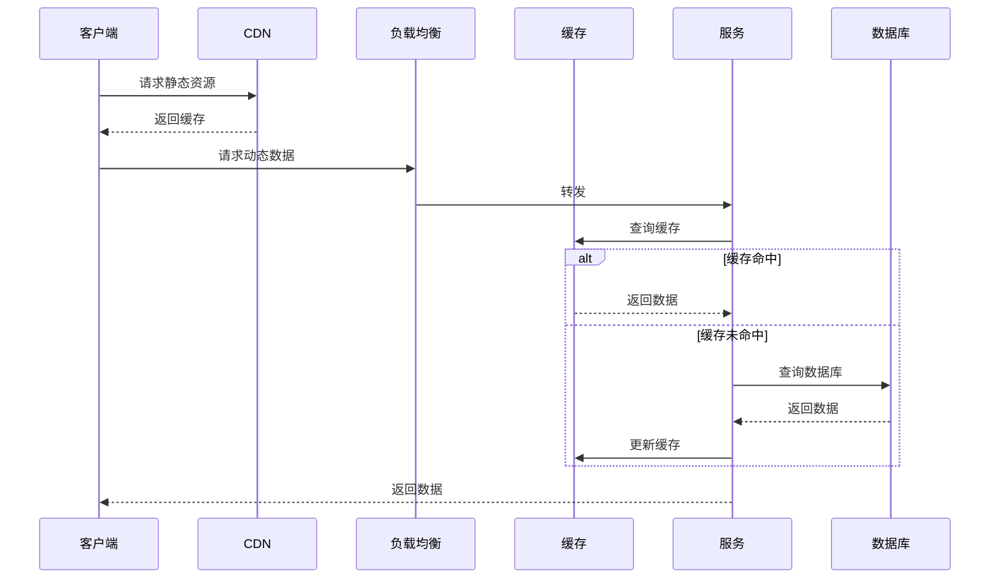
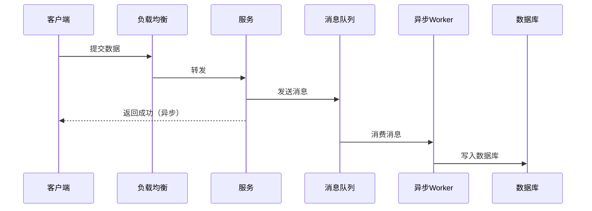

# 系统设计解题框架

**目标读者**：P7 面试准备  
**面试级别**：P7 高频

## 快速自测

> **🔴 面试官最关心的 3 个问题**
>
> 1. 系统设计面试的正确姿势是什么？
> 2. 如何在 45 分钟内完成一个系统的设计？
> 3. 面试官想看到什么？

---

## 一、解题四步法

### STEP 1：需求澄清（5-10 分钟）

```
目标：明确问题边界、数据规模、性能要求
```

**必问清单**：
- 目标用户是谁？
- 日活 DAU 是多少？
- 峰值 QPS 是多少？
- 核心功能有哪些？
- 需要支持哪些操作？
- 数据存储量有多大？

### STEP 2：高层设计（15-20 分钟）

```
目标：画出系统架构图，确定核心组件
```

**核心问题**：
- 有哪些核心服务？
- 数据如何存储？
- 服务间如何通信？
- 如何处理峰值流量？

### STEP 3：详细设计（15-20 分钟）

```
目标：深入关键模块的设计细节
```

**关注点**：
- API 设计
- 数据模型
- 核心算法
- 扩展方案

### STEP 4：总结权衡（5 分钟）

```
目标：讨论优化点、监控告警、容灾方案
```

**讨论点**：
- 如何监控和告警？
- 如何做容量规划？
- 如何处理故障？

---

## 二、面试评分标准

| 维度 | 权重 | 考察点 |
|------|------|--------|
| 沟通能力 | 25% | 积极讨论、澄清需求 |
| 架构设计 | 25% | 组件划分、数据流 |
| 技术深度 | 25% | 技术选型、trade-off |
| 可扩展性 | 15% | 水平扩展、模块化 |
| 权衡思维 | 10% | 优缺点分析 |

---

## 三、常用组件选型

### 负载均衡

| 方案 | 特点 | 适用场景 |
|------|------|----------|
| Nginx | 高性能、反向代理 | 七层负载均衡 |
| LVS | 四层负载均衡 | 超高并发 |
| AWS ALB | 云服务、托管 | 云部署 |

### 缓存

| 方案 | 特点 | 适用场景 |
|------|------|----------|
| Redis | 内存 KV、性能高 | 热数据、分布式锁 |
| Memcached | 简单、分布式 | 页面缓存 |
| CDN | 边缘节点 | 静态资源 |

### 消息队列

| 方案 | 特点 | 适用场景 |
|------|------|----------|
| Kafka | 高吞吐、日志场景 | 日志、大数据 |
| RabbitMQ | 灵活路由 | 复杂路由 |
| RocketMQ | 事务消息 | 电商、金融 |

### 数据库

| 方案 | 特点 | 适用场景 |
|------|------|----------|
| MySQL | 关系型、事务 | 业务数据 |
| PostgreSQL | 高级特性 | 复杂查询 |
| MongoDB | 文档型、灵活 | 非结构化数据 |
| Cassandra | 分布式、写入强 | 时序数据 |

---

## 四、数据流设计模板

### 读请求



### 写请求



---

## 五、面试话术模板

### 澄清需求

```
好的，让我确认一下几个问题：
1. 日活 DAU 大概是多少？
2. 峰值 QPS 是多少？
3. 数据需要存储多久？
4. 有哪些核心功能需要支持？
```

### 提出方案

```
基于需求，我建议采用以下架构：
1. 使用 XX 作为负载均衡
2. 使用 XX 作为缓存层
3. 数据存储在 XX
4. 异步任务通过 XX 处理
```

### 权衡取舍

```
这个方案有以下权衡：
- 优点：...
- 缺点：...
- 如果未来需要扩展，可以...
```

### 主动优化

```
这个设计还有优化空间：
1. 可以加入 XX 来提高性能
2. 可以加入 XX 来提高可用性
3. 可以加入 XX 来做监控
```

---

## 六、常见问题处理

| 问题 | 回答策略 |
|------|----------|
| 需要支持多大并发？ | 给出具体数字和估算依据 |
| 如何保证数据一致性？ | 根据场景选择强一致或最终一致 |
| 单点故障怎么办？ | 增加冗余、故障转移 |
| 性能瓶颈在哪？ | 分析可能的瓶颈点 |

---

## 七、面试要点

| 要点 | 说明 |
|------|------|
| 主动沟通 | 不要一个人埋头画图 |
| 数据驱动 | 用数字支撑设计 |
| 权衡分析 | 说明 trade-off |
| 预留优化 | 设计要可扩展 |
| 监控运维 | 考虑上线后的运维 |

---

## 八、实战示例

### 题目：设计一个短链系统

```
面试官：设计一个短链系统

你：好的，请问预期日均访问量是多少？
面试官：1 亿次

你：好的，那我先明确一下需求：
1. 日均点击 1 亿次
2. 需要支持生成短链
3. 数据需要永久存储
4. 需要支持自定义短链吗？
面试官：不需要

你：好的，我的设计方案如下：
1. 使用 MD5 生成 8 位短链
2. Redis 缓存热数据
3. MySQL 存储完整映射
4. 布隆过滤器过滤已存在的短链

面试官：展开讲讲
...
```
