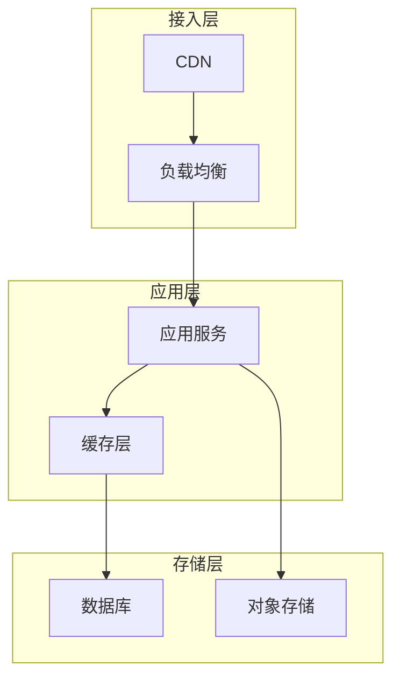
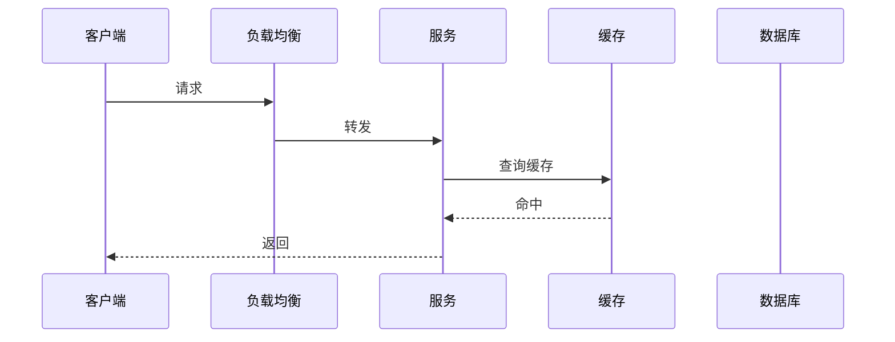
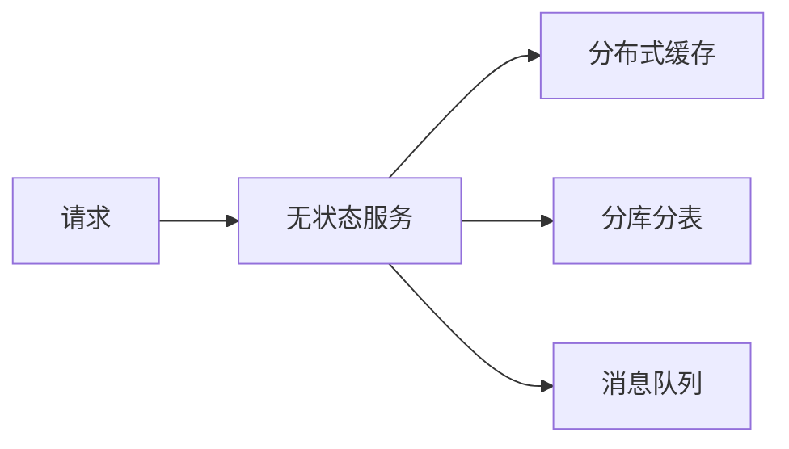

# 系统设计方法论

**目标读者**：P7 面试准备  
**面试级别**：P7 高频

## 快速自测

> **🔴 面试官最关心的 3 个问题**
>
> 1. 系统设计面试的流程是什么？
> 2. 如何评估系统的容量和性能？
> 3. 如何设计一个可扩展的系统？

---

## 一、系统设计面试流程

### 四步法

| 步骤 | 内容 | 时间占比 |
|------|------|----------|
| 1. 需求澄清 | 明确功能范围、边界条件 | 20% |
| 2. 高层设计 | 画出核心组件和数据流 | 40% |
| 3. 详细设计 | 深入关键模块 | 30% |
| 4. 总结权衡 | 讨论优缺点、优化点 | 10% |

### 面试心态

```
✅ 要做：积极讨论、权衡取舍、估算数据
❌ 不要：埋头画图、追求完美、拒绝引导
```

---

## 二、需求澄清

### 必问问题清单


### 关键问题

| 问题类别 | 示例问题 | 为什么重要 |
|----------|----------|------------|
| 功能范围 | 需要支持哪些功能？ | 避免做多余设计 |
| 用户规模 | 日活 DAU、峰值并发？ | 决定架构复杂度 |
| 数据规模 | 数据量、增长速度？ | 决定存储选型 |
| 性能要求 | QPS、延迟要求？ | 决定优化策略 |
| 可用性要求 | 需要几个 9？ | 决定容错设计 |
| 一致性要求 | 强一致还是最终一致？ | 决定技术方案 |

### 示例对话

```
面试官：设计一个短链系统
你：好的，请问预期日均访问量是多少？
面试官：1 亿次
你：峰值 QPS 大概是多少？
面试官：10 万 QPS
你：点击率大概多少？
面试官：100:1（100次展示1次点击）
你：好的，短链有效期有要求吗？
面试官：需要永久有效
...
```

---

## 三、高层设计

### 核心组件



### 数据流设计



---

## 四、容量估算

### 估算公式

```
DAU（日活）→ TPS（每秒事务）→ 存储需求
```

### 常用指标

| 指标 | 含义 | 估算方法 |
|------|------|----------|
| DAU | 日活跃用户 | 用户总量 × 活跃率 |
| MAU | 月活跃用户 | DAU × 30 |
| QPS | 每秒查询数 | DAU × 人均请求数 / 86400 × 峰值因子 |
| TPS | 每秒事务数 | 写操作比例 × QPS |
| 存储 | 数据存储量 | 单条数据大小 × 数据量 |

### 估算示例

```
场景：设计一个评论系统

假设：
- DAU = 1000 万
- 人均每天评论 = 10 条
- 峰值因子 = 5

计算：
- 每天评论数 = 1000万 × 10 = 1亿条
- 每天写入 QPS = 1亿 / 86400 ≈ 1157
- 峰值 QPS = 1157 × 5 ≈ 6000

存储估算：
- 每条评论 ≈ 100 字节
- 一年存储 = 1亿 × 365 × 100 = 3.65 TB
```

---

## 五、关键指标

### 性能指标

| 指标 | 说明 | 目标 |
|------|------|------|
| 延迟 P50 | 中位数延迟 | `<` 100ms |
| 延迟 P99 | 99% 请求延迟 | `<` 500ms |
| QPS | 每秒请求数 | 根据业务估算 |
| 吞吐量 | 系统处理能力 | TB/小时 |

### 可用性指标

| 可用性 | 每天宕机时间 | 每年宕机时间 |
|--------|--------------|--------------|
| 99% | 14.4 分钟 | 3.65 天 |
| 99.9% | 1.44 分钟 | 8.76 小时 |
| 99.99% | 8.64 秒 | 52.6 分钟 |
| 99.999% | 0.86 秒 | 5.26 分钟 |

---

## 六、扩展性设计

### 水平扩展 vs 垂直扩展

| 维度 | 水平扩展 | 垂直扩展 |
|------|----------|----------|
| 实现方式 | 增加机器 | 增加单机配置 |
| 扩展上限 | 无上限 | 受单机限制 |
| 复杂度 | 高 | 低 |
| 成本 | 线性增长 | 指数增长 |
| 单点故障 | 无 | 有 |

### 扩展策略



---

## 七、一致性模型

### CAP 定理

```
CAP = Consistency + Availability + Partition Tolerance
     只能同时满足两个

CA (不现实)：单机数据库
CP：ZooKeeper、HBase、MongoDB
AP：Eureka、Cassandra、DynamoDB
```

### 一致性级别

| 级别 | 说明 | 适用场景 |
|------|------|----------|
| 强一致 | 每次读取最新数据 | 金融、订单 |
| 顺序一致 | 按操作顺序读取 | 分布式锁 |
| 最终一致 | 允许短暂不一致 | 社交、Feed |
| 因果一致 | 只保证因果顺序 | 评论系统 |

---

## 八、面试要点

| 要点 | 说明 |
|------|------|
| 需求澄清 | 主动提问，明确边界 |
| 数据流 | 清楚请求如何流转 |
| 权衡取舍 | 说明 trade-off |
| 估算数据 | 用数字支撑设计 |
| 讨论优化 | 预留优化空间 |

---

## 九、面试追问

> **第一层**：如何估算系统的 QPS？
>
> **第二层**：如何保证系统的高可用？
>
> **第三层**：如何选择强一致和最终一致？

**💡 加分回答**：可以提到具体项目中的容量规划经验。
