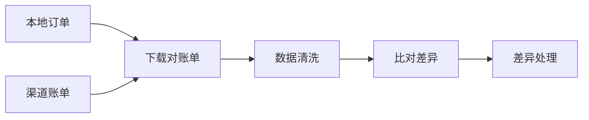

# 支付对账系统

**目标读者**：P7 面试准备  
**面试级别**：P7 中频

## 快速自测

> **🔴 面试官最关心的 3 个问题**
>
> 1. 如何设计对账流程？
> 2. 如何处理长款和短款？
> 3. 如何实现自动调账？

---

## 一、对账流程



---

## 二、对账实现

```java
@Service
public class ReconciliationService {
    @Scheduled(cron = "0 30 4 * * ?") // 每天凌晨对账
    public void reconcile() {
        // 1. 下载渠道账单
        List<ChannelTrade> channelTrades = downloadChannelBill();

        // 2. 查询本地订单
        List<LocalOrder> localOrders = queryLocalOrders();

        // 3. 比对
        Map<String, Difference> differences = compare(channelTrades, localOrders);

        // 4. 处理差异
        for (Difference diff : differences.values()) {
            handleDifference(diff);
        }
    }
}
```

---

## 三、差异处理

```sql
CREATE TABLE reconciliation_diff (
    id BIGINT PRIMARY KEY,
    order_id VARCHAR(64),
    channel VARCHAR(32),
    diff_type VARCHAR(32),   -- LONG: 长款, SHORT: 短款
    local_amount DECIMAL(10,2),
    channel_amount DECIMAL(10,2),
    status VARCHAR(32),
    created_at DATETIME
);
```

---

## 四、面试追问

> **第一层**：如何处理长款和短款？
>
> **第二层**：如何实现自动调账？
>
> **第三层**：对账失败如何告警？

**💡 加分回答**：可以提到使用监控告警及时发现对账问题。
