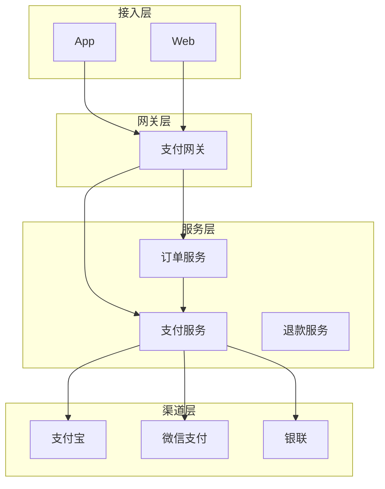
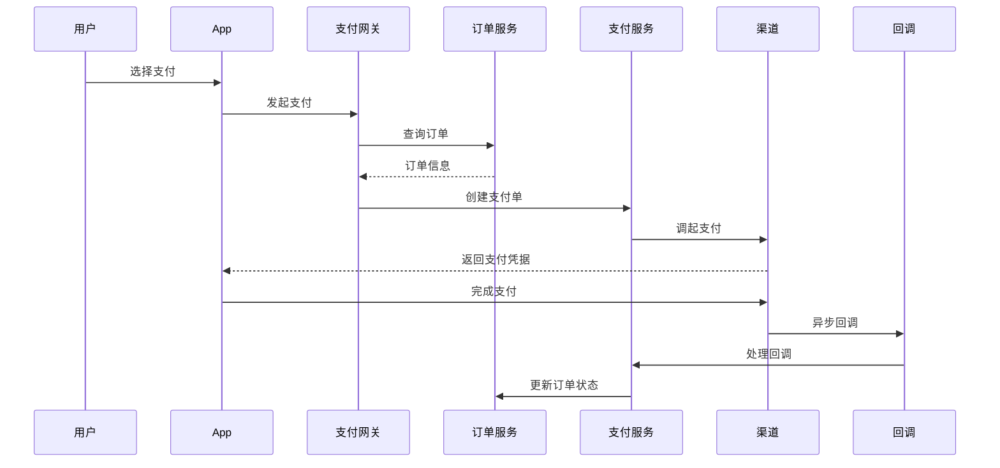

# 支付系统设计

**目标读者**：P7 面试准备  
**面试级别**：P7 高频

## 快速自测

> **🔴 面试官最关心的 3 个问题**
>
> 1. 如何设计支付系统架构？
> 2. 如何保证支付幂等性？
> 3. 如何处理支付回调？

---

## 一、系统架构



---

## 二、支付流程



---

## 三、幂等设计

```java
@Service
public class PaymentService {
    @Autowired
    private RedisTemplate<String, String> redisTemplate;

    public String createPayment(Long orderId, String channel) {
        // 幂等检查
        String idempotentKey = "payment:idempotent:" + orderId + ":" + channel;
        String existing = redisTemplate.opsForValue().get(idempotentKey);
        if (existing != null) {
            return existing;
        }

        // 创建支付单
        String paymentId = generatePaymentId();
        redisTemplate.opsForValue().set(idempotentKey, paymentId, Duration.ofHours(2));

        // 调用支付渠道
        // ...

        return paymentId;
    }
}
```

---

## 四、面试追问

> **第一层**：如何保证支付幂等性？
>
> **第二层**：如何处理支付回调？
>
> **第三层**：如何设计分布式事务？

**💡 加分回答**：可以提到使用 TCC 或 Saga 模式处理分布式事务。
