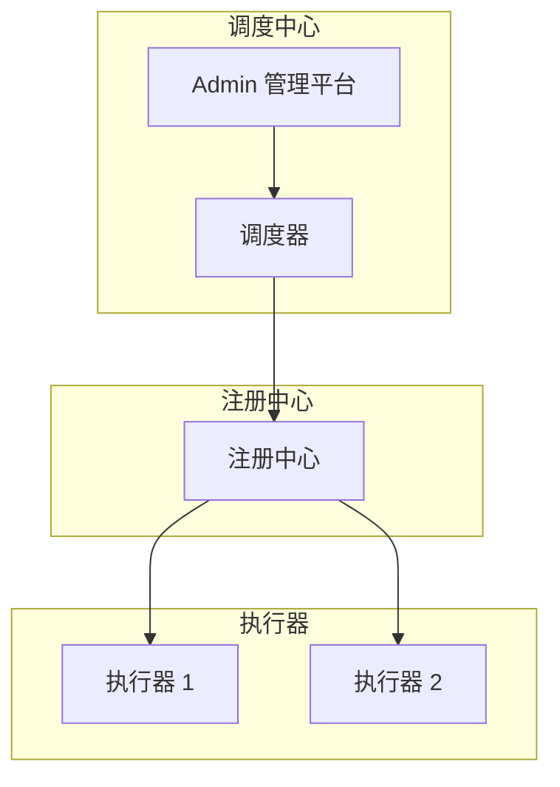

# 定时任务调度

**目标读者**：P7 面试准备  
**面试级别**：P7 中频

## 快速自测

> **🔴 面试官最关心的 3 个问题**
>
> 1. 如何实现分布式定时任务？
> 2. 如何保证任务不重复执行？
> 3. 如何处理任务超时和失败？

---

## 一、定时任务方案对比

| 方案 | 优点 | 缺点 | 适用场景 |
|------|------|------|----------|
| @Scheduled | 简单 | 单机、不能分布式 | 测试环境 |
| Quartz | 功能丰富 | 配置复杂 | 小规模 |
| XXL-Job | 运维友好 | 需要额外部署 | 中大规模 |
| ElasticJob | 云原生 | 较新 | 云环境 |

---

## 二、XXL-Job 架构



---

## 三、任务执行

```java
@Component
public class MyJob {
    @XxlJob("myJob")
    public ReturnT<String> execute(String param) {
        // 业务逻辑
        return ReturnT.SUCCESS;
    }
}
```

---

## 四、分片任务

```java
@Component
public class ShardingJob {
    @XxlJob("shardingJob")
    public ReturnT<String> execute(String param) {
        // 分片参数
        ShardingUtil.ShardingVO shardingVO = ShardingUtil.getSharding();

        // 本分片执行
        int shardingIndex = shardingVO.getIndex();
        int shardingTotal = shardingVO.getTotal();

        // 查询本分片数据
        List<Long> ids = queryData(shardingIndex, shardingTotal);

        // 处理数据
        for (Long id : ids) {
            process(id);
        }

        return ReturnT.SUCCESS;
    }
}
```

---

## 五、面试追问

> **第一层**：如何实现分布式定时任务？
>
> **第二层**：如何保证任务不重复执行？
>
> **第三层**：如何处理任务超时和失败？

**💡 加分回答**：可以提到使用分布式锁或任务分片来保证任务不重复执行。
