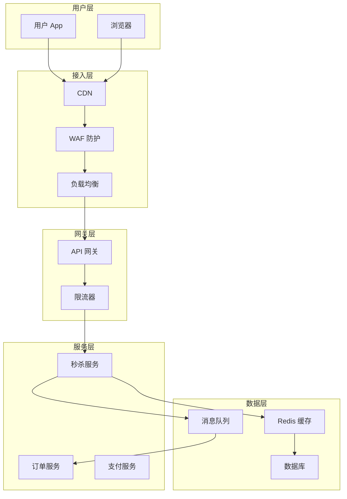
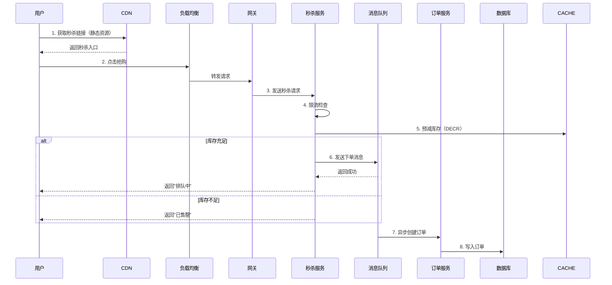

# 秒杀系统设计

**目标读者**：P7 面试准备  
**面试级别**：P7 高频（核心问题）

## 快速自测

> **🔴 面试官最关心的 3 个问题**
>
> 1. 如何解决超卖问题？
> 2. 如何应对高并发流量？
> 3. 如何保证库存不超扣？

---

## 一、秒杀系统核心挑战

### 三大特点

| 特点 | 影响 |
|------|------|
| 瞬时流量大 | 系统过载、响应延迟 |
| 库存有限 | 超卖风险 |
| 竞争激烈 | 请求成功率高（低）|

### 核心问题

```
1. 高并发读写
2. 库存超卖
3. 下单体验差
4. 成本控制
```

---

## 二、系统架构



---

## 三、核心流程

### 秒杀链路



---

## 四、库存扣减方案

### 方案一：数据库乐观锁

```java
// 乐观锁版本
UPDATE inventory
SET stock = stock - 1, version = version + 1
WHERE product_id = ? AND stock > 0 AND version = ?;

// 问题：冲突多时重试多
```

### 方案二：Redis 原子操作（推荐）

```java
@Service
public class SeckillService {
    @Autowired
    private StringRedisTemplate redisTemplate;

    public Result seckill(Long userId, Long productId) {
        String stockKey = "seckill:stock:" + productId;
        String userKey = "seckill:user:" + productId;

        // 1. 检查用户是否已购买（防刷）
        Boolean isMember = redisTemplate.opsForSet().isMember(userKey, userId.toString());
        if (Boolean.TRUE.equals(isMember)) {
            return Result.error("您已购买");
        }

        // 2. 原子扣减库存
        Long stock = redisTemplate.opsForValue().decrement(stockKey);
        if (stock == null || stock < 0) {
            // 恢复库存
            if (stock != null) {
                redisTemplate.opsForValue().increment(stockKey);
            }
            return Result.error("已售罄");
        }

        // 3. 记录用户购买
        redisTemplate.opsForSet().add(userKey, userId.toString());

        // 4. 发送订单消息
        orderMQ.send(new OrderMessage(userId, productId));

        return Result.success("抢购成功");
    }
}
```

### 方案三：Lua 脚本保证原子性

```lua
-- seckill.lua
local stockKey = KEYS[1]
local userKey = KEYS[2]
local userId = ARGV[1]

-- 检查用户是否已购买
if redis.call('SISMEMBER', userKey, userId) == 1 then
    return -2  -- 已购买
end

-- 检查库存
local stock = tonumber(redis.call('GET', stockKey) or 0)
if stock <= 0 then
    return -1  -- 库存不足
end

-- 扣减库存
redis.call('DECR', stockKey)
redis.call('SADD', userKey, userId)

return 1  -- 成功
```

---

## 五、高并发处理

### 1. 流量削峰

```java
@Configuration
public class RateLimiterConfig {
    @Bean
    public FilterRegistrationBean<RateLimitFilter> rateLimitFilter() {
        FilterRegistrationBean<RateLimitFilter> bean = new FilterRegistrationBean<>();
        bean.setFilter(new RateLimitFilter());
        bean.addUrlPatterns("/seckill/*");
        return bean;
    }
}

// 限流算法：令牌桶
public class RateLimitFilter implements Filter {
    private RateLimiter rateLimiter = RateLimiter.create(10000); // 每秒 10000 个令牌

    @Override
    public void doFilter(ServletRequest request, ServletResponse response, FilterChain chain)
            throws IOException, ServletException {
        if (rateLimiter.tryAcquire()) {
            chain.doFilter(request, response);
        } else {
            HttpServletResponse resp = (HttpServletResponse) response;
            resp.setStatus(429);
            resp.getWriter().write("请求过于频繁");
        }
    }
}
```

### 2. 热点数据缓存

```java
@Service
public class ProductService {
    @Autowired
    private RedisTemplate<String, Object> redisTemplate;

    // 热点商品预热
    @PostConstruct
    public void preloadHotProducts() {
        List<Product> hotProducts = productMapper.findHotProducts();
        for (Product product : hotProducts) {
            String stockKey = "seckill:stock:" + product.getId();
            String infoKey = "seckill:info:" + product.getId();

            redisTemplate.opsForValue().set(stockKey, product.getStock());
            redisTemplate.opsForHash().putAll(infoKey, toMap(product));
        }
    }
}
```

### 3. 分层拦截

```java
// 第一层：CDN 缓存静态页面
// 第二层：Redis 缓存热点数据
// 第三层：消息队列异步处理
// 第四层：数据库最终一致性
```

---

## 六、防刷策略

### 1. 用户维度限制

```java
public class UserRateLimit {
    @Autowired
    private RedisTemplate<String, String> redisTemplate;

    public boolean isUserAllowed(Long userId, Long productId) {
        String key = "seckill:user:" + productId + ":" + userId;
        Boolean success = redisTemplate.setIfAbsent(key, "1", Duration.ofSeconds(10));
        return Boolean.TRUE.equals(success);
    }
}
```

### 2. IP 维度限制

```java
public class IpRateLimit {
    @Autowired
    private RedisTemplate<String, String> redisTemplate;

    public boolean isIpAllowed(String ip, Long productId) {
        String key = "seckill:ip:" + productId + ":" + ip;
        Long count = redisTemplate.opsForValue().increment(key);
        if (count != null && count > 100) { // 单 IP 每分钟最多 100 次
            return false;
        }
        if (count != null && count == 1) {
            redisTemplate.expire(key, Duration.ofMinutes(1));
        }
        return true;
    }
}
```

### 3. 验证码

```java
// 秒杀前需要答题/图形验证码
// 分散峰值流量，过滤机器人
```

---

## 七、库存回补

### 超时未支付回补

```java
@Scheduled(fixedDelay = 60000) // 每分钟执行
public void restoreStock() {
    List<Order> timeoutOrders = orderMapper.findTimeoutUnpaidOrders(
        LocalDateTime.now().minusMinutes(15)
    );

    for (Order order : timeoutOrders) {
        // 1. 取消订单
        orderMapper.cancelOrder(order.getId());

        // 2. 恢复库存
        String stockKey = "seckill:stock:" + order.getProductId();
        redisTemplate.opsForValue().increment(stockKey);

        // 3. 移除用户购买记录
        String userKey = "seckill:user:" + order.getProductId();
        redisTemplate.opsForSet().remove(userKey, order.getUserId().toString());
    }
}
```

---

## 八、核心代码模板

```java
@Service
public class SeckillServiceImpl implements SeckillService {
    @Autowired
    private RedisTemplate<String, String> redisTemplate;
    @Autowired
    private OrderProducer orderProducer;

    @Override
    public SeckillResult seckill(SeckillRequest request) {
        Long userId = request.getUserId();
        Long productId = request.getProductId();

        // 1. 参数校验
        if (!validateRequest(request)) {
            return SeckillResult.error("参数错误");
        }

        // 2. 验证码校验
        if (!verifyCaptcha(request.getCaptchaToken())) {
            return SeckillResult.error("验证码错误");
        }

        // 3. 限流检查
        if (!rateLimiter.tryAcquire()) {
            return SeckillResult.error("系统繁忙");
        }

        // 4. 用户防刷
        if (!userRateLimit.isUserAllowed(userId, productId)) {
            return SeckillResult.error("您已购买");
        }

        // 5. 库存扣减（Lua 脚本保证原子性）
        Long stock = executeSeckillLua(productId, userId);
        if (stock < 0) {
            return stock == -1 ? SeckillResult.error("已售罄")
                               : SeckillResult.error("重复购买");
        }

        // 6. 发送订单消息
        orderProducer.sendOrderMessage(userId, productId);

        return SeckillResult.success("抢购成功");
    }

    private Long executeSeckillLua(Long productId, Long userId) {
        String script =
            "local stockKey = KEYS[1] " +
            "local userKey = KEYS[2] " +
            "local userId = ARGV[1] " +
            "if redis.call('SISMEMBER', userKey, userId) == 1 then " +
            "    return -2 " +
            "end " +
            "local stock = tonumber(redis.call('GET', stockKey) or 0) " +
            "if stock <= 0 then " +
            "    return -1 " +
            "end " +
            "redis.call('DECR', stockKey) " +
            "redis.call('SADD', userKey, userId) " +
            "return 1";

        return redisTemplate.execute(
            new DefaultRedisScript<>(script, Long.class),
            Arrays.asList("seckill:stock:" + productId, "seckill:user:" + productId),
            userId.toString()
        );
    }
}
```

---

## 九、面试追问

> **第一层**：如何解决超卖问题？
>
> **第二层**：如何应对高并发流量？
>
> **第三层**：库存不足时，如何保证公平性？

**💡 加分回答**：可以提到使用 Redis + Lua 原子操作保证库存不超扣，结合消息队列异步创建订单。

---

## 十、常见面试陷阱

> **⚠️ 陷阱 1**：直接操作数据库扣库存
>
> 数据库是瓶颈，高并发下会大量超时。应该先在 Redis 扣减，最终一致性同步到数据库。

> **⚠️ 陷阱 2**：忽略防刷
>
> 同一用户重复秒杀、黄牛批量请求。必须做用户维度和 IP 维度的限制。
