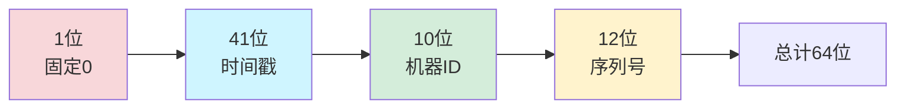

# 短链系统发号器设计

## 一个撞车事故

2023年Q3，我们短链服务上线了一个"批量创建短链"的功能。

运营同学一次性导入了 10 万条短链映射。大促预热页面全部配置好，推广链接分发到各个渠道。

预热开始后，大量用户反馈跳转到了错误的页面。我们的客服在 5 分钟内接到了 200 多个投诉电话。

排查发现：批量导入过程中，有一批请求并发处理，两个请求同时从数据库拿了同一个自增 ID，各自创建了不同的短链。第二个请求覆盖了第一个——10 万条里，有 3 万条映射被错误覆盖。

这次事故之后，我们彻底重写了 ID 生成模块。

## 问题定义

短链系统需要为每个长 URL 分配一个唯一的短码。发号器（ID Generator）的职责就是生成这个唯一 ID。

核心需求：
- **全局唯一**：不能出现两个不同的长 URL 共用同一个短码
- **趋势递增**：ID 最好随时间递增，便于数据库索引和范围查询
- **高可用**：ID 生成服务不能成为系统的单点瓶颈
- **高性能**：单节点 QPS 要能达到数万，支持水平扩展
- **短码友好**：ID 最好是 62 进制的原始值，能直接映射到短码字符

【架构权衡】

短码的长度直接由 ID 的最大值决定：
- 6 位短码 = `62^6 = 568 亿`，够用
- 7 位短码 = `62^7 = 3.5 万亿`，非常充裕

但问题是：ID 越大，短码越长，用户体验越差。需要在 ID 空间和用户体验之间找平衡。

## 方案演进

### 方案A：数据库自增 ID

最简单粗暴的方案。

```sql
CREATE TABLE short_url(
    id BIGINT AUTO_INCREMENT PRIMARY KEY,
    short_code VARCHAR(8) NOT NULL,
    long_url VARCHAR(2048) NOT NULL,
    created_at TIMESTAMP DEFAULT CURRENT_TIMESTAMP,
    UNIQUE INDEX idx_short_code (short_code)
);

-- 每次插入获取自增ID
INSERT INTO short_url (short_code, long_url)
VALUES (NULL, 'https://example.com/very/long/url');
SELECT LAST_INSERT_ID();  -- 获取生成的ID
```

**优点**：简单，绝对唯一，数据库帮你保证
**缺点**：
- 性能差：每次生成需要一次数据库往返
- 水平扩展困难：多数据库实例时无法保证全局唯一
- ID 连续递增：可被猜测，不适合对外暴露
- 单点瓶颈：数据库是中心节点

### 方案B：Redis INCR

用 Redis 的原子递增操作生成 ID。

```java
@Service
public class RedisIdGenerator {

    @Autowired
    private RedisTemplate<String, Long> redisTemplate;

    private static final String ID_KEY = "short_url:id:counter";

    public long nextId() {
        return redisTemplate.opsForValue().increment(ID_KEY);
    }

    // 转换为62进制短码
    public String toShortCode(long id) {
        final String chars = "0123456789ABCDEFGHIJKLMNOPQRSTUVWXYZabcdefghijklmnopqrstuvwxyz";
        StringBuilder sb = new StringBuilder();
        while (id > 0) {
            int idx = (int) (id % 62);
            sb.append(chars.charAt(idx));
            id /= 62;
        }
        return sb.reverse().toString();
    }
}
```

**优点**：性能比数据库高一个数量级，天然支持集群
**缺点**：
- 依赖 Redis，Redis 挂了 ID 生成就挂了（但 Redis 通常比 MySQL 高可用得多）
- ID 连续递增问题依然存在
- 多 Redis 实例时需要额外的分配策略（如 Redis Cluster 不同节点分配不同起始值）

### 方案C：雪花算法（Snowflake）

Twitter 开源的分布式 ID 算法，是工业界最流行的方案。

```java
public class SnowflakeIdGenerator {

    // 时间戳部分：41位，理论上支持约69年
    private final long epoch = 1609459200000L; // 2021-01-01 毫秒

    // 各部分位数
    private final long workerIdBits = 10L;   // 机器ID：2^10 = 1024
    private final long sequenceBits = 12L;    // 序列号：2^12 = 4096

    // 各部分最大值
    private final long maxWorkerId = ~(-1L << workerIdBits); // 1023
    private final long maxSequence = ~(-1L << sequenceBits); // 4095

    // 各部分左移位数
    private final long workerIdShift = sequenceBits;
    private final long timestampLeftShift = sequenceBits + workerIdBits;

    private final long workerId;
    private long sequence = 0L;
    private long lastTimestamp = -1L;

    public SnowflakeIdGenerator(long workerId) {
        if (workerId < 0 || workerId > maxWorkerId) {
            throw new IllegalArgumentException(
                "workerId 必须在 0~" + maxWorkerId + " 之间");
        }
        this.workerId = workerId;
    }

    // 核心方法：生成下一个ID
    public synchronized long nextId() {
        long timestamp = timeGen();

        // 时钟回拨：当前时间小于上次时间
        if (timestamp < lastTimestamp) {
            // 方案1：等待回拨的毫秒数
            long offset = lastTimestamp - timestamp;
            if (offset <= 5) {
                try {
                    wait(offset << 1);
                    timestamp = timeGen();
                    if (timestamp < lastTimestamp) {
                        throw new ClockBackwardsException("时钟回拨超出容忍范围");
                    }
                } catch (InterruptedException e) {
                    Thread.currentThread().interrupt();
                }
            }
            // 方案2（更激进）：直接用 lastTimestamp
            // timestamp = lastTimestamp;
        }

        // 同一毫秒内序列号递增
        if (timestamp == lastTimestamp) {
            sequence = (sequence + 1) & maxSequence;
            if (sequence == 0) {
                // 序列号用完，等待下一毫秒
                timestamp = tilNextMillis(lastTimestamp);
            }
        } else {
            sequence = 0L;
        }

        lastTimestamp = timestamp;

        // 组装ID：时间戳部分 | 机器ID部分 | 序列号部分
        return ((timestamp - epoch) << timestampLeftShift)
                | (workerId << workerIdShift)
                | sequence;
    }

    private long tilNextMillis(long lastTimestamp) {
        long timestamp = timeGen();
        while (timestamp <= lastTimestamp) {
            timestamp = timeGen();
        }
        return timestamp;
    }

    private long timeGen() {
        return System.currentTimeMillis();
    }
}
```

雪花 ID 结构（64 位）：



**优点**：
- 不依赖第三方组件，纯本地算法，性能极高（单节点可达每秒数十万 ID）
- 趋势递增，对数据库索引友好
- 支持分布式（通过 workerId 区分不同机器）

**缺点**：
- 依赖机器时钟，时钟回拨会导致 ID 冲突
- ID 趋势递增但不是连续的（中间有空洞）
- 10 位 workerId 在大规模集群下可能不够

### 方案D：号段模式（数据库号段）

解决雪花算法 ID 太大问题的折中方案。

```java
// 号段模式：每次从数据库批量获取一段ID
@Service
public class SegmentIdGenerator {

    @Autowired
    private JdbcTemplate jdbcTemplate;

    private volatile long currentId = 0;
    private volatile long maxId = 0;
    private static final long STEP = 1000; // 每次获取1000个

    public long nextId() {
        if (currentId >= maxId) {
            refresh();
        }
        return currentId++;
    }

    private synchronized void refresh() {
        // 双检锁：确保只有一个线程去数据库拿号段
        if (currentId < maxId) {
            return;
        }

        // 批量更新起始值
        String sql = "UPDATE id_segment SET max_id = max_id + ? WHERE biz_tag = 'short_url'";
        jdbcTemplate.update(sql, STEP);

        // 获取新的max_id
        sql = "SELECT max_id FROM id_segment WHERE biz_tag = 'short_url'";
        Long newMaxId = jdbcTemplate.queryForObject(sql, Long.class);
        this.maxId = newMaxId;
        this.currentId = newMaxId - STEP;

        log.info("刷新号段：[{}, {})", currentId, maxId);
    }
}
```

```sql
CREATE TABLE id_segment (
    biz_tag VARCHAR(64) PRIMARY KEY,
    max_id BIGINT NOT NULL DEFAULT 0,
    step INT NOT NULL DEFAULT 1000,
    description VARCHAR(256),
    updated_at TIMESTAMP DEFAULT CURRENT_TIMESTAMP ON UPDATE CURRENT_TIMESTAMP
);
```

**优点**：
- 数据库操作次数大幅降低（每 1000 次请求才一次 DB）
- ID 连续递增，数据库索引友好
- 可按业务标签（biz_tag）分表存储不同业务的 ID

**缺点**：
- ID 有空洞：号段分配后，如果服务重启，未用完的号段就浪费了
- 数据库是中心节点：数据库挂了，所有服务都拿不到 ID
- 多数据库实例需要额外的号段分配协调

### 方案E：多基地时钟同步

解决雪花算法时钟回拨问题。

```java
public class MultiDataCenterSnowflake {

    // 数据中心ID：5位，2^5 = 32 个数据中心
    // 机器ID：5位，2^5 = 32 台机器/中心
    private final long datacenterIdBits = 5L;
    private final long workerIdBits = 5L;
    private final long sequenceBits = 12L;

    private final long maxDatacenterId = ~(-1L << datacenterIdBits);
    private final long maxWorkerId = ~(-1L << workerIdBits);
    private final long maxSequence = ~(-1L << sequenceBits);

    private final long datacenterId;
    private final long workerId;
    private final long epoch = 1609459200000L;

    private final long workerIdShift = sequenceBits;
    private final long datacenterIdShift = sequenceBits + workerIdBits;
    private final long timestampLeftShift = sequenceBits + workerIdBits + datacenterIdBits;

    private long sequence = 0L;
    private long lastTimestamp = -1L;

    // 使用 AtomicReference 记录时间戳和序列号
    private AtomicReference<Holder> holderRef = new AtomicReference<>();

    public MultiDataCenterSnowflake(long datacenterId, long workerId) {
        if (datacenterId < 0 || datacenterId > maxDatacenterId) {
            throw new IllegalArgumentException("datacenterId 超出范围");
        }
        if (workerId < 0 || workerId > maxWorkerId) {
            throw new IllegalArgumentException("workerId 超出范围");
        }
        this.datacenterId = datacenterId;
        this.workerId = workerId;
    }

    // 使用 Holder 封装状态，原子替换
    private static class Holder {
        final long timestamp;
        final long sequence;

        Holder(long timestamp, long sequence) {
            this.timestamp = timestamp;
            this.sequence = sequence;
        }
    }

    public long nextId() {
        while (true) {
            long now = System.currentTimeMillis();
            Holder current = holderRef.get();

            if (current == null) {
                // 初始化
                holderRef.compareAndSet(null,
                    new Holder(now - epoch, 0));
                continue;
            }

            long ts = current.timestamp;
            long seq = current.sequence;

            if (now < ts + epoch) {
                // 时钟回拨：使用 lastTimestamp + 1
                // 但要确保不和其他节点冲突
                long newTs = ts + 1 - epoch;
                long newSeq = 0;
                if (holderRef.compareAndSet(current,
                        new Holder(newTs, newSeq))) {
                    return buildId(newTs, datacenterId, workerId, newSeq);
                }
            } else if (now == ts + epoch - current.timestamp + ts) {
                // 同一毫秒内序列递增
                if (seq < maxSequence) {
                    long newSeq = seq + 1;
                    if (holderRef.compareAndSet(current,
                            new Holder(ts, newSeq))) {
                        return buildId(ts, datacenterId, workerId, newSeq);
                    }
                }
                // 序列号用完，等待下一毫秒
            } else {
                // 新毫秒，序列归零
                if (holderRef.compareAndSet(current,
                        new Holder(now - epoch, 0))) {
                    return buildId(now - epoch, datacenterId, workerId, 0);
                }
            }
        }
    }

    private long buildId(long timestamp, long datacenterId, long workerId, long sequence) {
        return (timestamp << timestampLeftShift)
                | (datacenterId << datacenterIdShift)
                | (workerId << workerIdShift)
                | sequence;
    }
}
```

## 生产避坑

### 坑1：雪花算法时钟回拨

这是生产环境中雪花算法最常见的故障原因。

**场景**：服务器从休眠中恢复、NTP 服务异常调整时间、虚拟机迁移。

**解决方案**：
- 容忍少量回拨（5ms 以内），等待补齐
- 回拨超出容忍范围时抛出异常，人工介入
- 更可靠的方案：使用数据库或 ZooKeeper 持久化上次的时间戳，重启后从持久化时间继续

```java
// 更安全的时钟回拨处理
public class SnowflakeWithPersistence extends SnowflakeIdGenerator {

    @Autowired
    private RedisTemplate<String, Long> redisTemplate;

    private static final String LAST_TIMESTAMP_KEY = "snowflake:last_timestamp";

    @Override
    public synchronized long nextId() {
        long timestamp = timeGen();

        // 优先从 Redis 恢复上次时间戳（持久化方案）
        Long persistedTimestamp = redisTemplate.opsForValue().get(LAST_TIMESTAMP_KEY);
        if (persistedTimestamp != null && timestamp < persistedTimestamp) {
            // 时钟回拨，但已经在持久化时间之后恢复
            timestamp = persistedTimestamp;
        }

        if (timestamp < lastTimestamp) {
            // 持久化时间也比当前时间大，这是严重问题
            log.error("时钟回拨超出容忍范围: last={}, current={}",
                lastTimestamp, timestamp);
            throw new ClockBackwardsException("时钟回拨");
        }

        // ... 正常生成逻辑

        // 持久化当前时间戳到 Redis
        redisTemplate.opsForValue().set(LAST_TIMESTAMP_KEY, timestamp);
    }
}
```

### 坑2：号段耗尽瞬间的尖刺

号段模式中，当 currentId 接近 maxId 时，所有请求都会阻塞在刷新号段的数据库操作上。这会导致短暂的 QPS 下降。

**解决方案**：
- 异步预取：当 currentId 达到 maxId 的 80% 时，后台线程就开始预取下一个号段
- 双号段缓冲：一个号段快用完时，切换到另一个已经预取好的号段

```java
public class DoubleBufferSegmentGenerator {

    private volatile Segment current = new Segment(0, 0);
    private volatile Segment next = new Segment(0, 0);
    private volatile boolean loading = false;

    private static class Segment {
        final long current;
        final long max;

        Segment(long current, long max) {
            this.current = current;
            this.max = max;
        }
    }

    public long nextId() {
        if (current.current >= current.max) {
            // 切换到预取好的号段
            synchronized (this) {
                if (current.current >= current.max) {
                    this.current = next;
                    // 触发下一次预取
                    loadNextSegmentAsync();
                }
            }
        }
        return current.current++;
    }

    @Async
    public void loadNextSegmentAsync() {
        if (loading) return;
        loading = true;
        try {
            // 异步从数据库获取下一个号段
            Segment newSegment = fetchNextSegment();
            this.next = newSegment;
        } finally {
            loading = false;
        }
    }
}
```

### 坑3：ID 转换短码时的前导零问题

```java
// 错误的转换：ID=1 时，短码是 "1"，而不是 "000001"
public String toShortCodeWrong(long id) {
    final String chars = "0123456789ABCDEFGHIJKLMNOPQRSTUVWXYZabcdefghijklmnopqrstuvwxyz";
    StringBuilder sb = new StringBuilder();
    while (id > 0) {
        sb.append(chars.charAt((int)(id % 62)));
        id /= 62;
    }
    return sb.reverse().toString();
}

// 正确的转换：保证固定长度
public String toShortCode(long id) {
    final String chars = "0123456789ABCDEFGHIJKLMNOPQRSTUVWXYZabcdefghijklmnopqrstuvwxyz";
    StringBuilder sb = new StringBuilder();
    for (int i = 0; i < 6; i++) {  // 固定6位，不足补前导零
        sb.append(chars.charAt((int)(id % 62)));
        id /= 62;
    }
    return sb.reverse().toString();
}
```

## 工程代价评估

| 维度 | 数据库自增 | Redis INCR | 雪花算法 | 号段模式 | 多基地雪花 |
| --- | --- | --- | --- | --- | --- |
| 性能 | 低（DB RTT） | 高（内存操作） | 极高（本地） | 极高（批量） | 极高（本地） |
| 可用性 | 中（单点） | 高（Redis 高可用） | 高（无依赖） | 中（DB 单点） | 高（无依赖） |
| 趋势递增 | 连续递增 | 连续递增 | 趋势递增（不连续） | 连续递增 | 趋势递增 |
| 可猜测性 | 高 | 高 | 中 | 高 | 中 |
| 时钟依赖 | 无 | 无 | 有 | 无 | 有（但更健壮） |
| 扩展性 | 困难 | 中（Cluster） | 容易（workerId） | 容易（号段分片） | 容易 |

## 落地 Checklist

- [ ] ID 生成方案选型（根据业务规模选择雪花或号段）
- [ ] 时钟回拨处理方案（雪花算法必做）
- [ ] 号段模式的异步预取和双缓冲（号段模式必做）
- [ ] ID 到短码的转换逻辑（前导零处理）
- [ ] 短码长度规划（6位够用吗？7位？）
- [ ] 监控告警：ID 生成 QPS、延迟、号段剩余量
- [ ] 降级方案：ID 生成服务挂了怎么降级（缓存一批预生成的 ID）
- [ ] 单元测试：时钟回拨、并发安全、ID 唯一性

## 短链发号器与存储的联合设计

发号器生成的 ID 最终要持久化到存储中，短链系统和发号器的联合设计有几种模式：

### 模式1：发号器 + 异步写库

```java
@Service
public class ShortUrlService {

    @Autowired
    private SnowflakeIdGenerator idGenerator;

    public String createShortUrl(String longUrl) {
        // 1. 生成分布式ID
        long id = idGenerator.nextId();

        // 2. 转换为62进制短码（固定6位）
        String shortCode = idGenerator.toShortCode(id);

        // 3. 异步写入数据库（削峰）
        asyncWriteToDb(shortCode, longUrl, id);

        return shortCode;
    }
}
```

### 模式2：发号器 + 缓存双写

```java
public String createShortUrl(String longUrl) {
    long id = idGenerator.nextId();
    String shortCode = idGenerator.toShortCode(id);

    // Redis 和 DB 双写
    redisTemplate.opsForValue().set("s:" + shortCode, longUrl);
    jdbcTemplate.update(
        "INSERT INTO short_url (id, short_code, long_url) VALUES (?, ?, ?)",
        id, shortCode, longUrl
    );

    return shortCode;
}
```

### 模式3：号段 + 批量预写

```java
// 批量创建短链：一次申请一个号段，批量写入
public List<String> batchCreateShortUrl(List<String> longUrls) {
    List<String> shortCodes = new ArrayList<>();

    // 从号段获取一段连续ID
    long startId = segmentGenerator.nextSegmentId();
    int step = segmentGenerator.getStep();

    // 批量转换
    for (int i = 0; i < longUrls.size() && i < step; i++) {
        long id = startId + i;
        String shortCode = toShortCode(id);
        shortCodes.add(shortCode);
    }

    // 批量写入（减少数据库往返）
    jdbcTemplate.batchUpdate(
        "INSERT INTO short_url (id, short_code, long_url) VALUES (?, ?, ?)",
        new BatchPreparedStatementSetter() {
            @Override
            public void setValues(PreparedStatement ps, int i) throws SQLException {
                ps.setLong(1, startId + i);
                ps.setString(2, shortCodes.get(i));
                ps.setString(3, longUrls.get(i));
            }
            @Override
            public int getBatchSize() { return shortCodes.size(); }
        }
    );

    return shortCodes;
}
```

【架构权衡】

短链发号器的选型关键看业务规模：
- **日均千万级以下**：号段模式 + MySQL 就够了，简单可靠
- **日均亿级以上**：雪花算法，多节点部署，每秒可生成数十万 ID
- **需要严格不可猜测**：雪花算法的 ID 不连续，有一定安全性；如果需要完全不可猜测，可以在雪花 ID 基础上加加密（如 Base62 随机打乱）
- **多机房部署**：必须使用多基地时钟同步方案，避免时钟漂移导致 ID 冲突
