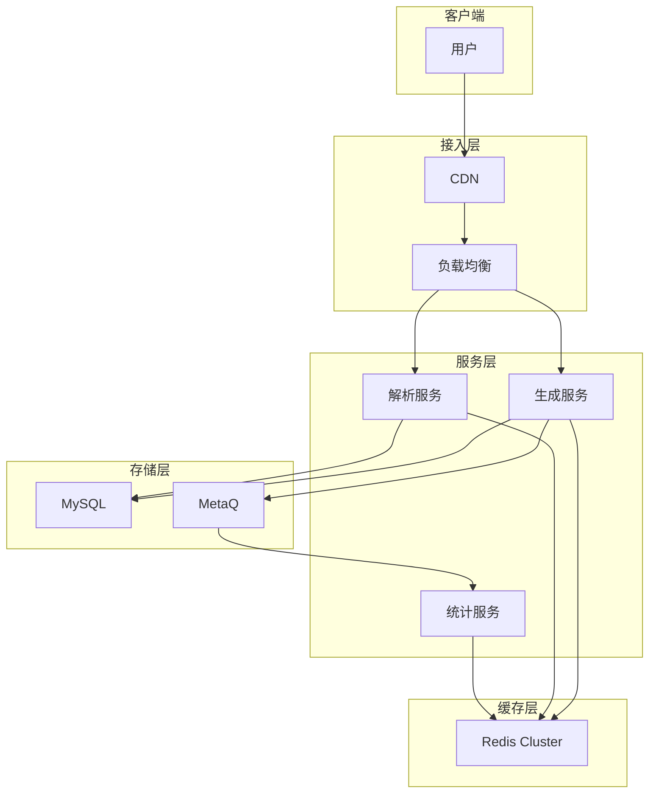

# 短链系统设计

**目标读者**：P7 面试准备  
**面试级别**：P7 高频

## 快速自测

> **🔴 面试官最关心的 3 个问题**
>
> 1. 如何生成唯一的短码？
> 2. 如何设计高可用的跳转服务？
> 3. 如何处理热点访问？

---

## 一、核心问题

### 功能需求

| 功能 | 说明 |
|------|------|
| 生成短链 | 长 URL → 短 URL |
| 访问短链 | 短 URL → 长 URL + 重定向 |
| 统计分析 | 点击量、来源、时间 |

### 性能目标

| 指标 | 目标 |
|------|------|
| 日均生成 | 1000 万 |
| 日均访问 | 1 亿 |
| 响应延迟 | P99 `<` 50ms |
| 可用性 | 99.99% |

---

## 二、系统架构



---

## 三、短码生成算法

### 方案对比

| 方案 | 优点 | 缺点 | 适用场景 |
|------|------|------|----------|
| Hash（MD5/SHA256）| 简单 | 可能碰撞 | 小规模 |
| 发号器 | 唯一、可预测 | 需要分布式 ID | 大规模 |
| 随机数 | 简单 | 可能碰撞 | 低并发 |
| Base62 | 短 | 依赖发号器 | 通用 |

### 发号器 + Base62（推荐）

```java
@Service
public class ShortCodeGenerator {
    private static final String CHARACTERS = "0123456789ABCDEFGHIJKLMNOPQRSTUVWXYZabcdefghijklmnopqrstuvwxyz";
    private static final int BASE = CHARACTERS.length();

    @Autowired
    private IdGenerator idGenerator;

    public String generate(Long urlId) {
        StringBuilder sb = new StringBuilder();
        long id = urlId;

        while (id > 0) {
            sb.append(CHARACTERS.charAt((int) (id % BASE)));
            id /= BASE;
        }

        // 补齐到 6 位
        while (sb.length() < 6) {
            sb.append('0');
        }

        return sb.reverse().toString();
    }

    // 解析短码为 ID
    public long parse(String shortCode) {
        long id = 0;
        for (char c : shortCode.toCharArray()) {
            id = id * BASE + CHARACTERS.indexOf(c);
        }
        return id;
    }
}
```

### 发号器实现

```java
@Service
public class DistributedIdGenerator {
    @Autowired
    private RedisTemplate<String, String> redisTemplate;

    private static final String ID_KEY = "shorturl:id";
    private static final int STEP = 1000;

    public long generateId() {
        Long id = redisTemplate.opsForValue().increment(ID_KEY, STEP);
        return (id - STEP + 1); // 返回起始 ID
    }

    public List<Long> generateIds(int count) {
        Long id = redisTemplate.opsForValue().increment(ID_KEY, count);
        List<Long> ids = new ArrayList<>();
        for (int i = count - 1; i >= 0; i--) {
            ids.add(id - i);
        }
        return ids;
    }
}
```

---

## 四、存储设计

### 表结构

```sql
CREATE TABLE short_url (
    id BIGINT PRIMARY KEY AUTO_INCREMENT,
    short_code VARCHAR(20) NOT NULL UNIQUE,
    long_url TEXT NOT NULL,
    user_id BIGINT,
    create_time DATETIME NOT NULL,
    expire_time DATETIME,
    click_count BIGINT DEFAULT 0,
    status TINYINT DEFAULT 1,  -- 1: 正常, 0: 禁用
    INDEX idx_short_code (short_code),
    INDEX idx_user_id (user_id),
    INDEX idx_create_time (create_time)
) ENGINE=InnoDB DEFAULT CHARSET=utf8mb4;
```

### 热点数据处理

```java
@Service
public class ShortUrlService {
    @Autowired
    private RedisTemplate<String, String> redisTemplate;

    private static final String SHORT_URL_PREFIX = "short:";
    private static final String LONG_URL_PREFIX = "long:";

    // 生成短链
    public String createShortUrl(String longUrl, Long userId) {
        // 1. 检查长链是否已存在
        String existingShortCode = redisTemplate.opsForHash()
            .get(LONG_URL_PREFIX, longUrl);

        if (existingShortCode != null) {
            return existingShortCode;
        }

        // 2. 生成新短码
        Long urlId = idGenerator.generateId();
        String shortCode = shortCodeGenerator.generate(urlId);

        // 3. 存储映射
        redisTemplate.opsForValue().set(SHORT_URL_PREFIX + shortCode, longUrl);
        redisTemplate.opsForHash().put(LONG_URL_PREFIX, longUrl, shortCode);

        // 4. 异步写入数据库
        asyncSaveToDb(urlId, shortCode, longUrl, userId);

        return shortCode;
    }

    // 访问短链
    public String resolveShortUrl(String shortCode) {
        String cacheKey = SHORT_URL_PREFIX + shortCode;

        // 1. 先查缓存
        String longUrl = redisTemplate.opsForValue().get(cacheKey);
        if (longUrl != null) {
            // 异步更新点击数
            asyncIncrementClick(shortCode);
            return longUrl;
        }

        // 2. 缓存未命中，查数据库
        ShortUrlDO urlDO = shortUrlMapper.selectByShortCode(shortCode);
        if (urlDO == null || urlDO.getStatus() == 0) {
            return null;
        }

        // 3. 回填缓存
        redisTemplate.opsForValue().set(cacheKey, urlDO.getLongUrl());

        return urlDO.getLongUrl();
    }
}
```

---

## 五、核心代码

### 跳转服务

```java
@RestController
@RequestMapping("/r")
public class RedirectController {
    @Autowired
    private ShortUrlService shortUrlService;
    @Autowired
    private ClickStatService clickStatService;

    @GetMapping("/{shortCode}")
    public ResponseEntity<Void> redirect(@PathVariable String shortCode,
                                        HttpServletRequest request,
                                        HttpServletResponse response) {
        // 1. 解析长链
        String longUrl = shortUrlService.resolveShortUrl(shortCode);
        if (longUrl == null) {
            return ResponseEntity.notFound().build();
        }

        // 2. 记录访问统计
        ClickStat stat = ClickStat.builder()
            .shortCode(shortCode)
            .referer(request.getHeader("Referer"))
            .userAgent(request.getHeader("User-Agent"))
            .ip(getClientIp(request))
            .timestamp(System.currentTimeMillis())
            .build();
        clickStatService.record(stat);

        // 3. 302 重定向
        return ResponseEntity.status(HttpStatus.FOUND)
            .header("Location", longUrl)
            .build();
    }
}
```

---

## 六、容量估算

### 存储需求

```
每天生成：1000 万条
每条数据：约 100 字节
每天存储：1000万 × 100 = 1 GB
1 年存储：1 GB × 365 = 365 GB
3 副本存储：365 GB × 3 = 1.1 TB
```

### 缓存需求

```
热点数据：前 20% 的短链
热点数量：1000万 × 20% = 200 万
缓存大小：200万 × 100字节 ≈ 200 MB
```

### QPS 估算

```
日均访问：1 亿
平均 QPS：1亿 / 86400 ≈ 1158
峰值 QPS：1158 × 5 = 5790
```

---

## 七、面试追问

> **第一层**：如何生成唯一的短码？
>
> **第二层**：如何处理热点短链的访问？
>
> **第三层**：如何实现短链的统计分析？

**💡 加分回答**：可以提到使用 Redis HyperLogLog 统计 UV，使用 ClickHouse 存储访问日志。
