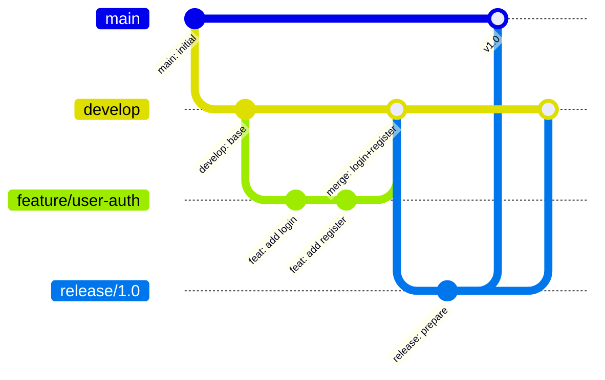

# Git 分支管理

import { Badge } from '@rspress/core/theme';

<Badge text="面试高频" type="tip" />

「这个分支叫什么来着？」「feature-pay-2024-03-15-final-真的final版？」「别动那个分支，我还在用！」——如果你在团队中听到过类似的对话，说明你们迫切需要一套分支管理规范。

分支命名混乱是团队协作的慢性毒药。短期内似乎无关痛痒，但随着项目推进，你会花越来越多的时间在「这个分支是干什么的」「能不能删」「为什么删不掉」这些问题上。

## 分支命名规范

好的分支名应该具备三个特征：**自描述**（一看就知道是什么）、**唯一性**（不会和其他分支混淆）、**一致性**（所有人都用同一套规则）。

### 命名格式

```bash
# 推荐的命名格式
<type>/<ticket-id>-<short-description>

# 示例
feature/PROJ-123-user-authentication
bugfix/PROJ-456-login-timeout
hotfix/PROJ-789-payment-crash
chore/PROJ-101-update-dependencies
docs/PROJ-102-api-documentation
```

### 分支类型前缀

| 前缀 | 用途 | 示例 |
|---|---|---|
| `feature/` | 新功能开发 | `feature/PROJ-123-payment-module` |
| `bugfix/` | 普通 bug 修复 | `bugfix/PROJ-456-fix-null-error` |
| `hotfix/` | 生产环境紧急修复 | `hotfix/PROJ-789-security-patch` |
| `release/` | 发布准备 | `release/v1.2.0` |
| `chore/` | 维护任务（依赖更新、配置调整） | `chore/PROJ-101-update-deps` |
| `docs/` | 文档更新 | `docs/PROJ-102-api-readme` |
| `refactor/` | 代码重构 | `refactor/PROJ-105-extract-service` |
| `test/` | 测试相关 | `test/PROJ-106-add-integration-test` |

### 反模式：需要避免的命名

```bash
# 这些都是反面教材
feature/my-work          # 太模糊，不知道是做什么的
bugfix-1234              # 没有类型前缀
test                      # 根本不知道是什么测试
dev                       # 大家都用 dev，分支多了就冲突
zhang-test                # 用人名命名，跨团队协作时很混乱
final                     # 你信吗，这个分支不会真的是 final
v1                        # 到底是分支还是 tag？
```

---

## 分支保护规则

分支保护是防止「手滑」的最后一道防线。在 GitHub、GitLab 等平台上，你可以为关键分支配置保护规则。

### 为什么要保护分支？

- 防止直接向 main/master 推送代码，强制 Code Review
- 防止删除重要分支
- 防止强制推送覆盖历史
- 确保所有合并都必须通过 CI 检查

### GitHub 分支保护配置

```bash
# 使用 GitHub CLI 设置分支保护
gh api repos/:owner/:repo/branches/main/protection -X PUT \
  -f required_status_checks='{"strict":true,"contexts":["ci/pipeline"]}' \
  -f enforce_admins=true \
  -f required_pull_request_reviews='{"required_approving_review_count":2}' \
  -f allow_force_pushes=false \
  -f delete_branch_on_merge=true
```

### GitLab 分支保护配置

```yaml
# .gitlab-ci.yml 中的分支保护通过 GitLab UI 设置
# 或者使用 GitLab API
curl --request PUT --header "PRIVATE-TOKEN: your-token" \
  "https://gitlab.com/api/v4/projects/project-id/protected-branches/main" \
  --data "push_access_level=0" \
  --data "merge_access_level=40"  # 40 = Developer
```

### 推荐的保护规则

| 规则 | 推荐设置 | 说明 |
|---|---|---|
| 禁止直接推送 | 启用 | main 分支必须通过 PR 合并 |
| 要求 Pull Request | 启用 | 所有合并必须创建 PR |
| 最少 Review 通过数 | 2 | 至少两人 Review |
| 状态检查必须通过 | 启用 | CI 流水线必须全部通过 |
| 分支最新化 | 启用 | 合并前需要 rebase 到最新 |
| 允许强制推送 | 禁用 | 防止意外覆盖历史 |
| 合并后删除分支 | 启用 | 自动清理已合并分支 |

---

## 长生命周期分支 vs 短生命周期分支

### 长生命周期分支

这类分支会存在数周甚至数月，通常对应项目的重大阶段。

```bash
# 典型的长生命周期分支
main           # 生产环境代码，始终可部署
develop        # 开发主分支，汇集所有功能
release/1.0    # 特定版本的发布分支
```

**维护策略**：

```bash
# 1. 定期从 main 同步更新到 develop
git checkout develop
git fetch origin
git merge origin/main

# 2. develop 定期同步到 release 分支
git checkout release/1.0
git merge develop

# 3. hotfix 需要同时更新 main 和 develop
git checkout main
git merge hotfix/critical-fix

git checkout develop
git merge hotfix/critical-fix
```

### 短生命周期分支

功能分支、bugfix 分支属于这一类。它们存在时间短（几小时到几天），用完即弃。

```bash
# 创建功能分支
git checkout -b feature/PROJ-123-user-profile

# 开发完成后，通过 PR 合并

# 合并后删除本地和远程分支
git branch -d feature/PROJ-123-user-profile
git push origin --delete feature/PROJ-123-user-profile
```

---

## 分支清理与维护

### 手动清理

```bash
# 1. 删除已经合并到 main 的本地分支
git checkout main
git branch --merged main | grep -v "main" | xargs git branch -d

# 2. 删除远程已合并的分支（需要 GitHub/GitLab 开启自动删除）
# 手动清理时
git fetch --prune  # 清理已删除的远程分支引用

# 3. 一次性清理所有过时分支
git fetch --prune
git branch -vv | grep ': gone]' | awk '{print $1}' | xargs git branch -d
```

### 自动化清理策略

**GitHub 自动清理**：

```bash
# 在 GitHub 设置中开启
# Settings → Branches → ✅ "Delete head branches"
# 所有通过 PR 合并的分支会自动删除
```

**GitLab 自动清理**：

```yaml
# Settings → General → Merge requests → ✅ "Delete source branch"
# 合并请求完成后自动删除源分支
```

**清理脚本**：

```bash
#!/bin/bash
# cleanup-branches.sh

set -e

echo "Fetching remote branches..."
git fetch --prune

echo "Local merged branches to delete:"
git branch --merged main | grep -v "main" | grep -v "develop" | grep -v "release/*"

read -p "Delete these branches? (y/n) " -n 1 -r
echo
if [[ $REPLY =~ ^[Yy]$ ]]; then
  git branch --merged main | grep -v "main" | grep -v "develop" | grep -v "release/*" | xargs git branch -d
  echo "Done!"
fi
```

---

## 分支管理最佳实践

### 日常开发流程

```bash
# 1. 开始新任务前，确保本地 main 最新
git checkout main
git pull

# 2. 从最新的 main 创建功能分支
git checkout -b feature/PROJ-456-payment-api

# 3. 开发过程中，定期 rebase 同步 main 更新
# 建议每天至少一次
git fetch origin
git rebase origin/main

# 4. 完成任务后，发起 Pull Request
git push -u origin feature/PROJ-456-payment-api

# 5. PR 合并后，切换回 main 并更新
git checkout main
git pull

# 6. 删除已合并的分支
git branch -d feature/PROJ-456-payment-api
```

### 分支生命周期管理



---

## 常见问题处理

### 分支冲突解决

```bash
# 当 rebase 或 merge 时遇到冲突
git rebase origin/main

# 输出：Auto-merging src/main.js
# CONFLICT (content): Merge conflict in src/main.js

# 1. 打开冲突文件，编辑解决冲突
# 2. 标记冲突已解决
git add src/main.js

# 3. 继续 rebase
git rebase --continue

# 或者放弃 rebase
git rebase --abort
```

### 误删分支恢复

```bash
# 如果分支未合并就被删了，还有救
git reflog
# 输出：
# abc123 HEAD@{0}: checkout: moving from feature-xyz to main
# def456 HEAD@{1}: commit: WIP: incomplete work

# 1. 找到删除前的提交
git checkout -b feature-xyz def456

# 2. 继续工作
# ...
```

### 长期未更新的分支

```bash
# 检查分支是否落后于 main
git fetch origin
git log --oneline feature/old-branch..origin/main

# 如果落后太多，建议重新创建分支
git checkout -b feature/renewed origin/main
# 然后手动应用关键修改
```

> [!TIP]
> 建议在团队内部建立「分支命名规范」文档，并使用 Git hooks 或 CI 检查来强制执行命名规范。
