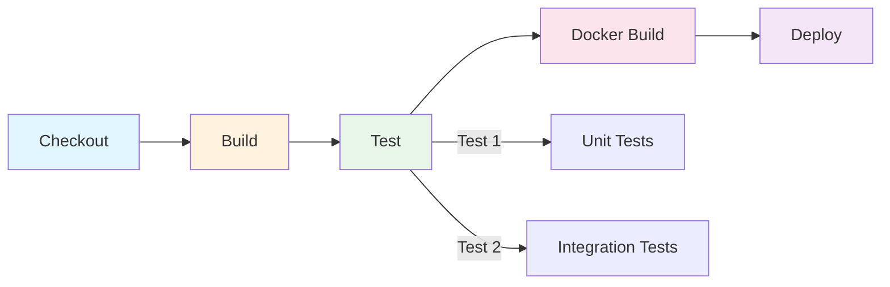

# Blue Ocean 可视化流水线

Jenkins 的经典 UI 设计于 2006 年，那个年代的网页设计和现在完全不同。当流水线变得复杂时，满屏的参数配置、嵌套菜单让人头疼。

Blue Ocean 是 Jenkins 团队为现代开发者打造的全新 UI。它诞生于 2016 年，核心理念是：**流水线应该像流水线那样可视化，而不是像配置页面那样表格化**。

## Blue Ocean 核心特性

### 可视化流水线编辑器

Blue Ocean 提供所见即所得的流水线编辑器，即使不熟悉 Jenkinsfile 语法，也能通过拖拽创建流水线。

**主要功能**：

- 可视化创建和编辑 Pipeline
- 自动生成 Jenkinsfile
- 支持 Stage 和 Step 的拖拽排序
- 实时语法检查和错误提示

### Pipeline 可视化



---

## 安装 Blue Ocean

### 方式一：通过插件管理

```bash
# 1. Manage Jenkins → Manage Plugins → Available
# 2. 搜索 "Blue Ocean"
# 3. 选择并安装

# 或者使用 Jenkins CLI
java -jar jenkins-cli.jar -s http://jenkins:8080 install-plugin blueocean
```

### 方式二：Docker 方式启动

```yaml
# docker-compose.yml
version: '3.8'
services:
  jenkins:
    image: jenkins/jenkins:2.462-jdk17
    ports:
      - "8080:8080"
      - "50000:50000"
    volumes:
      - jenkins_home:/var/jenkins_home
    environment:
      - JENKINS_OPTS=--prefix=/jenkins
    plugins:
      - blueocean

volumes:
  jenkins_home:
```

---

## Blue Ocean 界面概览

### 访问 Blue Ocean

启动 Blue Ocean 后，通过以下 URL 访问：

```
http://jenkins-url/blue
```

### 核心视图

| 视图 | 说明 | URL |
|---|---|---|
| Dashboard | 所有流水线概览 | `/blue` |
| Pipeline Editor | 可视化编辑器 | `/blue/pipeline-editor` |
| Run Details | 构建详情 | `/blue/organizations/*/pipeline/*/runs/*` |
| Settings | 账户设置 | `/blue/settings` |

---

## Pipeline 可视化编辑器

### 创建新流水线

```bash
# 1. 点击 "New Pipeline"
# 2. 选择源码仓库（GitHub/GitLab/Bitbucket）
# 3. 授权访问
# 4. 选择 Organization 和 Repository
# 5. 选择分支或创建 Pipeline

# Jenkinsfile 存在则导入，不存在则创建新的
```

### 添加 Stage

```bash
# 在可视化编辑器中：
# 1. 点击 "+ Add Stage"
# 2. 输入 Stage 名称
# 3. 点击 "Add Step"
# 4. 选择需要的 Step（sh, echo, checkout 等）
# 5. 配置 Step 参数

# 编辑器会生成对应的 Jenkinsfile
```

### 可视化编辑器生成的 Jenkinsfile

```groovy
pipeline {
    agent any
    stages {
        stage('Checkout') {
            steps {
                checkout scm
            }
        }
        stage('Build') {
            steps {
                sh 'mvn clean package'
            }
        }
        stage('Test') {
            steps {
                sh 'mvn test'
            }
        }
    }
}
```

---

## Run Details 视图

### 构建历史

```bash
# Run Details 页面展示：
# 1. Pipeline 状态概览
# 2. 每个 Stage 的执行状态
# 3. 当前 Stage 的 Console Output
# 4. 测试结果
# 5. 制品列表
```

### Stage 详情

```bash
# 点击某个 Stage 可以查看：
# - Stage 执行时间
# - 详细日志
# - 环境变量
# - 修改的文件列表
```

### 支持的操作

| 操作 | 说明 |
|---|---|
| Replay | 用修改后的代码重新执行 |
| Pause | 暂停流水线 |
| Abort | 中止流水线 |
| Retry | 重试失败的流水线 |
| Edit | 在可视化编辑器中修改 |

---

## 分支与 Pull Request 感知

Blue Ocean 自动检测并展示所有活跃的分支和 Pull Request。

### 分支视图

```bash
# Dashboard 展示：
# - main 分支的最新状态
# - feature/* 分支列表
# - 每个分支的最后构建时间和状态

# 点击分支可以：
# - 查看该分支的 Pipeline
# - 创建 Pull Request
# - 删除分支
```

### Pull Request 集成

```bash
# Blue Ocean 自动：
# - 列出所有 Open 的 Pull Request
# - 显示 CI 检查状态
# - 支持直接在 PR 页面查看构建结果

# GitHub PR 状态展示：
# - Checks passing ✓
# - Checks failing ✗
# - Checks pending ⏳
```

---

## 与经典 UI 的对比

| 特性 | Blue Ocean | 经典 UI |
|---|---|---|
| 流水线可视化 | ✅ 原生支持 | ⚠️ 需要插件 |
| Pipeline Editor | ✅ 所见即所得 | ❌ 需要手写 Jenkinsfile |
| 移动端支持 | ✅ 响应式设计 | ❌ 不支持 |
| 多分支视图 | ✅ 清晰展示 | ⚠️ 需要 Blue Ocean 插件 |
| 错误提示 | ✅ 实时语法检查 | ❌ 运行时才发现 |
| 性能 | ✅ 更轻量 | ⚠️ 较重 |

---

## 最佳实践

### 何时使用 Blue Ocean？

**适合使用 Blue Ocean 的场景**：

- Jenkins 新手，需要快速上手
- 流水线结构简单，不需要复杂配置
- 需要可视化编辑流水线
- 团队成员对 Jenkinsfile 语法不熟悉

**建议继续使用经典 UI 的场景**：

- 流水线非常复杂，包含大量 Groovy 脚本
- 需要使用共享库和高级特性
- 团队成员熟悉 Jenkinsfile 语法
- 需要深度定制 Jenkins 配置

### 在 Blue Ocean 中查看日志

```bash
# 1. 进入 Run Details 页面
# 2. 点击失败的 Stage
# 3. 在右侧面板查看日志

# 或者：
# 1. 点击某个 Stage
# 2. 选择 "Log" 标签
# 3. 支持日志搜索和高亮
```

### 导出 Jenkinsfile

```bash
# Blue Ocean 支持从可视化编辑器导出 Jenkinsfile
# 1. 打开 Pipeline Editor
# 2. 点击右上角 "..." 菜单
# 3. 选择 "Export to Jenkinsfile"
# 4. 保存到本地文件
```

> [!TIP]
> Blue Ocean 适合快速创建和可视化流水线，但复杂的 Jenkinsfile 建议直接在 IDE 中编辑并通过 Git 管理。
