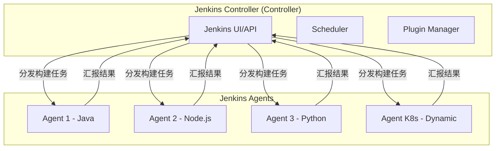
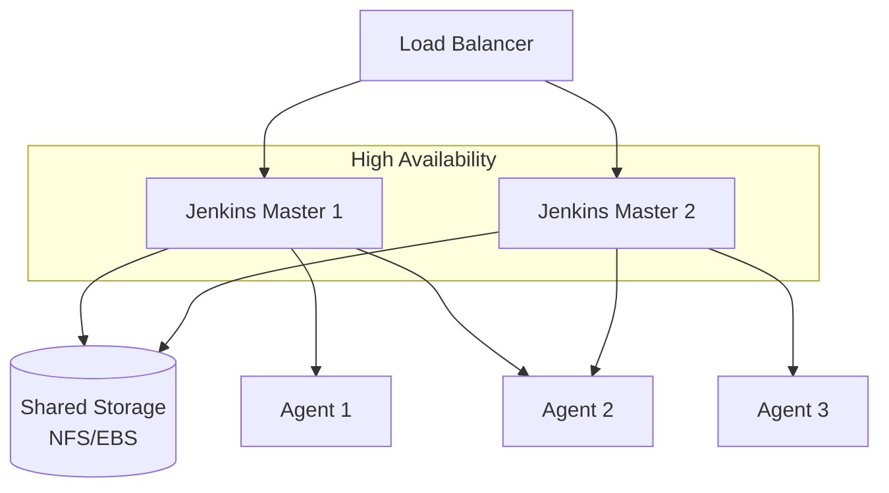

# Jenkins 架构

import { Badge } from '@rspress/core/theme';

<Badge text=" PRINCIPLE 原理类" type="warning" />

想象一下，你经营一家餐厅。Jenkins 的 Master 就是这家餐厅的前台和后厨总管，它接待客人（接收构建请求）、分配任务（分发构建任务）、检查成品（判断构建结果）。而 Jenkins 的 Agent（过去叫 Slave）就是那些真正在灶台上炒菜的厨师。

如果只有一个厨师，所有订单都得排队；如果有 10 个厨师，就可以同时处理 10 个订单。这就是 Jenkins 分布式架构的核心价值——**横向扩展构建能力**。

## Master-Slave 架构（Controller-Agent 架构）

Jenkins 2.462+ 版本将「Slave」更名为「Agent」，但核心概念没变。

### 架构图示



### Controller 职责

| 职责 | 说明 |
|---|---|
| 用户界面 | 提供 Web UI 管理 Jobs、Builds、配置 |
| 任务调度 | 决定哪个 Job 在什么时候执行 |
| 结果存储 | 存储构建历史、Console 输出、制品 |
| 插件管理 | 管理所有插件的安装和加载 |
| API 服务 | 提供 REST API 供外部调用 |

### Agent 职责

| 职责 | 说明 |
|---|---|
| 执行构建 | 运行 Job 分配的构建步骤 |
| 环境隔离 | 每个 Job 可以在独立的 Agent 上运行 |
| 资源占用 | 占用机器的 CPU、内存、磁盘资源 |
| 结果上报 | 将构建结果汇报给 Controller |

### 通信机制

Jenkins Agent 与 Controller 之间的通信有两种模式：

**Agent → Controller（推荐）**：Agent 主动连接到 Controller 的 TCP 端口。这种模式下，Agent 在防火墙后面也没问题，只要能访问 Controller 即可。

```bash
# Agent 启动时连接 Controller
java -jar agent.jar -jnlpUrl http://jenkins.example.com/computer/agent1/slave-agent.jnlp -secret xxxxxxxx
```

**Controller → Agent**：Controller 主动 SSH 到 Agent 执行命令。适用于 Agent 有公网 IP 且 Controller 能访问的场景。

---

## 配置 Jenkins Agent

### 通过 Web UI 添加 Agent

```bash
# 1. 在 Agent 机器上安装 Java
sudo apt install openjdk-17-jre

# 2. 在 Jenkins Web UI 中
# Manage Jenkins → Manage Nodes → New Node

# 3. 配置 Node
# Node Name: build-agent-1
# Permanent Agent: true
# Remote root directory: /home/jenkins/agent
# Labels: java, maven, linux
# Launch method: Launch agent via SSH
# Host: 192.168.1.100
# Credentials: Add SSH credential
```

### 通过命令行启动 Agent

```bash
# 在 Agent 机器上
# 1. 下载 agent.jar
curl -o agent.jar http://jenkins.example.com/jnlpJars/agent.jar

# 2. 启动 Agent（需要先在 Jenkins 中创建节点获取 secret）
java -jar agent.jar \
  -jnlpUrl http://jenkins.example.com/computer/agent1/slave-agent.jnlp \
  -secret xxxxxxxx \
  -workDir "/home/jenkins/agent"
```

### Kubernetes 动态 Agent

现代 Jenkins 最常用的方式是 Kubernetes 动态创建 Agent Pod，用完即销毁：

```yaml
# Kubernetes Plugin 配置
# Manage Jenkins → Manage Nodes → Configure Clouds → Kubernetes

apiVersion: v1
kind: Pod
metadata:
  name: jenkins-agent
spec:
  containers:
    - name: jnlp
      image: jenkins/inbound-agent:latest-jdk17
      imagePullPolicy: IfNotPresent
      env:
        - name: JENKINS_URL
          value: "http://jenkins:8080"
      resources:
        requests:
          cpu: "500m"
          memory: "512Mi"
        limits:
          cpu: "1000m"
          memory: "1Gi"
      volumeMounts:
        - name: workspace
          mountPath: /home/jenkins/agent
  volumes:
    - name: workspace
      emptyDir: {}
```

---

## 分布式构建策略

### 按标签分配

```groovy
pipeline {
  agent none  // 默认不使用 agent
  
  stages {
    stage('Build') {
      agent { label 'maven' }  // 只在有 maven 标签的 agent 上执行
      steps {
        sh 'mvn clean package'
      }
    }
    
    stage('Test') {
      agent { label 'test' }
      steps {
        sh 'mvn test'
      }
    }
    
    stage('Deploy') {
      agent { label 'deploy' }
      steps {
        sh './deploy.sh'
      }
    }
  }
}
```

### 按需分配

```groovy
pipeline {
  // 只在需要时分配 agent
  stages {
    stage('Build on Windows') {
      when {
        expression { env.BRANCH_NAME == 'release/*' }
      }
      agent {
        label 'windows'
      }
      steps {
        bat 'build.bat'
      }
    }
  }
}
```

---

## 安全模型

### 认证与授权

Jenkins 提供多种安全策略：

| 策略 | 说明 | 适用场景 |
|---|---|---|
| Legacy Mode | 任何人都可以做任何事 | 测试环境 |
| Logged-in users can do anything | 登录用户可以做任何事 | 小团队 |
| Matrix-based security | 基于矩阵的细粒度权限控制 | 中大型团队 |
| Role-based authorization | 基于角色的权限管理 | 企业环境 |

### 矩阵权限配置

```groovy
// 在 Configure Global Security 中启用 Matrix Authorization Strategy

// 用户权限配置
alice    : Administer, Read, Create, Delete, Update, Configure
bob      : Read, Build, Workspacer
charlie  : Read, Build
```

### Agent 安全

```groovy
// 限制谁能控制 Agent
// Manage Jenkins → Manage Nodes → Configure global security

// Agent → Controller 通信安全
- Enable Agent → Controller Access Control
- Whitelist mode: Only allow specific IP addresses

// 限制 Agent 能执行的操作
- Disable CLI over Remoting
- Enable CSRF Protection
```

---

## 高可用架构

### 为什么需要高可用？

单机 Jenkins 的问题：

- Jenkins Master 挂了，整个 CI/CD 系统瘫痪
- 构建高峰期，所有任务排队等待
- 无法水平扩展

### 主备模式



### 配置步骤

```bash
# 1. 准备共享存储
# NFS Server
/etc/exports:
/jenkins_home 10.0.0.0/24(rw,sync,no_root_squash)

# 2. 在两台机器上挂载同一存储
sudo mount -t nfs nfs-server:/jenkins_home /var/jenkins_home

# 3. 配置 Jenkins
# 启动参数中添加
--httpPort=8080
--prefix=/jenkins

# 4. 配置负载均衡
# Nginx upstream 配置
upstream jenkins {
    server master1:8080;
    server master2:8080;
}
```

---

## 性能调优

### JVM 参数优化

```bash
# /etc/systemd/system/jenkins.service
[Service]
Environment="JAVA_OPTS=-Xmx4g -Xms2g -XX:+UseG1GC -XX:+HeapDumpOnOutOfMemoryError"
Environment="JENKINS_OPTS=--handlerCountMax=100 --handlerCountMaxIdle=20"
```

| 参数 | 说明 | 推荐值 |
|---|---|---|
| `-Xmx` | 最大堆内存 | Master 内存的 50%，至少 2GB |
| `-Xms` | 初始堆内存 | 与 -Xmx 相同，避免动态扩容 |
| `-XX:+UseG1GC` | 使用 G1 垃圾收集器 | 适合大内存场景 |
| `handlerCountMax` | 最大线程数 | 根据并发构建数设置 |

### 构建并发控制

```groovy
// 限制单个 Job 的并发构建数
pipeline {
  options {
    // 最多同时运行 2 个构建
    disableConcurrentBuilds()
  }
  
  stages {
    stage('Build') {
      steps {
        sh 'mvn clean package'
      }
    }
  }
}
```

---

## 监控与告警

### Prometheus 指标暴露

Jenkins 内置 Prometheus 支持：

```bash
# 启用 Prometheus metrics
# Manage Jenkins → Configure System → Prometheus

# Metrics endpoint: /prometheus
# 或者通过插件: Prometheus Metrics Plugin
```

### 关键监控指标

| 指标 | 说明 | 告警阈值 |
|---|---|---|
| `jenkins_node_offline` | 离线节点数 | `> 0` |
| `jenkins_queue_size` | 队列长度 | `> 10` |
| `jenkins_executor_busy` | 繁忙执行器 | `> 80% capacity` |
| `jenkins_build_result` | 构建结果 | `failure rate > 10%` |

> [!TIP]
> 建议将 Jenkins 纳入统一的监控系统，设置构建失败率、队列堆积、节点离线等告警，确保 CI/CD 系统的健康运行。
