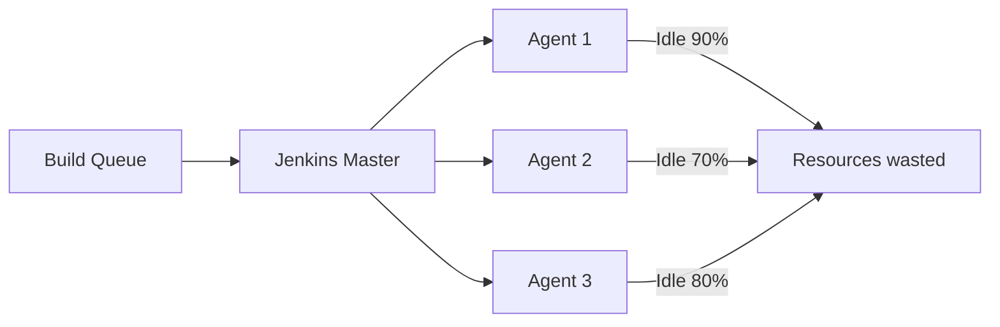
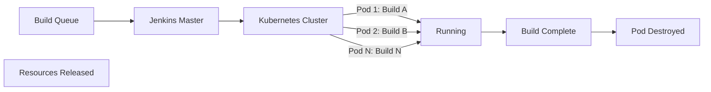

# Jenkins 与 Kubernetes 集成

import { Badge } from '@rspress/core/theme';

<Badge text=" PRINCIPLE 原理类" type="warning" />

传统 Jenkins 的 Agent 是长期运行的虚拟机或物理机。无论有没有构建任务，这些机器都在运行，都要付钱。更糟糕的是，当构建高峰来临时，队列堆积；当低谷来临时，资源闲置。

Kubernetes 改变了这个局面。在 Kubernetes 模式下，Jenkins Agent 变成了 Pod——有构建任务时，Kubernetes 动态创建 Pod；构建完成后，Pod 被销毁。每一次构建都是全新的环境，没有污染，没有残留。

这就是**弹性构建**的魅力：按需分配资源，用完即释放。

## 架构原理

### 传统模式 vs Kubernetes 模式

**传统模式**：



**Kubernetes 模式**：



### 核心组件

| 组件 | 说明 |
|---|---|
| Kubernetes Plugin | Jenkins 与 Kubernetes 通信的桥梁 |
| Kubernetes API Server | 接收 Jenkins 的 Pod 创建请求 |
| Jenkins Agent Base Image | Pod 中运行的 Jenkins Agent 镜像 |
| Docker-in-Docker (DinD) | 在 Pod 中运行 Docker 的能力 |

---

## 环境准备

### 前提条件

- 运行中的 Kubernetes 集群（1.19+）
- kubectl 已配置且有权限创建 Pod
- Jenkins 2.462+ 或更新版本
- Jenkins Kubernetes Plugin 已安装

### ServiceAccount 配置

```yaml
# jenkins-rbac.yaml
apiVersion: v1
kind: ServiceAccount
metadata:
  name: jenkins
  namespace: jenkins
---
apiVersion: rbac.authorization.k8s.io/v1
kind: Role
metadata:
  name: jenkins
  namespace: jenkins
rules:
  - apiGroups: [""]
    resources: ["pods", "pods/log", "pods/exec", "services"]
    verbs: ["*"]
  - apiGroups: [""]
    resources: ["persistentvolumeclaims"]
    verbs: ["*"]
  - apiGroups: ["apps"]
    resources: ["deployments", "replicasets"]
    verbs: ["get", "list", "watch"]
  - apiGroups: [""]
    resources: ["configmaps"]
    verbs: ["*"]
  - apiGroups: ["networking.k8s.io"]
    resources: ["ingresses"]
    verbs: ["*"]
---
apiVersion: rbac.authorization.k8s.io/v1
kind: RoleBinding
metadata:
  name: jenkins
  namespace: jenkins
subjects:
  - kind: ServiceAccount
    name: jenkins
    namespace: jenkins
roleRef:
  kind: Role
  name: jenkins
  apiGroup: rbac.authorization.k8s.io
```

### 应用配置

```bash
kubectl apply -f jenkins-rbac.yaml

# 验证
kubectl get sa jenkins -n jenkins
kubectl get role jenkins -n jenkins
kubectl get rolebinding jenkins -n jenkins
```

---

## Jenkins 配置

### 配置云（Cloud）

1. **Manage Jenkins → Manage Nodes and Clouds → Configure Clouds → Add a new cloud → Kubernetes**

2. **Kubernetes 配置**：

| 配置项 | 说明 | 示例值 |
|---|---|---|
| Kubernetes URL | Kubernetes API Server 地址 | `https://kubernetes.default.svc` |
| Kubernetes Namespace | Agent Pod 运行的命名空间 | `jenkins-agents` |
| Credentials | Kubernetes ServiceAccount Token | 选择对应的凭证 |
| Jenkins URL | Jenkins Master 地址 | `http://jenkins:8080` |
| Jenkins Tunnel | Agent 连接到 Master 的地址 | `jenkins:50000` |

### 容器模板配置

```yaml
# Jenkins Kubernetes 配置中的 Container Template

# Maven 构建模板
- name: maven
  image: maven:3.9-eclipse-temurin-17
  label: maven-jdk17
  command: ""
  args: ""
  ttyEnabled: true
  resourceRequestCpu: "500m"
  resourceRequestMemory: "1Gi"
  resourceLimitCpu: "1000m"
  resourceLimitMemory: "2Gi"

# Node.js 构建模板
- name: node
  image: node:20-alpine
  label: nodejs
  command: ""
  args: ""
  ttyEnabled: true
  resourceRequestCpu: "300m"
  resourceRequestMemory: "512Mi"

# Docker 构建模板
- name: docker
  image: docker:24-dind
  label: docker
  command: ""
  args: ""
  ttyEnabled: true
  privileged: true
  resourceLimitCpu: "1000m"
  resourceLimitMemory: "1Gi"
```

---

## 完整流水线示例

### Maven + Docker 构建

```groovy
pipeline {
    agent {
        kubernetes {
            label 'jenkins-agent'
            defaultContainer 'jnlp'
            yaml '''
apiVersion: v1
kind: Pod
metadata:
  name: jenkins-agent
spec:
  serviceAccountName: jenkins
  containers:
    - name: jnlp
      image: jenkins/inbound-agent:latest-jdk17
      imagePullPolicy: IfNotPresent
      resources:
        requests:
          cpu: "100m"
          memory: "256Mi"
        limits:
          cpu: "500m"
          memory: "512Mi"
      ttyEnabled: true
      volumeMounts:
        - name: workspace
          mountPath: /home/jenkins/agent
    - name: maven
      image: maven:3.9-eclipse-temurin-17
      command: ["sleep"]
      args: ["infinity"]
      ttyEnabled: true
      volumeMounts:
        - name: maven-cache
          mountPath: /root/.m2
        - name: workspace
          mountPath: /home/jenkins/agent
    - name: docker
      image: docker:24-dind
      securityContext:
        privileged: true
      env:
        - name: DOCKER_TLS_CERTDIR
          value: ""
      volumeMounts:
        - name: docker-socket
          mountPath: /var/run/docker.sock
        - name: workspace
          mountPath: /home/jenkins/agent
  volumes:
    - name: workspace
      emptyDir: {}
    - name: maven-cache
      persistentVolumeClaim:
        claimName: maven-cache-pvc
    - name: docker-socket
      hostPath:
        path: /var/run/docker.sock
'''
        }
    }
    
    environment {
        APP_NAME = 'spring-boot-app'
        REGISTRY = 'registry.example.com'
        DOCKER_CREDS = credentials('docker-hub')
    }
    
    stages {
        stage('Checkout') {
            steps {
                checkout scm
            }
        }
        
        stage('Build') {
            steps {
                container('maven') {
                    sh '''
                        mvn clean package -DskipTests
                        ls -la target/
                    '''
                }
            }
        }
        
        stage('Test') {
            steps {
                container('maven') {
                    sh 'mvn test'
                }
            }
            post {
                always {
                    junit 'target/surefire-reports/*.xml'
                }
            }
        }
        
        stage('Docker Build & Push') {
            steps {
                container('docker') {
                    sh '''
                        # 登录 Docker Registry
                        docker login -u ${DOCKER_CREDS_USR} -p ${DOCKER_CREDS_PSW} ${REGISTRY}
                        
                        # 构建镜像
                        docker build -t ${APP_NAME}:${BUILD_NUMBER} .
                        docker tag ${APP_NAME}:${BUILD_NUMBER} ${REGISTRY}/${APP_NAME}:${BUILD_NUMBER}
                        docker tag ${APP_NAME}:${BUILD_NUMBER} ${REGISTRY}/${APP_NAME}:latest
                        
                        # 推送镜像
                        docker push ${REGISTRY}/${APP_NAME}:${BUILD_NUMBER}
                        docker push ${REGISTRY}/${APP_NAME}:latest
                        
                        # 清理
                        docker rmi ${APP_NAME}:${BUILD_NUMBER}
                    '''
                }
            }
        }
        
        stage('Deploy') {
            when {
                branch 'main'
            }
            steps {
                container('docker') {
                    sh '''
                        # 使用 Helm 部署
                        helm upgrade --install ${APP_NAME} ./charts/${APP_NAME} \
                            --set image.tag=${BUILD_NUMBER} \
                            --namespace production \
                            --create-namespace
                    '''
                }
            }
        }
    }
    
    post {
        always {
            echo 'Cleaning up workspace'
            deleteDir()
        }
        success {
            echo 'Pipeline completed successfully!'
        }
        failure {
            echo 'Pipeline failed!'
        }
    }
}
```

---

## Docker-in-Docker (DinD) 方案

### 为什么需要 DinD？

在 Kubernetes Pod 中构建 Docker 镜像，需要 Pod 内部有 Docker 守护进程。有两种方案：

| 方案 | 优点 | 缺点 |
|---|---|---|
| DinD（Docker-in-Docker） | 完整 Docker 功能 | 需要特权模式 |
| Kaniko | 无需特权，安全 | 不支持 Docker daemon 特性 |

### DinD 配置

```yaml
# DinD 容器配置
- name: docker
  image: docker:24-dind
  securityContext:
    privileged: true   # 必须开启特权模式
  env:
    - name: DOCKER_TLS_CERTDIR
      value: ""          # 禁用 TLS，简化配置
  resources:
    requests:
      cpu: "500m"
      memory: "512Mi"
    limits:
      cpu: "1000m"
      memory: "1Gi"
  volumeMounts:
    - name: docker-graph-storage
      mountPath: /var/lib/docker
```

### Kaniko 替代方案

```groovy
pipeline {
    agent {
        kubernetes {
            label 'jenkins-agent'
            defaultContainer 'kaniko'
            yaml '''
apiVersion: v1
kind: Pod
spec:
  serviceAccountName: jenkins
  containers:
    - name: jnlp
      image: jenkins/inbound-agent:latest-jdk17
    - name: kaniko
      image: gcr.io/kaniko-project/executor:v1.18.0
      command: /kaniko/executor
      args:
        - --context=git://github.com/example/project.git
        - --destination=${REGISTRY}/${APP_NAME}:${BUILD_NUMBER}
      env:
        - name: DOCKER_CONFIG
          value: /kaniko/.docker
'''
        }
    }
    
    stages {
        stage('Build with Kaniko') {
            steps {
                container('kaniko') {
                    sh '/kaniko/executor'
                }
            }
        }
    }
}
```

---

## Pod 模板复用

### Library 模式

```groovy
// vars/mavenPodTemplate.groovy
def call(Map config = [:]) {
    def label = config.label ?: 'maven'
    def mavenVersion = config.mavenVersion ?: '3.9'
    def jdkVersion = config.jdkVersion ?: '17'
    
    return """
apiVersion: v1
kind: Pod
metadata:
  name: ${label}
spec:
  containers:
    - name: jnlp
      image: jenkins/inbound-agent:latest-jdk${jdkVersion}
    - name: maven
      image: maven:${mavenVersion}-eclipse-temurin-${jdkVersion}
      command: ["sleep"]
      args: ["infinity"]
      ttyEnabled: true
"""
}
```

```groovy
// Jenkinsfile 中使用
@Library('shared-libraries') _

pipeline {
    agent {
        kubernetes {
            label 'build-agent'
            defaultContainer 'jnlp'
            yaml mavenPodTemplate(mavenVersion: '3.9', jdkVersion: '17')
        }
    }
    
    stages {
        stage('Build') {
            steps {
                container('maven') {
                    sh 'mvn clean package'
                }
            }
        }
    }
}
```

---

## 资源调优

### 动态资源配置

```yaml
# 根据构建类型调整资源配置
# Build 类型
- name: maven
  image: maven:3.9-eclipse-temurin-17
  resourceRequestCpu: "1000m"
  resourceRequestMemory: "2Gi"
  resourceLimitCpu: "2000m"
  resourceLimitMemory: "4Gi"

# Test 类型
- name: test
  image: maven:3.9-eclipse-temurin-17
  resourceRequestCpu: "500m"
  resourceLimitCpu: "1000m"
```

### 存储优化

```yaml
# 使用 PVC 缓存 Maven 依赖
volumes:
  - name: maven-cache
    persistentVolumeClaim:
      claimName: maven-cache-${AGENT_NAME}
---
apiVersion: v1
kind: PersistentVolumeClaim
metadata:
  name: maven-cache-shared
spec:
  accessModes:
    - ReadWriteMany
  resources:
    requests:
      storage: 50Gi
```

---

## 最佳实践

### 1. 使用专用镜像

```dockerfile
# jenkins-agent/Dockerfile
FROM eclipse-temurin:17-jdk

# 安装构建工具
RUN apt-get update && apt-get install -y \
    maven \
    gradle \
    kubectl \
    helm \
    docker.io \
    && rm -rf /var/lib/apt/lists/*

# 安装 Node.js（可选）
RUN curl -fsSL https://deb.nodesource.com/setup_20.x | bash - \
    && apt-get install -y nodejs \
    && rm -rf /var/lib/apt/lists/*

# 清理
RUN apt-get autoremove -y && rm -rf /var/cache/apt/archives/*
```

### 2. 及时清理镜像

```groovy
post {
    always {
        // 清理 Docker 镜像
        container('docker') {
            sh '''
                docker system prune -af || true
                docker volume prune -f || true
            '''
        }
        
        // 清理工作目录
        deleteDir()
    }
}
```

### 3. 设置合理的超时

```groovy
options {
    timeout(time: 30, unit: 'MINUTES')
}
```

### 4. 监控资源使用

```bash
# 查看 Jenkins Agent Pod 资源使用
kubectl top pods -n jenkins-agents

# 查看历史资源使用
kubectl describe pods -n jenkins-agents | grep -A5 "Limits\|Requests"
```

> [!TIP]
> Kubernetes 集成让 Jenkins 真正成为弹性云原生 CI/CD 平台。建议结合 Prometheus + Grafana 监控集群资源，制定合理的资源配额和限制。
