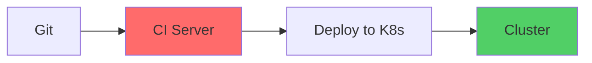
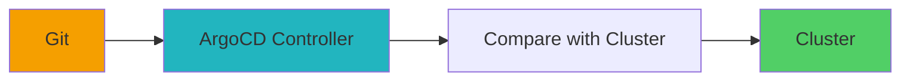
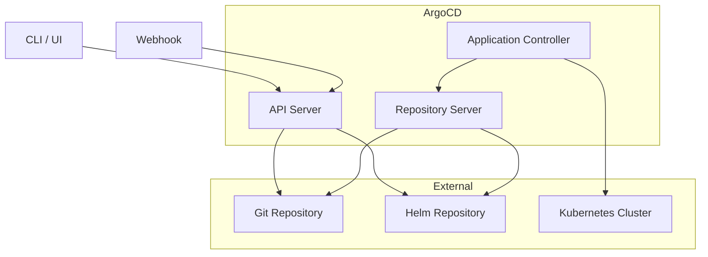

# ArgoCD 持续部署

import { Badge } from '@rspress/core/theme';

<Badge text=" PRINCIPLE 原理类" type="warning" />

传统的 CI/CD 流程是 Push 模式：代码合并后，CI 流水线「推动」应用部署到集群。这种模式有几个问题：CI 服务器需要对集群有写入权限、部署状态对开发团队不透明、难以保证集群实际状态与期望状态一致。

GitOps 带来了新的思路：**应用声明文件（如 Kubernetes manifests）存储在 Git 仓库中，一个独立的控制器持续监控 Git 和集群，当发现不一致时，自动同步或告警**。这就是 ArgoCD 的核心理念。

## GitOps 理念

GitOps 由 Weaveworks 在 2017 年提出，核心原则是：

> **Git 是系统基础设施和应用的唯一真相来源。**

### Push vs Pull 模式

**Push 模式（传统 CI/CD）**：



**Pull 模式（GitOps）**：



### GitOps 的优势

| 优势 | 说明 |
|---|---|
| 安全性 | CI 服务器不需要集群写入权限 |
| 可追溯性 | 所有变更通过 Git history 追踪 |
| 一致性 | 集群状态始终与 Git 声明一致 |
| 审计性 | 谁在什么时候改了什么，一目了然 |
| 自愈能力 | 手动修改会被自动覆盖 |

---

## ArgoCD 架构

### 核心组件



| 组件 | 职责 |
|---|---|
| API Server | 提供 gRPC/REST API，处理 UI、CLI 请求 |
| Application Controller | 监控集群状态与 Git 声明，执行同步 |
| Repository Server | 维护 Git 仓库本地缓存，生成 Kubernetes manifests |

### 核心 CRD

ArgoCD 定义了两个核心 CRD：

**Application**：定义一个需要部署的应用。

**AppProject**：定义应用分组、资源限制、目标集群等。

---

## 安装 ArgoCD

### 方式一：kubectl 安装

```bash
# 创建命名空间
kubectl create namespace argocd

# 安装 ArgoCD
kubectl apply -n argocd -f https://raw.githubusercontent.com/argoproj/argo-cd/stable/manifests/install.yaml

# 安装 HA 版本（生产环境推荐）
kubectl apply -n argocd -f https://raw.githubusercontent.com/argoproj/argo-cd/stable/manifests/ha/install.yaml
```

### 方式二：Helm 安装

```bash
helm repo add argo https://argoproj.github.io/argo-helm
helm repo update

helm install argocd argo/argo-cd \
  --namespace argocd \
  --create-namespace \
  --set server Ingress.enabled=true \
  --set server.Ingress.hostname=argocd.example.com
```

### 访问 ArgoCD UI

```bash
# 获取初始密码
kubectl -n argocd get secret argocd-initial-admin-secret \
  -o jsonpath="{.data.password}" | base64 -d

# 端口转发（开发环境）
kubectl port-forward svc/argocd-server -n argocd 8080:443

# 登录
argocd login localhost:8080 --username admin --password <password>
```

---

## Application 定义

### 基本 Application

```yaml
# guestbook-app.yaml
apiVersion: argoproj.io/v1alpha1
kind: Application
metadata:
  name: guestbook
  namespace: argocd
spec:
  project: default
  
  source:
    repoURL: https://github.com/argoproj/argocd-example-apps.git
    targetRevision: HEAD
    path: guestbook
    kustomize:
      images:
        - gcr.io/heptio-images/ks-guestbook-demo:0.2
  
  destination:
    server: https://kubernetes.default.svc
    namespace: guestbook
  
  syncPolicy:
    automated:
      prune: true      # 自动删除不在 Git 中的资源
      selfHeal: true   # 自动同步回 Git 声明的状态
```

### 使用 Helm

```yaml
# helm-app.yaml
apiVersion: argoproj.io/v1alpha1
kind: Application
metadata:
  name: my-app
  namespace: argocd
spec:
  project: default
  
  source:
    repoURL: https://github.com/example/helm-charts.git
    chart: my-app
    targetRevision: 1.0.0
    helm:
      valueFiles:
        - values-prod.yaml
      values: |
        replicaCount: 3
        image:
          tag: "v1.2.3"
  
  destination:
    server: https://kubernetes.default.svc
    namespace: production
  
  syncPolicy:
    automated:
      prune: true
      selfHeal: true
```

### 多源 Application

```yaml
apiVersion: argoproj.io/v1alpha1
kind: Application
metadata:
  name: multi-source-app
  namespace: argocd
spec:
  project: default
  
  sources:
    - repoURL: https://github.com/example/frontend.git
      path: k8s
      targetRevision: HEAD
    
    - repoURL: https://github.com/example/config.git
      path: config
      targetRevision: HEAD
    
    - repoURL: https://github.com/example/secrets.git
      path: secrets
      targetRevision: HEAD
      ref: secrets
  
  destination:
    server: https://kubernetes.default.svc
    namespace: production
  
  syncPolicy:
    automated: {}
```

---

## Sync 策略

### Sync 选项

```yaml
spec:
  syncPolicy:
    automated:
      prune: true        # 自动删除不在 Git 中的资源
      selfHeal: true     # 手动修改会被自动覆盖
      allowEmpty: false   # 允许空资源（镜像不存在时）
    
    syncOptions:
      - CreateNamespace=true    # 自动创建命名空间
      - PrunePropagationPolicy=foreground  # 级联删除策略
      - RespectIgnoreDifferences=true  # 尊重服务器端差异
```

### Sync 阶段

```yaml
spec:
  syncPolicy:
    syncOptions:
      - Prepare=true
    retry:
      limit: 5
      backoff:
        duration: 5s
        factor: 2
        maxDuration: 3m
```

### Rollback

```bash
# 查看历史
argocd app history guestbook

# 回滚到指定版本
argocd app rollback guestbook <revision>

# 在 UI 中操作
# Application → History → 点击版本 → ROLLBACK
```

---

## AppProject

### 基本 Project

```yaml
apiVersion: argoproj.io/v1alpha1
kind: AppProject
metadata:
  name: my-project
  namespace: argocd
spec:
  description: My Project Description
  
  # 允许的源仓库
  sourceRepos:
    - https://github.com/example/*
    - https://gitlab.com/example/*
    - git@github.com:example/*.git
  
  # 允许的目标集群
  destinations:
    - server: https://kubernetes.default.svc
      namespace: production
    - server: https://kubernetes.other.com
      namespace: staging
    - name: in-cluster
      namespace: '*'
  
  # 允许创建的命名空间
  namespaceResourceBlacklist:
    - group: ''
      kind: ResourceQuota
    - group: ''
      kind: LimitRange
  
  # 禁止的操作
  clusterResourceWhitelist:
    - group: '*'
      kind: '*'
  
  # 角色
  roles:
    - name: ci-robot
      description: CI Robot
      policies:
        - p, proj:my-project:ci-robot, applications, *, my-project/*, allow
        - p, proj:my-project:ci-robot, applications, sync, my-project/*, allow
```

---

## 最佳实践

### 1. 分环境管理

```yaml
# production-app.yaml
spec:
  source:
    path: apps/my-app/overlays/production
  destination:
    namespace: production

# staging-app.yaml
spec:
  source:
    path: apps/my-app/overlays/staging
  destination:
    namespace: staging
```

### 2. 使用 ApplicationSet 批量创建

```yaml
apiVersion: argoproj.io/v1alpha1
kind: ApplicationSet
metadata:
  name: my-app-set
  namespace: argocd
spec:
  generators:
    - matrix:
        generators:
          - git:
              repoURL: https://github.com/example/clusters.git
              revision: HEAD
              directories:
                - path: clusters/*
          - clusters:
              selector:
                matchLabels:
                  environment: production
  
  template:
    metadata:
      name: '{{path.basename}}-my-app'
    spec:
      project: production
      source:
        repoURL: https://github.com/example/app.git
        path: manifests
        targetRevision: main
        helm:
          valueFiles:
            - values-{{name}}.yaml
      destination:
        server: '{{server}}'
        namespace: '{{path.basename}}'
```

### 3. 集成通知

```yaml
apiVersion: argoproj.io/v1alpha1
kind: Application
metadata:
  name: my-app
spec:
  ignoreDifferences:
    - group: apps
      kind: Deployment
      jsonPointers:
        - /spec/replicas  # 忽略副本数差异（由 HPA 管理）
```

### 4. 渐进式交付

```yaml
# 与 Argo Rollouts 集成
apiVersion: argoproj.io/v1alpha1
kind: Rollout
metadata:
  name: my-app
spec:
  strategy:
    canary:
      steps:
        - setWeight: 5
        - pause: {}
        - setWeight: 20
        - pause: {duration: 10m}
        - setWeight: 50
        - pause: {}
      canaryMetadata:
        labels:
          role: canary
      stableMetadata:
        labels:
          role: stable
      trafficRouting:
        nginx:
          stableIngress: stable
          additionalIngressAnnotations:
            canary-by-header: X-Canary
```

---

## 与 CI 集成

### Webhook 配置

```bash
# ArgoCD Webhook
argocd repo add https://github.com/example/repo.git --username <user> --password <token>

# GitHub Webhook（自动配置）
argocd repo add https://github.com/example/repo.git \
  --github-app-id <id> \
  --github-app-installation-id <installation-id> \
  --kubernetes-secret <secret-name>
```

### CI 触发 Sync

```bash
# CI 完成后触发 Sync
curl -X POST https://argocd.example.com/api/v1/applications/my-app/sync \
  -H "Authorization: Bearer $ARGOCD_TOKEN" \
  -H "Content-Type: application/json" \
  -d '{"prune": false, "dryRun": false}'
```

> [!TIP]
> ArgoCD 是 GitOps 落地的最佳工具之一。建议配合 Argo Rollouts 使用，实现真正的渐进式交付。
