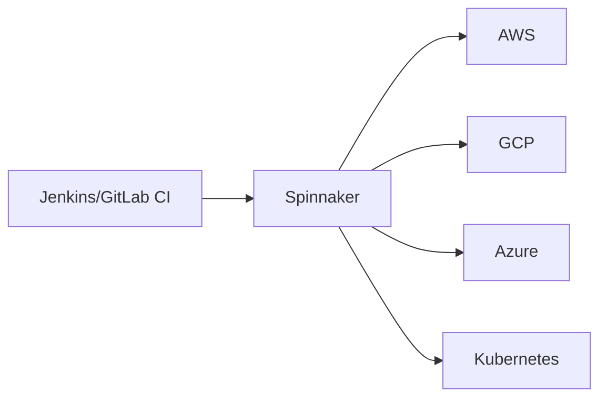
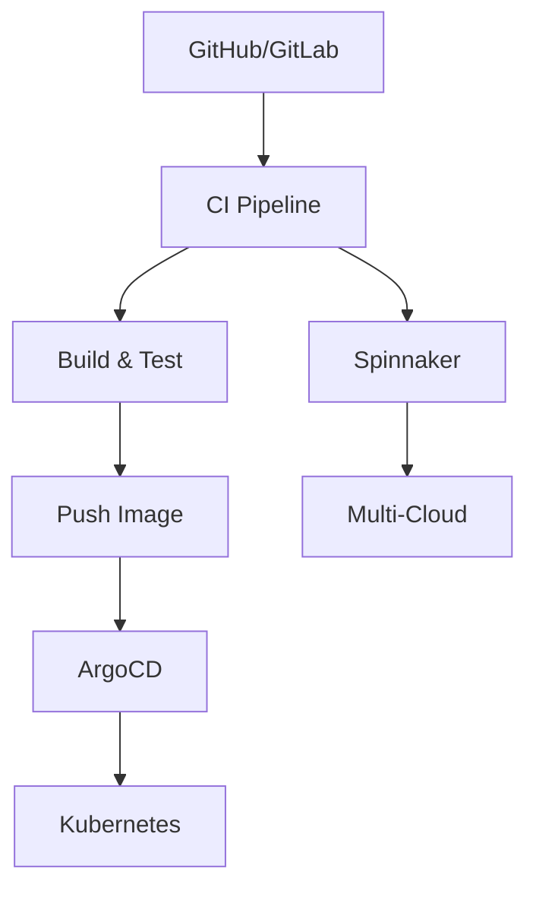

# CI/CD 工具对比

import { Badge } from '@rspress/core/theme';

<Badge text=" PRINCIPLE 原理类" type="warning" />

没有银弹。选择 CI/CD 工具就像选择技术栈一样，没有绝对的对错，只有适不适合。Jenkins 历史悠久、插件丰富，但配置复杂；GitHub Actions 简单易用，但局限于 GitHub 生态；ArgoCD 完美适配 GitOps，但在 Kubernetes 之外的场景力不从心。

这一章，我们从多个维度对比主流 CI/CD 工具，帮助你做出最适合团队的选择。

## 功能对比表

| 特性 | Jenkins | GitLab CI | GitHub Actions | ArgoCD | Tekton | Spinnaker |
|---|---|---|---|---|---|---|
| **部署模型** | Push | Push | Push | Pull | Push | Push |
| **Kubernetes 原生** | 需插件 | 需配置 | 需配置 | ✅ 原生 | ✅ 原生 | ✅ 原生 |
| **配置格式** | Groovy | YAML | YAML | YAML | YAML | JSON |
| **多云支持** | 需插件 | 一般 | 一般 | 一般 | 一般 | ✅ 优秀 |
| **可视化 UI** | 经典+Blue Ocean | ✅ 优秀 | 一般 | ✅ 优秀 | 需安装 | ✅ 优秀 |
| **部署策略** | 基础 | 基础 | 基础 | 需配合 | 基础 | ✅ 丰富 |
| **GitOps 支持** | 需插件 | 一般 | 基础 | ✅ 优秀 | 一般 | 一般 |
| **学习曲线** | 陡峭 | 平缓 | 平缓 | 平缓 | 较陡 | 陡峭 |
| **插件生态** | ✅ 丰富 | 良好 | ✅ 丰富 | 发展中 | 发展中 | 一般 |
| **托管服务** | 自托管 | 自托管/托管 | ✅ SaaS | 自托管 | 自托管 | 自托管 |

---

## 详细对比

### Jenkins vs GitHub Actions

**选择 Jenkins 如果**：

- 你的团队已经在使用 Jenkins，有现成的基础设施
- 需要高度定制化的流水线逻辑（Groovy 的灵活性）
- 需要连接内部系统（如 LDAP、Kerberos）
- 团队有专门的 DevOps 工程师维护

**选择 GitHub Actions 如果**：

- 你的代码在 GitHub 上
- 追求快速上手，不想维护 CI 服务器
- 开源项目（免费分钟数充足）
- 需要频繁使用 Actions 市场的现成 Action

**对比**：

| 维度 | Jenkins | GitHub Actions |
|---|---|---|
| 启动速度 | 需要服务器启动 | 秒级启动托管 Runner |
| 维护成本 | 需要维护 Master/Agent | 无服务器维护 |
| 插件可靠性 | 良莠不齐 | 经过 GitHub 审核 |
| 配置同步 | 分散在各 Job | Jenkinsfile 随代码版本化 |
| 自定义程度 | 几乎无限 | 受 Action 限制 |

### GitLab CI vs GitHub Actions

**共同点**：

- 都是 YAML 驱动
- 都支持矩阵构建
- 都集成在代码托管平台

**GitLab CI 优势**：

- 与 GitLab 集成更深（Container Registry、Dependency Scanning）
- Pipeline Editor 可视化程度更高
- 支持 DAG 流水线（`needs` 关键字）
- Application 自动部署功能

**GitHub Actions 优势**：

- Actions 市场更丰富
- 社区更活跃
- 对开源项目更友好（免费额度更多）

### ArgoCD vs Jenkins/GitLab CI

**核心区别**：部署模型

| 模型 | 说明 | 适用场景 |
|---|---|---|
| Push | CI 流水线触发部署 | 传统架构、单一环境 |
| Pull | 控制器持续监控 Git | Kubernetes、GitOps |

**选择 ArgoCD 如果**：

- 你是纯 Kubernetes 环境
- 你想实践 GitOps
- 你需要应用状态的自我修复能力
- 你需要开发团队自助部署

**选择 CI 工具 + ArgoCD 如果**：

- 你已经有成熟的 CI 流水线
- 你只想用 ArgoCD 管理部署阶段

### Tekton vs Jenkins Pipeline

**共同点**：

- 都是 Pipeline as Code
- 都支持 Kubernetes 扩展

**Tekton 优势**：

- 原生 Kubernetes CRD，流水线本身可 GitOps 管理
- 更好的可移植性（Kubernetes 集群间迁移）
- 与 ArgoCD、Knative 无缝集成
- 原子化 Task，便于复用

**Jenkins 优势**：

- 社区更成熟
- 插件生态更丰富
- 文档更完善

### Spinnaker vs 其他工具

**Spinnaker 的独特价值**：

- 多云统一管理（AWS、GCP、Azure、K8s）
- 内置金丝雀分析和自动化回滚
- 成熟的红/黑部署策略
- Enterprise 支持（Armory）

**选择 Spinnaker 如果**：

- 你需要多云部署
- 你需要复杂的部署策略
- 你的团队有专职 SRE

---

## 场景选型指南

### 场景一：小型团队，开源项目

**推荐**：GitHub Actions

**理由**：

- 免费（开源项目 2000 分钟/月）
- 5 分钟内完成第一个 Pipeline
- Actions 市场满足大部分需求

**典型配置**：

```yaml
name: CI
on: [push, pull_request]
jobs:
  build:
    runs-on: ubuntu-latest
    steps:
      - uses: actions/checkout@v4
      - uses: actions/setup-node@v4
        with:
          node-version: '20'
      - run: npm ci
      - run: npm test
```

### 场景二：中型团队，GitLab 全家桶

**推荐**：GitLab CI

**理由**：

- 一站式平台（代码、CI、安全扫描）
- 内置容器镜像仓库
- CI/CD 与 Issue、MR 无缝集成

**典型配置**：

```yaml
stages:
  - build
  - test
  - deploy

build:
  stage: build
  image: maven:3.9
  script: mvn clean package

test:
  stage: test
  image: maven:3.9
  script: mvn test

deploy:
  stage: deploy
  script:
    - kubectl apply -f k8s/
  only:
    - main
```

### 场景三：Kubernetes 团队，GitOps

**推荐**：ArgoCD + CI 工具（GitHub Actions/GitLab CI）

**理由**：

- ArgoCD 负责部署阶段的声明式管理
- CI 工具负责构建、测试、推送镜像
- Git 是唯一的真相来源

**架构**：

```
Git Repository
    │
    ├── CI Pipeline (GitHub Actions/GitLab CI)
    │   ├── Build
    │   ├── Test
    │   └── Push Image
    │
    └── GitOps Repo
        ├── k8s/deployment.yaml (引用新镜像)
        └── ArgoCD 自动同步
```

### 场景四：企业级，多云部署

**推荐**：Spinnaker 或 Tekton + ArgoCD

**理由**：

- Spinnaker 天生多云
- 支持复杂的部署策略
- 企业级支持（Armory）

**架构**：



### 场景五：微服务，Knative 生态

**推荐**：Tekton + ArgoCD

**理由**：

- Tekton 与 Knative Build 兼容
- 都是 Kubernetes 原生
- 便于构建可移植的 CI/CD 组件

---

## 迁移指南

### 从 Jenkins 迁移

| 步骤 | 说明 |
|---|---|
| 1. 分析 Jenkinsfile | 提取所有 Job 的流水线逻辑 |
| 2. 分类任务 | 构建、测试、部署分开 |
| 3. 选择目标工具 | 根据上文选型指南选择 |
| 4. 并行运行 | 新旧系统并行，验证结果一致 |
| 5. 逐步迁移 | 先迁移简单的 Job，再迁移复杂的 |

### 从 GitLab CI 迁移到 GitHub Actions

```yaml
# GitLab CI
build:
  stage: build
  image: maven:3.9
  script: mvn package

# GitHub Actions
jobs:
  build:
    runs-on: ubuntu-latest
    container: maven:3.9
    steps:
      - uses: actions/checkout@v4
      - run: mvn package
```

### 从 CI-only 迁移到 GitOps

```yaml
# 之前：CI Pipeline 负责部署
kubectl apply -f k8s/deployment.yaml

# 之后：更新 Git 声明，ArgoCD 负责部署
# 1. CI Pipeline 更新镜像版本
sed -i 's|image: .*|image: my-app:${IMAGE_TAG}|' k8s/deployment.yaml
git add k8s/deployment.yaml
git commit -m "Update image to ${IMAGE_TAG}"
git push
# 2. ArgoCD 检测变更并部署
```

---

## 混合架构

现代 CI/CD 往往不是单一工具，而是多种工具的组合：



**推荐组合**：

| CI 构建 | CD 部署 | 适用场景 |
|---|---|---|
| GitHub Actions | ArgoCD | 纯 K8s，GitHub 托管 |
| GitLab CI | ArgoCD | GitLab 全家桶 |
| Jenkins | Spinnaker | 企业多云 |
| Tekton | ArgoCD | 云原生可移植 |

> [!TIP]
> 选择工具时，团队的技术栈和学习能力比工具本身的功能更重要。一个团队能驾驭的工具，才是最好的工具。
