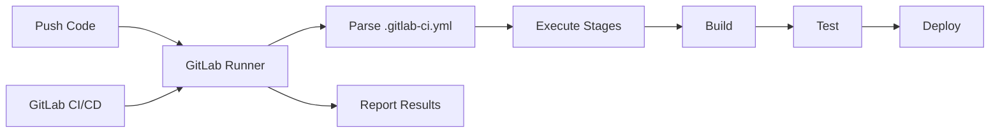

# GitLab CI/CD

import { Badge } from '@rspress/core/theme';

<Badge text=" PRINCIPLE 原理类" type="warning" />

GitLab CI/CD 是 GitLab 内置的持续集成和持续部署功能。与 Jenkins 需要单独安装不同，GitLab CI 只需要在仓库根目录放置一个 `.gitlab-ci.yml` 文件，就能自动触发流水线。

这就是 GitLab 的哲学：**一切都应该在同一个平台**。代码仓库、问题跟踪、Code Review、CI/CD、安全扫描、部署——在 GitLab，你不需要集成第三方工具，一切开箱即用。

## 工作原理

### 核心流程



### GitLab Runner

Runner 是实际执行 CI/CD 任务的组件。它是一个与 GitLab 实例通信的独立进程，可以部署在本地、虚拟机或 Kubernetes 集群中。

**Runner 类型**：

| 类型 | 说明 | 适用场景 |
|---|---|---|
| Shared Runner | 所有项目共享 | 通用构建任务 |
| Group Runner | 组内项目共享 | 同一团队的项目 |
| Specific Runner | 绑定到特定项目 | 特殊环境需求 |

**Runner 安装**：

```bash
# 1. 下载 GitLab Runner
curl -L https://packages.gitlab.com/install/repositories/runner/gitlab-runner/script.deb.sh | sudo bash

# 2. 注册 Runner
sudo gitlab-runner register

# 输入 GitLab 实例地址
# 输入 token（在 Settings → CI/CD → Runners 获取）
# 输入 Runner 描述
# 选择标签（可选）
# 选择执行器（docker / shell / kubernetes）

# 3. 启动 Runner
sudo gitlab-runner start
```

---

## .gitlab-ci.yml 详解

### 基本结构

```yaml
stages:
  - build
  - test
  - deploy

variables:
  APP_NAME: "my-app"
  DOCKER_IMAGE: "registry.example.com/${APP_NAME}"

build:
  stage: build
  script:
    - echo "Building ${APP_NAME}..."
    - mvn clean package
  artifacts:
    paths:
      - target/*.jar
    expire_in: 1 hour

test:
  stage: test
  script:
    - echo "Running tests..."
    - mvn test
  coverage: '/Total.*?([0-9]{1,3})%/'

deploy:
  stage: deploy
  script:
    - echo "Deploying..."
  only:
    - main
  environment:
    name: production
```

### stages

`stages` 定义流水线的阶段，阶段按顺序执行，同一阶段的所有任务并行执行。

```yaml
stages:
  - build      # 第一阶段：所有 build 任务并行
  - test       # 第二阶段：所有 test 任务并行
  - deploy     # 第三阶段：所有 deploy 任务并行
```

### jobs

每个 job 代表一个独立的任务。

```yaml
job_name:
  stage: test              # 属于哪个阶段
  script:                  # 执行什么命令
    - command1
    - command2
  image: maven:3.9          # 使用 Docker 镜像
  tags:                    # 在哪些 Runner 上执行
    - docker
  only:                    # 触发条件
    - main
  except:                  # 排除条件
    - develop
  rules:                   # 高级触发规则（GitLab 12.9+）
    - if: '$CI_COMMIT_BRANCH == "main"'
  when: on_failure         # 何时执行：on_success / on_failure / always / manual
  allow_failure: false     # 是否允许失败
  timeout: 10 minutes      # 超时时间
  retry:                   # 重试配置
    max: 2
    when:
      - runner_system_failure
      - stuck_or_timeout_failure
```

---

## 常用关键字

### script 与 before_script

```yaml
build:
  image: node:20-alpine
  before_script:
    - npm install --legacy-peer-deps
  script:
    - npm run build
```

### dependencies 与 needs

```yaml
build:
  stage: build
  script:
    - mvn clean package
  artifacts:
    paths:
      - target/app.jar

test:integration:
  stage: test
  dependencies:
    - build          # 依赖 build 阶段的 artifacts
  script:
    - mvn integration-test
```

### needs 与 DAG 流水线

```yaml
stages:
  - build
  - test
  - deploy

build:a:
  stage: build
  script: echo "A"

build:b:
  stage: build
  script: echo "B"

test:ab:
  stage: test
  needs:
    - build:a
    - build:b
  script: echo "AB"

deploy:
  stage: deploy
  needs:
    - test:ab
  script: echo "Deploy"
```

### cache

```yaml
build:
  stage: build
  cache:
    key: ${CI_COMMIT_REF_SLUG}
    paths:
      - .m2/repository
      - node_modules
  script:
    - mvn clean package
```

### artifacts

```yaml
build:
  stage: build
  script:
    - mvn clean package
  artifacts:
    name: "${CI_COMMIT_REF_SLUG}-artifacts"
    paths:
      - target/*.jar
      - build/
    expire_in: 7 days
    reports:
      junit: target/surefire-reports/*.xml
      coverage_report:
        coverage_format: cobertura
        path: target/cobertura/coverage.xml
```

### environment

```yaml
deploy:staging:
  stage: deploy
  script:
    - kubectl apply -f k8s/staging/
  environment:
    name: staging
    url: https://staging.example.com
    on_stop: stop:staging

deploy:production:
  stage: deploy
  script:
    - kubectl apply -f k8s/production/
  environment:
    name: production
    url: https://example.com
  only:
    - main
  when: manual          # 手动触发
```

---

## rules：高级触发控制

`rules` 是 `only`/`except` 的进化版，提供更强大的条件控制能力。

```yaml
build:
  rules:
    - if: '$CI_PIPELINE_SOURCE == "merge_request_event"'
      changes:
        - "src/**"
    - if: '$CI_COMMIT_BRANCH == "main"'
    - if: '$CI_COMMIT_TAG'          # 标签触发
    - if: '$CI_PIPELINE_SOURCE == "schedule"'  # 定时触发
```

### 完整示例

```yaml
stages:
  - build
  - test
  - security
  - deploy

variables:
  DOCKER_DRIVER: overlay2
  MAVEN_OPTS: "-Dmaven.repo.local=.m2/repository"

.cache: &cache_configuration
  cache:
    key: ${CI_COMMIT_REF_SLUG}
    paths:
      - .m2/repository
      - node_modules/

build:maven:
  stage: build
  image: maven:3.9-eclipse-temurin-17
  <<: *cache_configuration
  script:
    - mvn clean package -DskipTests
  artifacts:
    paths:
      - target/*.jar
    expire_in: 1 hour

build:docker:
  stage: build
  image: docker:latest
  services:
    - docker:dind
  script:
    - docker build -t $CI_REGISTRY_IMAGE:$CI_COMMIT_SHA .
    - docker push $CI_REGISTRY_IMAGE:$CI_COMMIT_SHA
  only:
    - main
    - develop

test:unit:
  stage: test
  image: maven:3.9-eclipse-temurin-17
  <<: *cache_configuration
  script:
    - mvn test
  coverage: '/Total.*?([0-9]{1,3})%/'
  artifacts:
    reports:
      junit: target/surefire-reports/*.xml
    expire_in: 1 day

test:integration:
  stage: test
  image: maven:3.9-eclipse-temurin-17
  services:
    - postgres:15
    - redis:7
  variables:
    POSTGRES_DB: testdb
    POSTGRES_USER: test
    POSTGRES_PASSWORD: test
  script:
    - mvn verify -Dspring.profiles.active=test
  artifacts:
    reports:
      junit: target/surefire-reports/*.xml
    expire_in: 1 day

security:sast:
  stage: security
  image: returntocorp/semgrep:latest
  script:
    - semgrep --config=auto --json --output=sast-report.json .
  artifacts:
    reports:
      sast: sast-report.json

deploy:staging:
  stage: deploy
  image: bitnami/kubectl:latest
  services:
    - docker:dind
  environment:
    name: staging
    url: https://staging.example.com
  script:
    - kubectl config use-context staging
    - kubectl apply -f k8s/staging/
  only:
    - develop

deploy:production:
  stage: deploy
  image: bitnami/kubectl:latest
  services:
    - docker:dind
  environment:
    name: production
    url: https://example.com
  script:
    - kubectl config use-context production
    - kubectl apply -f k8s/production/
  only:
    - main
  when: manual
  allow_failure: false
```

---

## GitLab CI 与外部服务集成

### GitLab Container Registry

```yaml
build:docker:
  image: docker:latest
  services:
    - docker:dind
  before_script:
    - docker login -u $CI_REGISTRY_USER -p $CI_REGISTRY_PASSWORD $CI_REGISTRY
  script:
    - docker build -t $CI_REGISTRY_IMAGE:$CI_COMMIT_SHA .
    - docker build -t $CI_REGISTRY_IMAGE:latest .
    - docker push $CI_REGISTRY_IMAGE:$CI_COMMIT_SHA
    - docker push $CI_REGISTRY_IMAGE:latest
```

### GitLab Dependency Scanning

```yaml
dependency_scanning:
  stage: security
  image: aquasec/trivy:latest
  script:
    - trivy image --exit-code 0 --severity HIGH,CRITICAL $CI_REGISTRY_IMAGE:$CI_COMMIT_SHA
  allow_failure: true
```

### SonarQube 集成

```yaml
sonarqube_check:
  stage: test
  image: sonarsource/sonar-scanner-cli:latest
  variables:
    SONAR_USER_HOME: ${CI_PROJECT_DIR}/.sonar
    GIT_DEPTH: 0
  script:
    - sonar-scanner
  allow_failure: true
```

---

## GitLab CI/CD 最佳实践

### 1. 使用 DAG 流水线加速

```yaml
# 而不是线性流水线
build:a:
  stage: build
  script: echo "A"

build:b:
  stage: build
  script: echo "B"

test:
  needs:
    - build:a
    - build:b
  stage: test
  script: echo "Test after both builds"
```

### 2. 合理使用 artifacts

```yaml
# 只传递需要的 artifacts
test:integration:
  dependencies:
    - build:maven   # 只依赖 build，不要依赖其他 test jobs
  script:
    - mvn verify
```

### 3. 使用模板复用配置

```yaml
# .gitlab-ci.yml
include:
  - local: '.gitlab-ci-template.yml'
  - remote: 'https://gitlab.example.com/templates/docker.yml'
```

### 4. 配置超时与重试

```yaml
job:
  script:
    - ./complex-build.sh
  timeout: 1 hour
  retry:
    max: 2
    when:
      - runner_system_failure
      - stuck_or_timeout_failure
      - api_unavailable
```

> [!TIP]
> GitLab CI 的强大之处在于与 GitLab 生态的深度集成。建议充分利用 GitLab 的容器镜像仓库、依赖扫描、安全扫描等内置功能，减少对外部工具的依赖。
