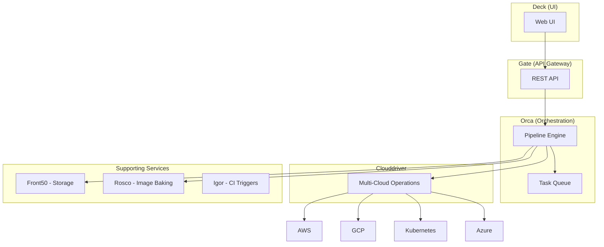

# Spinnaker 多云部署

<Badge text="企业级多云平台" type="tip" />

Netflix 在 2015 年开源了 Spinnaker，彼时他们已经在 AWS 上运行了世界上最大的微服务架构之一。Spinnaker 的诞生是为了解决一个核心问题：**如何在多个云平台之间一致地部署和管理应用**。

Jenkins 擅长构建和单元测试，但谈到「部署到 AWS、 GCP、 Kubernetes，且支持蓝绿部署、金丝雀发布、滚动更新」，Spinnaker 就是最好的选择。它是目前功能最全面的多云持续部署平台。

## Spinnaker 架构

### 核心组件



| 组件 | 职责 |
|---|---|
| Deck | Web UI 界面 |
| Gate | REST API 网关 |
| Orca | 流水线编排引擎 |
| Clouddriver | 多云操作代理 |
| Front50 | 应用和流水线持久化存储 |
| Rosco | 镜像烘焙（用于创建 AMI） |
| Igor | CI 系统触发器集成 |

---

## 安装 Spinnaker

### Halyard 安装（传统方式）

```bash
# 安装 Halyard
curl -O https://raw.githubusercontent.com/spinnaker/halyard/master/install/macos/hal
chmod +x hal
sudo mv hal /usr/local/bin/hal

# 添加 Kubernetes Provider
hal config provider kubernetes enable

# 添加账户
hal config provider kubernetes account add my-cluster \
  --context $(kubectl config current-context)

# 启用 Redis
hal config metricstore redis enable

# 部署
hal deploy apply
```

### Operator 安装（现代方式）

```yaml
# spinnaker-crds.yaml
apiVersion: v1
kind: Namespace
metadata:
  name: spinnaker
---
apiVersion: v1
kind: ConfigMap
metadata:
  name: halyard-config
  namespace: spinnaker
data:
  # Halyard 配置文件
---
apiVersion: spinnaker.io/v1alpha2
kind: SpinnakerService
metadata:
  name: spinnaker
  namespace: spinnaker
spec:
  spinnakerConfig:
    config: |
      version: 1.32.0
      persistentStorage:
        persistentStoreType: s3
        s3:
          bucket: my-spinnaker-bucket
          rootFolder: front50
      providers:
        kubernetes:
          enabled: true
          accounts:
            - name: my-cluster
              kubeconfigFile: /home/spinnaker/.kube/config
              providerVersion: V2
```

```bash
# 安装 Operator
kubectl apply -f https://github.com/armory/spinnaker-operator/releases/latest/download/crds.yaml
kubectl apply -f https://github.com/armory/spinnaker-operator/releases/latest/download/operator.yaml

# 部署 Spinnaker
kubectl apply -f spinnaker-crds.yaml
```

---

## Pipeline 配置

### Pipeline 结构

```json
{
  "name": "Deploy to Production",
  "stages": [
    {
      "type": "deploy",
      "clusters": [
        {
          "account": "my-cluster",
          "application": "my-app",
          "strategy": "redblack",
          "targetSize": 10,
          "containers": [
            {
              "imageDescription": {
                "imageId": "registry.example.com/my-app:v1.0.0"
              }
            }
          ]
        }
      ]
    }
  ],
  "triggers": [
    {
      "type": "webhook",
      "source": "jenkins"
    }
  ]
}
```

### 完整 Pipeline 示例

```json
{
  "name": "CI/CD Pipeline",
  "schemaVersion": 2,
  "application": "my-app",
  
  "triggers": [
    {
      "type": "jenkins",
      "master": "jenkins-master",
      "job": "my-app-build",
      "enabled": true,
      "propertyFile": "build.properties"
    }
  ],
  
  "parameters": [
    {
      "name": "DEPLOY_ENV",
      "description": "Deployment environment",
      "type": "string",
      "default": "staging"
    },
    {
      "name": "CONFIRM",
      "description": "Proceed with deployment?",
      "type": "boolean",
      "default": false
    }
  ],
  
  "stages": [
    {
      "name": "Bake Image",
      "type": "bake",
      "required": true,
      "regions": ["us-east-1"],
      "store": "s3",
      "baseOs": "ubuntu",
      "package": "my-app",
      "templateRenderer": "packer",
      "extendedAttributes": {
        "chef": {
          "runList": ["role[my-app]"]
        }
      }
    },
    {
      "name": "Deploy to Staging",
      "type": "deploy",
      "clusters": [
        {
          "account": "staging",
          "application": "my-app",
          "stack": "staging",
          "detail": "v1",
          "strategy": "redblack",
          "targetSize": 3,
          "region": "us-east-1",
          "availabilityZones": {
            "us-east-1a": ["us-east-1a"]
          },
          "capacity": {
            "desired": 3,
            "min": 3,
            "max": 10
          }
        }
      ],
      "dependsOn": ["Bake Image"]
    },
    {
      "name": "Smoke Tests",
      "type": "script",
      "command": "./smoke-test.sh staging",
      "dependsOn": ["Deploy to Staging"]
    },
    {
      "name": "Manual Approval",
      "type": "manualJudgment",
      "instructions": "Please review and approve deployment to production",
      "provides": "人工审批节点",
      "dependsOn": ["Smoke Tests"]
    },
    {
      "name": "Deploy to Production",
      "type": "deploy",
      "clusters": [
        {
          "account": "production",
          "application": "my-app",
          "stack": "production",
          "strategy": "redblack",
          "targetSize": 10,
          "region": "us-east-1"
        }
      ],
      "dependsOn": ["Manual Approval"]
    },
    {
      "name": "Send Notification",
      "type": "notify",
      "address": {
        "slack": "#deployments"
      },
      "message": {
        "complete": "Deployment completed successfully",
        "failed": "Deployment failed"
      },
      "dependsOn": ["Deploy to Production"]
    }
  ]
}
```

---

## 部署策略

### 滚动更新（Rolling Red/Black）

```json
{
  "name": "Rolling Update",
  "type": "deploy",
  "clusters": [
    {
      "strategy": "rollingredblack",
      "rolloutStrategy": {
        "strategy": "rolling",
        "percentage": 25,
        "pauseTime": 10
      }
    }
  ]
}
```

### 红/黑部署（Red/Black）

```json
{
  "name": "Red/Black Deploy",
  "type": "deploy",
  "clusters": [
    {
      "strategy": "redblack",
      "capacity": {
        "desired": 10
      },
      "scaleUp": true,
      "rollback": {
        "automatic": false
      },
      "delayInitialDelaySeconds": 0
    }
  ]
}
```

### 金丝雀部署（Canary）

```json
{
  "name": "Canary Deployment",
  "type": "deploy",
  "clusters": [
    {
      "name": "Baseline",
      "account": "production",
      "targetSize": 10,
      "imageDescription": {
        "imageId": "registry.example.com/my-app:v1.0.0"
      }
    },
    {
      "name": "Canary",
      "account": "production",
      "targetSize": 2,
      "imageDescription": {
        "imageId": "registry.example.com/my-app:v1.1.0"
      }
    }
  ]
}

---
// Canary Analysis Stage
{
  "name": "Canary Analysis",
  "type": "canary",
  "config": {
    "canaryConfigurations": [
      {
        "name": "default",
        "pairs": [
          {
            "name": "my-metric",
            "control": {
              "name": "Baseline"
            },
            "experiment": {
              "name": "Canary"
            }
          }
        ]
      }
    ],
    "metricsStore": "prometheus",
    "enabledHours": {
      "startTime": 0,
      "endTime": 24
    },
    "lookback": "2h",
    "interval": "30m",
    "thresholds": {
      "marginal": 95,
      "pass": 99
    }
  }
}
```

---

## 与 CI 系统集成

### Jenkins Trigger

```json
{
  "triggers": [
    {
      "type": "jenkins",
      "master": "jenkins-master",
      "job": "my-app-build",
      "enabled": true,
      "propertyFile": "build.properties"
    }
  ]
}
```

### Git Trigger

```json
{
  "triggers": [
    {
      "type": "git",
      "project": "my-project",
      "slug": "my-repo",
      "branch": "main",
      "enabled": true
    }
  ]
}
```

### Webhook Trigger

```json
{
  "triggers": [
    {
      "type": "webhook",
      "source": "github",
      "enabled": true,
      "payloadConstraints": {
        "event": "push",
        "repository": "my-repo"
      }
    }
  ]
}
```

---

## 最佳实践

### 1. 多环境 Pipeline 设计

```json
{
  "name": "Full Deployment Pipeline",
  "stages": [
    {
      "name": "Deploy to Dev",
      "type": "deploy",
      "clusters": [...],
      "requisiteStageRefIds": [],
      "account": "dev"
    },
    {
      "name": "Deploy to Staging",
      "type": "deploy",
      "dependsOn": ["Deploy to Dev"],
      "account": "staging"
    },
    {
      "name": "Integration Tests",
      "type": "script",
      "dependsOn": ["Deploy to Staging"]
    },
    {
      "name": "Deploy to Production",
      "type": "deploy",
      "dependsOn": ["Integration Tests"],
      "account": "production",
      "preconditions": [
        {
          "type": "expression",
          "failPipeline": true,
          "expression": "true"
        }
      ]
    }
  ]
}
```

### 2. 安全配置

```json
{
  "account": {
    "permissions": {
      "READ": ["role:reader", "role:developer"],
      "WRITE": ["role:deployer"],
      "EXECUTE": ["role:admin"]
    }
  }
}
```

### 3. 回滚策略

```json
{
  "name": "Automated Rollback",
  "type": "undoLastServerGroup",
  "clusters": [
    {
      "account": "production",
      "region": "us-east-1",
      "application": "my-app"
    }
  ],
  "continuePipeline": false
}
```

> [!TIP]
> Spinnaker 的学习曲线较陡，但其多云能力和高级部署策略（尤其是金丝雀分析）是无与伦比的。建议从单云、Kubernetes 开始，逐步扩展到多云场景。
