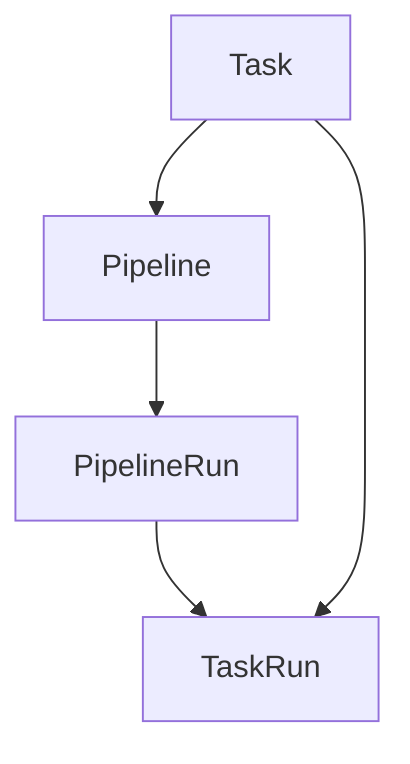

# Tekton 云原生流水线

import { Badge } from '@rspress/core/theme';

<Badge text=" PRINCIPLE 原理类" type="warning" />

2019 年，Google 将 Kubernetes 内部的构建系统 Knative Build 拆分为独立项目——这就是 Tekton 的前身。Tekton 的设计目标很明确：**成为 Kubernetes 原生的 CI/CD 构建块**。

与 Jenkins 用 Groovy 写流水线不同，Tekton 用 YAML 定义一切——Task、Pipeline、PipelineRun。这些 YAML 不仅仅是配置文件，它们是 Kubernetes Custom Resource Definitions（CRD），直接存储在 Kubernetes 集群中。

这带来了一个革命性的变化：**流水线本身也可以通过 GitOps 管理**。你修改流水线，就像修改任何其他 Kubernetes 资源一样——提交 Git PR，ArgoCD 自动同步到集群。

## 核心概念

### Tekton CRDs



| CRD | 说明 |
|---|---|
| Task | 单个可执行任务，定义具体的步骤 |
| TaskRun | Task 的一次执行实例 |
| Pipeline | 编排多个 Task 的工作流 |
| PipelineRun | Pipeline 的一次执行实例 |

### Task：基本执行单元

```yaml
apiVersion: tekton.dev/v1beta1
kind: Task
metadata:
  name: hello-world
spec:
  steps:
    - name: greet
      image: ubuntu
      script: |
        #!/bin/bash
        echo "Hello, World!"
```

### TaskRun：Task 执行实例

```yaml
apiVersion: tekton.dev/v1beta1
kind: TaskRun
metadata:
  name: hello-world-run
spec:
  taskRef:
    name: hello-world
```

### Pipeline：编排多个 Task

```yaml
apiVersion: tekton.dev/v1beta1
kind: Pipeline
metadata:
  name: hello-pipeline
spec:
  tasks:
    - name: hello
      taskRef:
        name: hello-world
    - name: goodbye
      taskRef:
        name: goodbye-world
      runAfter:
        - hello  # 在 hello 之后执行
```

---

## 详细语法

### Task 详解

```yaml
apiVersion: tekton.dev/v1beta1
kind: Task
metadata:
  name: build-and-push
spec:
  params:
    - name: image
      type: string
    - name: path
      type: string
      default: .
  
  resources:
    inputs:
      - name: source
        type: git
    outputs:
      - name: image
        type: image
  
  steps:
    - name: build
      image: maven:3.9-eclipse-temurin-17
      script: |
        #!/bin/bash
        mvn clean package
      workingDir: /workspace/source
      env:
        - name: MAVEN_OPTS
          value: "-Dmaven.repo.local=/workspace/.m2"
      
    - name: build-docker
      image: docker:latest
      script: |
        #!/bin/bash
        docker build -t $(params.image) $(params.path)
      securityContext:
        runAsUser: 0
        privileged: true
      volumeMounts:
        - name: docker-socket
          mountPath: /var/run/docker.sock
  
  volumes:
    - name: docker-socket
      hostPath:
        path: /var/run/docker.sock
```

### Pipeline 详解

```yaml
apiVersion: tekton.dev/v1beta1
kind: Pipeline
metadata:
  name: ci-pipeline
spec:
  params:
    - name: repo-url
      type: string
    - name: branch
      type: string
      default: main
  
  resources:
    - name: app-source
      type: git
  
  tasks:
    # 任务 1：编译
    - name: build
      taskRef:
        name: maven-build
      resources:
        inputs:
          - name: source
            resource: app-source
      params:
        - name: goals
          value: clean package
      
    # 任务 2：单元测试（并行）
    - name: test
      taskRef:
        name: maven-test
      resources:
        inputs:
          - name: source
            resource: app-source
      runAfter:
        - build
      
    # 任务 3：镜像构建
    - name: build-image
      taskRef:
        name: kaniko-build
      resources:
        inputs:
          - name: source
            resource: app-source
      params:
        - name: image
          value: registry.example.com/app:$(tasks.build.results.version)
      runAfter:
        - test
      
    # 任务 4：部署
    - name: deploy
      taskRef:
        name: kubectl-deploy
      params:
        - name: manifest
          value: k8s/deployment.yaml
      runAfter:
        - build-image
```

### PipelineRun：执行 Pipeline

```yaml
apiVersion: tekton.dev/v1beta1
kind: PipelineRun
metadata:
  name: ci-pipeline-run
spec:
  pipelineRef:
    name: ci-pipeline
  params:
    - name: repo-url
      value: https://github.com/example/app.git
    - name: branch
      value: main
  resources:
    - name: app-source
      resourceRef:
        name: app-source
  serviceAccountName: tekton-robot
  timeout: 1h0m0s
```

### Task Reference 与 Inline Task

```yaml
# 引用式
spec:
  tasks:
    - name: build
      taskRef:
        name: my-task
        bundle: docker://registry.example.com/my-task:latest

# 内联式
spec:
  tasks:
    - name: build
      taskSpec:
        steps:
          - name: build
            image: maven:3.9
            script: mvn clean package
```

---

## Workspaces 与 Secrets

### Workspaces：共享存储

```yaml
apiVersion: tekton.dev/v1beta1
kind: Task
metadata:
  name: maven-task
spec:
  workspaces:
    - name: maven-cache
      mountPath: /root/.m2
    - name: shared-data
      mountPath: /workspace
  
  steps:
    - name: build
      image: maven:3.9-eclipse-temurin-17
      script: mvn clean package
      env:
        - name: MAVEN_OPTS
          value: "-Dmaven.repo.local=/root/.m2/repository"
```

```yaml
apiVersion: tekton.dev/v1beta1
kind: Pipeline
metadata:
  name: ci-pipeline
spec:
  workspaces:
    - name: shared-workspace
  
  tasks:
    - name: build
      taskRef:
        name: maven-task
      workspaces:
        - name: maven-cache
          workspace: shared-workspace
```

```yaml
apiVersion: tekton.dev/v1beta1
kind: PipelineRun
metadata:
  name: ci-pipeline-run
spec:
  pipelineRef:
    name: ci-pipeline
  workspaces:
    - name: shared-workspace
      persistentVolumeClaim:
        claimName: shared-pvc
      subPath: workspace
```

### Secrets 集成

```yaml
apiVersion: v1
kind: Secret
metadata:
  name: docker-config
type: kubernetes.io/dockerconfigjson
data:
  .dockerconfigjson: <base64-encoded-config>

---
apiVersion: v1
kind: ServiceAccount
metadata:
  name: tekton-robot
secrets:
  - name: docker-config

---
apiVersion: rbac.authorization.k8s.io/v1
kind: Role
metadata:
  name: tekton-pipeline-role
rules:
  - apiGroups: [""]
    resources: ["pods", "pods/log"]
    verbs: ["get", "list"]
---
apiVersion: rbac.authorization.k8s.io/v1
kind: RoleBinding
metadata:
  name: tekton-pipeline-binding
subjects:
  - kind: ServiceAccount
    name: tekton-robot
roleRef:
  kind: Role
  name: tekton-pipeline-role
  apiGroup: rbac.authorization.k8s.io
```

---

## 进阶特性

### 条件执行

```yaml
apiVersion: tekton.dev/v1beta1
kind: Pipeline
metadata:
  name: conditional-pipeline
spec:
  tasks:
    - name: build
      taskRef:
        name: maven-build
    
    - name: deploy-staging
      taskRef:
        name: kubectl-deploy
      params:
        - name: env
          value: staging
      when:
        - input: "$(params.branch)"
          operator: in
          values: ["main", "develop"]
      runAfter:
        - build
    
    - name: deploy-production
      taskRef:
        name: kubectl-deploy
      params:
        - name: env
          value: production
      when:
        - input: "$(params.branch)"
          operator: eq
          values: ["main"]
      runAfter:
        - deploy-staging
```

### 结果传递

```yaml
# Task 定义输出结果
apiVersion: tekton.dev/v1beta1
kind: Task
metadata:
  name: maven-build
spec:
  steps:
    - name: build
      image: maven:3.9-eclipse-temurin-17
      script: |
        #!/bin/bash
        mvn clean package -DskipTests
        echo -n "1.0.$(date +%s)" > $(results.version.path)
      env:
        - name: HOME
          value: /tekton/home
  
  results:
    - name: version
      description: The build version
```

```yaml
# Pipeline 中引用结果
apiVersion: tekton.dev/v1beta1
kind: Pipeline
metadata:
  name: ci-pipeline
spec:
  tasks:
    - name: build
      taskRef:
        name: maven-build
    
    - name: deploy
      taskRef:
        name: kubectl-deploy
      params:
        - name: version
          value: "$(tasks.build.results.version)"
      runAfter:
        - build
```

### 并行执行

```yaml
apiVersion: tekton.dev/v1beta1
kind: Pipeline
metadata:
  name: parallel-pipeline
spec:
  tasks:
    # 三个任务并行执行
    - name: lint
      taskRef:
        name: lint-task
    
    - name: test-unit
      taskRef:
        name: unit-test-task
    
    - name: test-coverage
      taskRef:
        name: coverage-task
    
    # 汇总任务在前三个完成后执行
    - name: report
      taskRef:
        name: report-task
      runAfter:
        - lint
        - test-unit
        - test-coverage
```

---

## Tekton Hub

[Tekton Hub](https://hub.tekton.dev/) 是 Tekton 的官方市场，提供预构建的 Task 和 Pipeline。

### 安装 Task

```bash
# 安装 Git Clone Task
kubectl apply -f https://raw.githubusercontent.com/tektoncd/catalog/main/task/git-clone/0.9/git-clone.yaml

# 安装 Kaniko Build Task
kubectl apply -f https://raw.githubusercontent.com/tektoncd/catalog/main/task/kaniko/0.6/kaniko.yaml

# 安装 Helm Deploy Task
kubectl apply -f https://raw.githubusercontent.com/tektoncd/catalog/main/task/helm-upgrade-from-source/0.2/helm-upgrade-from-source.yaml
```

### 使用 Tekton Hub Task

```yaml
apiVersion: tekton.dev/v1beta1
kind: PipelineRun
metadata:
  name: ci-pipeline-run
spec:
  pipelineSpec:
    tasks:
      - name: clone
        taskRef:
          name: git-clone
          bundle: docker.io/tekton-catalog/workspace:latest
        params:
          - name: url
            value: https://github.com/example/app.git
          - name: revision
            value: main
          - name: subdirectory
            value: ""
          - name: deleteExisting
            value: "true"
        workspaces:
          - name: output
            workspace: shared-workspace
      
      - name: build
        taskRef:
          name: kaniko
        params:
          - name: IMAGE
            value: registry.example.com/app:latest
        workspaces:
          - name: source
            workspace: shared-workspace
        runAfter:
          - clone
```

---

## 完整 CI/CD 流水线示例

```yaml
apiVersion: tekton.dev/v1beta1
kind: Pipeline
metadata:
  name: app-ci-cd
spec:
  params:
    - name: repo-url
      type: string
    - name: revision
      type: string
      default: main
    - name: image
      type: string
    - name: namespace
      type: string
      default: default
  
  workspaces:
    - name: shared-workspace
    - name: dockerconfig
      optional: true
  
  tasks:
    # 1. Git Clone
    - name: clone
      taskRef:
        name: git-clone
      workspaces:
        - name: output
          workspace: shared-workspace
      params:
        - name: url
          value: $(params.repo-url)
        - name: revision
          value: $(params.revision)
        - name: deleteExisting
          value: "true"
    
    # 2. Unit Test
    - name: test
      taskRef:
        name: maven-test
      workspaces:
        - name: source
          workspace: shared-workspace
      runAfter:
        - clone
    
    # 3. Build Image
    - name: build-image
      taskRef:
        name: kaniko
      workspaces:
        - name: source
          workspace: shared-workspace
        - name: dockerconfig
          workspace: dockerconfig
      params:
        - name: IMAGE
          value: $(params.image)
        - name: CONTEXT
          value: .
        - name: EXTRA_ARGS
          value: ["--skip-tls-verify"]
      runAfter:
        - test
    
    # 4. Deploy
    - name: deploy
      taskRef:
        name: kubectl-deploy
      params:
        - name: namespace
          value: $(params.namespace)
        - name: manifests
          value: k8s/
      workspaces:
        - name: source
          workspace: shared-workspace
      runAfter:
        - build-image
    
    # 5. Verify
    - name: verify
      taskRef:
        name: curl-health
      params:
        - name: url
          value: https://$(params.namespace).example.com/health
      runAfter:
        - deploy
```

> [!TIP]
> Tekton 的设计哲学是「小而美」——每个 Task 只做一件事，通过 Pipeline 组合使用。建议从 Tekton Hub 选取现成 Task，逐步构建适合自己团队的流水线库。
