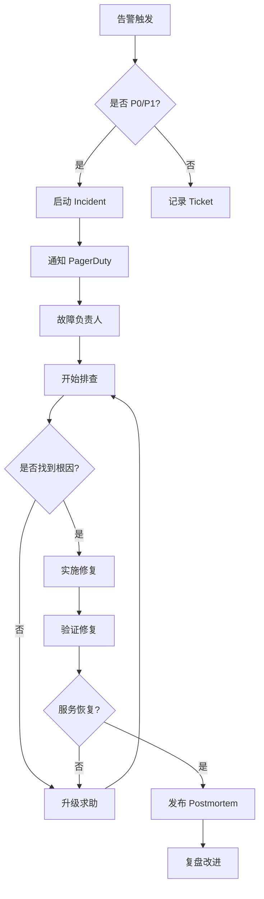

# SRE：Google 的运维哲学

「SRE 是什么？」——用软件工程思维做运维。

SRE（Site Reliability Engineering）不是职位，是思维方式。它用软件工程师的方法解决运维问题：自动化代替人工、度量代替猜测、错误预算代替零容忍。SRE 不是让你少干活，而是让你干更有价值的活。

## SRE 核心理念

```
┌─────────────────────────────────────────────────────────────────┐
│                    SRE 核心理念                                   │
│                                                                  │
│  ┌───────────────────────────────────────────────────────────┐    │
│  │  SLO (Service Level Objective)  服务等级目标                 │    │
│  │  定义：服务「好」的标准                                    │    │
│  │  例：月度可用性 99.9%                                     │    │
│  │       P99 延迟 < 500ms                                     │    │
│  │       错误率 < 0.1%                                        │    │
│  └───────────────────────────────────────────────────────────┘    │
│                           │                                       │
│                           ▼                                       │
│  ┌───────────────────────────────────────────────────────────┐    │
│  │  Error Budget  错误预算                                    │    │
│  │  计算：允许的「坏」时间                                     │    │
│  │  例：月度 99.9% = 43.8 分钟不可用/月                        │    │
│  │       如果已用 20 分钟 → 剩余 23.8 分钟                     │    │
│  └───────────────────────────────────────────────────────────┘    │
│                           │                                       │
│                           ▼                                       │
│  ┌───────────────────────────────────────────────────────────┐    │
│  │  决策依据：                                                │    │
│  │  Error Budget 充足 → 可以发版、做实验                       │    │
│  │  Error Budget 不足 → 专注稳定性，禁止变更                    │    │
│  └───────────────────────────────────────────────────────────┘    │
└─────────────────────────────────────────────────────────────────┘
```

## SLO 与 SLI

### 定义 SLO

```yaml
# SLO 配置示例
service: order-service
team: backend

slos:
  - name: availability
    sli: |
      sum(rate(http_requests_total{status!~"5.."}))  # 成功请求
      /
      sum(rate(http_requests_total))                # 总请求
    target: 99.9
    window: 30d
    alert:
      budget_remaining < 0.5  # 预算剩余 < 50% 告警
      burn_rate > 14.4        # 烧预算速率（1 小时内烧掉 6%）

  - name: latency_p99
    sli: |
      histogram_quantile(0.99,
        sum(rate(http_request_duration_seconds_bucket[5m])) by (le)
      )
    target: 500ms
    window: 30d
    alert:
      budget_remaining < 0.5

  - name: error_rate
    sli: |
      sum(rate(http_requests_total{status=~"5.."}[5m]))
      /
      sum(rate(http_requests_total[5m]))
    target: 0.1
    window: 30d
```

### SLI 计算

```promql
# 可用性 SLI（成功率）
100 * (
  sum(rate(http_requests_total{job="order-service", status!~"5.."}[5m]))
  /
  sum(rate(http_requests_total{job="order-service"}[5m]))
)

# 延迟 SLI（P99）
histogram_quantile(0.99,
  sum(rate(http_request_duration_seconds_bucket{job="order-service"}[5m])) by (le)
)

# 延迟 SLI（Good Request，延迟 < 500ms 的请求比例）
100 * (
  sum(rate(http_request_duration_seconds_bucket{job="order-service", le="0.5"}[5m]))
  /
  sum(rate(http_request_duration_seconds_bucket{job="order-service"}[5m]))
)
```

## Toil（辛劳）与自动化

### 什么是 Toil

```
┌─────────────────────────────────────────────────────────────────┐
│                    Toil 的特征                                    │
│                                                                  │
│  Toil = 手工的、重复性的、可自动化的、没有持久价值的工作            │
│                                                                  │
│  典型 Toil：                                                     │
│  ✗ 手动重启服务                                                  │
│  ✗ 手动扩容节点                                                  │
│  ✗ 手动审批权限                                                  │
│  ✗ 手动配置变更                                                  │
│  ✗ 手动清理日志                                                  │
│  ✗ 手动导出监控报表                                              │
│                                                                  │
│  非 Toil：                                                       │
│  ✓ 设计高可用架构                                               │
│  ✓ 开发自动化工具                                                │
│  ✓ 制定发布流程                                                  │
│  ✓ 分析故障根因                                                  │
│  ✓ 优化系统性能                                                  │
└─────────────────────────────────────────────────────────────────┘
```

### Toil 治理

```bash
# 每周跟踪 Toil 时间
# 问题：上周手动处理了多少次告警？
# 目标：Toil < 50% 工作时间

# 常用指标
# - 手动操作次数（人工干预次数）
# - 变更发布时间（人工审批时间）
# - 故障恢复时间（MTTR）
# - 告警响应时间（人工确认时间）

# SRE 团队 Toil 控制目标
# - 人工告警确认 < 5 次/周
# - 手动发布 < 2 次/周
# - Toil 时间 < 30% 工作时间
```

## 故障管理

### 故障分类

```
┌─────────────────────────────────────────────────────────────────┐
│                    故障分级                                       │
│                                                                  │
│  P0 业务中断（Critical）                                         │
│  - 核心服务完全不可用                                            │
│  - 影响全部用户                                                  │
│  - 恢复时间目标（RTO）: 15 分钟                                    │
│  - 数据恢复目标（RPO）: 0                                         │
│                                                                  │
│  P1 严重降级（High）                                             │
│  - 核心功能不可用，部分用户受影响                                 │
│  - RTO: 1 小时                                                  │
│  - RPO: 15 分钟                                                 │
│                                                                  │
│  P2 中度影响（Medium）                                           │
│  - 非核心功能不可用                                              │
│  - RTO: 4 小时                                                  │
│  - RPO: 1 小时                                                 │
│                                                                  │
│  P3 轻微影响（Low）                                              │
│  - 非核心功能部分用户受影响                                       │
│  - RTO: 24 小时                                                │
│  - RPO: 4 小时                                                 │
└─────────────────────────────────────────────────────────────────┘
```

### 故障响应流程



### Postmortem（故障复盘）

```markdown
# Postmortem 模板

## 故障概述
- **时间**: 2024-01-15 14:30 - 15:15 UTC
- **持续**: 45 分钟
- **影响**: 订单创建失败，影响约 5000 用户
- **严重程度**: P1

## 时间线
| 时间 | 事件 |
|------|------|
| 14:30 | 部署新版本 order-service v1.2.3 |
| 14:32 | 监控告警：订单创建错误率上升至 5% |
| 14:35 | SRE 响应告警，开始排查 |
| 14:40 | 发现数据库连接池配置错误 |
| 14:50 | 回滚 order-service 到 v1.2.2 |
| 15:00 | 确认服务恢复 |
| 15:15 | 发布故障复盘 |

## 根因分析
- **直接原因**: 数据库连接池最大连接数从 100 误配置为 10
- **根本原因**: 发布 checklist 缺少数据库配置检查项

## 改进措施
| 措施 | 负责人 | 完成日期 |
|------|--------|----------|
| 增加数据库配置检查到发布 checklist | @zhang | 2024-01-20 |
| 增加连接池配置告警 | @li | 2024-01-22 |
| 建立配置变更审批流程 | @wang | 2024-01-25 |

## 经验教训
1. 配置变更必须经过评审
2. 灰度发布时间窗口不足
3. 缺少数据库配置监控
```

## 变更管理

### 变更分级

```
┌─────────────────────────────────────────────────────────────────┐
│                    变更分级                                       │
│                                                                  │
│  低风险变更（自动化审批）                                          │
│  - 配置参数调整（在预设范围内）                                    │
│  - 无代码变更的部署                                               │
│  - 自动扩缩容                                                     │
│                                                                  │
│  中风险变更（人工审批）                                           │
│  - 新功能发布                                                    │
│  - 配置参数大范围调整                                             │
│  - 数据库 schema 变更                                            │
│                                                                  │
│  高风险变更（多层审批 + 回滚计划）                                 │
│  - 核心系统架构变更                                              │
│  - 跨团队依赖变更                                                │
│  - 数据库迁移                                                    │
└─────────────────────────────────────────────────────────────────┘
```

### 发布流程

```yaml
# GitOps 发布流程
stages:
  - name: build
    triggers:
      - push to feature/*
    actions:
      - docker build
      - docker push
      - unit test

  - name: staging
    triggers:
      - merge to main
    actions:
      - deploy to staging
      - integration test
      - performance test
      - smoke test

  - name: canary
    duration: 30m
    actions:
      - deploy canary 5%
      - monitor error rate
      - monitor latency
      - auto rollback if error_rate > 1%

  - name: production
    triggers:
      - canary passed
    actions:
      - deploy 25%
      - monitor 15m
      - deploy 100%
      - rollback if error_rate > 0.5%
```

## SRE 常用指标

```
┌─────────────────────────────────────────────────────────────────┐
│                    SRE 黄金指标                                   │
│                                                                  │
│  1. 延迟（Latency）                                              │
│     服务响应时间，P50/P95/P99                                    │
│                                                                  │
│  2. 流量（Traffic）                                              │
│     QPS、并发连接数                                              │
│                                                                  │
│  3. 错误（Errors）                                               │
│     错误率、5xx 比例                                              │
│                                                                  │
│  4. 饱和度（Saturation）                                         │
│     CPU、内存、磁盘、连接池使用率                                  │
│                                                                  │
│  额外指标：                                                      │
│  - MTTR（Mean Time To Recovery）：平均恢复时间                    │
│  - MTTF（Mean Time To Failure）：平均故障时间                    │
│  - MTBF（Mean Time Between Failures）：平均故障间隔               │
│  - Change Failure Rate：变更失败率                               │
│  - Deployment Frequency：部署频率                                 │
└─────────────────────────────────────────────────────────────────┘
```

## SRE vs DevOps

```
┌─────────────────────────────────────────────────────────────────┐
│                    SRE vs DevOps                                │
│                                                                  │
│  目标一致：提高服务质量 + 交付效率                                 │
│                                                                  │
│  SRE：                                                          │
│  - 背景：Google 实践                                             │
│  - 方法：用软件工程思维做运维                                     │
│  - 核心：SLO、Error Budget、Toil 管理                           │
│  - 团队：专职 SRE 团队（部分公司）                                │
│                                                                  │
│  DevOps：                                                        │
│  - 背景：行业最佳实践集合                                         │
│  - 方法：打破开发和运维壁垒                                       │
│  - 核心：CI/CD、自动化、文化                                       │
│  - 团队：全栈团队，每个人都要运维                                 │
│                                                                  │
│  融合：                                                          │
│  SRE 是 DevOps 的具体实现之一                                    │
│  SRE 提供度量框架（SLI/SLO/SLA）                                │
│  DevOps 提供方法论（CI/CD、IaC）                                │
└─────────────────────────────────────────────────────────────────┘
```

## 面试追问方向

1. **Error Budget 是什么？如何使用？**
   答：Error Budget = 1 - SLO。SLO 99.9% 意味着每月允许 43.8 分钟的不可用时间。当 Error Budget 充足时，可以更激进地发布新功能、做技术实验；当 Error Budget 不足时，暂停所有非稳定性相关的变更，专注修复。这是「数据驱动决策」的具体体现。

2. **如何确定 SLO？**
   答：基于历史数据和业务需求。用户能接受的「最差体验」是什么？竞争对手的 SLA 是多少？历史故障的恢复时间是多少？建议 SLO 比用户预期略高（如用户能接受 99.5%，你设 99.9%），留有缓冲。同时，SLO 要可测量、可验证，否则没有意义。

3. **Toil 治理的优先级是什么？**
   答：先量化 Toil。用指标追踪「人工干预次数」「手动发布时间」等。优先级排序：高频 > 低频但高风险 > 低频低风险。高频 Toil（如每天都要手动处理告警）优先自动化。Toil 治理的目标是让团队有时间做更有价值的事（架构优化、自动化工具开发）。

4. **Postmortem 的核心是什么？**
   答：Postmortem 不是追责，是学习。重点是「What happened」和「What to improve」，而不是「Who is responsible」。好的 Postmortem 包括：时间线、根因分析、5 个为什么（5 Whys）、可落地的改进措施。改进措施必须有负责人和完成日期，否则就是空谈。

SRE 不是银弹，但它的度量思维（SLO/Error Budget）和软件工程方法，能让运维从「救火队」变成「可靠性工程师」。
