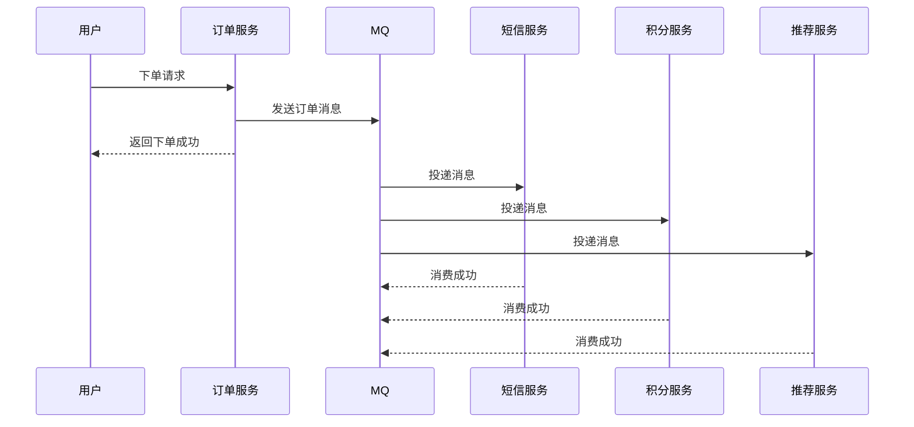
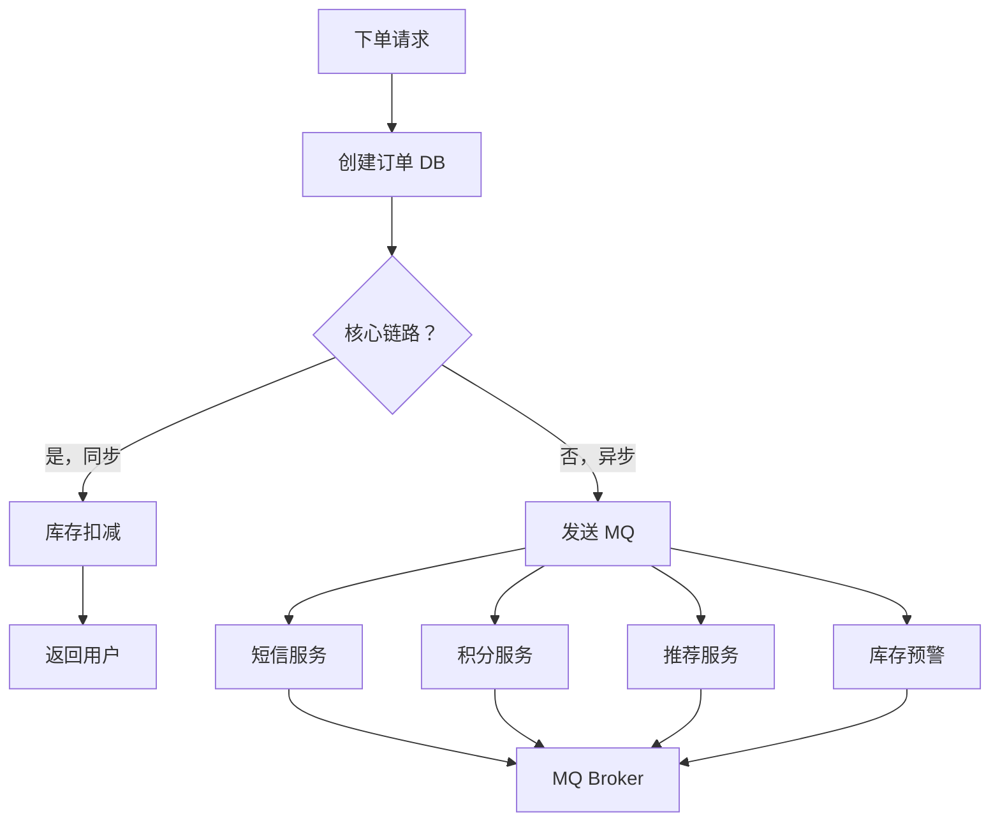

2023年双十二，我们团队接了一个需求：用户下单成功后，要给用户发短信通知、计算积分、更新推荐算法模型、触发库存预警。

开发同学很实诚，写了这段代码：

```java
public Order placeOrder(Order order) {
    // 1. 创建订单
    Order savedOrder = orderDao.save(order);

    // 2. 发短信通知
    smsService.send(savedOrder.getUserPhone(), "下单成功");

    // 3. 计算积分
    pointService.calculate(savedOrder.getUserId(), savedOrder.getAmount());

    // 4. 更新推荐模型
    recommendService.updateModel(savedOrder.getUserId());

    // 5. 触发库存预警
    stockService.checkWarning(savedOrder.getProductId());

    return savedOrder;
}
```

结果大促当天，因为短信服务超时，平均下单响应时间从 200ms 飙升到 8s。用户体验直接崩了。

这个故事告诉我们：**同步做所有事情，就是把所有环节的可用性捆绑在一起**。短信服务挂了，整个下单流程就崩了。

## 问题背景

同步调用的本质是：**调用方要等待被调用方返回结果，才能继续执行**。如果被调用方慢，调用方就只能干等着。

异步化的本质是：**调用方发完消息就可以干别的事，不需要等待被调用方处理完成**。



这个图的核心变化：**下单接口从 5 个同步调用变成 1 个 MQ 发送，响应时间从 5 个调用之和变成 1 个调用**。

## 核心概念

### 消息队列的三大价值

1. **解耦**：生产者和消费者不需要同时在线，也不需要知道彼此的存在
2. **削峰**：高峰期积压的消息在低峰期处理，保护下游系统不被冲垮
3. **异步**：非核心流程异步化，主流程快速响应

### 消息投递语义

这是面试和实战中最容易翻车的点。

| 语义 | 含义 | 场景 |
| --- | --- | --- |
| At-Most-Once | 最多投递一次，消息可能丢失 | 日志收集、允许丢数据的监控 |
| At-Least-Once | 至少投递一次，消息不会丢失，但可能重复 | 绝大多数业务场景 |
| Exactly-Once | 精确一次，既不丢失也不重复 | 支付场景（极难实现） |

:::warning ⚠️
Exactly-Once 是分布式系统中最难实现的语义之一。很多 MQ 中间件宣传支持 Exactly-Once，实际上是"端到端 Exactly-Once"，依赖了事务性输出（如数据库事务 + 消息确认的组合）。Kafka 的事务语义也需要消费者配合做幂等处理。
:::

## 消息队列选型

### Kafka vs RocketMQ vs RabbitMQ

| 维度 | Kafka | RocketMQ | RabbitMQ |
| --- | --- | --- | --- |
| 吞吐量 | 极高，百万级 TPS | 高，十万级 TPS | 中等，万级 TPS |
| 延迟 | 低，毫秒级 | 低，毫秒级 | 低，微妙~毫秒级 |
| 消息可靠性 | 可配置 | 高，可靠性优 | 高 |
| 消息回溯 | 支持按 offset 回溯 | 支持按时间回溯 | 不支持 |
| 延迟消息 | 不支持（需插件） | 原生支持 | 插件支持 |
| 事务消息 | 支持（事务 coordinators） | 原生支持 | 不支持 |
| 顺序消息 | 支持（单 partition） | 支持 | 支持 |
| 适用场景 | 日志、大数据、ETL | 交易类业务 | 小规模业务 |

:::tip 💡
Kafka 的核心竞争力是**吞吐量和数据回溯能力**，适合大数据场景和日志收集。RocketMQ 的核心竞争力是**事务消息和延迟消息**，适合交易类和对可靠性要求高的业务。RabbitMQ 的核心竞争力是**灵活的路由和简单的 API**，适合中小规模的异步解耦场景。
:::

## 异步架构设计

### 订单系统的异步化改造



**核心原则**：核心链路（创建订单、扣减库存）保持同步，保证强一致性；非核心链路（发短信、计算积分）走异步，追求最终一致性。

### 消息幂等性设计

At-Least-Once 语义下，消息重复是必然的。消费者必须做幂等处理。

```java
@KafkaListener(topics = "order_topic")
public void processOrder(ConsumerRecord<String, Order> record) {
    Order order = record.value();
    String idempotentKey = "order_processed:" + order.getId();

    // 1. 尝试获取幂等锁
    Boolean locked = redis.setnx(idempotentKey, "1", 86400);
    if (!locked) {
        log.info("订单 {} 已处理过，跳过", order.getId());
        return;
    }

    // 2. 业务处理
    try {
        pointService.calculate(order.getUserId(), order.getAmount());
    } catch (Exception e) {
        log.error("积分计算失败，订单ID: {}", order.getId(), e);
        // 3. 处理失败，释放锁让消息可以重试
        redis.del(idempotentKey);
        throw e;
    }
}
```

幂等性实现方案：

| 方案 | 原理 | 适用场景 |
| --- | --- | --- |
| 唯一键 + 插入 | 用 order_id 做唯一键，重复插入会冲突 | 数据库新增场景 |
| 状态机 | 订单有明确的状态流转，已处理的状态不再处理 | 有明确状态机的业务 |
| 分布式锁 | 用 Redis 锁住业务 ID，处理完释放 | 通用场景 |
| 去重表 | 记录已处理的消息 ID | 通用场景 |

## 生产避坑

### 坑1：消息丢失

消息从生产到消费，中间有 4 个环节可能丢失：

```
生产者 ──► MQ Broker ──► 消费者
         (1)持久化     (2)确认
```

**防止丢失的策略**：
- 生产者确认：发送后等待 broker 确认（acks=all）
- Broker 持久化：刷盘策略改为同步刷盘（性能下降）
- 消费者确认：处理完成后才确认消费成功

```java
// Kafka 生产者配置
props.put("acks", "all");      // 等待所有副本确认
props.put("retries", 3);       // 重试 3 次
props.put("enable.idempotence", true);  // 开启幂等性
```

### 坑2：消息积压

MQ 中的消息积压是最常见的生产问题之一。常见原因：

1. 消费者数量 < 分区数（Kafka）
2. 消费者处理速度跟不上生产速度
3. 消费者 OOM 或假死
4. 消费者有死循环或长时间阻塞

**应急处理**：
1. 扩容消费者节点
2. 消费者降级：关闭非核心消费者，让核心消费者先处理
3. 消息快速消费：写一个临时脚本，只消费不处理，直接入库

:::warning ⚠️
生产环境的消息积压不能靠重启消费者来解决。如果根因是代码 bug，重启后消息会再次积压。先排查根因，再决定是否重启。
:::

### 坑3：消息顺序问题

Kafka 在单 partition 内保证顺序。如果业务需要全局有序，可以：
- 用一个 partition（牺牲吞吐量）
- 或者在消息体内带上序列号，消费者按序列号排序处理

但更常见的需求是**局部有序**：同一个用户的操作有序，不同用户之间可以并行。这种情况下，用 user_id 做分片键，让同一用户的操作落在同一个 partition 里即可。

## 工程代价评估

| 维度 | 评估 |
| --- | --- |
| 开发成本 | 高，需要设计消息格式、幂等性、重试策略 |
| 运维成本 | 高，MQ 集群运维 + 监控 |
| 排障复杂度 | 高，消息链路追踪困难 |
| 扩展性 | 优秀，水平扩展消费者即可 |
| 业务侵入性 | 中等，部分业务逻辑需要异步化改造 |

【架构权衡】
异步化的本质是用**最终一致性换性能**。同步改异步后，主业务流程变快了，但非核心流程的结果会延迟。这个延迟可能是几毫秒，也可能是几分钟。关键是在设计阶段明确：**哪些流程必须同步，哪些可以异步，异步的延迟上限是多少**。没有这些约束，异步化改造就是在给自己埋雷。
