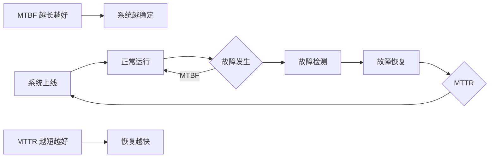
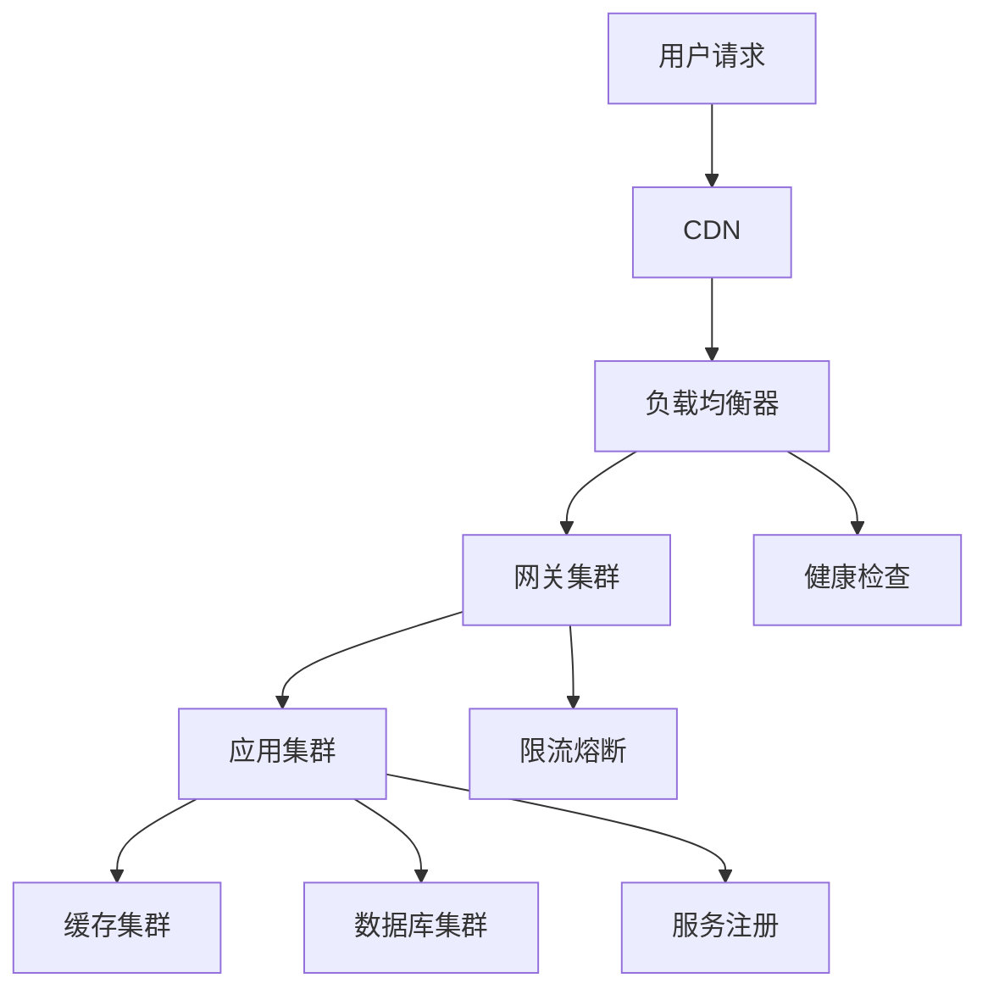
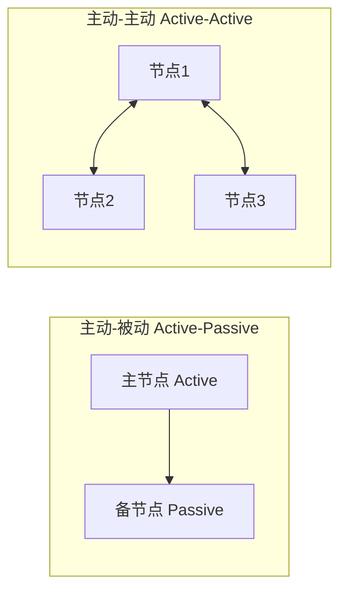
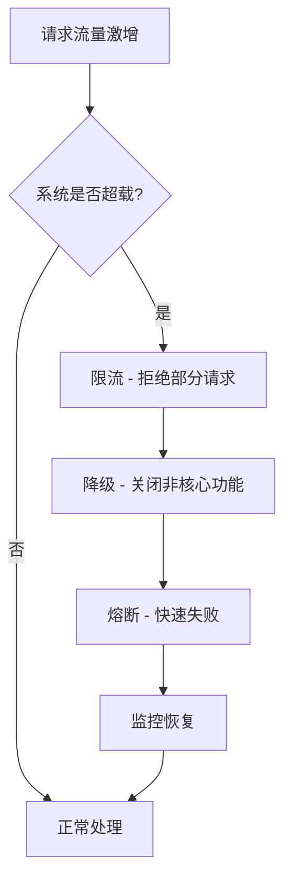
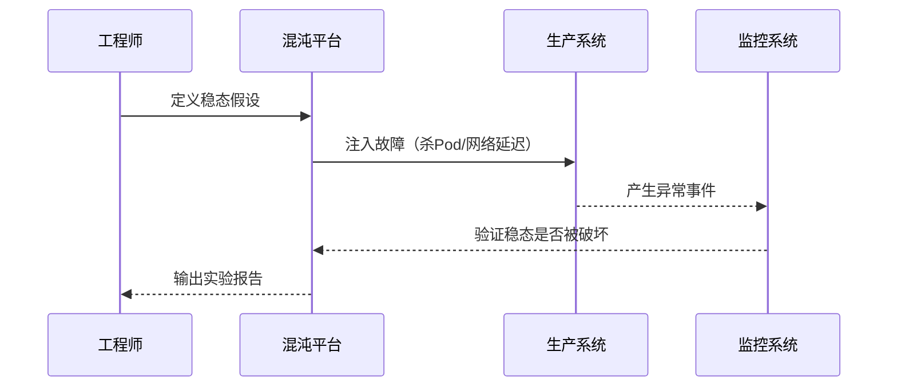

# 高可用设计概览

## 问题背景

2024年"618"大促前夕，某头部电商平台的订单系统在凌晨 2:17 分出现了一次持续 4 小时零 23 分钟的全面宕机。

事故原因并不复杂：核心数据库的主从切换脚本里有一个边界条件没有处理妥当，在一次计划内的维护重启中，备库提升为主库时出现了数据目录权限问题，导致 MySQL 无法启动。人工排查加上回滚操作，整整花了 4 个多小时。

直接损失：约 1200 万GMV（订单中断期间无法下单），间接损失（用户信任度下降、品牌口碑损伤）：难以量化。

这不是技术不够好，而是高可用架构没有做完整。

【架构权衡】
高可用是有代价的：成本翻倍、运维复杂度增加、系统设计难度提升。在业务 SLA 和工程成本之间找到平衡点，才是架构设计的核心命题。99.9% 和 99.99% 的可用性看起来只差一个 9，背后可能是 10 倍的工程投入。

## 问题定义

高可用（High Availability，HA）不是"不让系统挂"，而是"让系统在可接受的时间内恢复"。这里有几个关键度量：

**MTBF（Mean Time Between Failures，平均故障间隔时间）**：系统正常运行到下一次故障的平均时间。这个值越大越好，说明系统越稳定。

**MTTR（Mean Time To Repair，平均修复时间）**：系统发生故障后，恢复到正常服务的平均时间。这个值越小越好。

**SLA（Service Level Agreement，服务等级协议）**：SLA 是对外承诺，可用性 SLA `=` 正常运行时间 `/` 总时间。例如：
- 99%（2个9）：每年停机时间 `<` 87.6 小时
- 99.9%（3个9）：每年停机时间 `<` 8.76 小时
- 99.99%（4个9）：每年停机时间 `<` 52.6 分钟
- 99.999%（5个9）：每年停机时间 `<` 5.26 分钟

**RTO（Recovery Time Objective，恢复时间目标）**：业务能容忍的最大停机时间。比如 RTO = 1 小时，意味着停机超过 1 小时，业务就承受不住了。

**RPO（Recovery Point Objective，恢复点目标）**：业务能容忍的最大数据丢失量。比如 RPO = 1 小时，意味着最多允许丢失 1 小时的数据。

:::tip 💡
RTO 和 RPO 是架构设计的输入，而不是输出。你要先问业务："最多能接受多久不可用？最多能丢失多少数据？"然后倒推架构方案，而不是先定了架构再让业务接受约束。
:::

## 分层高可用架构

高可用不是一个点，而是一整套分层策略。每一层都可能出现单点故障，每一层都需要对应的防护手段。

### 1. 网络层

- **CDN**：静态资源就近分发，节点故障自动切换，用户无感知
- **负载均衡**：LVS/Nginx/云负载均衡器，避免单点，通过健康检查自动剔除故障节点
- **DNS**：DNS 解析的 TTL 设置要合理，DNS 故障会导致全站不可用

### 2. 应用层

- **无状态服务**：应用层服务不保存本地状态，所有状态外置到 Redis/DB，这样任何实例挂了都可以被替换
- **服务注册与发现**：Eureka/Consul/Nacos，服务实例动态上下线，客户端及时感知
- **限流与熔断**：Sentinel/Hystrix/Resilience4j，防止雪崩效应

### 3. 数据层

- **主从复制**：MySQL/Redis 的主从架构，提供读写分离和故障转移能力
- **分片集群**：Cassandra/MongoDB/Redis Cluster，数据分布在多个节点，单节点故障不影响全局
- **多副本策略**：同 AZ 多副本防机器故障，跨 AZ 多副本防机房故障

### 4. 基础设施层

- **多可用区部署**：核心服务部署在两个以上 AZ，一个 AZ 故障时流量切换到另一个
- **容器化 + 编排**：K8s 提供 Pod 的自愈、自动重启、自动调度能力
- **监控与告警**：Prometheus + Grafana + AlertManager，提前发现隐患

## 冗余策略

冗余是高可用的物理基础。没有冗余，就没有可用性。

### 主动-被动模式（Active-Passive）

主节点处理所有请求，备节点处于待机状态。主节点故障时，备节点接管。

- 优点：实现简单，数据一致性容易保证
- 缺点：资源利用率只有 50%，切换有延迟

### 主动-主动模式（Active-Active）

所有节点都处理请求，互为备份。

- 优点：资源利用率高，容错能力强
- 缺点：数据一致性挑战大（跨节点同步问题），架构复杂度高

【架构权衡】
两副本是工业标准，三副本的边际收益递减但成本线性增长。对于绝大多数业务场景，**同城两副本 + 异地备份**已经足够。金融级场景可以上三副本，但要接受 3 倍的存储和运维成本。

## 故障检测与自动切换

### 故障检测机制

| 检测方式 | 原理 | 优点 | 缺点 |
| --- | --- | --- | --- |
| 心跳检测 | 节点定期发送心跳包 | 实现简单，延迟低 | 无法检测应用层故障 |
| 探活检测 | 主动探测服务端口/HTTP 端点 | 能检测到应用层问题 | 增加网络开销，可能误判 |
| 阈值检测 | 连续 N 次失败才判定为故障 | 避免瞬时抖动干扰 | 有延迟，可能扩大故障影响 |

### 自动切换的风险

自动切换快，但有代价：**脑裂（Split-Brain）**。当网络分区发生时，主备节点可能同时认为对方挂了，各自接管服务，导致数据冲突。

:::warning ⚠️
自动切换的代价是脑裂风险，手动切换的代价是响应速度。金融交易系统通常选择手动切换（人工事先评估），而互联网业务通常选择自动切换（速度优先）。
:::

## 降级与限流

当系统承压时，"有损服务"优于"完全不可用"。

- **限流**：QPS 限制、连接数限制，保护系统不被压垮
- **降级**：关闭非核心功能（推荐位、评论、积分），保证核心链路（下单、支付）可用
- **熔断**：当下游服务持续超时，断路器打开，快速返回错误而不是排队等待

## 混沌工程

高可用架构设计得再好，也需要验证。混沌工程（Chaos Engineering）通过主动注入故障来验证系统的韧性。

Netflix 在 2010 年推出了 Chaos Monkey，随机关闭生产环境的服务器，迫使工程师构建真正有韧性的系统。

## SRE 核心实践

### 错误预算（Error Budget）

SLO `= 1 - Error Budget。如果月度 SLO 是 99.9%，错误预算是 0.1% = 43.8 分钟。

- 如果错误预算消耗得慢：可以激进地发布新功能
- 如果错误预算消耗得快：暂停发布，专注稳定性

### SLO/SLI

- **SLI（Service Level Indicator）**：可量化的指标，如"p99 延迟 `<` 500ms"
- **SLO（Service Level Objective）**：对 SLI 的目标承诺，如"99.5% 的请求延迟 `<` 500ms"
- **SLA**：对外承诺，具有法律效力，通常比内部 SLO 更宽松

【架构权衡】
不要为了追求更高的 SLA 而盲目堆砌冗余。99.99% 比 99.9% 多一个 9，但背后可能是：
- 3 倍的基础设施成本
- 5 倍的运维复杂度
- 10 倍的架构改造投入

对于大多数互联网业务，99.9%~99.95% 的 SLA 是投入产出比最合理的区间。

## 生产避坑

1. **单点故障藏在最不起眼的地方**：很多团队的 MySQL 是主从，但 Redis 是单机；网关有集群，但 DNS 是单点。
2. **健康检查不等于真的健康**：服务进程在，但连接池已耗尽、线程池卡死、GC 停顿中——这些情况健康检查测不出来。
3. **切换脚本是重灾区**：故障转移脚本平时不跑，只有出事时才跑，一跑就出错。必须定期演练。
4. **降级预案要提前写好**：不要在故障发生时才开始想"要不要关推荐"。降级预案要提前设计好开关，运行时一键降级。

## 工程代价

| 维度 | 评估 |
| --- | --- |
| 基础设施成本 | 多副本部署，成本 `+` 100% ~ 300% |
| 运维复杂度 | 故障场景翻倍，排障难度增加 |
| 开发复杂度 | 需要处理幂等、分布式事务、一致性 |
| 排障复杂度 | 多层冗余导致故障点定位更困难 |
| 回滚风险 | 切换逻辑复杂，回滚失败率高于普通发布 |

## 落地 Checklist

- [ ] 梳理所有单点故障点（Redis 单机、单机 MySQL、无备援的 Nginx 等）
- [ ] 确定业务的 RTO 和 RPO 目标
- [ ] 设计并评审高可用架构方案
- [ ] 编写故障转移脚本并定期演练
- [ ] 配置健康检查（不要只检查端口，要检查应用层）
- [ ] 设计降级预案，明确每个开关的作用范围
- [ ] 建立 SLO 和错误预算机制
- [ ] 引入混沌工程，从简单的"杀 Pod"实验开始
- [ ] 压测验证：模拟 AZ 故障，验证自动切换是否生效
- [ ] 建立值班机制和故障应急流程
