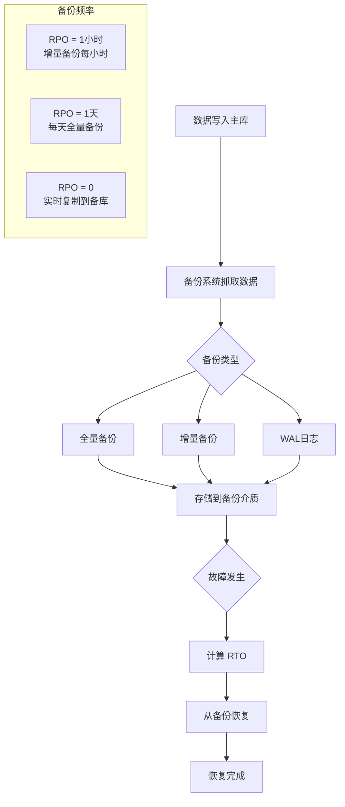
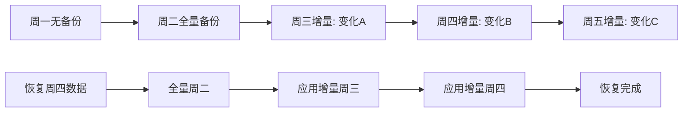
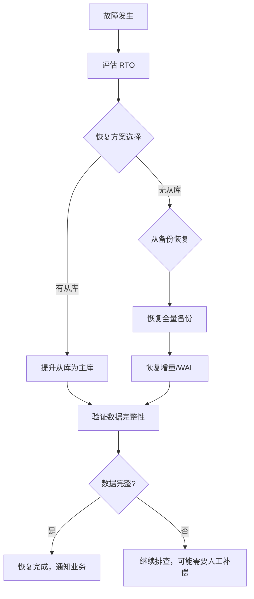
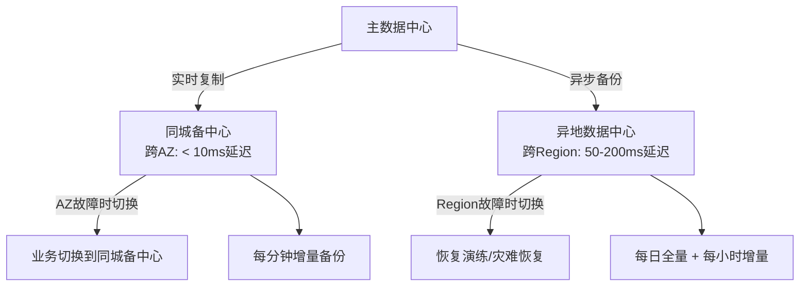
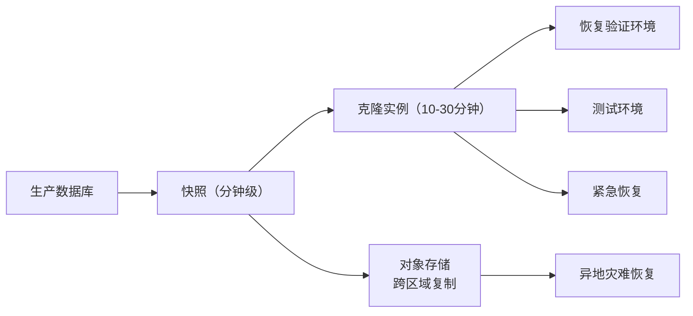

# 数据备份与恢复

## 问题背景

2024年3月，某在线教育平台的一位 DBA 在凌晨 2:30 执行一条 SQL 清理历史课时数据：

```sql
DELETE FROM user_lesson_records WHERE created_at < '2023-01-01';
```

结果：忘了加 `WHERE` 条件，执行到一半才发现全表数据被清空。还好有备份。DBA 胸有成竹地开始恢复——

然后他发现，**最近的可用备份是 7 天前的**。因为最近一次备份因为磁盘空间不足而失败，之后没人注意到。

最终结果：丢失了 7 天的用户课时数据，涉及 3400 多名付费用户的课程记录。客服团队花了 3 天时间做人工补偿，直接赔付超过 80 万元。

这个故事告诉我们：**备份的价值不在于备份本身，而在于能可靠恢复。**

【架构权衡】
太多团队"备份了数据"但"从来没演练过恢复"。备份不验证等于没备份。每一次备份失败都应该触发 PagerDuty 告警，每一次恢复演练都应该有记录和报告。

## 问题定义

数据安全的最后一道防线是备份和恢复。两个核心目标：

**RPO（Recovery Point Objective）**：业务能容忍的最大数据丢失量。这决定了备份的频率——RPO 越低，备份越频繁。

**RTO（Recovery Time Objective）**：业务能容忍的最大停机时间。这决定了恢复的速度要求——RTO 越低，恢复流程越要自动化。



## 备份类型详解

### 全量备份（Full Backup）

备份数据库的所有数据。每次备份都是完整副本。

- **优点**：恢复简单，只需要一个备份文件
- **缺点**：数据量大，备份时间长，占用存储多
- **建议频率**：每天一次（低峰期，如凌晨 3 点）

### 增量备份（Incremental Backup）

只备份自上一次备份以来变化的数据。

- **优点**：备份速度快，存储空间小
- **缺点**：恢复时需要按顺序应用所有增量，恢复时间长
- **依赖**：需要基于全量备份



### 差异备份（Differential Backup）

只备份自上一次全量备份以来变化的数据。比增量备份恢复更快，但备份量比增量备份大。

### WAL 日志备份（Write-Ahead Log）

PostgreSQL/MySQL 的事务日志实时备份，支持 Point-in-Time Recovery（PITR）。

- **RPO 接近 0**：理论上可以恢复到任意时间点
- **代价**：需要持续归档 WAL 文件，对存储和网络有持续压力

【架构权衡】
对于大多数业务：**每日全量备份 + 每小时增量备份 + 实时 WAL 归档**是最佳平衡点。RPO 可以做到 1 小时以内，恢复不需要应用所有增量，存储成本可控。

## MySQL 备份方案

### mysqldump

逻辑备份工具，导出 SQL 语句。适用于小规模数据库（GB 级）。

```bash
# 全量备份
mysqldump -h127.0.0.1 -uroot -p \
  --single-transaction \
  --routines --triggers --events \
  --master-data=2 \
  --all-databases > full_backup_$(date +%Y%m%d).sql

# --single-transaction: 在一个事务内完成，保证一致性（仅限InnoDB）
# --master-data=2: 记录Binlog位置，便于PITR
```

:::warning ⚠️
mysqldump 的坑：
- 对大数据库备份时间极长（可能超过 10 小时）
- `--single-transaction` 对 MyISAM 无效
- 网络中断后无法断点续传
- 恢复时需要重新执行所有 SQL，恢复时间也很长
:::

### XtraBackup（推荐）

物理备份工具，直接复制数据文件。备份和恢复速度比 mysqldump 快 10 倍以上，支持热备。

```bash
# 全量备份
xtrabackup --backup \
  --target-dir=/backup/full_$(date +%Y%m%d) \
  --user=bkpuser --password=xxx

# 增量备份
xtrabackup --backup \
  --target-dir=/backup/incr_$(date +%Y%m%d) \
  --incremental-basedir=/backup/full_20240101 \
  --user=bkpuser --password=xxx

# 恢复
xtrabackup --prepare --target-dir=/backup/full_20240101
xtrabackup --prepare --incremental-dir=/backup/incr_xxx --target-dir=/backup/full_20240101
xtrabackup --copy-back --target-dir=/backup/full_20240101
```

### MariaDB Backup

Percona XtraBackup 的上游分支，功能类似，对 MariaDB 优化更好。

### 备份策略对比

| 维度 | mysqldump | XtraBackup |
| --- | --- | --- |
| 备份类型 | 逻辑备份（SQL） | 物理备份（数据文件） |
| 备份速度 | 慢（小时级） | 快（分钟级） |
| 恢复速度 | 慢（重放SQL） | 快（直接复制） |
| 锁表 | 需要（MyISAM）或可选（InnoDB） | 支持热备，不锁表 |
| 适用场景 | 小库、迁移 | 生产大库 |
| PITR 支持 | `--master-data` | `--binlog-info=auto` |

## Redis 备份

Redis 提供两种备份机制，通常**两者结合使用**。

### RDB（Redis Database）

定时快照备份。fork 一个子进程将内存数据写入磁盘。

```bash
# 手动触发
BGSAVE
# 或在 redis.conf 中配置自动快照
save 900 1      # 900秒内至少1个key变化就保存
save 300 10     # 300秒内至少10个key变化
save 60 10000   # 60秒内至少10000个key变化
```

- **优点**：文件紧凑，恢复快
- **缺点**：可能丢失最后一次快照之后的数据（RPO `>` 0）

### AOF（Append Only File）

每个写操作追加到日志文件，支持实时持久化。

```bash
# redis.conf
appendonly yes
appendfsync everysec  # 每秒同步，性能和数据安全的折中
# appendfsync always  # 每次写入都同步，最安全但最慢
# appendfsync no      # 由OS决定何时同步，最快但可能丢失数据
```

- **优点**：RPO 可以接近 0
- **缺点**：AOF 文件比 RDB 大，恢复速度可能稍慢

:::tip 💡
最佳实践：**RDB + AOF 混合模式**。RDB 做定时快照（每天低峰期），AOF 做实时追加。恢复时先用 RDB 快速恢复到最后一次快照，再用 AOF 重放增量数据。Redis 6.0+ 支持 `aof-use-rdb-preamble yes` 自动做这个优化。
:::

## 恢复流程优化

恢复是备份价值的最终体现。很多团队备份做得好，但恢复流程一塌糊涂。

### 恢复流程



### RTO 优化策略

1. **定期验证备份可恢复**：每月执行一次完整恢复演练，测量实际 RTO
2. **备份分级存储**：本地备份（快但有单点） + 异地备份（慢但安全）
3. **准备恢复环境**：不要在生产数据库上恢复——准备好一台恢复专用机器
4. **自动化恢复脚本**：减少人工操作，降低出错概率

### 异地备份

单数据中心内的备份无法抵御火灾、地震等灾难。异地备份是数据安全的必要手段。



| 维度 | 同城备份（跨AZ） | 异地备份（跨Region） |
| --- | --- | --- |
| 延迟 | `<` 10ms | 50~200ms |
| 用途 | 高可用切换 | 灾难恢复 |
| 备份频率 | 分钟级增量 | 小时级增量 |
| 成本 | 低 | 高 |

## 云原生备份

### 数据库快照

云厂商的 RDS（Amazon RDS / 阿里云 RDS / 腾讯云 CDB）提供近乎即时的快照备份：

```bash
# AWS RDS 示例
aws rds create-db-snapshot \
  --db-instance-identifier my-database \
  --db-snapshot-identifier manual-backup-$(date +%Y%m%d)

# 恢复：从快照创建新实例
aws rds restore-db-instance-from-db-snapshot \
  --db-instance-identifier restored-db \
  --db-snapshot-identifier manual-backup-20240101
```

快照备份的优势：**分钟级备份、RPO 可以到秒级、存储在对象存储中（跨地域容灾）**。

### 克隆与快速恢复

云原生环境支持从快照快速克隆新实例：



## 常见误区

1. **备份了但不验证**：这是最普遍的问题。备份文件损坏、备份脚本失效、磁盘空间不足导致备份失败——这些问题只有在恢复时才能发现。
2. **等删库了才想起来恢复**：恢复演练应该是日常运维的一部分，不是灾难发生时才想起来的事情。
3. **忽视备份的网络和存储成本**：GB 级数据的异地备份如果走公网，成本可能比想象中高很多。需要考虑专线或压缩传输。
4. **备份和恢复由同一个人掌握**：单点故障不只是系统层面的，也是人员层面的。关键技能的备份和文档化同样重要。
5. **只备份数据库，不备份配置文件和密钥**：恢复时发现配置文件丢了，等于白恢复。

【架构权衡】
备份的投入要跟数据的价值匹配。不是所有数据都需要实时备份 + 异地容灾。核心交易数据：RPO `=` 0、RTO `<` 30 分钟；用户行为日志：RPO `=` 1 天、RTO `=` 几小时也可以接受。用数据分级来决定备份策略，而不是"全部一样"。

## 生产避坑

1. **监控备份任务状态**：不是备份脚本跑完就完了，要验证备份文件大小是否符合预期、MD5 校验是否通过。
2. **备份保留策略**：不要让磁盘被旧备份塞满。推荐" grandfather-father-son"策略：每日备份保留 7 份，周备份保留 4 份，月备份保留 12 份。
3. **密钥和备份分开存储**：备份文件如果加密，密钥不要和备份文件存在同一个地方——否则灾难发生时备份和密钥一起丢了。
4. **PITR 恢复的时间窗口**：如果用 Binlog 做 PITR，需要确保 Binlog 没有被 purge。`expire_logs_days` 设置太小会导致灾难发生时 Binlog 已被清理，无法恢复到精确时间点。

## 工程代价

| 维度 | 评估 |
| --- | --- |
| 存储成本 | 全量备份 `+` 100% 存储，增量 `+` 20%~50% |
| 网络成本 | 异地备份走公网成本高，建议走内网专线或使用云厂商内网复制 |
| 运维成本 | 需要 DBA 定期检查备份状态、验证恢复流程 |
| 排障复杂度 | 备份失败的原因多样（空间、网络、权限），需要完善的监控 |
| RTO | 取决于备份类型和恢复流程，分钟级到小时级不等 |

## 落地 Checklist

- [ ] 评估各业务数据库的 RPO/RTO 要求，进行数据分级
- [ ] 选择备份策略（全量 `+` 增量 `+` WAL 的组合）
- [ ] 生产环境使用 XtraBackup（替代 mysqldump），Redis 使用 RDB `+` AOF 混合模式
- [ ] 配置自动化备份任务，避开业务高峰期
- [ ] 配置备份状态监控和告警（失败即 PagerDuty）
- [ ] 配置异地备份（跨 AZ，至少每日一次）
- [ ] 每月执行一次完整的恢复演练，记录 RTO 实际值
- [ ] 配置 PITR（Point-in-Time Recovery）并验证 Binlog 完整性
- [ ] 备份加密 + 密钥分开存储
- [ ] 建立备份保留策略，防止磁盘被旧备份撑满
- [ ] 备份恢复文档化，确保任何 DBA 都能执行恢复
- [ ] 备份和恢复流程纳入交接清单，不依赖单一人员
