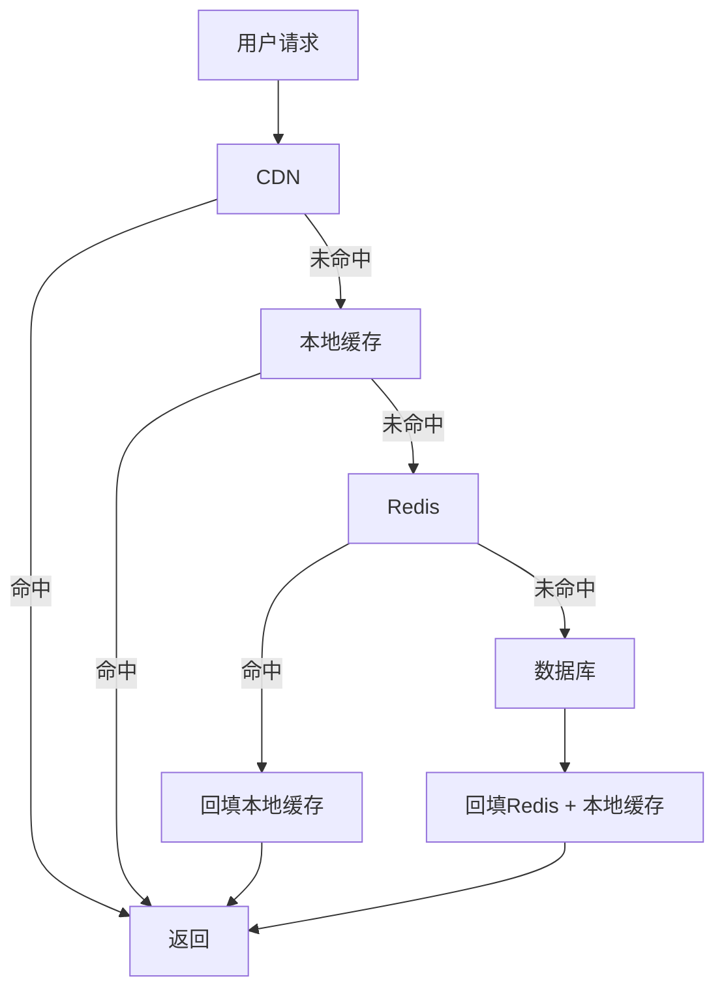

2022年双十一前夜，0点还没到，我们的系统先崩了。

不是数据库，是 Redis。

故障原因是：开发团队在凌晨 2 点手动清空了一个 80GB 的热缓存集群，准备第二天大促前预热。结果预热脚本跑的时候出了问题，大促流量进来，缓存里是空的，所有请求都穿透到了数据库。数据库在 3 秒内被打爆，MySQL 连接数瞬间达到上限，然后整个服务链路开始连环超时。

从缓存失效到全站不可用，前后不到 30 秒。

这次事故教会我们一件事：**缓存是系统加速的引擎，也是系统崩溃的引信**。

## 问题背景

缓存的本质是用空间换时间。把热点数据放在访问速度更快的存储里，减少对慢存储的访问次数。

以 Redis 为例：
- Redis 内存访问：0.1~0.5 微秒
- SSD 顺序读取：100 微秒
- HDD 随机读取：5~10 毫秒
- 同城网络延迟：0.5~2 毫秒

Redis 比磁盘快 1000~10000 倍。但它也比磁盘贵 100 倍。所以我们不能把所有数据都放缓存，只能放热点数据。

## 缓存架构设计

### 缓存分层模型

```
CPU缓存 ──► L1/L2/L3 ──► 进程内缓存 ──► 分布式缓存 ──► 数据库
  ns        ns~μs         μs              ms              ms
```

互联网公司典型的缓存分层：



### 缓存读写策略

**Cache-Aside（旁路缓存）**：最常用

```java
// 读
public User getUser(Long id) {
    // 先查缓存
    User user = redis.get("user:" + id);
    if (user != null) {
        return user;
    }
    // 缓存未命中，查数据库
    user = db.query("SELECT * FROM users WHERE id = ?", id);
    // 写入缓存
    redis.setex("user:" + id, 3600, user);
    return user;
}

// 写
public void updateUser(User user) {
    // 先更新数据库
    db.update("UPDATE users SET ... WHERE id = ?", user.getId());
    // 再删除缓存（注意：是删除，不是更新）
    redis.del("user:" + user.getId());
}
```

:::tip 💡
写策略用"删除缓存"而不是"更新缓存"，这是经典的分布式系统trade-off。因为删缓存的成本远低于更新缓存，且不存在并发下的数据不一致问题。
:::

**Read-Through / Write-Through**：业务无感知，由缓存中间件自动处理

**Write-Behind**：先写缓存，异步写数据库。性能最高，但数据安全性最低。

### 缓存过期策略

| 策略 | 原理 | 优点 | 缺点 |
| --- | --- | --- | --- |
| TTL 过期 | 设置固定过期时间 | 简单，易实现 | 可能同时失效 |
| 随机过期 | TTL 加随机偏移量 | 避免同时失效 | 不可控性 |
| 惰性过期 | 访问时检查是否过期 | 内存友好 | 不活跃的过期数据可能一直占内存 |
| 主动刷新 | 定时刷新热数据 | 保证数据新鲜度 | 增加系统复杂度 |

:::warning ⚠️
**缓存雪崩**：大量缓存 key 在同一时间过期，流量全部击穿到数据库。解决方案：过期时间加随机偏移量，或者用"热点数据永不过期 + 异步更新"策略。
:::

### 缓存击穿、穿透、雪崩

```
缓存击穿：某个热点 key 过期，瞬间大量请求击穿到数据库
缓存穿透：查询不存在的数据，缓存没有，数据库也没有，无限穿透
缓存雪崩：大量 key 同时过期，或缓存服务宕机
```

**解决方案**：

```java
// 缓存击穿：互斥锁/单飞请求
public User getUserWithLock(Long id) {
    String key = "user:" + id;
    User user = redis.get(key);
    if (user != null) {
        return user;
    }
    // 尝试获取锁
    String lockKey = "lock:" + key;
    String lockValue = uuid;
    if (redis.setnx(lockKey, lockValue, 10)) {
        // 获取锁成功，查数据库
        user = db.query(id);
        redis.setex(key, 3600, user);
        redis.del(lockKey);
        return user;
    } else {
        // 等待后重试
        Thread.sleep(50);
        return getUserWithLock(id);
    }
}
```

## 分布式缓存一致性

### Redis Cluster 的数据分片

Redis Cluster 把数据分成 16384 个 slot，每个 key 通过 CRC16 哈希落在某个 slot 里：

```java
slot = CRC16(key) % 16384
```

16384 个 slot 分散在多个 Redis 节点上，每个节点负责一部分 slot。

**槽迁移**：当节点扩缩容时，slot 会在节点间迁移。迁移期间，key 可能一半在旧节点一半在新节点，Redis Cluster 会返回 `MOVED` 错误，让客户端重新请求。

:::tip 💡
Redis Cluster 的槽迁移期间，系统是部分可用的。这也是为什么迁移通常在业务低峰期进行，且需要灰度操作。
:::

### 双写一致性

当缓存和数据库同时更新时，最核心的问题是：**谁先谁后**？

| 方案 | 做法 | 一致性 | 风险 |
| --- | --- | --- | --- |
| 先写数据库，再删缓存 | Cache-Aside | 最终一致 | 删除缓存失败时数据不一致 |
| 先删缓存，再写数据库 | 更常见 | 最终一致 | 读请求可能读到脏数据 |
| 先写缓存，再写数据库 | 不推荐 | 弱一致 | 缓存写入成功但数据库失败，数据丢失 |
| 延迟双删 | 写数据库后延迟删缓存 | 最终一致 | 延迟时间不好确定 |

## 生产避坑

### 坑1：热 key 问题

在 Redis Cluster 中，如果某个 key 的访问量特别大（比如微博热搜），所有请求都会打到同一个节点上，导致这个节点过载。

**解决方案**：
1. 热 key 识别：通过 Redis 监控发现 QPS 异常高的 key
2. 热 key 复制：在 key 后面加随机后缀，分散到多个 slot
3. 本地缓存：对热 key 做本地缓存兜底

```java
// 热 key 本地缓存兜底
public User getUserHot(Long id) {
    // 本地缓存先查
    User localUser = localCache.get(id);
    if (localUser != null) {
        return localUser;
    }
    // 再查 Redis
    User user = redis.get("user:" + id);
    if (user != null) {
        localCache.set(id, user, 60); // 本地缓存 60 秒
        return user;
    }
    return null;
}
```

### 坑2：大 key 问题

一个 key 存了几百 MB 的数据，删除时要遍历整个数据结构，阻塞 Redis 主线程。

**识别方法**：`redis-cli --bigkeys` 可以扫描出大 key。

**解决方向**：
- 拆分大 key：把大 hash 拆成多个小 hash
- 压缩：value 使用 gzip 或 protobuf 压缩
- 存储结构优化：用 set 代替 list，用 ziplist 代替 linkedlist

### 坑3：缓存与数据库的数据漂移

生产环境最常见的问题：缓存里有数据，但数据库里没有，或者反过来。

原因可能是：
- 缓存更新失败了
- 数据库被人工修改了
- 分布式系统中的并发问题

**兜底策略**：给缓存数据加版本号或时间戳，读的时候校验数据合理性。比如用户年龄不能是负数，订单金额不能超过某个上限。

## 工程代价评估

| 维度 | 评估 |
| --- | --- |
| 开发成本 | 中等，需要设计缓存 key 策略和更新策略 |
| 运维成本 | 高，Redis 集群运维 + 监控 + 故障切换 |
| 排障复杂度 | 高，缓存和数据库的数据一致性最难排查 |
| 扩展性 | 好，Redis Cluster 支持水平扩展 |
| 业务侵入性 | 低，缓存层可独立演进 |

【架构权衡】
缓存设计的核心权衡是**一致性与性能的对立**。强一致性需要同步操作，成本高；最终一致性允许短暂不一致，性能好。大多数互联网场景下，最终一致性是可以接受的，关键是**明确业务对不一致性的容忍度**，而不是一味追求强一致。
