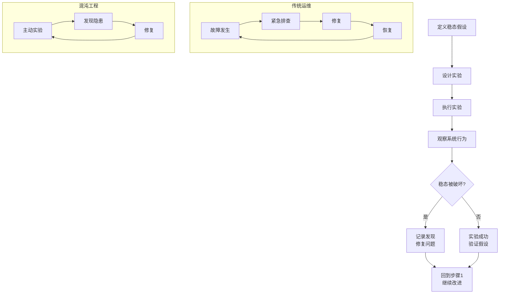
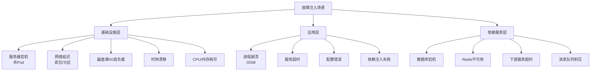
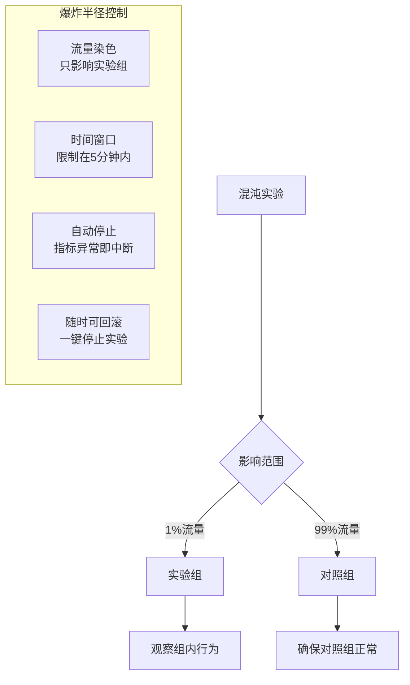
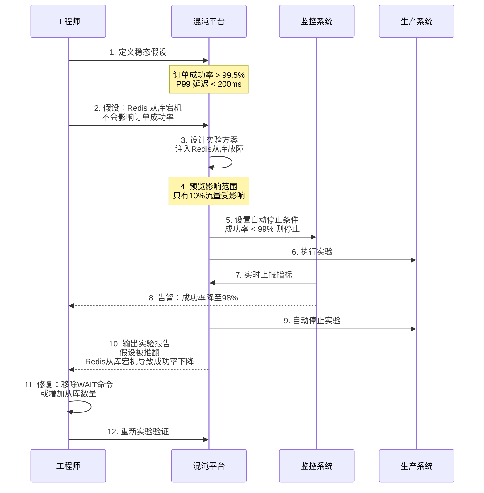
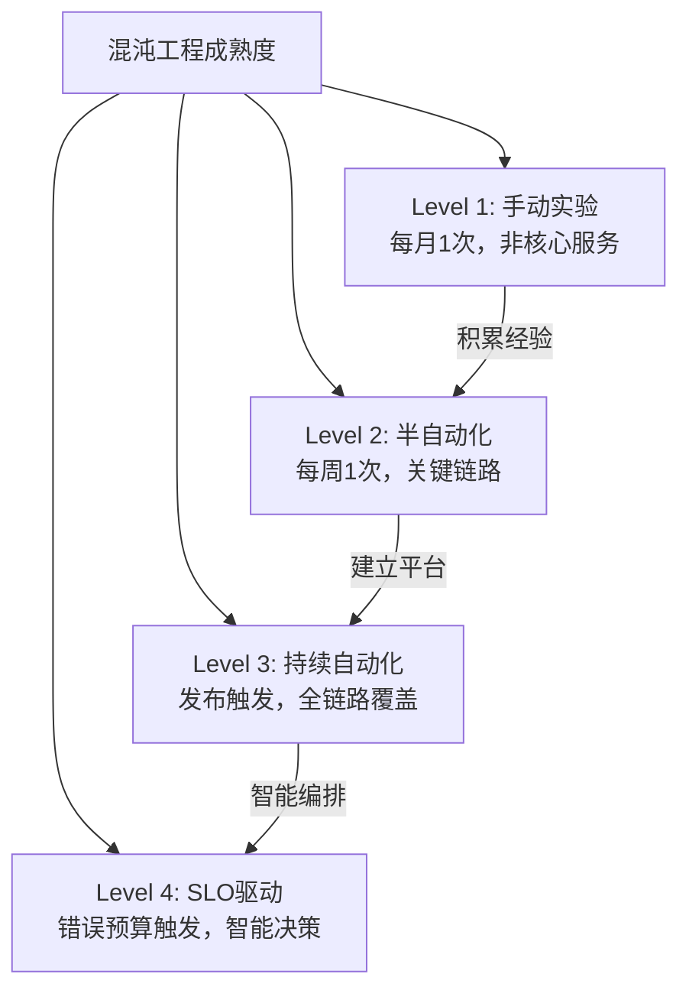

# 混沌工程

## 问题背景

2021年，某中型互联网公司的 SRE 团队经历了一次噩梦般的故障：凌晨 3 点，Redis 集群中一个从节点因为内存溢出而宕机。由于应用配置的是哨兵模式，主库检测到从库下线后发起了故障转移，一切看起来很正常。

但问题在于：故障转移后，新的从库需要从主库全量同步数据。在同步完成之前（约 4 分钟），应用所有的写请求都失败了——因为配置中写操作也要等待至少一个从库确认（`WAIT` 命令）。

这不是意外，是设计缺陷。但这个缺陷在正常运行时永远不会被发现——只有在 Redis 从节点宕机的瞬间才会暴露。

故障复盘后，SRE 负责人问了自己一个问题：**我们能不能在平时主动发现这些隐患，而不是等故障来教我们？**

答案是混沌工程（Chaos Engineering）。

【架构权衡】
混沌工程的价值不是"发现了一个 bug"，而是**建立了一种文化**——让团队习惯用实验来验证系统的可靠性假设。大多数团队的问题是：系统运行正常时，没人愿意去"破坏"它。但故障往往发生在最意想不到的时刻。混沌工程让这些时刻提前到来，在可控的环境中发现问题。

## 问题定义

混沌工程由 Netflix 在 2010 年提出，通过**主动向生产环境注入故障**来验证系统在各类故障场景下的行为，从而发现系统中的隐藏弱点。

它不是破坏系统，而是**科学地验证系统的韧性**。



## 混沌工程 vs 压测

这两个概念经常被混淆，但它们解决的问题完全不同：

| 维度 | 全链路压测 | 混沌工程 |
| --- | --- | --- |
| **目标** | 找到系统容量瓶颈 | 验证系统韧性 |
| **注入内容** | 高并发压力 | 故障（网络延迟、进程终止、磁盘满） |
| **关注指标** | QPS、延迟、吞吐量 | 可用性、错误率、恢复时间 |
| **时机** | 发布前、大促前 | 持续进行 |
| **问题类型** | 性能问题 | 可用性问题 |
| **类比** | "这辆车能跑多快？" | "这辆车在爆胎后还能开多远？" |

## 核心原则

Netflix 提出的混沌工程五项原则：

### 1. 建立稳态假设

在开始实验之前，先明确"什么是系统的正常行为"。

```java
// 稳态假设示例
稳态假设 = {
    "指标1": "订单成功率 > 99.5%",
    "指标2": "P99 延迟 < 200ms",
    "指标3": "库存服务可用率 = 100%",
    "指标4": "下单链路错误率 < 0.1%"
}
```

### 2. 用多样化真实事件验证

故障注入要多样化，覆盖真实世界中可能发生的各种场景：



### 3. 在生产环境实验

预发布环境的故障行为和生产环境可能有巨大差异。只有在生产环境实验，才能发现真实的问题。

:::warning ⚠️
在生产环境做混沌实验有风险，但这个风险是**可控的**：通过小范围、低影响、时间窗口受控的实验，可以将风险降到最低。"不在生产实验"就像"不在水里学游泳"——永远无法验证真实能力。
:::

### 4. 自动化持续实验

手动实验效率低下，需要建立自动化的混沌实验平台，实现：
- 定时自动执行实验
- 自动收集和分析结果
- 自动生成实验报告

### 5. 最小化爆炸半径

实验的影响范围要可控。"炸掉整个系统"不是混沌工程，是破坏。



## 主流工具对比

| 工具 | 开发方 | 特点 | 适用场景 |
| --- | --- | --- | --- |
| Chaos Monkey | Netflix | 随机终止实例，最简单 | AWS 环境的 Spring Boot 应用 |
| Gremlin | 商业化平台 | 成熟的混沌实验平台，支持多种攻击 | 企业级混沌工程 |
| ChaosBlade | 阿里巴巴 | 轻量级，K8s 原生支持，故障注入丰富 | 国内互联网公司 |
| AWS FIS | Amazon | 原生集成 AWS 服务，低门槛 | AWS 环境 |
| Litmus | CNCF | K8s 原生，云原生友好 | Kubernetes 环境 |
| Pumba | 开源社区 | Docker/K8s 容器网络和资源故障 | 容器化环境 |
| Toxiproxy | Shopify | 网络故障模拟（延迟、分区） | 依赖外部服务测试 |

### ChaosBlade 使用示例

```bash
# 安装 ChaosBlade CLI
wget https://github.com/chaosblade-io/chaosblade/releases/download/v1.7.0/chaosblade-1.7.0-linux-amd64.tar.gz
tar -xzvf chaosblade-1.7.0-linux-amd64.tar.gz

# 演练1: 杀 Pod
blade create k8s pod-kill --namespaces default --labels app=order-service

# 演练2: 网络延迟（注入 2000ms 延迟到 Redis）
blade create docker network delay --interface eth0 --time 2000 --destination-port 6379

# 演练3: CPU 满载
blade create cpu load --cpu-percent 80 --timeout 60

# 查看实验状态
blade status --uid xxxxxxxx

# 停止实验
blade destroy xxxxxxxx
```

### Kubernetes + Litmus 使用示例

```yaml
# Litmus ChaosEngine 配置
apiVersion: litmuschaos.io/v1alpha1
kind: ChaosEngine
metadata:
  name: order-service-chaos
spec:
  appinfo:
    appns: default
    applabel: "app=order-service"
  chaosServiceAccount: litmus-admin
  experiments:
    - name: pod-kill
      spec:
        components:
          env:
            - name: TOTAL_CHAOS_DURATION
              value: '30'
            - name: CHAOS_INTERVAL
              value: '10'
            - name: FORCE
              value: 'false'
```

## 实验设计流程

一个完整的混沌实验遵循以下流程：



## 故障注入场景

### 基础设施层

- **服务器宕机**：终止物理机或虚拟机，验证应用的高可用切换
- **网络分区**：模拟网络断开，验证脑裂防护是否生效
- **网络延迟**：注入随机延迟，验证超时配置是否合理
- **DNS 故障**：模拟 DNS 不可用，验证服务发现机制
- **时钟漂移**：NTP 服务器异常导致时钟不同步，验证时间敏感逻辑

### 应用层

- **进程崩溃**：使用 `kill -9` 终止进程，验证健康检查和自愈机制
- **OOM**：模拟内存耗尽，验证内存限制和熔断策略
- **线程池耗尽**：注入线程池满载，验证限流和降级
- **依赖超时**：使用 Toxiproxy 模拟下游服务超时

### 数据层

- **数据库主从切换**：强制主从切换，验证应用层的重连机制
- **Redis 不可用**：验证降级策略和本地缓存兜底
- **消息队列积压**：模拟消费者停止消费，验证生产者的告警和限流

## 落地路径

### 第一阶段：手动实验（1~2个月）

不要一开始就搞平台。先从手动实验开始：

1. 选择一个非核心服务（不要选核心下单链路）
2. 选择一个简单的故障场景（如"杀一个 Pod"）
3. 在低峰期（凌晨 2 点）手动执行
4. 记录实验结果和发现

### 第二阶段：半自动化（2~3个月）

引入 ChaosBlade 或 Litmus，建立实验模板：

1. 将手动实验脚本化
2. 引入监控和自动停止条件
3. 建立实验报告模板
4. 每周执行一次计划内实验

### 第三阶段：持续自动化（持续）

建立正式的混沌工程平台：

1. 与 CI/CD 流水线集成（每次发布后自动执行关键实验）
2. 建立 SLO 驱动的自动实验（错误预算消耗时触发实验）
3. 建立全公司共享的实验场景库
4. 将实验发现纳入故障复盘闭环



【架构权衡】
混沌工程的成熟需要时间。Level 1 到 Level 4 通常需要 1~2 年。团队不要急于求成，关键是**建立"用实验验证可靠性"的文化**。每发现一个隐患并修复，都是在降低未来的故障概率。这个投入的 ROI 极高——一次故障的代价（GMV 损失、用户流失、口碑损伤）往往抵得上团队一年的混沌工程投入。

## 生产避坑

1. **不要在业务高峰期做实验**：混沌实验的目的是发现隐患，不是制造新的故障。低峰期做，给自己和团队留足反应时间。
2. **一定要设置自动停止条件**：如果监控系统检测到指标严重偏离稳态（如成功率从 99.5% 掉到 95%），必须自动停止实验。
3. **不要跳过"预览影响范围"步骤**：大多数混沌平台都提供"影响范围预览"功能，正式执行前一定要看。
4. **实验后要闭环**：每个实验发现都要有后续：分析根因、制定修复计划、验证修复有效。只有闭环，实验才有价值。
5. **不要只做"杀 Pod"实验**：终止实例是最简单的场景，但最有价值的发现往往在网络延迟、时钟漂移、依赖超时这些"软故障"中。

## 工程代价

| 维度 | 评估 |
| --- | --- |
| 工具成本 | 开源工具免费，商用平台（如 Gremlin）按节点收费 |
| 人力成本 | 初期需要 0.5~1 人专注推动 |
| 风险成本 | 实验本身有风险，需要完善的自动停止机制 |
| 收益 | 提前发现隐患，减少生产故障次数和持续时间 |

## 落地 Checklist

- [ ] 选择混沌工程工具（ChaosBlade / Litmus / Gremlin）
- [ ] 在非核心服务上做第一次手动实验（杀 Pod）
- [ ] 配置监控和自动停止条件（错误率超过阈值即停止）
- [ ] 定义核心服务的稳态假设（成功率、延迟等指标）
- [ ] 设计故障注入矩阵（基础设施 × 应用层 × 数据层）
- [ ] 建立实验文档（每个实验的目标、假设、步骤、预期结果）
- [ ] 每周执行一次计划内混沌实验
- [ ] 每次实验后输出报告，确保发现的问题闭环
- [ ] 将关键实验集成到 CI/CD 流水线
- [ ] 建立全团队的混沌工程文化（分享实验发现，奖励主动发现）
- [ ] 与 SLO/错误预算机制联动（错误预算消耗时增加实验频率）
- [ ] 定期评审和更新故障注入场景（覆盖新上线的组件和新引入的依赖）
