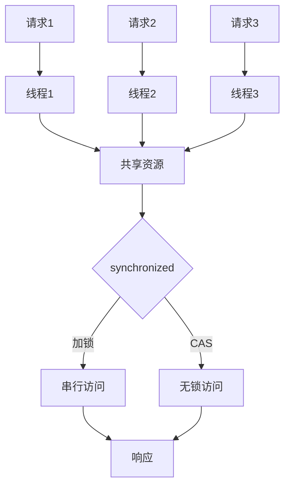

2019年，我们团队第一次做双十一秒杀活动。

1000 台 iPhone，5 万用户同时在线抢。开发团队很自信——Java 服务，4 核 8G，Tomcat 默认配置。

结果开抢后 30 秒，服务全面崩溃。不是机器撑不住，是数据库连接池被打爆了。

更糟糕的是，活动结束后盘库，发现卖了 1200 台——超卖了 200 台。直接经济损失 20 万。

这不是技术不行，是**对高并发的认知不到位**。很多人以为高并发就是加机器、加线程、加连接池。但超卖告诉我们：有些问题是加资源解决不了的。

## 问题背景

高并发问题的本质是：**多个请求竞争同一个资源时，如何保证结果的正确性**。

这个问题在单机时代就存在（多线程竞争锁），到了分布式时代变得更复杂（多台机器竞争同一个数据库行）。

高并发场景的核心矛盾：
1. **正确性 vs 性能**：越严格的并发控制，性能损耗越大
2. **吞吐量 vs 延迟**：高吞吐往往伴随着长尾延迟
3. **资源成本 vs 并发能力**：无限扩容可以解决问题，但成本不可接受

## 并发模型演进

### 单机并发：线程与锁



**线程池模型**：

```java
// 线程池参数选择
public ThreadPoolExecutor buildExecutor() {
    // CPU 密集型：核心线程数 = CPU 核心数 + 1
    // IO 密集型：核心线程数 = CPU 核心数 * (1 + IO时间/CPU时间)
    int corePoolSize = Runtime.getRuntime().availableProcessors() * 2;
    int maxPoolSize = corePoolSize * 2;

    return new ThreadPoolExecutor(
        corePoolSize, maxPoolSize, 60L, TimeUnit.SECONDS,
        new LinkedBlockingQueue<>(1000),
        new ThreadFactoryBuilder().setNameFormat("pool-%d").build(),
        // 拒绝策略：队列满了如何处理
        new ThreadPoolExecutor.CallerRunsPolicy()
    );
}
```

### 分布式并发：进程间协调

当单机无法承载时，需要多台机器协作。但多台机器带来了新的问题：**没有共享内存，无法用锁直接同步**。

解决方案：

| 方案 | 原理 | 适用场景 | 性能 |
| --- | --- | --- | --- |
| 数据库乐观锁 | version/CAS 机制 | 冲突不多的场景 | 好 |
| 数据库悲观锁 | SELECT FOR UPDATE | 冲突频繁的场景 | 差 |
| 分布式锁 | Redis/ZooKeeper | 需要跨节点互斥 | 中等 |
| 无锁数据结构 | 单分片 CAS | 单分片数据 | 好 |

## 秒杀系统的并发控制

秒杀是高并发设计的试金石。我们来设计一个秒杀系统：

### 方案一：数据库乐观锁

```sql
-- 库存表
CREATE TABLE stock (
    id BIGINT PRIMARY KEY,
    product_id BIGINT,
    stock_count INT,
    version INT,           -- 乐观锁版本号
    update_time DATETIME
);

-- 下单扣减库存（乐观锁）
UPDATE stock
SET stock_count = stock_count - 1,
    version = version + 1,
    update_time = NOW()
WHERE product_id = ?
  AND stock_count > 0
  AND version = ?;        -- 乐观锁条件

-- 如果影响行数为 0，说明库存不足或版本冲突
```

**优点**：不需要额外的锁组件
**缺点**：高并发下大量请求会失败重试，数据库压力依然存在

### 方案二：Redis 原子操作

```java
// Lua 脚本保证原子性
String luaScript =
    "if redis.call('exists', KEYS[1]) == 1 then " +
    "  local stock = tonumber(redis.call('get', KEYS[1])) " +
    "  if stock > 0 then " +
    "    redis.call('decr', KEYS[1]) " +
    "    return 1 " +
    "  else " +
    "    return 0 " +
    "  end " +
    "else " +
    "  return -1 " +  -- key 不存在
    "end";

RedisScript<Long> script = RedisScript.of(luaScript, Long.class);
Long result = redisTemplate.execute(script, "stock:" + productId);
```

**优点**：性能极高，Redis 单机可达 10 万 TPS
**缺点**：Redis 挂了怎么办？

### 方案三：Redis + 数据库双保险

```
请求 ──► Redis 扣减（快速拦截） ──► 数据库扣减（最终一致性） ──► 订单创建
      (库存充足，扣减成功)         (异步确认，失败补偿)
```

这是目前互联网公司通用的秒杀架构：
1. Redis 做第一道拦截，挡住 99% 的无效请求
2. 数据库做最终扣减，保证数据一致性
3. 异步消息做补偿，处理 Redis 和数据库不一致的情况

:::tip 💡
秒杀系统的核心设计思想是**分层过滤**：在入口层用限流过滤，在 Redis 层用库存拦截，在数据库层做最终扣减。越早过滤，效果越好。
:::

## 高并发架构演进

### 流量分层

```
用户请求
    │
    ▼
CDN ──► 静态资源直接返回，不占用后端资源
    │
    ▼
DNS 负载均衡 ──► 按地域/运营商分流
    │
    ▼
应用层 ──► 无状态服务，可水平扩展
    │
    ▼
网关层 ──► 统一鉴权、限流、风控
    │
    ▼
业务层 ──► 核心业务逻辑
    │
    ▼
数据层 ──► 缓存 + 数据库
```

### 无状态化设计

高并发系统的第一原则：**无状态**。

如果服务保存了用户会话、本地缓存等状态，就无法水平扩展。因为新加一台机器后，状态不在新机器上，请求会失败。

**解决方案**：
- Session 外置化：放到 Redis 或数据库
- 本地缓存降级：只缓存不共享，或作为多级缓存的一层
- 状态转信息：把状态信息通过请求参数传递

```java
// 错误：本地缓存用户信息
public class UserService {
    private Map<Long, User> localCache = new ConcurrentHashMap<>();
}

// 正确：无状态服务，用户信息从请求参数或 Redis 获取
public class UserService {
    public User getUser(Long userId, UserCache userCache) {
        return userCache.get(userId);
    }
}
```

## 生产避坑

### 坑1：线程安全问题

高并发下，最可怕的不是性能问题，而是**数据错乱**。

```java
// 错误：先检查后操作（Race Condition）
public boolean deductStock(Long productId) {
    Stock stock = stockDao.findByProductId(productId);
    if (stock.getCount() > 0) {       // 检查
        stock.setCount(stock.getCount() - 1);
        stockDao.update(stock);        // 操作
        return true;
    }
    return false;
}
```

两个线程同时进来，都看到 count = 1，都会执行扣减，超卖就发生了。

:::warning ⚠️
所有"先检查后操作"的代码，在高并发下都是不安全的。必须用原子操作或锁来保证检查和操作的原子性。
:::

### 坑2：连接池配置不当

数据库连接池配置的两个极端：
- **太大**：连接数太多，数据库压力大，上下文切换严重
- **太小**：线程拿不到连接，排队等待，性能退化

连接池大小的经验公式：
```
连接池大小 = (核心数 * 2) + 有效磁盘数
```

但这个公式只是起点。实际配置需要结合：
- 数据库的 max_connections
- 业务的平均查询时间
- 允许的最大等待时间

### 坑3：JVM GC 停顿

高并发 + 大内存 = 频繁 GC = 服务抖动。

CMS 或 G1 GC 在垃圾回收时会有"Stop-The-World"停顿。在高并发场景下，GC 停顿可能导致大量请求超时。

**解决方向**：
- 控制堆大小：单实例不超过 8GB，让 GC 停顿控制在可接受范围
- 使用 ZGC/Shenandoah：停顿时间控制在毫秒级
- 降低对象分配率：减少对象创建，避免短生命周期的大对象

## 工程代价评估

| 维度 | 评估 |
| --- | --- |
| 开发成本 | 极高，高并发代码需要精细的并发控制 |
| 运维成本 | 高，多节点运维 + 监控 |
| 排障复杂度 | 高，并发问题难以复现 |
| 扩展性 | 好，无状态服务理论上可无限扩展 |
| 业务侵入性 | 高，业务逻辑需要改造以适应高并发 |

【架构权衡】
高并发设计的核心权衡是**正确性 vs 性能 vs 成本**。严格按串行执行最安全，但吞吐量最低。完全无锁最高效，但正确性最难保证。大多数场景下，我们需要的是一个"够用"的方案：在可接受的成本下，保证绝大多数情况下数据是正确的，且有兜底机制处理异常情况。
