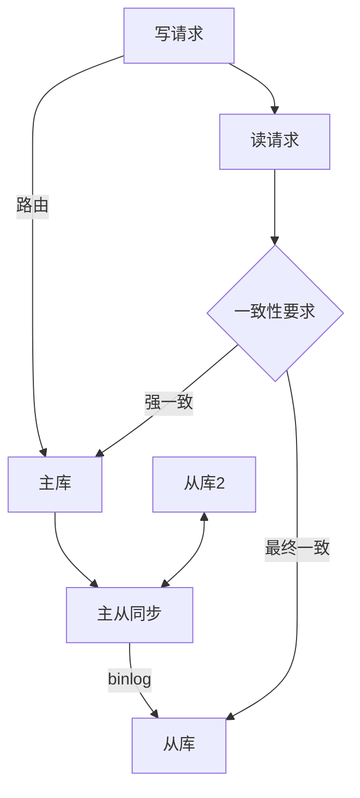

2023年618大促，我们团队卖出了 3 万台 iPhone。

但有 300 个用户在下单后，收到了系统自动取消的通知——他们被超卖了。

排查了 6 个小时，根因让人哭笑不得：数据库主从延迟了 8 秒。这 8 秒内，用户从结算页看到有库存，下单时写到了主库，但库存扣减的读请求打到了从库——从库还没同步完，主库已经从 0 扣到了 -300。

这就是数据库高性能设计最残酷的一面：**一个小延迟，可以让你卖出 300 台不存在的 iPhone**。

## 问题背景

数据库是几乎所有系统的最后一道防线。不管你的缓存多厚、异步化做得多好，最终的用户数据、交易数据、核心业务数据都在数据库里。

数据库的性能瓶颈主要来自三个方向：

1. **IO 瓶颈**：磁盘读写速度远低于 CPU 和内存，数据从磁盘到内存这一跳就是毫秒级
2. **CPU 瓶颈**：复杂查询、函数计算、锁竞争都会消耗 CPU
3. **连接瓶颈**：每个连接都是一个线程，连接数是有限的资源

互联网公司里，80% 的数据库性能问题都可以归结为：**不该查的数据查了，不该排序的排了，不该 JOIN 的 JOIN 了**。

## 核心设计手段

### 索引设计：数据结构视角

MySQL 的 InnoDB 使用 B+ 树作为索引结构。B+ 树的特点是：
- 所有数据都在叶子节点，叶子节点之间用链表相连
- 查询复杂度 `O(log n)`，非常稳定
- 范围查询友好，因为叶子节点有序

```sql
-- 假设有一张订单表
CREATE TABLE orders (
    id BIGINT PRIMARY KEY,       -- 主键索引，B+树
    user_id BIGINT,               -- 普通字段
    status TINYINT,               -- 普通字段
    created_at DATETIME,          -- 普通字段
    amount DECIMAL(10,2),         -- 普通字段
    INDEX idx_user_status (user_id, status),   -- 联合索引
    INDEX idx_created (created_at)            -- 时间索引
);
```

**联合索引的最左前缀原则**：

```sql
-- 索引: idx_user_status(user_id, status)

-- ✅ 能命中索引：使用了最左前缀
SELECT * FROM orders WHERE user_id = 123;
SELECT * FROM orders WHERE user_id = 123 AND status = 1;

-- ❌ 无法命中索引：跳过了 user_id
SELECT * FROM orders WHERE status = 1;

-- ❌ 无法命中索引：不是前缀匹配
SELECT * FROM orders WHERE status = 1 AND user_id = 123;  -- 理论上可以用，但MySQL优化器不一定走索引
```

:::tip 💡
Explain 是分析 SQL 性能的最好工具。每个 DDL 上线前，必须用 `EXPLAIN` 跑一遍，确认走了正确的索引。生产事故里，至少有 30% 是因为索引问题导致的。
:::

**覆盖索引**：如果查询的所有列都在索引里，MySQL 就不需要回表，性能提升巨大。

```sql
-- 回表：查 user_id 再拿 amount，需要再查一次主键索引
SELECT amount FROM orders WHERE user_id = 123;

-- 覆盖索引：idx_user_amount(user_id, amount) 包含所有列，不需要回表
SELECT user_id, amount FROM orders WHERE user_id = 123;
```

### 读写分离：架构视角



读写分离的核心价值：**把读流量卸载到从库，让主库专心处理写流量**。

但读写分离带来一个致命问题：**主从延迟**。

主从延迟的原因：
1. 主库写 binlog，从库 IO 线程拉取（网络延迟）
2. 从库 SQL 线程重放 binlog（CPU 消耗）
3. 从库与主库硬件配置不一致（从库通常弱于主库）

延迟的控制策略：

| 策略 | 适用场景 | 代价 |
| --- | --- | --- |
| 强制读主库 | 对一致性要求高的场景 | 失去读写分离的意义 |
| 读从库 + 延迟窗口 | 对延迟容忍的场景 | 短期数据不一致 |
| 延迟检测 + 降级 | 大多数通用场景 | 需要额外监控 |
| GTID + 并行复制 | 大数据量场景 | 配置复杂 |

### 分库分表：数据层视角

当单表数据量超过 5000 万条，或者单库 QPS 超过 1 万时，就必须考虑分库分表了。

**分库分表的核心是选择一个分片键**：

| 分片键 | 适用场景 | 痛点 |
| --- | --- | --- |
| user_id | 用户维度查询多 | 跨用户汇总查询困难 |
| 时间（按月/天） | 订单、日志等时间序列 | 热数据集中在最新分片 |
| 地域 | LBS 相关业务 | 数据分布不均匀 |
| 哈希 | 数据分布均匀 | 跨分片查询极难 |

**分库分表后的跨分片查询**：

这是分库分表最大的坑。假设按 user_id 分了 8 库 8 表，用户想查"所有商品类别中最受欢迎的前 10 个"——这种查询在单库时代一个 SQL 就搞定，分库后需要：

1. 分散查询到 64 个分片
2. 收集 64 个结果
3. 归并排序
4. 返回 top 10

这就是**异构索引表**方案诞生的原因——把需要聚合的字段冗余到 ES/HBase 等支持聚合查询的存储中。

## 生产避坑

### 坑1：索引不是越多越好

每个索引都是一棵 B+ 树。索引越多，插入/更新/删除的性能越差，因为每次数据变更都要同时更新所有相关索引。

我见过一张表 15 个字段，建了 12 个索引。查询是快了，但插入一条数据要操作 13 个索引（主键索引 + 12 个二级索引），性能直接退化 10 倍。

:::warning ⚠️
索引评审规范：每加一个索引，必须回答三个问题：这个索引服务哪个查询场景？这个查询的 QPS 是多少？如果去掉这个索引会怎样？
:::

### 坑2：慢查询不慢

`SQL` 执行时间超过 1s 才算慢查询？错。在高并发场景下，100ms 的全表扫描就足以拖垮整个系统。

MySQL 默认配置下，单个查询可以占用 200MB 内存。如果有 10 个并发慢查询，内存直接爆掉。

**生产监控规范**：
- 慢查询日志：超过 100ms 的查询都要记录
- 连接数监控：连接数超过最大连接数的 80% 就告警
- 主从延迟监控：从库延迟超过 5s 就触发告警

### 坑3：分库分表后的分布式 ID

分库分表后，自增主键会冲突，必须用分布式 ID 生成方案。

| 方案 | 优点 | 缺点 |
| --- | --- | --- |
| UUID | 简单，无依赖 | 无序，存储空间大（36字节） |
| Snowflake | 高性能，有序 | 依赖时钟，如果时钟回拨会重复 |
| 数据库号段模式 | 简单可控 | 依赖数据库，有网络延迟 |
| 滴滴 TicK / 之美 Redis | 高性能 | 需要运维额外组件 |

## 工程代价评估

| 维度 | 评估 |
| --- | --- |
| 开发成本 | 高，SQL 审核 + 索引维护 + 分片路由 |
| 运维成本 | 极高，分库分表需要配套的运维工具 |
| 排障复杂度 | 高，需要慢查询分析 + 主从状态监控 |
| 扩展性 | 好，数据层水平扩展 |
| 业务侵入性 | 中等，部分业务逻辑需要改造 |

【架构权衡】
数据库高性能设计的本质是：**在数据一致性、性能和复杂度之间找平衡**。读写分离牺牲了强一致性，换取了吞吐量的提升。分库分表牺牲了跨分片查询的灵活性，换取了数据容量和写入性能。每一个设计决策背后都有代价，理解代价比理解方案更重要。
